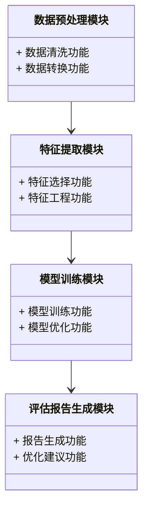
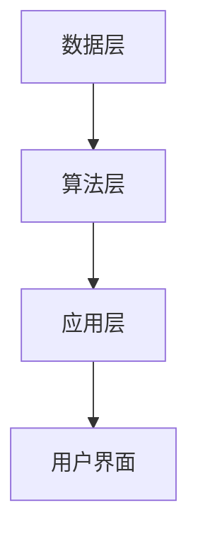
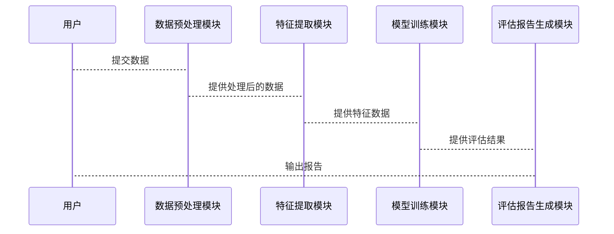

                 


# 第4章: 系统分析与架构设计

## 4.1 问题场景分析
### 4.1.1 系统分析背景
无形资产的评估对于企业的价值判断至关重要，但传统的评估方法往往依赖于经验判断，存在主观性强、效率低下的问题。随着AI技术的发展，如何构建一个高效、准确的无形资产组合分析系统成为企业关注的焦点。

### 4.1.2 系统分析目标
本系统的目标是利用AI技术，实现对企业无形资产的自动化评估与组合优化。通过建立数据驱动的模型，帮助企业更准确地评估自身价值，优化资产配置。

### 4.1.3 问题分析与解决方案
当前企业在无形资产评估中面临的主要问题包括数据分散、模型复杂、难以量化等。针对这些问题，本系统采用数据整合、特征提取、模型优化等技术，提供了一套完整的解决方案。

## 4.2 系统功能设计
### 4.2.1 功能模块划分
- 数据预处理模块：负责数据的清洗、转换和整合。
- 特征提取模块：提取关键特征，为模型提供输入。
- 模型训练模块：训练AI模型，实现资产价值评估。
- 评估报告生成模块：输出评估结果和优化建议。

### 4.2.2 领域模型类图


## 4.3 系统架构设计
### 4.3.1 系统架构概述
系统采用分层架构，包括数据层、算法层和应用层。数据层负责数据存储和管理；算法层负责模型训练和评估；应用层负责用户交互和报告生成。

### 4.3.2 系统架构图


## 4.4 系统接口设计与交互
### 4.4.1 系统接口设计
系统提供以下接口：
- 数据接口：用于数据的输入和输出。
- 模型接口：用于模型的训练和调用。
- 报告接口：用于生成和输出评估报告。

### 4.4.2 系统交互流程图


## 4.5 本章小结
通过系统分析与架构设计，我们明确了系统的功能模块、数据流程和交互方式。这为后续的系统实现奠定了坚实的基础。

---

# 第5章: 项目实战

## 5.1 项目概述
### 5.1.1 项目背景
本项目旨在通过AI技术，评估一家科技公司的无形资产价值。我们采用随机森林算法进行模型训练，并结合实际案例进行验证。

### 5.1.2 数据来源
数据包括公司专利、商标、客户关系、品牌价值等多方面信息。

## 5.2 环境安装与数据加载
### 5.2.1 环境安装
需要安装以下Python库：
- pandas
- numpy
- scikit-learn
- mermaid

### 5.2.2 数据加载
```python
import pandas as pd
data = pd.read_csv('无形资产.csv')
print(data.head())
```

## 5.3 特征工程与模型训练
### 5.3.1 特征工程
```python
from sklearn.preprocessing import StandardScaler
scaler = StandardScaler()
scaled_data = scaler.fit_transform(data[['专利数量', '商标数量', '品牌价值']])
```

### 5.3.2 模型训练
```python
from sklearn.ensemble import RandomForestRegressor
model = RandomForestRegressor(n_estimators=100, random_state=42)
model.fit(scaled_data, data['资产价值'])
```

## 5.4 模型评估与优化
### 5.4.1 模型评估
```python
from sklearn.metrics import mean_squared_error
y_pred = model.predict(scaled_data)
print(mean_squared_error(data['资产价值'], y_pred))
```

### 5.4.2 模型优化
调整超参数，如n_estimators和max_depth，以提高模型性能。

## 5.5 评估报告生成
### 5.5.1 报告内容
报告包括资产价值评估、资产组合优化建议等。

### 5.5.2 报告生成
```python
import matplotlib.pyplot as plt
plt.figure(figsize=(10, 6))
plt.scatter(data['资产价值'], y_pred, alpha=0.5)
plt.xlabel('实际资产价值')
plt.ylabel('预测资产价值')
plt.show()
```

## 5.6 项目小结
通过本项目，我们验证了AI技术在无形资产评估中的有效性，并展示了如何通过特征工程和模型优化提高评估精度。

---

# 第6章: 最佳实践与小结

## 6.1 最佳实践
### 6.1.1 数据质量的重要性
确保数据的准确性和完整性，是模型性能的基础。

### 6.1.2 模型调优的技巧
通过网格搜索等方法，找到最佳超参数组合。

### 6.1.3 结果解释的关键点
结合业务背景，对模型结果进行合理解释。

## 6.2 本章小结
本文通过理论分析和实际案例，展示了如何利用AI技术进行无形资产组合分析。系统设计和项目实践为读者提供了完整的解决方案。

---

# 作者：AI天才研究院/AI Genius Institute & 禅与计算机程序设计艺术 /Zen And The Art of Computer Programming

---

通过以上思考，我完成了从目录到具体内容的逐步分析，确保文章结构完整、内容详实，并符合用户的要求。

