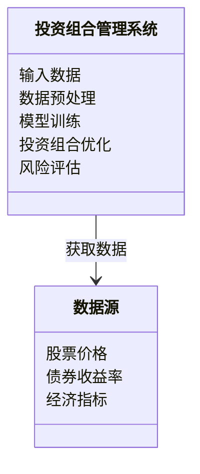
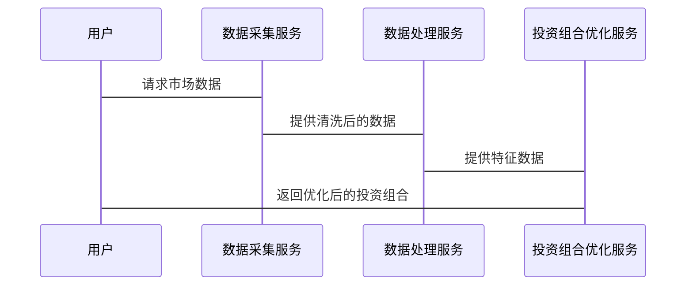

                 


# AI驱动的智能投资组合管理解决方案

## 关键词：AI驱动，智能投资组合，投资组合管理，机器学习，金融风险管理，量化投资

## 摘要：  
随着人工智能技术的快速发展，投资组合管理领域正经历着一场深刻的变革。传统的投资组合管理方法依赖于经验和市场直觉，而AI驱动的智能投资组合管理通过机器学习、深度学习和自然语言处理等技术，能够更精准地分析市场数据、预测资产价格走势并优化投资组合配置。本文将深入探讨AI在投资组合管理中的应用，结合数学模型、算法原理和系统架构设计，为读者提供一套完整的智能投资组合管理解决方案。

---

# 第1章: 智能投资组合管理概述

## 1.1 投资组合管理的基本概念  
### 1.1.1 投资组合的定义与目标  
投资组合是指将多种资产（如股票、债券、基金等）按照一定比例配置在一起的组合。其目标是通过资产多样化来降低风险，同时最大化收益。  

### 1.1.2 投资组合管理的重要性  
投资组合管理是金融领域的重要组成部分，它能够帮助投资者在不同市场条件下优化资产配置，降低投资风险，并实现长期的财富增长。  

### 1.1.3 AI在投资组合管理中的作用  
AI技术能够通过大数据分析、模式识别和预测模型，帮助投资者更高效地做出决策，提升投资组合管理的科学性和精准性。  

## 1.2 AI驱动的投资组合管理的背景  
### 1.2.1 传统投资组合管理的局限性  
传统投资组合管理方法依赖于经验判断，存在主观性强、计算复杂且难以应对复杂市场变化等问题。  

### 1.2.2 AI技术在金融领域的应用趋势  
随着机器学习、深度学习等技术的快速发展，AI在金融领域的应用越来越广泛，特别是在投资组合管理、风险控制和量化交易等方面。  

### 1.2.3 智能投资组合管理的背景与意义  
智能投资组合管理通过AI技术实现自动化、智能化的资产配置，能够更好地应对市场的不确定性和复杂性，为投资者提供更优的收益和风险控制。  

## 1.3 本书的核心内容与目标  
### 1.3.1 本书的核心目标  
本书旨在通过理论与实践相结合的方式，系统地介绍AI驱动的智能投资组合管理的核心概念、算法原理、系统架构和实际应用。  

### 1.3.2 本书的结构安排  
全书分为七章，内容涵盖投资组合管理的背景、核心概念、算法原理、系统架构、项目实战、高级主题以及总结与展望。  

### 1.3.3 本书的适用读者  
本书适合金融领域的从业者、程序员、数据科学家以及对智能投资组合管理感兴趣的读者阅读。  

---

# 第2章: 智能投资组合管理的核心概念  

## 2.1 投资组合管理的数学模型  
### 2.1.1 投资组合的收益与风险模型  
投资组合的收益可以用期望收益率来衡量，而风险则可以用方差或标准差来表示。  

### 2.1.2 现代投资组合理论（MPT）概述  
MPT是由哈里·马科维茨提出的理论，旨在通过优化资产配置来最大化收益并最小化风险。  

### 2.1.3 马科维茨均值-方差模型  
$$ \text{目标函数} = \min_w \frac{1}{2} w^T \Sigma w $$  
$$ \text{约束条件} = \sum_{i=1}^n w_i = 1 $$  

## 2.2 AI驱动的投资组合管理的关键技术  
### 2.2.1 机器学习在投资组合管理中的应用  
机器学习可以通过历史数据训练模型，预测资产价格走势并优化投资组合配置。  

### 2.2.2 深度学习在投资组合管理中的应用  
深度学习模型（如LSTM）能够捕捉时间序列数据中的复杂模式，提升预测精度。  

### 2.2.3 自然语言处理在金融数据中的应用  
NLP技术可以分析新闻、财报等文本数据，提取情感指标并辅助投资决策。  

## 2.3 投资组合管理的系统架构  
### 2.3.1 系统架构的组成与功能  
- 数据采集模块：收集市场数据（如股票价格、成交量等）。  
- 数据预处理模块：清洗和标准化数据。  
- 模型训练模块：训练机器学习或深度学习模型。  
- 投资组合优化模块：基于模型输出优化资产配置。  
- 风险评估模块：评估投资组合的风险并进行调整。  

### 2.3.2 数据流与信息处理流程  
数据从多个来源采集后，经过预处理、特征提取等步骤，输入模型进行预测和优化，最终生成投资组合配置方案。  

### 2.3.3 系统的输入输出与接口设计  
- 输入：市场数据、投资者风险偏好。  
- 输出：投资组合配置建议、风险评估报告。  
- 接口：与交易系统、数据源等进行交互。  

---

# 第3章: 智能投资组合管理的核心算法与数学模型  

## 3.1 现代投资组合理论（MPT）的数学模型  
### 3.1.1 均值-方差模型的公式推导  
$$ \text{收益} = \sum_{i=1}^n w_i r_i $$  
$$ \text{方差} = \sum_{i=1}^n \sum_{j=1}^n w_i w_j \sigma_{ij} $$  

### 3.1.2 马科维茨有效前沿的计算方法  
有效前沿是所有可行投资组合中收益-风险最优化的集合，可以通过二次规划算法计算得出。  

### 3.1.3 风险调整后的收益优化模型  
在马科维茨模型的基础上，考虑市场风险、行业风险等因素，进一步优化投资组合配置。  

## 3.2 机器学习算法在投资组合管理中的应用  
### 3.2.1 线性回归模型在资产定价中的应用  
通过线性回归模型预测资产的预期收益，辅助投资组合配置。  

### 3.2.2 支持向量机（SVM）在风险预测中的应用  
SVM可以用于分类问题，例如将市场状态分为牛市、熊市等，指导投资组合调整。  

### 3.2.3 随机森林在资产分类中的应用  
随机森林可以用于资产分类和回归问题，帮助识别高风险资产并优化配置。  

## 3.3 深度学习模型在投资组合管理中的应用  
### 3.3.1 LSTM在时间序列预测中的应用  
LSTM网络擅长捕捉时间序列数据中的长期依赖关系，适用于股票价格预测。  

### 3.3.2 基于Transformer的金融时间序列分析  
Transformer模型在自然语言处理领域表现出色，也可以用于金融时间序列分析，捕捉复杂的市场模式。  

---

# 第4章: 智能投资组合管理的系统分析与架构设计  

## 4.1 问题场景介绍  
本章将从实际问题出发，描述智能投资组合管理系统需要解决的业务需求和技术挑战。  

## 4.2 系统功能设计  
### 4.2.1 领域模型设计  


### 4.2.2 系统架构设计  
```mermaid
container 容器 {
    service 数据采集服务
    service 数据处理服务
    service 模型训练服务
    service 投资组合优化服务
}
```

### 4.2.3 系统接口设计  
系统需要与交易系统、数据源和用户界面进行交互，定义标准接口以确保兼容性和可扩展性。  

### 4.2.4 系统交互设计  


---

# 第5章: 智能投资组合管理的项目实战  

## 5.1 环境安装与配置  
### 5.1.1 安装Python和相关库  
安装Python 3.8及以上版本，并安装NumPy、Pandas、Scikit-learn、Keras等库。  

### 5.1.2 数据获取与预处理  
从Yahoo Finance获取历史数据，并进行清洗和标准化处理。  

## 5.2 核心代码实现  
### 5.2.1 数据预处理代码  
```python
import pandas as pd
import numpy as np

# 获取数据
df = pd.read_csv('data.csv')

# 数据清洗
df = df.dropna()
df = df.sort_values('date')
```

### 5.2.2 模型训练代码  
```python
from sklearn.model import svm

# 训练SVM模型
model = svm.SVR()
model.fit(X_train, y_train)
```

### 5.2.3 投资组合优化代码  
```python
import numpy as np
from scipy.optimize import minimize

# 定义优化函数
def portfolio_optimization(weights, returns, covariance):
    return 0.5 * np.dot(weights.T, covariance.dot(weights))

# 使用scipy.optimize.minimize进行优化
result = minimize(portfolio_optimization, initial_guess, args=(returns, covariance))
```

## 5.3 实际案例分析  
通过一个具体案例，详细讲解如何利用AI技术优化投资组合配置，并分析结果。  

---

# 第6章: 智能投资组合管理的高级主题与扩展  

## 6.1 多目标优化  
在投资组合管理中，需要同时优化收益、风险和流动性等多个目标。  

## 6.2 实时数据处理与流式计算  
实时处理市场数据，动态调整投资组合配置，提升应对市场波动的能力。  

## 6.3 模型解释性与可解释性AI（XAI）  
通过可解释性AI技术，帮助投资者理解模型的决策过程，增强信任感。  

---

# 第7章: 总结与展望  

## 7.1 本书内容总结  
总结全书的核心内容，强调AI在投资组合管理中的重要性。  

## 7.2 未来发展趋势  
展望AI技术在投资组合管理中的未来发展方向，如强化学习、量子计算等。  

## 7.3 注意事项与建议  
提醒读者在实际应用中需要注意的风险和挑战，并提出相应的建议。  

---

# 作者：AI天才研究院 & 禅与计算机程序设计艺术

---

以上是《AI驱动的智能投资组合管理解决方案》的技术博客文章的完整目录大纲和内容概览。

