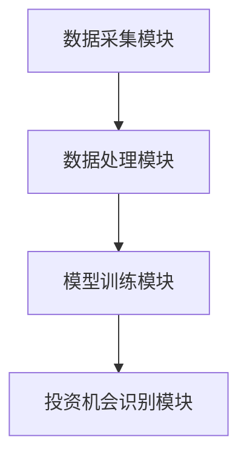
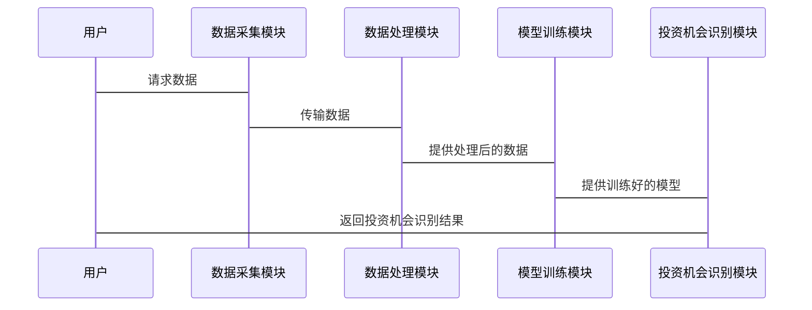

                 


# AI驱动的特殊情况投资机会识别

> 关键词：AI驱动、投资机会识别、特殊情况、机器学习、金融分析、数据挖掘

> 摘要：本文探讨了如何利用人工智能技术识别特殊情况下的投资机会，从背景介绍、核心概念、算法原理、系统架构设计到项目实战，全面解析AI在投资领域的应用潜力。

---

## 第一部分: AI驱动的特殊情况投资机会识别概述

### 第1章: 特殊情况投资机会的背景与意义

#### 1.1 投资机会识别的背景
##### 1.1.1 传统投资机会识别方法的局限性
传统投资机会识别主要依赖于人类经验和市场分析，这种方法存在效率低、主观性强、覆盖面有限等问题。在金融市场日益复杂化的背景下，传统方法难以应对海量数据和瞬息万变的市场变化。

##### 1.1.2 AI技术在投资领域的应用潜力
人工智能技术，尤其是机器学习和自然语言处理，能够处理海量数据，发现隐藏的模式和趋势，为投资机会识别提供了新的可能性。AI技术可以帮助投资者更高效地识别潜在机会，降低投资风险。

##### 1.1.3 特殊情况投资机会的定义与特点
特殊情况投资机会指的是在特定市场条件下出现的投资机会，例如市场崩盘、突发事件等。这些机会通常具有高风险、高回报的特点，且往往难以通过常规方法识别。

---

### 第2章: AI驱动投资机会识别的关键技术

#### 2.1 机器学习在投资分析中的应用
##### 2.1.1 监督学习与非监督学习在投资分析中的应用
- **监督学习**：用于预测股票价格、分类市场趋势。
- **非监督学习**：用于发现市场中的隐含模式和群组。

##### 2.1.2 深度学习在金融时间序列分析中的应用
- **LSTM网络**：用于时间序列预测，捕捉长期依赖关系。
- **卷积神经网络（CNN）**：用于分析金融数据中的局部模式。

##### 2.1.3 强化学习在投资策略优化中的应用
- **策略优化**：通过强化学习算法，优化投资组合和交易策略。

#### 2.2 自然语言处理在投资机会识别中的作用
##### 2.2.1 文本挖掘与情感分析在投资分析中的应用
- **文本挖掘**：从新闻、社交媒体中提取情感倾向，预测市场情绪。
- **情感分析**：用于判断市场参与者的情绪变化，辅助投资决策。

##### 2.2.2 基于NLP的市场情绪分析
- **案例分析**：利用Twitter数据预测股票价格波动。

##### 2.2.3 事件驱动投资机会识别
- **事件驱动策略**：识别市场中的突发事件，快速响应投资机会。

#### 2.3 数据挖掘与特征工程在投资机会识别中的作用
##### 2.3.1 数据预处理与特征提取
- **数据清洗**：处理缺失值、异常值。
- **特征提取**：从原始数据中提取有用的特征，例如波动率、成交量等。

##### 2.3.2 特征选择与降维技术
- **特征选择**：使用Lasso回归或随机森林进行特征重要性评估。
- **降维技术**：使用主成分分析（PCA）降低特征维度。

##### 2.3.3 时间序列数据的特征工程
- **特征工程**：提取时间序列的均值、标准差、自相关系数等特征。

---

## 第二部分: 算法原理与数学模型

### 第3章: 机器学习模型在投资机会识别中的应用

#### 3.1 机器学习模型在投资预测中的应用
##### 3.1.1 线性回归与逻辑回归在投资预测中的应用
- **线性回归**：用于预测股票价格。
- **逻辑回归**：用于分类市场趋势。

##### 3.1.2 支持向量机在分类问题中的应用
- **SVM**：用于分类市场状态（牛市、熊市等）。

##### 3.1.3 随机森林与梯度提升树在特征工程中的应用
- **随机森林**：用于特征重要性分析。
- **梯度提升树（如XGBoost）**：用于分类和回归任务。

#### 3.2 时间序列分析模型
##### 3.2.1 ARIMA模型在时间序列预测中的应用
- **ARIMA模型**：用于预测股票价格和市场趋势。

##### 3.2.2 LSTM网络在时间序列预测中的应用
- **LSTM网络**：用于捕捉时间序列的长期依赖关系。

##### 3.2.3 GARCH模型在金融风险管理中的应用
- **GARCH模型**：用于预测市场波动性。

#### 3.3 聚类分析与异常检测在投资机会识别中的应用
##### 3.3.1 K-means聚类在市场分割中的应用
- **K-means聚类**：用于将市场分成不同的群组，识别潜在的投资机会。

##### 3.3.2 DBSCAN算法在异常交易检测中的应用
- **DBSCAN**：用于检测市场中的异常交易行为。

##### 3.3.3 Isolation Forest算法在风险识别中的应用
- **Isolation Forest**：用于识别市场中的异常风险。

---

## 第三部分: 系统架构与设计

### 第4章: 投资机会识别系统的总体架构

#### 4.1 系统功能设计
##### 4.1.1 数据采集模块
- **功能**：从多种数据源（如股票交易所、新闻网站）采集实时数据。
- **实现**：使用API接口和网络爬虫技术。

##### 4.1.2 数据处理模块
- **功能**：对采集到的数据进行清洗、转换和特征提取。
- **实现**：使用Pandas库进行数据处理。

##### 4.1.3 模型训练模块
- **功能**：基于处理后的数据训练机器学习模型。
- **实现**：使用Scikit-learn、Keras等机器学习框架。

##### 4.1.4 投资机会识别模块
- **功能**：利用训练好的模型识别市场中的特殊情况投资机会。
- **实现**：基于模型预测结果生成投资信号。

#### 4.2 系统架构设计
##### 4.2.1 系统架构图


##### 4.2.2 接口设计
- **API接口**：提供RESTful API，供其他系统调用投资机会识别结果。

##### 4.2.3 交互流程


---

## 第四部分: 项目实战

### 第5章: 投资机会识别系统实战

#### 5.1 项目环境安装
```bash
pip install numpy pandas scikit-learn keras tensorflow
```

#### 5.2 系统核心实现源代码
##### 5.2.1 数据采集模块
```python
import requests
import pandas as pd

def get_stock_data(ticker):
    url = f"https://api.example.com/stock/{ticker}"
    response = requests.get(url)
    data = response.json()
    return pd.DataFrame(data)
```

##### 5.2.2 数据处理模块
```python
def preprocess_data(df):
    # 数据清洗
    df.dropna(inplace=True)
    # 特征提取
    df['return'] = df['close'].pct_change()
    return df
```

##### 5.2.3 模型训练模块
```python
from sklearn.ensemble import RandomForestClassifier

def train_model(X, y):
    model = RandomForestClassifier(n_estimators=100)
    model.fit(X, y)
    return model
```

##### 5.2.4 投资机会识别模块
```python
def identify_opportunity(model, new_data):
    prediction = model.predict(new_data)
    return prediction
```

#### 5.3 实际案例分析
##### 5.3.1 案例背景
- 市场出现突发事件，例如地缘政治冲突，导致市场波动加剧。

##### 5.3.2 数据分析
- 使用历史数据训练模型，识别出潜在的投资机会。

##### 5.3.3 模型预测结果
- 模型预测某股票在事件发生后会有显著上涨，建议买入。

---

## 第五部分: 总结与展望

### 第6章: 总结与展望

#### 6.1 本章总结
- 本文详细介绍了AI驱动的特殊情况投资机会识别的背景、关键技术、算法原理和系统架构设计。
- 通过项目实战展示了如何利用AI技术识别市场中的潜在投资机会。

#### 6.2 未来展望
- **多模态数据融合**：结合文本、图像等多种数据源，提高投资机会识别的准确性。
- **强化学习的应用**：进一步研究强化学习在投资策略优化中的应用。
- **实时性优化**：提高系统的实时性，适应快速变化的市场环境。

---

## 作者：AI天才研究院 & 禅与计算机程序设计艺术

---

这篇文章通过系统的分析和实战案例，全面探讨了AI驱动的特殊情况投资机会识别的技术和方法。从背景介绍到算法原理，再到系统设计和项目实战，为读者提供了一个完整的解决方案。

