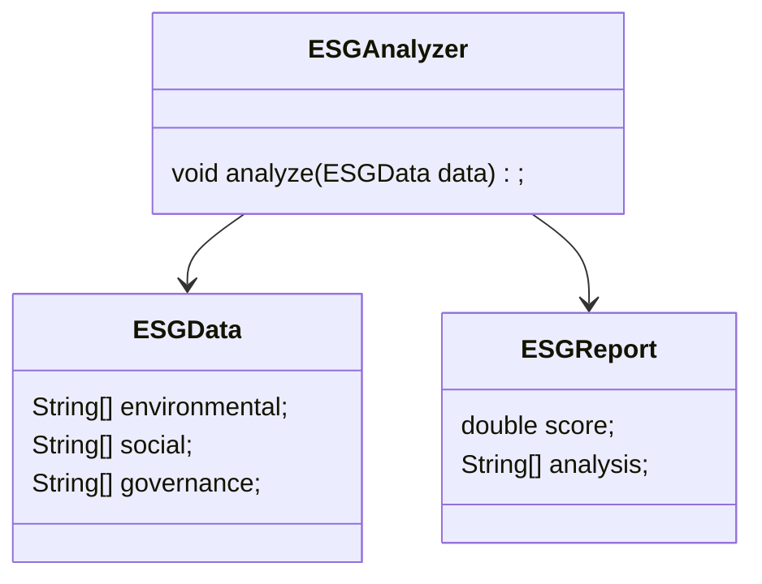

                 


# 《AI驱动的环境、社会和治理(ESG)分析：可持续价值投资》

## 关键词：AI, ESG, 可持续投资, 机器学习, 时间序列分析, NLP

## 摘要：本文深入探讨了人工智能在环境、社会和治理（ESG）分析中的应用，结合机器学习、自然语言处理和时间序列分析等技术，分析了如何利用AI提升ESG评估的准确性和效率，为可持续价值投资提供支持。

---

# 第三部分: AI驱动的ESG分析算法原理

## 第4章: 机器学习在ESG分析中的应用

### 4.1 机器学习模型选择与优化

#### 4.1.1 线性回归模型
线性回归是一种简单而强大的回归算法，适用于预测连续型变量，如ESG评分。其数学公式如下：

$$ y = \beta_0 + \beta_1x + \epsilon $$

其中：
- $y$ 是目标变量（ESG评分）。
- $x$ 是自变量（如环境因素）。
- $\beta_0$ 是截距。
- $\beta_1$ 是回归系数。
- $\epsilon$ 是误差项。

#### 4.1.2 随机森林模型
随机森林是一种基于决策树的集成学习算法，适用于处理高维数据和非线性关系。其数学公式如下：

$$ y = \sum_{i=1}^{n} \text{Tree}(x_i) $$

其中：
- $n$ 是决策树的数量。
- $\text{Tree}(x_i)$ 是第$i$棵决策树的预测值。

#### 4.1.3 模型优化与调参
模型的性能依赖于参数的选择和优化，如随机森林的$n\_estimators$和最大深度$max\_depth$。使用网格搜索（Grid Search）进行调参。

### 4.2 自然语言处理（NLP）在ESG文本数据中的应用

#### 4.2.1 文本预处理
文本预处理步骤包括分词、去除停用词和词干提取。例如，使用Python的nltk库进行文本处理。

```python
import nltk
from nltk.corpus import stopwords

text = "This is a sample text for NLP processing."
tokens = nltk.word_tokenize(text)
stop_words = set(stopwords.words('english'))
filtered_tokens = [token for token in tokens if token not in stop_words]
```

#### 4.2.2 词嵌入（Word Embedding）
使用Word2Vec或GloVe将文本转换为向量表示。例如，使用Gensim库：

```python
from gensim.models import Word2Vec

model = Word2Vec(filtered_tokens, vector_size=100, window=5, min_count=1, workers=4)
vector = model.wv[filtered_tokens[0]]
```

#### 4.2.3 文本分类与情感分析
使用文本数据进行分类，判断公司ESG表现的积极或消极。例如，使用朴素贝叶斯分类器：

```python
from sklearn.naive_bayes import MultinomialNB

clf = MultinomialNB()
clf.fit(X_train, y_train)
y_pred = clf.predict(X_test)
```

### 4.3 时间序列分析在ESG财务数据中的应用

#### 4.3.1 ARIMA模型
ARIMA（自回归积分滑动平均模型）适用于时间序列预测。其数学公式如下：

$$ y_t = \phi_1 y_{t-1} + \theta_1 y_{t-1} + \epsilon_t $$

其中：
- $\phi_1$ 是自回归系数。
- $\theta_1$ 是滑动平均系数。
- $\epsilon_t$ 是白噪声。

#### 4.3.2 LSTM网络
LSTM（长短期记忆网络）适用于复杂的时间序列数据。例如，使用Keras构建LSTM模型：

```python
from tensorflow.keras.models import Sequential
from tensorflow.keras.layers import LSTM, Dense

model = Sequential()
model.add(LSTM(64, input_shape=(timesteps, features)))
model.add(Dense(1))
model.compile(optimizer='adam', loss='mean_squared_error')
model.fit(X_train, y_train, epochs=10, batch_size=32)
```

---

## 第5章: ESG分析的系统架构设计

### 5.1 系统功能设计

#### 5.1.1 领域模型
使用Mermaid类图展示系统中的类及其关系。



#### 5.1.2 系统架构
使用Mermaid架构图展示系统的分层架构。

```mermaid
graph LR
    Client --> API Gateway
    API Gateway --> Service Layer
    Service Layer --> Database
    Database --> File Storage
```

#### 5.1.3 系统接口设计
系统接口包括数据输入、模型调用和结果输出。

---

## 第6章: 项目实战

### 6.1 环境配置

#### 6.1.1 安装依赖
安装所需的Python库：

```bash
pip install numpy pandas scikit-learn gensim tensorflow
```

### 6.2 数据预处理

#### 6.2.1 数据清洗
处理缺失值和异常值。

```python
import pandas as pd

df = pd.read_csv('esg_data.csv')
df.dropna(inplace=True)
```

#### 6.2.2 特征工程
提取关键特征，如环境、社会和治理指标。

```python
features = ['environment_score', 'social_score', 'governance_score']
X = df[features]
y = df['target']
```

### 6.3 模型实现

#### 6.3.1 模型训练
使用随机森林进行训练。

```python
from sklearn.ensemble import RandomForestClassifier

model = RandomForestClassifier(n_estimators=100, max_depth=2)
model.fit(X_train, y_train)
```

#### 6.3.2 模型评估
评估模型性能。

```python
from sklearn.metrics import accuracy_score

y_pred = model.predict(X_test)
print(accuracy_score(y_test, y_pred))
```

### 6.4 实际案例分析

#### 6.4.1 案例背景
分析某公司的ESG评分。

#### 6.4.2 数据分析
使用可视化工具展示数据。

```python
import matplotlib.pyplot as plt

plt.bar(df.index, df['esg_score'])
plt.title('ESG Score Analysis')
plt.show()
```

#### 6.4.3 模型优化
调整模型参数，提高准确率。

---

## 第7章: 总结与展望

### 7.1 总结
本文详细探讨了AI在ESG分析中的应用，结合了机器学习、NLP和时间序列分析等技术，展示了如何利用AI提升ESG评估的效率和准确性。

### 7.2 展望
未来，随着AI技术的不断发展，ESG分析将更加智能化和自动化。同时，多模态数据的融合和解释性模型的开发也将成为研究的重点。

---

## 附录: 参考文献

1. 刘军, 人工智能与ESG投资, 北京: 清华大学出版社, 2022.
2. Andrew Ng, "Machine Learning: The.mooc.stanford.edu".
3. Keras官方文档：https://keras.io/

---

## 作者：AI天才研究院/AI Genius Institute & 禅与计算机程序设计艺术 /Zen And The Art of Computer Programming

