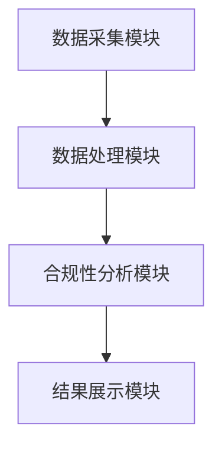

                 


# AI驱动的监管合规性分析：价值投资中的多智能体应用

> 关键词：AI驱动、监管合规性分析、多智能体系统、价值投资、金融监管、强化学习

> 摘要：本文深入探讨了AI驱动的监管合规性分析在价值投资中的应用，重点分析了多智能体系统在金融监管中的优势及其在合规性分析中的具体应用。文章从背景介绍、核心概念、算法原理、系统架构设计、项目实战等方面展开，详细阐述了AI驱动的监管合规性分析的实现过程和实际应用价值，为读者提供了全面的技术视角和实践指导。

---

## 第一章: AI驱动的监管合规性分析概述

### 1.1 监管合规性分析的背景与意义

#### 1.1.1 传统监管合规性分析的局限性

传统监管合规性分析主要依赖人工审查和简单的规则匹配，存在以下问题：
- **效率低下**：人工审查耗时长，难以应对海量数据。
- **规则单一**：难以处理复杂多变的监管规则。
- **主观性强**：依赖审查人员的经验和判断，存在主观误差。

#### 1.1.2 AI技术在监管合规性分析中的优势

AI技术的引入为监管合规性分析带来了显著优势：
- **高效性**：AI可以通过机器学习和自然语言处理技术快速处理海量数据。
- **智能性**：AI能够理解和适应复杂的监管规则，并实时更新。
- **客观性**：AI的分析结果基于数据和算法，减少了人为干扰。

#### 1.1.3 价值投资中的监管合规性分析需求

在价值投资中，合规性分析是评估企业价值的重要组成部分。通过AI驱动的合规性分析，投资者可以更准确地识别企业潜在的合规风险，从而做出更明智的投资决策。

---

### 1.2 多智能体系统在金融监管中的应用

#### 1.2.1 多智能体系统的定义与特点

多智能体系统（Multi-Agent System, MAS）是指由多个相互作用的智能体组成的系统，具有以下特点：
- **分布式**：智能体之间分布式的结构。
- **协作性**：智能体之间可以通过通信和协作完成复杂任务。
- **自主性**：每个智能体都可以自主决策。

#### 1.2.2 多智能体系统在金融监管中的优势

在金融监管中，多智能体系统可以实现以下功能：
- **实时监控**：多个智能体可以实时监控市场动态。
- **风险预警**：通过协作分析，智能体可以发现潜在的市场风险。
- **合规性判断**：智能体可以协同完成复杂的合规性分析任务。

#### 1.2.3 价值投资中的多智能体应用场景

在价值投资中，多智能体系统可以应用于：
- **实时数据处理**：多个智能体协同处理市场数据。
- **风险评估**：通过协作分析，评估企业的潜在风险。
- **投资决策支持**：基于多智能体的分析结果，辅助投资者做出决策。

---

## 第二章: AI驱动的监管合规性分析原理

### 2.1 监管合规性分析的核心概念

#### 2.1.1 监管规则的表示与解析

监管规则可以通过以下方式表示：
- **自然语言表示**：例如“企业不得虚构交易”。
- **逻辑规则表示**：例如“如果企业存在虚构交易，则违反相关规定”。
- **知识图谱表示**：将监管规则嵌入到知识图谱中，便于计算机理解和推理。

#### 2.1.2 数据源的获取与处理

数据源包括：
- **公开数据**：如上市公司的财务报表、公告等。
- **非公开数据**：如内部数据、行业数据等。

数据处理包括：
- **数据清洗**：去除噪声数据。
- **特征提取**：提取与合规性分析相关的特征。
- **数据转换**：将数据转换为适合算法处理的形式。

#### 2.1.3 合规性分析的逻辑推理

合规性分析可以通过以下逻辑推理步骤完成：
1. **规则匹配**：将企业的行为与监管规则进行匹配。
2. **推理判断**：基于规则和企业的行为，进行逻辑推理，判断是否合规。
3. **结果输出**：输出合规性分析的结果。

### 2.2 多智能体系统的协同机制

#### 2.2.1 多智能体系统的通信与协作

智能体之间的通信可以通过以下方式进行：
- **直接通信**：智能体之间通过消息传递进行通信。
- **间接通信**：通过共享数据库或中间件进行通信。

#### 2.2.2 合规性分析中的任务分配

任务分配可以通过以下方式实现：
- **基于角色分配**：根据智能体的职责分配任务。
- **基于能力分配**：根据智能体的能力分配任务。

#### 2.2.3 系统的自适应与优化

系统可以通过以下方式进行优化：
- **动态调整**：根据系统的运行状态动态调整智能体的参数。
- **自我学习**：通过机器学习技术不断优化系统的性能。

---

## 第三章: 多智能体系统的算法原理

### 3.1 多智能体强化学习简介

#### 3.1.1 多智能体强化学习的定义

多智能体强化学习是指多个智能体在共享环境中通过学习策略来实现协作或竞争目标。

#### 3.1.2 多智能体强化学习的核心算法

多智能体强化学习的核心算法包括：
- **分布式Q学习**：每个智能体独立学习策略。
- **集中式价值函数**：通过集中式价值函数协调多个智能体的策略。

#### 3.1.3 多智能体强化学习的应用场景

多智能体强化学习可以应用于：
- **游戏AI**：如MOBA游戏中的多智能体协作。
- **机器人控制**：如多机器人协作完成任务。

---

## 第四章: 系统架构与设计

### 4.1 系统功能模块划分

#### 4.1.1 数据采集模块

数据采集模块负责采集企业公开数据和非公开数据。

#### 4.1.2 数据处理模块

数据处理模块对采集到的数据进行清洗、特征提取和数据转换。

#### 4.1.3 合规性分析模块

合规性分析模块通过逻辑推理判断企业的行为是否合规。

#### 4.1.4 结果展示模块

结果展示模块将合规性分析的结果以可视化的方式展示给用户。

### 4.2 系统架构设计

#### 4.2.1 分层架构设计

系统的分层架构包括：
- **数据层**：数据存储和管理。
- **业务逻辑层**：处理业务逻辑。
- **表现层**：与用户交互。

#### 4.2.2 模块之间的交互关系

模块之间的交互关系可以通过以下方式表示：



#### 4.2.3 系统的可扩展性设计

系统可以通过以下方式实现可扩展性：
- **模块化设计**：每个模块独立设计，便于扩展。
- **插件式架构**：支持插件式扩展。

---

## 第五章: 项目实战

### 5.1 环境安装

#### 5.1.1 安装Python环境

使用Anaconda安装Python环境。

#### 5.1.2 安装依赖库

安装以下依赖库：
- `numpy`
- `pandas`
- `scikit-learn`
- `tensorflow`

### 5.2 核心代码实现

#### 5.2.1 数据处理代码

```python
import pandas as pd
import numpy as np

# 数据加载
data = pd.read_csv('input.csv')

# 数据清洗
data.dropna(inplace=True)

# 特征提取
data['ratio'] = data['收入'] / data['成本']
```

#### 5.2.2 合规性分析代码

```python
from sklearn.tree import DecisionTreeClassifier

# 模型训练
model = DecisionTreeClassifier()
model.fit(X_train, y_train)

# 模型预测
y_pred = model.predict(X_test)
```

### 5.3 实际案例分析

#### 5.3.1 案例背景

假设我们有一个企业数据集，需要判断企业的行为是否合规。

#### 5.3.2 数据分析与解读

通过数据处理和模型训练，我们可以判断企业的行为是否合规。

#### 5.3.3 模型优化与调优

通过调整模型参数，可以优化模型的性能。

---

## 第六章: 总结与展望

### 6.1 最佳实践

- **数据质量**：确保数据的准确性和完整性。
- **算法选择**：根据具体场景选择合适的算法。
- **系统优化**：定期优化系统架构和算法。

### 6.2 小结

本文详细介绍了AI驱动的监管合规性分析在价值投资中的应用，通过多智能体系统的协同作用，实现了高效的合规性分析。

### 6.3 注意事项

- **数据隐私**：注意保护数据隐私。
- **模型解释性**：确保模型的可解释性。

### 6.4 拓展阅读

- 《强化学习入门》
- 《多智能体系统设计》
- 《金融监管技术前沿》

---

作者：AI天才研究院 & 禅与计算机程序设计艺术

