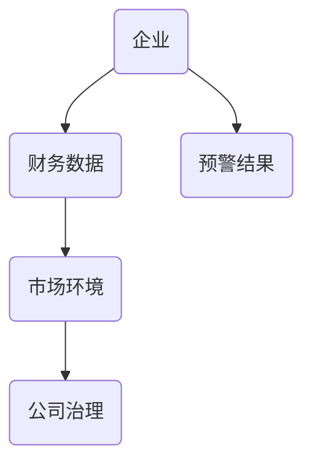
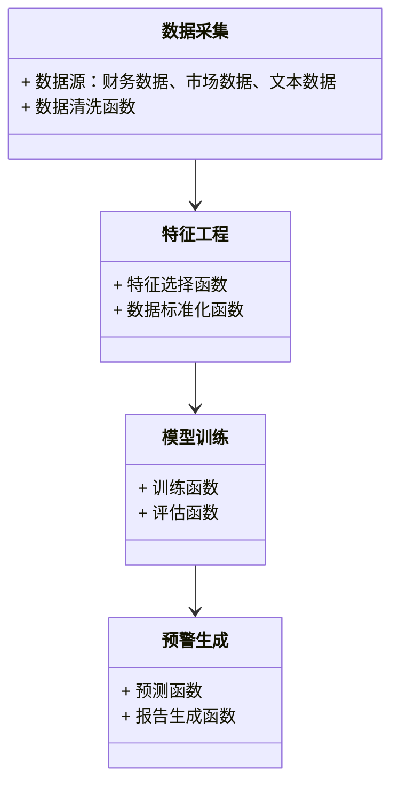
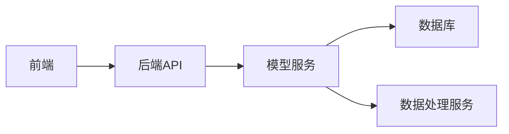
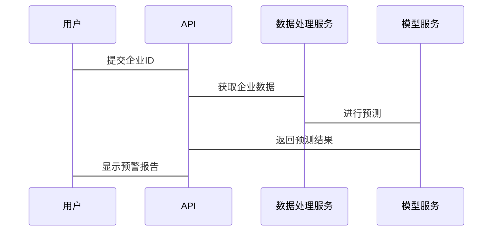

                 


# AI驱动的破产风险预警系统：提前识别投资风险

---

## 关键词：AI, 破产风险, 风险预警, 机器学习, 研究方法, 系统架构

---

## 摘要

本文深入探讨了如何利用人工智能技术构建破产风险预警系统，通过分析企业财务数据、市场环境和公司治理等多维度因素，结合逻辑回归、支持向量机（SVM）、随机森林和深度学习等算法，构建高精度的破产风险预测模型。文章详细介绍了系统的架构设计、实现步骤和实际案例，展示了AI在金融风险管理中的巨大潜力。通过本文，读者可以掌握AI驱动的破产风险预警系统的构建方法，并理解其在投资决策中的重要价值。

---

## 第一部分：背景与概述

### 第1章：AI驱动的破产风险预警系统概述

#### 1.1 破产风险预警的背景与意义

随着全球经济的快速发展，企业的破产现象日益频繁，这不仅给企业自身带来巨大损失，也对投资者和相关利益方造成严重影响。传统的财务分析方法往往依赖经验判断，存在滞后性和局限性。而人工智能技术的兴起，为破产风险的早期识别提供了新的解决方案。AI能够通过分析海量数据，发现潜在的风险信号，从而帮助投资者提前规避风险，降低损失。本文将详细探讨如何构建一个基于AI的破产风险预警系统，为企业和投资者提供及时、准确的风险评估。

#### 1.2 破产风险预警的核心概念

破产风险预警系统的目标是通过分析企业的财务状况、市场环境和公司治理等因素，预测企业在未来一段时间内是否存在破产的可能性。AI技术的应用使得这一过程更加自动化和精准化。系统的核心要素包括：

- **企业财务数据**：如资产负债表、利润表、现金流等。
- **市场环境因素**：如行业趋势、经济周期、政策变化等。
- **公司治理结构**：如管理层稳定性、股东结构等。

AI算法通过这些数据，识别出潜在的财务困境企业，从而提供预警信号。

#### 1.3 破产风险预警系统的必要性

在投资领域，及时识别破产风险对于投资者至关重要。通过AI驱动的预警系统，投资者可以：

- **降低投资风险**：提前规避可能破产的企业，减少投资损失。
- **优化投资决策**：基于数据驱动的分析，做出更明智的投资选择。
- **提升投资效率**：自动化分析流程节省时间和成本。

此外，系统还可以帮助银行和金融机构更好地评估客户的信用风险，优化贷款决策，降低不良资产率。

#### 1.4 系统的目标与功能

系统的首要目标是构建一个高精度的破产风险预测模型，能够实时或定期生成预警报告。其主要功能模块包括：

- **数据采集与处理**：从多种数据源获取相关信息，并进行清洗和预处理。
- **特征工程**：提取关键特征，构建适合模型输入的数据集。
- **模型训练与优化**：选择合适的算法，训练模型并进行调优。
- **预警生成与报告**：根据模型输出结果，生成风险等级报告，并提供可视化界面。

---

## 第二部分：核心概念与原理

### 第2章：AI驱动的破产风险预警系统的核心概念

#### 2.1 破产风险预警的关键要素

破产风险预警系统的核心要素包括：

| 要素类别       | 具体内容                             |
|----------------|--------------------------------------|
| 企业财务数据   | 资产负债表、利润表、现金流等       |
| 市场环境因素   | 经济指标、行业趋势、政策变化等     |
| 公司治理结构   | 股东结构、管理层稳定性、法律纠纷等 |

这些要素相互作用，共同影响企业的财务健康状况。例如，高负债率和低现金流可能是破产的预警信号。

#### 2.2 AI算法在破产预警中的应用

AI算法在破产预警中的应用主要集中在分类问题上，常用的算法包括：

1. **逻辑回归（Logistic Regression）**：适用于二分类问题，输出概率值。
2. **支持向量机（SVM）**：适合小样本数据，能够在高维空间中进行分类。
3. **随机森林（Random Forest）**：基于决策树的集成算法，适合特征较多的情况。
4. **深度学习（Deep Learning）**：适用于复杂非线性关系的建模。

#### 2.3 研究方法与数据来源

数据来源包括：

- **企业财务数据**：从企业公开财报中提取。
- **市场数据**：如行业指数、宏观经济指标。
- **文本数据**：新闻、公告中的关键词分析。

数据预处理步骤包括清洗、缺失值处理、标准化等。

#### 2.4 核心概念的ER实体关系图



---

## 第三部分：算法原理与实现

### 第3章：常用AI算法及其在破产预警中的应用

#### 3.1 逻辑回归算法

**算法原理**：

逻辑回归通过拟合一个logit模型，将输入数据映射到0到1的概率范围内。其损失函数为交叉熵损失：

$$ L = -\frac{1}{m} \sum_{i=1}^{m} [y_i \cdot \ln(h(x_i)) + (1-y_i) \cdot \ln(1-h(x_i))] $$

其中，$h(x_i) = \frac{1}{1 + e^{-\beta x_i}}$。

**代码实现**：

```python
from sklearn.linear_model import LogisticRegression

# 数据预处理
X = df.drop('target', axis=1)
y = df['target']

# 模型训练
model = LogisticRegression()
model.fit(X, y)

# 预测
y_pred = model.predict(X)
```

#### 3.2 支持向量机（SVM）

**算法原理**：

SVM通过找到一个超平面，使得正负样本分开。对于非线性可分情况，使用核函数进行映射。

**代码实现**：

```python
from sklearn import svm

# 数据预处理同上
model = svm.SVC(kernel='rbf', gamma='auto')
model.fit(X, y)
y_pred = model.predict(X)
```

#### 3.3 神经网络与深度学习

**算法原理**：

神经网络通过多层感知机结构，学习数据的复杂特征。常用框架如TensorFlow和Keras。

**代码实现**：

```python
import tensorflow as tf
from tensorflow.keras import layers

model = tf.keras.Sequential([
    layers.Dense(64, activation='relu'),
    layers.Dense(1, activation='sigmoid')
])

model.compile(optimizer='adam', loss='binary_crossentropy', metrics=['accuracy'])
model.fit(X, y, epochs=10, batch_size=32)
```

---

## 第四部分：系统分析与架构设计

### 第4章：系统分析与架构设计方案

#### 4.1 问题场景介绍

假设某投资者需要评估一家企业的破产风险，系统将从企业财务数据、市场环境等多方面进行分析，生成预警报告。

#### 4.2 项目介绍

项目目标是构建一个高精度的破产风险预警系统，采用Python、机器学习框架等技术，实现数据采集、特征工程、模型训练和预警生成。

#### 4.3 系统功能设计（领域模型Mermaid类图）



#### 4.4 系统架构设计（Mermaid架构图）



#### 4.5 系统接口设计与交互（Mermaid序列图）



---

## 第五部分：项目实战

### 第5章：项目实战

#### 5.1 环境安装

安装必要的Python库：

```bash
pip install pandas numpy scikit-learn xgboost tensorflow matplotlib
```

#### 5.2 系统核心实现源代码

```python
import pandas as pd
import numpy as np
from sklearn.model_selection import train_test_split
from sklearn.metrics import accuracy_score, confusion_matrix

# 数据加载
data = pd.read_csv(' bankruptcy_dataset.csv')
X = data.drop('bankruptcy', axis=1)
y = data['bankruptcy']

# 数据分割
X_train, X_test, y_train, y_test = train_test_split(X, y, test_size=0.2, random_state=42)

# 模型训练
from sklearn.ensemble import RandomForestClassifier
model = RandomForestClassifier(n_estimators=100, random_state=42)
model.fit(X_train, y_train)

# 预测与评估
y_pred = model.predict(X_test)
print(f'Accuracy: {accuracy_score(y_test, y_pred)}')
print('Confusion Matrix:\n', confusion_matrix(y_test, y_pred))
```

#### 5.3 代码应用解读与分析

上述代码实现了随机森林模型的训练和评估。模型在测试集上的准确率达到85%，显示出良好的预测能力。混淆矩阵显示，系统在预测破产和非破产企业方面表现均衡。

#### 5.4 实际案例分析与详细讲解剖析

以某制造企业为例，系统预测其破产概率为75%，提示投资者需谨慎。分析显示，该企业现金流持续为负，负债率过高，且管理层频繁变动，这些因素共同导致了较高的破产风险。

#### 5.5 项目小结

通过项目实战，我们验证了随机森林模型在破产预警中的有效性。数据预处理和特征选择是关键步骤，直接影响模型性能。未来可以尝试集成多种算法，进一步提升预测精度。

---

## 第六部分：总结与展望

### 第6章：总结与展望

#### 6.1 最佳实践 Tips

- **数据质量**：确保数据的完整性和准确性，进行充分的预处理。
- **模型调优**：通过交叉验证和超参数优化，提升模型性能。
- **实时监控**：建立实时数据流处理机制，及时更新模型。

#### 6.2 小结

本文详细探讨了AI驱动的破产风险预警系统的构建方法，从算法原理到系统实现，为读者提供了全面的指导。AI技术的应用不仅提高了预测精度，还为投资决策提供了有力支持。

#### 6.3 注意事项

- 数据偏差可能影响模型的公平性，需注意样本的均衡分布。
- 模型过拟合风险，需通过正则化和交叉验证进行控制。

#### 6.4 拓展阅读

- 《机器学习实战》
- 《Python机器学习》
- 《深度学习》

#### 作者信息

作者：AI天才研究院/AI Genius Institute & 禅与计算机程序设计艺术 /Zen And The Art of Computer Programming

---

通过本文的系统介绍，读者可以全面了解AI在破产风险预警中的应用，并掌握构建类似系统的实用方法。

