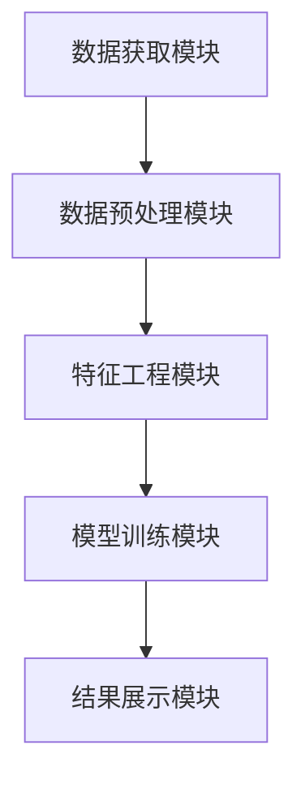
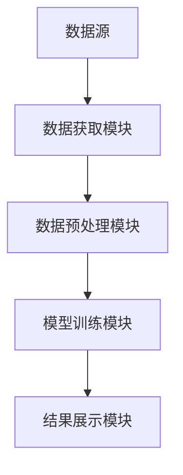

                 


# AI驱动的私募股权投资筛选

> 关键词：私募股权, 人工智能, 投资筛选, 机器学习, 数据分析

> 摘要：本文详细探讨了AI在私募股权投资筛选中的应用，从数据收集、特征工程、模型选择到系统架构，全面分析了如何利用AI技术优化私募股权的投资决策过程。文章结合实际案例，深入讲解了常见的机器学习算法及其在私募股权筛选中的实现，并通过系统架构设计展示了AI驱动的私募股权投资筛选系统的构建过程。最后，本文总结了AI在私募股权投资中的优势与挑战，并提出了未来的发展方向。

---

# 第一部分: AI驱动的私募股权投资筛选概述

# 第1章: 私募股权投资概述

## 1.1 私募股权投资的基本概念
### 1.1.1 私募股权的定义与特点
私募股权是指通过非公开市场进行的股权投资，其特点是投资期限较长、资金流动性较低、收益较高。私募股权通常分为早期投资、风险投资、成长资本、私募股权收购等阶段。

### 1.1.2 私募股权投资的流程与阶段
私募股权投资的流程一般包括项目筛选、尽职调查、估值分析、投资决策和投后管理等阶段。每个阶段都需要大量的数据支持和专业的分析能力。

### 1.1.3 私募股权市场的现状与发展趋势
随着全球经济的发展和技术的进步，私募股权市场逐渐扩大。AI技术的引入为私募股权的筛选和分析带来了新的可能性。

## 1.2 AI在私募股权投资中的作用
### 1.2.1 AI技术如何赋能私募股权
AI可以通过分析大量非结构化数据（如新闻、社交媒体）和结构化数据（如财务报表）来辅助投资决策，帮助投资者发现潜在的投资机会。

### 1.2.2 AI在私募股权筛选中的优势
AI可以快速处理和分析海量数据，提供实时的市场动态和公司估值，帮助投资者做出更明智的投资决策。

### 1.2.3 AI驱动私募股权投资的未来展望
随着AI技术的不断进步，私募股权的筛选将更加智能化和精准化，投资决策的效率和准确性将进一步提高。

## 1.3 数据驱动的私募股权筛选
### 1.3.1 数据在私募股权筛选中的重要性
数据是AI驱动私募股权投资的核心，包括公司财务数据、市场数据、行业趋势数据等。

### 1.3.2 数据来源与数据质量
数据来源包括公开市场数据、新闻媒体、社交媒体、公司财报等。数据质量直接影响到模型的准确性和可靠性。

### 1.3.3 数据预处理与特征工程
数据预处理包括数据清洗、缺失值处理、异常值处理等。特征工程则是将原始数据转化为对投资决策更有意义的特征。

---

# 第2章: AI驱动私募股权投资的核心概念与模型

## 2.1 数据特征与投资决策
### 2.1.1 财务指标分析
财务指标是私募股权投资的重要参考，包括收入增长率、利润率、资产负债率等。

### 2.1.2 市场表现分析
市场表现分析包括公司股票的波动性、市盈率、市净率等指标。

### 2.1.3 公司治理与风险因素
公司治理结构、管理团队稳定性、法律风险等也是重要的投资决策因素。

## 2.2 AI模型在私募股权筛选中的应用
### 2.2.1 机器学习模型的分类与选择
根据任务类型选择合适的机器学习模型，如分类任务选择随机森林、回归任务选择线性回归等。

### 2.2.2 常见的AI模型及其特点
- **线性回归**：适用于连续型变量的预测。
- **随机森林**：适用于分类和回归任务，具有较强的抗过拟合能力。
- **支持向量机**：适用于分类任务，对高维数据表现较好。
- **深度学习模型**：如LSTM适用于时间序列数据的分析。

### 2.2.3 深度学习模型在私募股权中的应用
深度学习模型可以处理复杂的非结构化数据，如自然语言处理（NLP）用于分析公司新闻和社交媒体数据。

## 2.3 AI模型的评估与优化
### 2.3.1 模型评估指标
常用的评估指标包括准确率、召回率、F1分数等。

### 2.3.2 模型调优与优化
通过交叉验证、网格搜索等方法优化模型参数。

### 2.3.3 模型的可解释性与风险控制
模型的可解释性对于投资决策非常重要，尤其是在风险控制方面。

---

# 第3章: 机器学习算法原理与实现

## 3.1 常见机器学习算法概述
### 3.1.1 线性回归
线性回归是一种简单且常用的回归算法，适用于预测连续型变量。

### 3.1.2 支持向量机
支持向量机是一种强大的分类算法，适用于高维数据。

### 3.1.3 随机森林
随机森林是一种基于决策树的集成学习算法，具有较强的抗过拟合能力。

### 3.1.4 神经网络
神经网络是一种模仿人脑结构的深度学习模型，适用于复杂的非线性数据。

## 3.2 算法原理与数学模型
### 3.2.1 线性回归的数学公式
$$ y = \beta_0 + \beta_1x + \epsilon $$

### 3.2.2 随机森林的算法流程
1. 从训练数据中随机抽取样本。
2. 对每个样本进行特征抽取。
3. 建立决策树模型。
4. 对所有决策树进行投票或平均，得到最终结果。

### 3.2.3 神经网络的结构与训练过程
神经网络由输入层、隐藏层和输出层组成，通过反向传播算法进行训练。

## 3.3 算法实现与代码示例
### 3.3.1 线性回归的Python实现
```python
import numpy as np
from sklearn.linear_model import LinearRegression

# 示例数据
X = np.array([[1], [2], [3], [4]])
y = np.array([2, 4, 6, 8])

# 训练模型
model = LinearRegression()
model.fit(X, y)

# 预测
print(model.predict([[5]]))  # 输出 [10]
```

### 3.3.2 随机森林的Python实现
```python
from sklearn.ensemble import RandomForestClassifier

# 示例数据
X = np.array([[1, 2], [3, 4], [5, 6], [7, 8]])
y = np.array([0, 1, 0, 1])

# 训练模型
model = RandomForestClassifier(n_estimators=2)
model.fit(X, y)

# 预测
print(model.predict([[9, 10]]))  # 输出 [1]
```

---

# 第4章: 系统分析与架构设计

## 4.1 问题场景介绍
私募股权筛选系统需要处理大量的数据，包括财务数据、市场数据、新闻数据等。

## 4.2 系统功能设计
### 4.2.1 数据获取模块
从多种数据源获取数据，包括公开市场数据、新闻媒体数据等。

### 4.2.2 数据预处理模块
对获取的数据进行清洗、特征提取等处理。

### 4.2.3 模型训练模块
选择合适的算法进行模型训练。

### 4.2.4 结果展示模块
将模型的预测结果以可视化的方式展示给用户。

## 4.3 系统架构设计
### 4.3.1 系统架构图


### 4.3.2 数据流图


---

# 第5章: 项目实战

## 5.1 环境安装
安装必要的Python库，如Scikit-learn、XGBoost、TensorFlow等。

## 5.2 系统核心实现源代码
### 5.2.1 数据获取与预处理
```python
import pandas as pd

# 数据获取
df = pd.read_csv('equity_data.csv')

# 数据预处理
df.dropna(inplace=True)
df['label'] = df['label'].astype(int)
```

### 5.2.2 模型训练与评估
```python
from sklearn.model_selection import train_test_split
from sklearn.metrics import accuracy_score

# 数据分割
X_train, X_test, y_train, y_test = train_test_split(df.drop('label', axis=1), df['label'], test_size=0.2)

# 模型训练
model.fit(X_train, y_train)

# 模型评估
print(accuracy_score(model.predict(X_test), y_test))
```

## 5.3 代码应用解读与分析
通过对代码的解读，详细分析模型的训练过程和评估结果。

## 5.4 实际案例分析
以一个具体案例为例，详细分析AI在私募股权投资中的实际应用。

## 5.5 项目小结
总结项目实现的关键点和经验教训。

---

# 第6章: 最佳实践、小结与展望

## 6.1 最佳实践
- 数据预处理是关键，确保数据质量。
- 选择合适的算法，避免过拟合。
- 定期更新模型，适应市场变化。

## 6.2 小结
AI技术在私募股权投资中的应用前景广阔，能够显著提高投资效率和准确性。

## 6.3 注意事项
- 数据隐私和合规性问题。
- 模型的可解释性和透明度。
- 技术与业务的结合。

## 6.4 拓展阅读
推荐相关的书籍和论文，供读者进一步学习。

---

# 作者

作者：AI天才研究院/AI Genius Institute & 禅与计算机程序设计艺术 /Zen And The Art of Computer Programming

