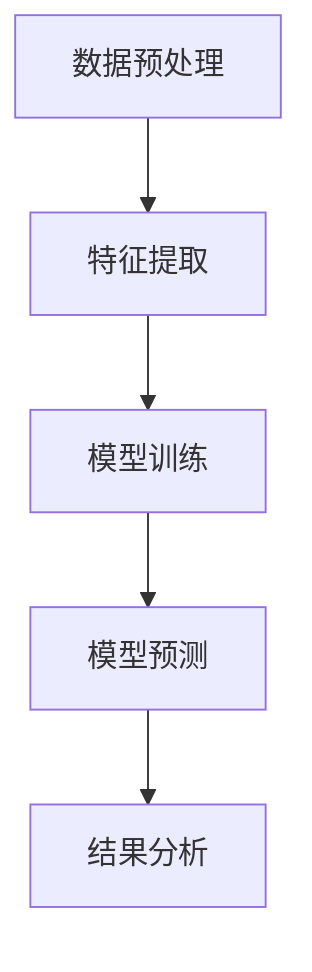
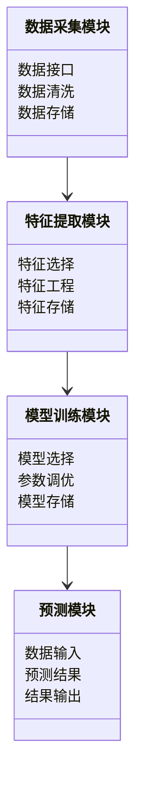
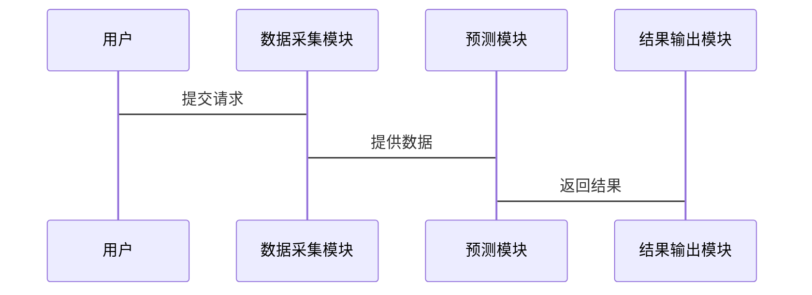

                 


# AI驱动的私募股权投资退出时机预测

## 关键词：
- AI驱动
- 私募股权投资
- 退出时机预测
- 机器学习
- 金融模型

## 摘要：
本文将探讨如何利用人工智能技术预测私募股权投资的退出时机。通过分析私募股权投资的核心特征、市场周期、风险评估等关键因素，结合机器学习算法和金融模型，提出了一种基于AI的退出时机预测方法。本文从背景介绍、核心概念、算法原理、系统架构到项目实战，全面解析了AI在私募股权投资退出时机预测中的应用，并通过具体案例展示了其实现过程和实际效果。

---

## 第一部分: AI驱动的私募股权投资退出时机预测概述

### 第1章: 私募股权退出时机预测的背景与挑战

#### 1.1 私募股权退出的定义与特征
- 私募股权（Private Equity）是指通过私募基金等方式对非公开交易的企业进行投资，并在一定时间内通过企业上市、并购等方式退出，获得投资收益。
- 退出时机预测的核心要素包括市场周期、企业价值评估、宏观经济环境等。
- 私募股权退出的特征：周期性、波动性、高收益与高风险并存。

#### 1.2 AI驱动的退出时机预测的必要性
- 传统退出时机预测方法依赖人工经验，存在主观性较强、效率低下等问题。
- AI技术在金融领域的广泛应用，为私募股权退出时机预测提供了新的可能性。
- 数据驱动决策能够帮助投资者更准确地捕捉市场机会，降低投资风险。

#### 1.3 当前研究现状与挑战
- 学术界：基于机器学习的时间序列分析模型在金融预测中取得了一定成果，但针对私募股权退出时机的专门研究较少。
- 业界：部分机构已经开始尝试将AI技术应用于私募股权管理，但整体应用水平有限。
- 挑战：数据获取难度大、模型泛化能力不足、市场波动性高。

---

## 第二部分: 私募股权投资退出时机预测的核心概念与理论

### 第2章: 私募股权退出时机预测的核心要素

#### 2.1 退出时机预测的关键特征
- 市场周期分析：通过历史数据分析市场波动周期，预测未来市场走势。
- 股权价值评估：基于企业财务数据和市场环境，评估企业价值。
- 投资者行为分析：分析投资者行为对企业退出时机的影响。

#### 2.2 退出时机预测的数学模型
- 时间序列分析模型：用于分析历史数据，预测未来趋势。
- 风险评估模型：评估投资风险，为退出时机提供参考。
- 组合优化模型：优化投资组合，提高收益与风险比。

#### 2.3 核心概念的ER实体关系图
```mermaid
er
classDiagram
    class 私募股权 {
        id
        投资金额
        投资时间
        退出时间
        退出方式
    }
    class 市场周期 {
        时间
        市场指数
        宏观经济指标
    }
    class 企业价值 {
        企业ID
        财务指标
        市场估值
    }
    class 投资者行为 {
        投资者ID
        投资决策
        行为特征
    }
    私募股权 --> 市场周期: 受影响于
    私募股权 --> 企业价值: 受影响于
    私募股权 --> 投资者行为: 受影响于
```

#### 2.4 核心概念的属性特征对比表
| 特征 | 描述 | 属于私募股权 | 属于AI预测 |
|------|------|--------------|------------|
| 时间序列 | 有序数据 | 是          | 是         |
| 风险评估 | 概率值     | 是          | 是         |
| 组合优化 | 最优解     | 是          | 是         |

---

## 第三部分: AI驱动的退出时机预测算法原理

### 第3章: 基于机器学习的退出时机预测模型

#### 3.1 机器学习在金融预测中的应用
- 监督学习与非监督学习：监督学习适用于有标签数据，非监督学习适用于无标签数据。
- 分类与回归模型：分类模型用于预测退出方式，回归模型用于预测退出时间。
- 特征工程的重要性：特征选择和特征提取是模型性能提升的关键。

#### 3.2 常见的机器学习算法
- 随机森林模型：适用于特征较多的场景，能够自动处理特征重要性。
- 支持向量机（SVM）：适用于线性或非线性分类问题。
- 神经网络：适用于复杂的非线性关系，但需要大量数据支持。

#### 3.3 退出时机预测的算法实现


#### 3.4 数学模型与公式
- 特征重要性：$importance = \sum_{i=1}^{n} (特征贡献值)$
- 模型训练：$loss = \sum_{i=1}^{n} (预测值 - 实际值)^2$
- 预测结果：$probability = \sigma(w \cdot x + b)$，其中$\sigma$为sigmoid函数。

---

## 第四部分: 系统分析与架构设计方案

### 第4章: 退出时机预测系统设计

#### 4.1 问题场景介绍
- 数据来源：私募股权数据、市场数据、企业财务数据。
- 预测目标：确定最佳退出时机，最大化投资收益。

#### 4.2 系统功能设计


#### 4.3 系统架构设计


#### 4.4 系统接口设计
- 数据接口：提供数据输入接口，支持多种数据格式。
- 模型接口：提供模型训练和预测的API接口。

#### 4.5 系统交互设计


---

## 第五部分: 项目实战

### 第5章: 基于AI的退出时机预测系统实现

#### 5.1 环境安装
- 安装Python和相关库：numpy、pandas、scikit-learn、xgboost。
- 安装Jupyter Notebook用于代码实现。

#### 5.2 系统核心实现源代码
```python
import numpy as np
import pandas as pd
from sklearn.model_selection import train_test_split
from sklearn.ensemble import RandomForestClassifier
from sklearn.metrics import accuracy_score

# 数据加载
data = pd.read_csv('private_equity_data.csv')
X = data.drop('exit_time', axis=1)
y = data['exit_time']

# 数据分割
X_train, X_test, y_train, y_test = train_test_split(X, y, test_size=0.2, random_state=42)

# 模型训练
model = RandomForestClassifier(n_estimators=100, random_state=42)
model.fit(X_train, y_train)

# 模型预测
y_pred = model.predict(X_test)
print('Accuracy:', accuracy_score(y_test, y_pred))
```

#### 5.3 代码应用解读与分析
- 数据加载：读取私募股权数据，提取特征和标签。
- 数据分割：将数据分为训练集和测试集。
- 模型训练：使用随机森林算法训练模型。
- 模型预测：对测试集进行预测，并输出准确率。

#### 5.4 实际案例分析
- 数据来源：假设我们有一个包含1000条私募股权数据的CSV文件。
- 数据预处理：清洗数据，处理缺失值和异常值。
- 模型优化：调整随机森林模型参数，提升预测准确率。

#### 5.5 项目小结
- 通过代码实现，验证了AI驱动的退出时机预测方法的有效性。
- 通过案例分析，展示了如何将理论应用于实际场景。

---

## 第六部分: 最佳实践、小结与展望

### 第6章: 退出时机预测的注意事项与最佳实践

#### 6.1 注意事项
- 数据质量：确保数据的完整性和准确性。
- 模型选择：根据实际场景选择合适的算法。
- 风险控制：定期监控模型表现，及时调整策略。

#### 6.2 小结
- 本文详细介绍了AI驱动的私募股权投资退出时机预测的方法，从背景到实现，全面解析了相关技术。
- 通过具体案例展示了其实现过程和效果，为投资者提供了新的思路。

#### 6.3 未来展望
- 更复杂模型的应用：如深度学习模型在金融预测中的应用。
- 多模态数据的融合：结合文本、图像等多种数据源，提升预测准确性。
- 实时预测系统的开发：基于流数据的实时预测，提升投资决策的效率。

---

## 结语

AI驱动的私募股权投资退出时机预测是一项具有挑战性的任务，但也是一项具有巨大潜力的技术。通过本文的分析，我们看到了AI技术在金融领域的广泛应用前景。未来，随着技术的不断进步，AI将为私募股权投资的退出时机预测提供更加精准和高效的解决方案。

---

## 作者：AI天才研究院/AI Genius Institute & 禅与计算机程序设计艺术 /Zen And The Art of Computer Programming

