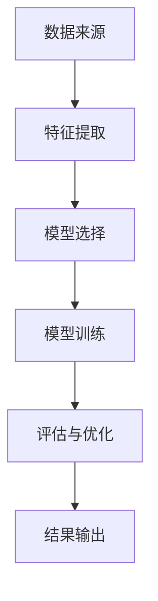
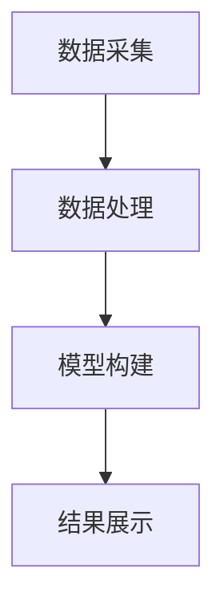
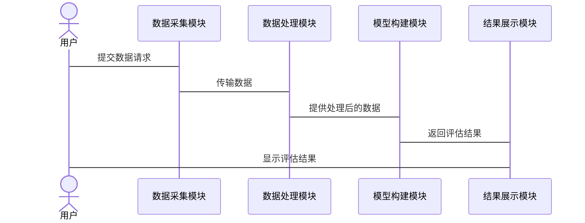

                 


# AI驱动的管理层继任计划分析：评估长期领导力风险

## 关键词：
- AI驱动
- 管理层继任计划
- 领导力风险
- 机器学习
- 数据驱动

## 摘要：
在当今快速变化的商业环境中，领导力的持续性和稳定性对于企业的长期成功至关重要。传统的管理层继任计划往往依赖于主观判断和经验评估，存在一定的局限性。随着人工智能技术的快速发展，AI驱动的管理层继任计划分析正逐渐成为评估长期领导力风险的重要工具。通过机器学习算法和大数据分析，企业能够更精准地识别潜在的领导人才，并预测他们的领导力潜力，从而制定出更加科学和有效的继任计划。本文将详细探讨AI在管理层继任计划中的应用，分析其核心概念、算法原理、系统架构，并通过实际案例展示其在项目中的应用，最后总结最佳实践和未来发展方向。

---

## 第一章：管理层继任计划的核心概念

### 1.1 问题背景与挑战

#### 1.1.1 管理层继任计划的重要性
管理层继任计划是企业战略管理中的核心环节，直接关系到企业的未来发展。一个有效的继任计划能够确保企业在关键岗位上的领导力储备，减少因高管离职或退休带来的管理真空，从而保持企业的稳定性和竞争力。

#### 1.1.2 长期领导力风险的定义与影响
长期领导力风险是指由于缺乏合适的继任者或继任者的能力不足，导致企业在未来一段时间内面临领导力断层的风险。这种风险可能引发企业战略执行不力、团队士气低落、客户信任度下降等问题，最终影响企业的长期发展。

#### 1.1.3 传统继任计划的局限性
传统的继任计划主要依赖于主观判断和经验评估，存在以下问题：
- 评估标准不统一，缺乏客观性。
- 无法全面捕捉潜在继任者的多维度能力。
- 难以预测继任者的长期发展潜力。

### 1.2 AI驱动的继任计划的优势

#### 1.2.1 数据驱动的精准评估
AI技术能够通过大数据分析，从员工的历史表现、工作行为、绩效评估等多个维度，全面评估潜在继任者的领导力特质。

#### 1.2.2 AI在领导力预测中的应用
通过机器学习算法，AI能够预测潜在继任者的未来表现，帮助企业在早期识别出具有发展潜力的领导者。

#### 1.2.3 提高企业长期竞争力
AI驱动的继任计划能够帮助企业提前发现和培养潜在的领导者，从而在竞争激烈的市场中保持长期的竞争力。

### 1.3 本书的研究目标与框架

#### 1.3.1 研究目标
本文旨在探讨AI技术在管理层继任计划中的应用，分析其在领导力评估中的优势，并提出一套基于AI的继任计划分析方法。

#### 1.3.2 本书结构与内容概述
本文将从管理层继任计划的核心概念出发，逐步分析AI驱动的领导力评估模型，探讨相关算法的实现原理，并通过实际案例展示AI在继任计划中的应用。

---

## 第二章：AI驱动的管理层继任计划的核心要素

### 2.1 管理层继任计划的流程

#### 2.1.1 识别潜在继任者
通过数据分析和模型预测，识别出具备潜力的潜在继任者。

#### 2.1.2 评估领导力特质
从多个维度评估潜在继任者的领导力，包括沟通能力、决策能力、团队合作能力等。

#### 2.1.3 制定继任策略
根据评估结果，制定相应的继任策略，包括培训计划、职业发展路径等。

### 2.2 AI技术在继任计划中的应用

#### 2.2.1 数据收集与处理
从员工的历史数据中提取相关信息，包括绩效数据、行为数据、能力评估等。

#### 2.2.2 模型构建与分析
通过机器学习算法，构建领导力评估模型，并对潜在继任者进行预测和评估。

#### 2.2.3 结果输出与反馈
将模型评估结果反馈给企业管理层，帮助其制定继任计划。

### 2.3 核心概念对比表

| **对比维度** | **传统继任计划** | **AI驱动的继任计划** |
|--------------|------------------|------------------------|
| **数据来源** | 主观评估、少量数据 | 大数据、多维度数据    |
| **评估方法** | 人工评估、经验判断 | 机器学习、数据驱动    |
| **评估结果** | 单一维度、有限深度 | 多维度、深度分析      |

### 2.4 领导力评估的关键指标

#### 2.4.1 技能评估
- 技术能力
- 沟通能力
- 团队合作能力

#### 2.4.2 绩效评估
- 历史绩效
- 目标达成能力
- 创新能力

#### 2.4.3 潜力评估
- 学习能力
- 适应能力
- 领导潜力

---

## 第三章：AI驱动的领导力评估模型

### 3.1 模型构建原理

#### 3.1.1 数据来源与特征提取
从员工的历史数据中提取特征，包括绩效数据、行为数据、能力评估等。

#### 3.1.2 模型选择与训练
选择合适的机器学习算法（如随机森林、支持向量机等），并对模型进行训练。

#### 3.1.3 模型评估与优化
通过交叉验证等方法评估模型性能，并进行参数优化。

### 3.2 模型流程图



### 3.3 算法实现

#### 3.3.1 机器学习算法选择
选择随机森林算法进行领导力评估。

#### 3.3.2 Python代码实现

```python
import pandas as pd
from sklearn.ensemble import RandomForestClassifier
from sklearn.metrics import accuracy_score

# 加载数据
data = pd.read_csv('leadership_data.csv')

# 分割特征和标签
X = data.drop('label', axis=1)
y = data['label']

# 训练模型
model = RandomForestClassifier()
model.fit(X, y)

# 预测结果
y_pred = model.predict(X)

# 评估准确率
accuracy = accuracy_score(y, y_pred)
print(f'准确率: {accuracy}')
```

---

## 第四章：系统架构与项目实战

### 4.1 系统架构设计

#### 4.1.1 功能模块设计
- 数据采集模块
- 模型构建模块
- 评估结果展示模块

#### 4.1.2 系统架构图



#### 4.1.3 接口设计
- 数据接口：与企业HR系统对接，获取员工数据。
- 模型接口：与机器学习框架（如Scikit-learn）对接，进行模型训练和预测。

#### 4.1.4 交互流程


### 4.2 项目实战

#### 4.2.1 环境安装
安装必要的Python库，如Pandas、Scikit-learn、Plotly等。

#### 4.2.2 核心代码实现

```python
import pandas as pd
from sklearn.ensemble import RandomForestClassifier
from sklearn.metrics import accuracy_score
import joblib

# 加载数据
data = pd.read_csv('leadership_data.csv')

# 分割特征和标签
X = data.drop('label', axis=1)
y = data['label']

# 训练模型
model = RandomForestClassifier()
model.fit(X, y)

# 保存模型
joblib.dump(model, 'leadership_model.pkl')

# 加载模型
loaded_model = joblib.load('leadership_model.pkl')

# 预测新数据
new_data = pd.read_csv('new_data.csv')
y_pred = loaded_model.predict(new_data[X.columns])

# 输出结果
print(f'预测结果: {y_pred}')
```

#### 4.2.3 案例分析
通过实际案例分析，展示AI驱动的管理层继任计划在企业中的应用效果。

---

## 第五章：总结与展望

### 5.1 最佳实践

- 确保数据的准确性和完整性。
- 定期更新模型，以适应企业需求的变化。
- 结合人工评估，确保结果的客观性。

### 5.2 小结
本文详细探讨了AI驱动的管理层继任计划分析的核心概念、算法实现和系统架构，并通过实际案例展示了其在项目中的应用。

### 5.3 注意事项
- 数据隐私和安全问题需要特别关注。
- 模型的可解释性需要进一步优化。

### 5.4 拓展阅读
建议读者进一步阅读相关领域的书籍和论文，深入了解机器学习在领导力评估中的应用。

---

## 作者：AI天才研究院/AI Genius Institute & 禅与计算机程序设计艺术/Zen And The Art of Computer Programming

---

通过以上结构，我们可以系统地探讨AI驱动的管理层继任计划分析的核心内容，并为企业提供科学的领导力风险评估方法。希望本文能够为企业的管理层继任计划提供有价值的参考和指导。

