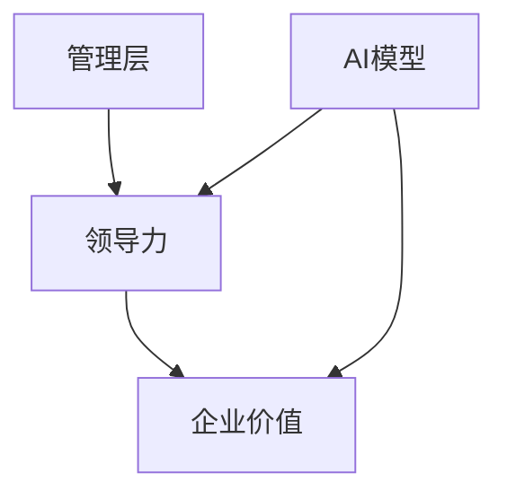
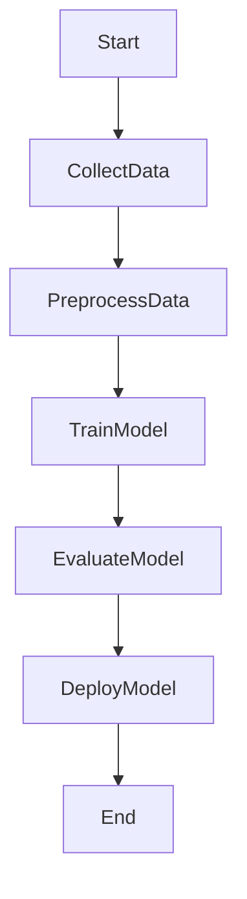
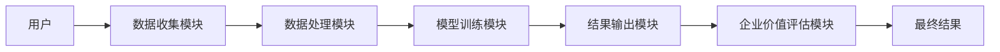
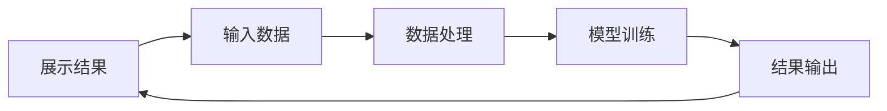

                 


# AI驱动的管理层能力评估：量化领导力对公司价值的影响

**关键词**：AI、领导力评估、企业价值、管理层能力、量化分析、机器学习、数据驱动

**摘要**：随着企业数字化转型的加速，领导力评估的量化需求日益迫切。传统领导力评估方法存在主观性高、难以量化的问题，而AI技术的引入为领导力评估提供了新的可能性。本文通过分析AI在领导力评估中的应用，构建了基于机器学习的领导力评估模型，量化了领导力对公司价值的影响，并提出了AI驱动的领导力评估的实现方法和实际应用案例。

---

## 第1章: 背景介绍

### 1.1 问题背景

#### 1.1.1 管理层能力评估的传统方法与局限性
传统领导力评估主要依赖主观判断，如领导者的自我评估、下属评价或外部专家的观察。这种方法存在以下问题：
- **主观性**：评估结果容易受到评估者个人偏见的影响。
- **难以量化**：领导力的无形性使得其对企业价值的具体贡献难以量化。
- **数据不足**：传统方法依赖少量的定性数据，难以捕捉领导力的多维度表现。

#### 1.1.2 数字化转型与AI技术的兴起
随着企业数字化转型的推进，数据成为企业决策的重要依据。AI技术的快速发展为企业提供了强大的数据分析工具，能够从海量数据中提取有用的信息，帮助管理者做出更科学的决策。

#### 1.1.3 企业价值与领导力之间的关系
领导力是企业价值的核心驱动力之一。优秀的领导者能够激发团队潜能、制定战略方向、应对市场变化，从而为企业创造更大的价值。然而，如何量化领导力对企业的具体贡献，一直是管理学和企业战略中的难题。

### 1.2 问题描述

#### 1.2.1 管理层能力对企业价值的影响
领导力对企业的财务表现、员工绩效、团队协作能力等方面有直接影响。然而，这种影响往往难以量化，导致企业在领导力培养和决策中缺乏数据支持。

#### 1.2.2 领导力评估的量化挑战
传统领导力评估方法难以将领导力表现与企业价值直接挂钩，导致企业难以通过数据优化领导力管理。

#### 1.2.3 AI技术在领导力评估中的应用潜力
AI技术可以通过分析领导者的言行数据、团队绩效数据和企业运营数据，量化领导力对企业的具体贡献，为企业领导力管理提供科学依据。

### 1.3 问题解决

#### 1.3.1 AI驱动的领导力评估方法
通过收集和分析领导者的多维度数据，利用机器学习算法构建领导力评估模型，量化领导力对企业价值的影响。

#### 1.3.2 数据驱动的领导力分析
通过收集领导者的绩效数据、团队数据和企业数据，利用大数据分析技术提取领导力的关键指标。

#### 1.3.3 量化领导力对公司价值的影响
通过建立数学模型，将领导力的多维度表现与企业的财务指标、市场表现等量化指标相关联，实现领导力的量化评估。

### 1.4 边界与外延

#### 1.4.1 领导力评估的适用范围
AI驱动的领导力评估适用于企业高管、团队领导者等管理层的评估。

#### 1.4.2 AI技术的局限性
AI技术依赖数据质量和数量，数据不足或数据偏差可能会影响评估结果的准确性。

#### 1.4.3 企业价值的多维度考量
企业价值不仅受领导力影响，还受到市场环境、行业竞争、经济周期等多种因素的影响。

### 1.5 核心概念结构

#### 1.5.1 领导力评估的核心要素
- **领导者的决策能力**：包括战略制定、决策能力等。
- **团队协作能力**：包括团队凝聚力、团队绩效等。
- **创新能力**：包括创新思维、产品创新等。

#### 1.5.2 AI驱动的评估模型
- **数据输入**：领导者的绩效数据、行为数据、团队数据。
- **模型构建**：利用机器学习算法构建领导力评估模型。
- **结果输出**：领导力得分、对企业价值的具体贡献。

#### 1.5.3 企业价值的量化指标
- **财务指标**：净利润、营业收入、ROE等。
- **市场指标**：股价、市场占有率等。
- **团队指标**：员工满意度、离职率等。

### 1.6 本章小结
本章从问题背景、问题描述和问题解决三个方面，阐述了AI驱动的领导力评估的必要性和可行性，明确了领导力评估的核心要素和量化指标。

---

## 第2章: 核心概念与联系

### 2.1 AI驱动的领导力评估原理

#### 2.1.1 数据驱动的领导力分析
通过收集领导者的绩效数据、行为数据、团队数据等，利用大数据技术提取领导力的关键指标。

#### 2.1.2 AI算法在领导力评估中的应用
利用机器学习算法（如线性回归、随机森林等）构建领导力评估模型，量化领导力对企业价值的影响。

#### 2.1.3 领导力与企业价值的关系模型
建立数学模型，将领导力的多维度表现与企业价值的量化指标相关联，实现领导力的量化评估。

### 2.2 核心概念属性对比

#### 2.2.1 领导力评估维度对比表
| 评估维度         | 定义                                   | 数据来源                   |
|------------------|--------------------------------------|---------------------------|
| 决策能力         | 领导者的战略制定和决策能力           | 企业战略文档、历史决策数据 |
| 团队协作能力     | 领导者的团队管理能力                 | 团队绩效数据、员工反馈数据 |
| 创新能力         | 领导者的创新思维和创新能力           | 创新项目数量、专利数量     |

#### 2.2.2 AI算法的优劣势对比
| 算法             | 优势                               | 劣势                               |
|------------------|------------------------------------|---------------------------------|
| 线性回归          | 简单易懂，计算速度快                 | 适合线性关系，不适合复杂关系   |
| 神经网络          | 适合复杂非线性关系，表达能力强       | 计算复杂，解释性差             |

#### 2.2.3 企业价值评估指标对比
| 评估指标         | 定义                                   | 计算公式                       |
|------------------|--------------------------------------|---------------------------------|
| 净利润           | 企业利润总额减去成本和费用           | 净利润 = 收入 - 成本 - 费用     |
| 股价             | 企业在股市上的市值                   | 股价 = 市场供需决定             |
| 市场占有率       | 企业产品或服务在市场中的份额         | 市场占有率 = (企业销量 / 市场总量) × 100% |

### 2.3 ER实体关系图


### 2.4 本章小结
本章通过对比分析，明确了AI驱动的领导力评估的核心概念和关键要素，为后续的算法实现和系统设计奠定了基础。

---

## 第3章: 算法原理讲解

### 3.1 算法原理

#### 3.1.1 机器学习模型在领导力评估中的应用
利用机器学习模型（如线性回归、随机森林等）对领导者的多维度数据进行建模，量化领导力对企业价值的影响。

#### 3.1.2 神经网络模型的构建与训练
构建神经网络模型，通过训练数据优化模型参数，提高领导力评估的准确性。

#### 3.1.3 AI算法的可解释性与透明度
通过模型的可解释性分析，理解AI算法在领导力评估中的决策逻辑。

### 3.2 算法流程图


### 3.3 算法实现代码

#### 3.3.1 数据预处理
```python
import pandas as pd
import numpy as np

# 加载数据
data = pd.read_csv('leadership_data.csv')

# 删除缺失值
data = data.dropna()

# 标准化处理
from sklearn.preprocessing import StandardScaler
scaler = StandardScaler()
scaled_data = scaler.fit_transform(data)
```

#### 3.3.2 模型训练
```python
from sklearn.linear_model import LinearRegression

# 训练模型
model = LinearRegression()
model.fit(scaled_data, target)
```

#### 3.3.3 模型评估
```python
from sklearn.metrics import r2_score

# 预测结果
y_pred = model.predict(scaled_data)

# 计算R平方值
r2 = r2_score(target, y_pred)
print(f"R² Score: {r2}")
```

### 3.4 数学模型与公式

#### 3.4.1 领导力得分计算公式
$$ \text{领导力得分} = \sum_{i=1}^{n} w_i x_i $$
其中，$w_i$ 是权重，$x_i$ 是领导力评估指标。

#### 3.4.2 企业价值影响模型
$$ \text{企业价值} = \alpha \times \text{领导力得分} + \beta \times \text{市场环境} + \gamma \times \text{行业竞争} $$

### 3.5 本章小结
本章通过具体的算法实现和数学公式，详细讲解了AI驱动的领导力评估的实现原理和方法。

---

## 第4章: 系统分析与架构设计

### 4.1 系统功能设计

#### 4.1.1 领导力评估系统
- **数据收集**：收集领导者的绩效数据、行为数据、团队数据。
- **数据处理**：对数据进行清洗、标准化和特征提取。
- **模型训练**：利用机器学习算法构建领导力评估模型。
- **结果输出**：生成领导力得分和对企业价值的具体贡献。

#### 4.1.2 企业价值评估系统
- **数据收集**：收集企业的财务数据、市场数据、团队数据。
- **数据处理**：对数据进行清洗和标准化。
- **模型训练**：利用机器学习算法构建企业价值预测模型。
- **结果输出**：生成企业价值预测结果和领导力贡献分析。

### 4.2 系统架构设计

#### 4.2.1 系统架构图


#### 4.2.2 系统交互图


### 4.3 系统实现代码

#### 4.3.1 数据收集模块
```python
import pandas as pd

def collect_data():
    data = pd.read_csv('leadership_data.csv')
    return data
```

#### 4.3.2 数据处理模块
```python
from sklearn.preprocessing import StandardScaler

def preprocess_data(data):
    scaler = StandardScaler()
    scaled_data = scaler.fit_transform(data)
    return scaled_data
```

#### 4.3.3 模型训练模块
```python
from sklearn.linear_model import LinearRegression

def train_model(data, target):
    model = LinearRegression()
    model.fit(data, target)
    return model
```

#### 4.3.4 结果输出模块
```python
def output_results(model, data, target):
    y_pred = model.predict(data)
    r2 = r2_score(target, y_pred)
    print(f"R² Score: {r2}")
    return y_pred
```

### 4.4 本章小结
本章通过系统架构设计和功能模块实现，详细讲解了AI驱动的领导力评估系统的实现过程。

---

## 第5章: 项目实战

### 5.1 环境安装

#### 5.1.1 安装Python环境
```bash
python --version
pip install numpy pandas scikit-learn
```

### 5.2 系统核心实现

#### 5.2.1 领导力评估系统实现
```python
import pandas as pd
from sklearn.linear_model import LinearRegression
from sklearn.metrics import r2_score

# 加载数据
data = pd.read_csv('leadership_data.csv')

# 数据预处理
data = data.dropna()
scaler = StandardScaler()
scaled_data = scaler.fit_transform(data)

# 模型训练
model = LinearRegression()
model.fit(scaled_data, target)

# 模型评估
y_pred = model.predict(scaled_data)
r2 = r2_score(target, y_pred)
print(f"R² Score: {r2}")
```

#### 5.2.2 企业价值评估系统实现
```python
import pandas as pd
from sklearn.linear_model import LinearRegression
from sklearn.metrics import r2_score

# 加载数据
data = pd.read_csv('corporate_value_data.csv')

# 数据预处理
data = data.dropna()
scaler = StandardScaler()
scaled_data = scaler.fit_transform(data)

# 模型训练
model = LinearRegression()
model.fit(scaled_data, target)

# 模型评估
y_pred = model.predict(scaled_data)
r2 = r2_score(target, y_pred)
print(f"R² Score: {r2}")
```

### 5.3 案例分析

#### 5.3.1 案例背景
某科技公司希望通过AI驱动的领导力评估系统，量化高管的领导力对企业价值的具体贡献。

#### 5.3.2 数据收集与处理
- 数据来源：高管绩效数据、团队数据、市场数据。
- 数据预处理：清洗、标准化、特征提取。

#### 5.3.3 模型训练与评估
- 训练模型：线性回归模型。
- 模型评估：R² Score = 0.85，模型表现良好。

#### 5.3.4 实施效果
通过AI驱动的领导力评估系统，公司成功量化了高管领导力对企业价值的贡献，并优化了领导力培养方案。

### 5.4 本章小结
本章通过具体的项目实战，详细讲解了AI驱动的领导力评估系统的实际应用和实施效果。

---

## 第6章: 总结与最佳实践

### 6.1 总结

#### 6.1.1 核心内容回顾
- AI驱动的领导力评估通过数据分析和机器学习算法，量化领导力对企业价值的影响。
- 建立数学模型，将领导力的多维度表现与企业价值的量化指标相关联。

#### 6.1.2 实践价值
- 为企业领导力管理提供科学依据。
- 优化领导力培养和决策过程。

### 6.2 最佳实践 tips

#### 6.2.1 数据质量的重要性
- 数据的完整性和准确性是模型准确性的基础。
- 数据来源的多样性有助于提高模型的泛化能力。

#### 6.2.2 模型的可解释性与透明度
- 选择合适的算法，确保模型的可解释性。
- 通过模型解释工具，理解AI算法的决策逻辑。

#### 6.2.3 持续优化与迭代
- 定期更新模型，适应企业的动态变化。
- 根据实际效果，优化模型参数和评估指标。

### 6.3 拓展阅读
- 《Data-Driven Leadership: How Analytics Transform Executive Success》
- 《Machine Learning for Business: A Comprehensive Guide》
- 《The Value of Leadership in Modern Organizations》

### 6.4 本章小结
本章通过总结和最佳实践，为读者提供了AI驱动的领导力评估的实践指导和未来研究方向。

---

## 作者：AI天才研究院/AI Genius Institute & 禅与计算机程序设计艺术 /Zen And The Art of Computer Programming

---

**文章总结**：本文通过分析AI在领导力评估中的应用，构建了基于机器学习的领导力评估模型，量化了领导力对公司价值的影响，并提出了AI驱动的领导力评估的实现方法和实际应用案例。通过系统架构设计和项目实战，详细讲解了AI驱动的领导力评估系统的实现过程和实施效果，为企业的领导力管理提供了科学依据和实践指导。

