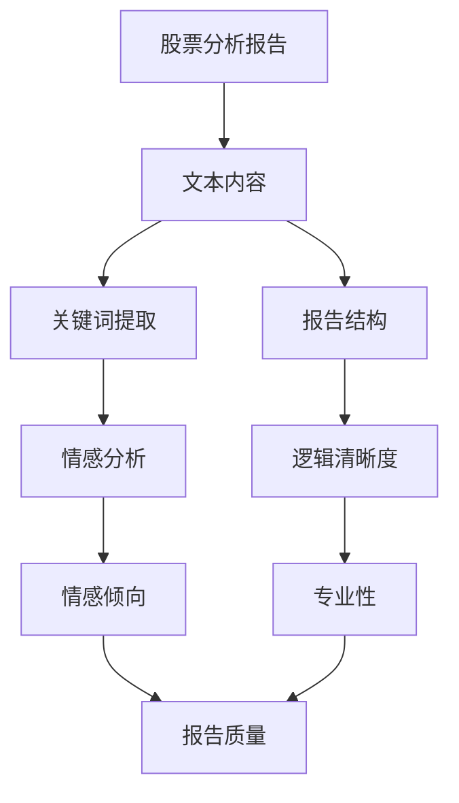
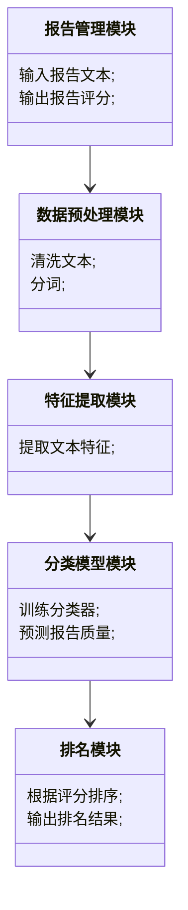
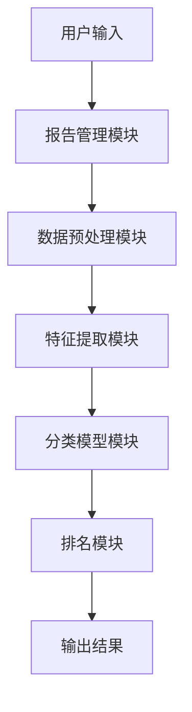
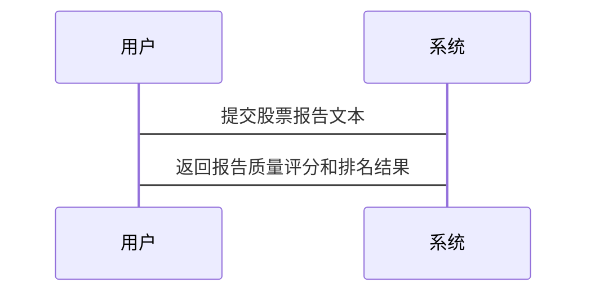

                 


# AI驱动的股票分析师报告质量评估与排名

## 关键词：AI，股票分析，报告质量评估，自然语言处理，机器学习，深度学习

## 摘要：  
本文探讨了如何利用人工智能技术，特别是自然语言处理和机器学习，来评估和排名股票分析师的报告质量。通过分析报告的内容、结构和语言，AI可以提供客观、高效的评估结果，帮助投资者做出更明智的决策。本文从背景介绍、核心概念、算法原理、系统设计到项目实战，全面阐述了AI在股票分析师报告质量评估中的应用，并通过具体案例展示了其实现过程。

---

# 第一部分：背景介绍

## 第1章：股票分析师报告质量评估的背景与意义

### 1.1 股票分析的基本概念

#### 1.1.1 股票分析的定义与分类  
股票分析是通过对公司财务数据、市场趋势、行业动态等信息的分析，评估股票的投资价值的过程。股票分析通常分为基本面分析和技术分析两大类：  
- **基本面分析**：基于公司财务报表、行业地位、盈利能力等基本面因素，评估股票的内在价值。  
- **技术分析**：通过研究股票价格和成交量的历史数据，预测未来的价格走势。  

#### 1.1.2 股票分析报告的特点与作用  
股票分析报告是分析师对特定股票或市场进行分析后形成的书面总结，其特点包括：  
- **专业性**：报告通常包含复杂的财务数据和市场分析。  
- **时效性**：报告需要及时更新，以反映最新的市场动态。  
- **指导性**：报告为投资者提供决策依据。  

#### 1.1.3 投资者对股票分析报告的需求  
投资者对股票分析报告的需求主要集中在以下方面：  
- **准确性**：报告分析是否客观、数据是否准确。  
- **深度**：报告是否提供了有价值的见解。  
- **及时性**：报告是否能够及时发布，以反映最新的市场变化。  

### 1.2 AI技术在金融领域的应用背景

#### 1.2.1 人工智能在金融行业的应用现状  
人工智能技术在金融行业的应用越来越广泛，包括股票预测、风险评估、欺诈检测等领域。AI的优势在于其强大的数据处理能力和模式识别能力。  

#### 1.2.2 自然语言处理在股票分析中的潜力  
自然语言处理（NLP）技术可以用于分析股票报告中的文本内容，提取关键信息，评估报告的质量。例如，通过分析报告的语言风格、逻辑结构和专业性，NLP可以帮助判断报告是否具有参考价值。  

#### 1.2.3 机器学习在金融预测中的优势  
机器学习算法可以通过历史数据训练模型，预测股票价格走势或评估报告质量。与传统统计方法相比，机器学习能够捕捉更多复杂的数据模式。  

### 1.3 股票分析师报告质量评估的重要性

#### 1.3.1 报告质量对投资决策的影响  
高质量的分析报告能够为投资者提供可靠的决策依据，而低质量的报告可能导致错误的投资决策。  

#### 1.3.2 不同投资者对报告质量的需求差异  
- **机构投资者**：通常需要深度、专业的分析报告。  
- **个人投资者**：更倾向于简单明了、易于理解的报告。  

#### 1.3.3 传统报告评估方法的局限性  
传统报告评估方法通常依赖人工阅读和评分，存在以下问题：  
- **主观性**：评估结果可能受到评估者个人偏见的影响。  
- **效率低**：人工评估耗时耗力，难以应对大量报告的评估需求。  
- **一致性差**：不同评估者对同一报告的评分可能存在较大差异。  

### 1.4 本章小结  
本章介绍了股票分析的基本概念、AI技术在金融领域的应用背景，以及股票分析师报告质量评估的重要性。传统的评估方法存在主观性、效率低和一致性差的问题，而AI技术的引入可以有效解决这些问题。

---

# 第二部分：核心概念与联系

## 第2章：AI驱动的股票分析师报告质量评估的核心概念

### 2.1 自然语言处理在报告评估中的应用

#### 2.1.1 NLP的基本原理  
自然语言处理（NLP）是人工智能的一个重要分支，旨在让计算机能够理解和处理人类语言。NLP的核心任务包括文本分类、实体识别、情感分析等。  

#### 2.1.2 NLP在股票分析报告中的具体应用  
- **文本分类**：将报告分为不同类别，例如乐观、中性或悲观。  
- **关键词提取**：从报告中提取关键信息，如公司财务数据、行业趋势等。  
- **情感分析**：分析报告中的情感倾向，判断报告是否积极或消极。  

#### 2.1.3 NLP与股票分析的结合  
通过NLP技术，可以对报告的语言风格、逻辑结构和专业性进行评估，从而判断报告的质量。例如，可以通过分析报告的语句是否通顺、逻辑是否清晰，来评估报告的可读性和专业性。  

### 2.2 机器学习在报告质量评估中的应用

#### 2.2.1 机器学习的基本原理  
机器学习是一种通过数据训练模型的技术，模型可以学习数据中的模式，并用于预测或分类。  

#### 2.2.2 机器学习在股票分析中的具体应用  
- **回归分析**：用于预测股票价格走势。  
- **分类模型**：用于判断报告是否为高质量报告。  
- **聚类分析**：用于将报告按质量进行分组。  

#### 2.2.3 机器学习与股票分析的结合  
通过机器学习技术，可以对大量股票报告进行分析，提取特征并训练模型，从而实现对报告质量的自动化评估。  

### 2.3 NLP与机器学习的结合

#### 2.3.1 NLP与机器学习的协同作用  
NLP主要用于文本的处理和分析，而机器学习则用于基于文本特征的分类和预测。两者结合可以实现对股票分析报告的全面评估。  

#### 2.3.2 NLP与机器学习的协同流程  
1. **文本预处理**：对报告文本进行分词、去除停用词等处理。  
2. **特征提取**：提取文本中的关键词、情感倾向等特征。  
3. **模型训练**：基于特征训练分类模型，如支持向量机（SVM）或神经网络。  
4. **质量评估**：利用训练好的模型对新的报告进行质量评估。  

### 2.4 核心概念的总结与对比

#### 2.4.1 核心概念对比表  
| **概念**       | **NLP**                | **机器学习**           |  
|----------------|------------------------|------------------------|  
| 核心任务         | 文本处理与分析          | 数据模式识别与预测      |  
| 典型应用         | 文本分类、情感分析      | 回归分析、分类模型      |  
| 在股票分析中的作用 | 报告内容分析           | 报告质量预测与分类      |  

#### 2.4.2 实体关系图  


### 2.5 本章小结  
本章详细介绍了自然语言处理和机器学习在股票分析报告质量评估中的应用，探讨了两者结合的协同作用，并通过对比表和实体关系图展示了核心概念之间的联系。

---

## 第3章：AI驱动的股票分析师报告质量评估的算法原理

### 3.1 基于NLP的文本特征提取

#### 3.1.1 分词与词向量表示  
- **分词**：将文本分割成词语或短语。  
- **词向量表示**：将词语表示为向量，常用的方法包括Word2Vec、GloVe等。  

#### 3.1.2 基于BERT的文本表示  
BERT（Bidirectional Encoder Representations from Transformers）是一种预训练语言模型，能够生成高质量的文本表示。通过BERT模型，可以将报告文本转化为向量表示，用于后续的特征提取和分类任务。  

### 3.2 基于机器学习的质量分类模型

#### 3.2.1 分类模型的选择  
- **支持向量机（SVM）**：适合小规模数据，分类效果好。  
- **随机森林（Random Forest）**：适合特征较多的情况，具有较强的鲁棒性。  
- **深度学习模型（如BERT）**：适合大规模数据，分类效果更优。  

#### 3.2.2 模型训练流程  
1. **数据预处理**：清洗数据，去除无关信息。  
2. **特征提取**：使用NLP技术提取文本特征。  
3. **模型训练**：基于特征训练分类模型。  
4. **模型评估**：通过交叉验证评估模型性能。  

### 3.3 基于深度学习的质量评估模型

#### 3.3.1 深度学习模型的优势  
- **自动特征提取**：模型能够自动学习数据中的特征，减少人工干预。  
- **高表达能力**：深度学习模型能够捕捉复杂的模式。  

#### 3.3.2 基于BERT的股票报告分类  
1. **预处理**：将股票报告输入BERT模型，生成文本表示。  
2. **特征提取**：提取BERT模型的中间层向量作为特征。  
3. **分类任务**：将特征输入分类器，预测报告质量。  

### 3.4 算法原理的数学模型

#### 3.4.1 BERT模型的数学表达  
BERT模型的输入是文本序列，输出是每个位置的向量表示。其数学表达如下：  
$$  
\text{BERT}(x_i) = \text{LayerNorm}(\text{Dropout}(x_i))  
$$  
其中，$x_i$ 表示输入的文本向量。  

#### 3.4.2 分类模型的损失函数  
以二分类任务为例，损失函数可以采用交叉熵损失：  
$$  
L = -\sum_{i=1}^{n} y_i \log(p_i) + (1-y_i)\log(1-p_i)  
$$  
其中，$y_i$ 是标签，$p_i$ 是模型预测的概率。  

### 3.5 本章小结  
本章详细介绍了基于NLP和机器学习的算法原理，重点讲解了BERT模型和分类模型的数学表达，为后续的系统设计奠定了理论基础。

---

## 第4章：系统分析与架构设计

### 4.1 问题场景介绍

#### 4.1.1 系统目标  
设计一个基于AI的股票分析师报告质量评估系统，实现报告的自动化评估与排名。  

#### 4.1.2 系统需求  
- **输入**：股票分析报告文本。  
- **输出**：报告质量评分和排名结果。  

### 4.2 系统功能设计

#### 4.2.1 领域模型设计  


#### 4.2.2 系统架构设计  


#### 4.2.3 系统接口设计  
- **输入接口**：接收股票报告文本。  
- **输出接口**：返回报告质量评分和排名结果。  

### 4.3 系统交互设计

#### 4.3.1 系统交互流程  
1. 用户输入股票报告文本。  
2. 系统对文本进行预处理和特征提取。  
3. 分类模型对特征进行分类，生成报告质量评分。  
4. 排名模块根据评分对报告进行排名。  
5. 系统输出报告质量评分和排名结果。  

#### 4.3.2 交互流程图  


### 4.4 本章小结  
本章详细介绍了AI驱动的股票分析师报告质量评估系统的功能设计、架构设计和交互设计，为后续的项目实施提供了明确的指导。

---

## 第5章：项目实战

### 5.1 环境配置

#### 5.1.1 安装依赖  
- **Python**：3.6+  
- **库依赖**：numpy、pandas、transformers、sklearn  

```bash
pip install numpy pandas transformers sklearn
```

### 5.2 系统核心实现

#### 5.2.1 数据预处理模块  
```python
import pandas as pd
from transformers import BertTokenizer, BertModel
from sklearn.model_selection import train_test_split

def preprocess_data(data_path):
    df = pd.read_csv(data_path)
    texts = df['report_text'].tolist()
    labels = df['quality_score'].tolist()
    return texts, labels

texts, labels = preprocess_data('reports.csv')
```

#### 5.2.2 特征提取模块  
```python
tokenizer = BertTokenizer.from_pretrained('bert-base-uncased')
model = BertModel.from_pretrained('bert-base-uncased')

def extract_features(texts):
    features = []
    for text in texts:
        inputs = tokenizer(text, return_tensors='np', padding=True, truncation=True)
        with torch.no_grad():
            outputs = model(**inputs)
        features.append(outputs.last_hidden_state[:, 0, :].numpy())
    return features

features = extract_features(texts)
```

#### 5.2.3 分类模型训练  
```python
from sklearn.ensemble import RandomForestClassifier
from sklearn.metrics import accuracy_score

X_train, X_test, y_train, y_test = train_test_split(features, labels, test_size=0.2)

clf = RandomForestClassifier(n_estimators=100)
clf.fit(X_train, y_train)

y_pred = clf.predict(X_test)
print("Accuracy:", accuracy_score(y_test, y_pred))
```

#### 5.2.4 排名模块  
```python
from sklearn.metrics import rankdata

def rank_reports(features, labels):
    ranked_scores = rankdata(labels, method='min')
    return ranked_scores

ranked_scores = rank_reports(features, labels)
```

### 5.3 代码应用解读与分析

#### 5.3.1 数据预处理模块  
- **输入**：股票报告文本。  
- **输出**：预处理后的文本和标签。  

#### 5.3.2 特征提取模块  
- **输入**：预处理后的文本。  
- **输出**：BERT模型提取的特征向量。  

#### 5.3.3 分类模型训练  
- **输入**：特征向量和标签。  
- **输出**：训练好的分类模型。  

#### 5.3.4 排名模块  
- **输入**：模型预测结果。  
- **输出**：报告质量排名。  

### 5.4 实际案例分析

#### 5.4.1 数据集准备  
假设我们有一个包含股票报告文本和质量评分的数据集，格式如下：  
```csv
report_text, quality_score
"报告1：公司业绩增长明显...", 4.5
"报告2：行业前景不明朗...", 3.0
...
```

#### 5.4.2 实施步骤  
1. 预处理数据：将报告文本和质量评分加载到数据框中。  
2. 提取特征：使用BERT模型提取文本特征。  
3. 训练模型：训练随机森林分类器，评估模型性能。  
4. 排名报告：根据质量评分对报告进行排名。  

### 5.5 项目小结  
本章通过具体代码展示了AI驱动的股票分析师报告质量评估系统的实现过程，包括数据预处理、特征提取、模型训练和排名模块的实现。

---

## 第6章：总结与展望

### 6.1 全文总结

#### 6.1.1 AI在股票分析中的应用  
AI技术为股票分析报告的质量评估提供了新的可能性，通过自然语言处理和机器学习技术，可以实现报告的自动化评估与排名。  

#### 6.1.2 系统实现的核心价值  
- **提高效率**：AI技术可以快速处理大量报告，显著提高评估效率。  
- **降低主观性**：基于AI的评估方法减少了人为因素的干扰，提高了评估结果的客观性。  
- **提供决策支持**：高质量的报告评估结果为投资者提供了可靠的决策支持。  

### 6.2 未来展望

#### 6.2.1 技术发展的方向  
- **模型优化**：进一步优化BERT模型，提高特征提取能力。  
- **多模态分析**：结合图像、视频等多模态数据，提升评估效果。  

#### 6.2.2 应用场景的扩展  
- **实时监控**：实现报告的实时评估与排名。  
- **个性化推荐**：根据投资者的需求，推荐适合的高质量报告。  

### 6.3 最佳实践 Tips

#### 6.3.1 数据质量的重要性  
确保输入数据的质量是模型表现好坏的关键。  

#### 6.3.2 模型调优的建议  
- **参数调整**：通过网格搜索优化模型参数。  
- **数据增强**：通过数据增强技术提升模型的泛化能力。  

### 6.4 注意事项

#### 6.4.1 数据隐私问题  
在实际应用中，需要特别注意数据隐私问题，确保数据的安全性和合规性。  

#### 6.4.2 模型解释性  
尽量选择具有较高解释性的模型，便于用户理解和信任。  

### 6.5 拓展阅读

#### 6.5.1 推荐书目  
- 《深度学习》——Ian Goodfellow  
- 《自然语言处理实战》——Dmitriyevt、 Alexandre van den Bulck  

#### 6.5.2 推荐博客与资源  
- [Analytics Vidhya](https://www.analyticsvidhya.com/)  
- [Towards Data Science](https://towardsdatascience.com/)  

---

## 作者：AI天才研究院 & 禅与计算机程序设计艺术

