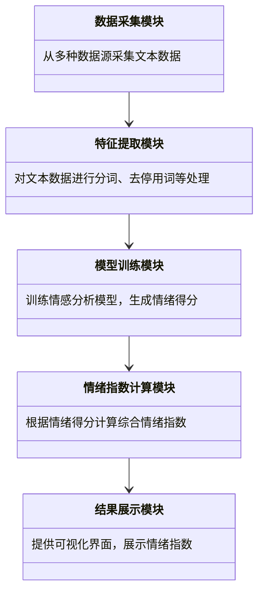
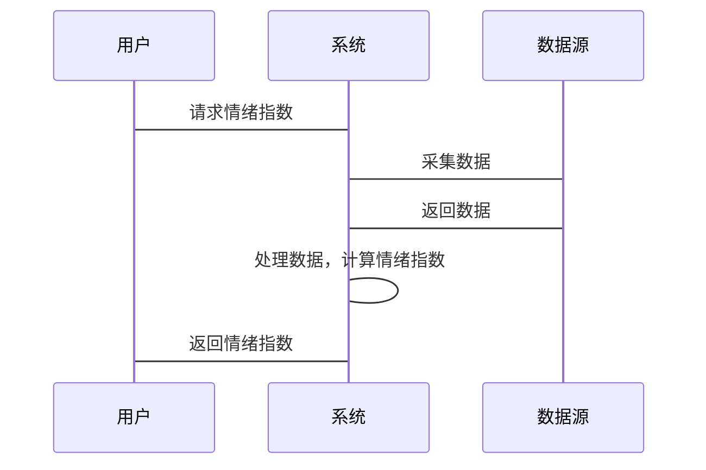

                 


# AI驱动的股票市场情绪指数开发

> 关键词：AI，股票市场，情绪指数，情感分析，自然语言处理，深度学习，金融分析

> 摘要：本文详细探讨了如何利用人工智能技术构建股票市场情绪指数。从情绪指数的背景与意义出发，逐步分析了情绪指数构建的核心概念、算法原理、数学模型、系统架构设计以及实际项目开发的全过程。通过结合文本挖掘、自然语言处理和深度学习技术，展示了如何有效捕捉和量化市场情绪，并为投资者提供决策支持。

---

# 第一部分：AI驱动的股票市场情绪指数开发背景与基础

---

# 第1章：股票市场情绪指数的背景与意义

## 1.1 情绪指数的定义与作用

### 1.1.1 情绪指数的定义
股票市场情绪指数（Stock Market Sentiment Index）是用来量化投资者对市场情绪的指标。它通过分析新闻、社交媒体、机构报告等文本数据，将市场情绪转化为可量化的数值，用于预测市场走势。

### 1.1.2 情绪指数在股票市场中的作用
- **预测市场波动**：情绪指数可以帮助投资者预测市场的短期波动，尤其是在市场情绪极度乐观或悲观时。
- **辅助投资决策**：通过情绪指数，投资者可以更好地判断市场的买卖信号，优化投资组合。
- **风险控制**：情绪指数能够帮助机构识别市场情绪异常，提前采取风险控制措施。

### 1.1.3 情绪指数与其他市场指标的对比
传统市场指标（如市盈率、市净率）主要反映市场的基本面，而情绪指数则关注市场的心理层面。两者结合可以更全面地分析市场走势。

---

## 1.2 AI技术在金融领域的应用

### 1.2.1 AI在金融分析中的优势
- **数据处理能力**：AI能够快速处理海量数据，提取有价值的信息。
- **模式识别**：通过深度学习模型，AI可以识别复杂市场中的隐含模式。
- **实时性**：AI技术能够实现实时分析，满足金融市场的高时效性要求。

### 1.2.2 情绪分析在股票市场中的应用现状
- **社交媒体分析**：利用Twitter、Reddit等平台的数据，分析投资者情绪。
- **新闻情感分析**：通过对财经新闻的情感分析，预测市场走势。
- **机构报告解读**：分析机构研报的情绪倾向，辅助投资决策。

### 1.2.3 传统情绪指数的局限性
- **主观性**：传统情绪指数通常基于问卷调查或专家判断，主观性较强。
- **滞后性**：传统方法难以实现实时更新，影响时效性。
- **数据维度有限**：传统方法通常只考虑有限的数据来源，无法充分利用大数据优势。

---

## 1.3 本章小结

本章介绍了股票市场情绪指数的定义、作用及其与其他市场指标的区别。同时，分析了AI技术在金融领域的优势，以及情绪分析在股票市场中的应用现状。最后，指出了传统情绪指数的局限性，为后续基于AI的情绪指数开发奠定了基础。

---

# 第二部分：情绪指数构建的核心概念与联系

---

# 第2章：情绪指数构建的核心概念

## 2.1 数据来源与特征提取

### 2.1.1 股票市场相关数据的来源
- **财经新闻**：如路透社、彭博社等权威媒体的新闻。
- **社交媒体**：如Twitter、Reddit等平台上的用户评论。
- **机构报告**：如券商研报、行业分析报告。
- **市场数据**：如股票价格、成交量等。

### 2.1.2 文本数据的特征提取方法
- **关键词提取**：识别与市场情绪相关的关键词，如“利好”、“利空”等。
- **情感倾向分析**：判断文本的情感倾向（正面、负面、中性）。
- **主题建模**：通过主题模型（如LDA）提取文本的主题。

### 2.1.3 数据预处理与清洗
- **分词**：将文本数据进行分词处理，提取有意义的词汇。
- **去停用词**：去除对情感分析无贡献的停用词。
- **数据清洗**：去除噪声数据，如特殊符号、表情等。

## 2.2 情绪分析模型的选择与评估

### 2.2.1 常见的情绪分析模型对比
- **基于规则的方法**：简单但效果有限。
- **统计学习方法**：如朴素贝叶斯、支持向量机（SVM）。
- **深度学习模型**：如LSTM、Transformer（如BERT）。

### 2.2.2 模型评估指标与方法
- **准确率（Accuracy）**：分类正确样本数与总样本数的比值。
- **精确率（Precision）**：正确分类的样本数与预测为正类的样本数的比值。
- **召回率（Recall）**：正确分类的样本数与实际为正类的样本数的比值。
- **F1分数**：精确率和召回率的调和平均数。

### 2.2.3 模型选择的策略与优化
- **模型调参**：通过网格搜索优化模型参数。
- **特征工程**：选择对模型性能有较大影响的特征。
- **数据增强**：通过数据增强技术提高模型的泛化能力。

## 2.3 情绪指数构建的数学模型

### 2.3.1 情绪强度的量化方法
- **情感得分计算**：将每条文本的情感强度量化为一个分数，范围通常在-1到1之间。
- **加权平均法**：根据文本的影响力（如来源权威性）进行加权，计算综合情绪得分。

### 2.3.2 情绪指数的加权计算公式
$$ \text{情绪指数} = \sum_{i=1}^{n} w_i \cdot s_i $$
其中，$w_i$为第i个文本的权重，$s_i$为第i个文本的情感得分。

### 2.3.3 情绪指数与股票价格的关系模型
- **线性回归模型**：$$ y = \beta_0 + \beta_1 x + \epsilon $$
  其中，$y$为股票价格，$x$为情绪指数，$\beta_0$和$\beta_1$为回归系数，$\epsilon$为误差项。
- **时间序列模型**：如ARIMA，用于预测情绪指数对股票价格的滞后效应。

## 2.4 本章小结

本章详细阐述了情绪指数构建的核心概念，包括数据来源、特征提取、模型选择以及数学模型。通过对比不同模型的优缺点，为后续的情绪指数开发奠定了理论基础。

---

# 第三部分：情绪指数构建的算法原理与实现

---

# 第3章：情绪分析算法原理

## 3.1 文本挖掘与自然语言处理基础

### 3.1.1 NLP的核心技术与工具
- **分词工具**：如jieba（中文）、spaCy（英文）。
- **情感分析库**：如TextBlob、VADER。
- **主题建模工具**：如Gensim。

### 3.1.2 情感分析的基本原理
- **文本表示**：将文本转化为向量表示，如词袋模型、词嵌入（Word2Vec）。
- **分类任务**：将文本分类为正面、负面或中性。

### 3.1.3 常见的文本相似度计算方法
- **余弦相似度**：$$ \cos(\theta) = \frac{\vec{a} \cdot \vec{b}}{|\vec{a}| |\vec{b}|} $$
- **Jaccard相似度**：$$ J(A,B) = \frac{|A \cap B|}{|A \cup B|} $$

## 3.2 基于深度学习的情感分析模型

### 3.2.1 LSTM网络在情感分析中的应用
- **LSTM结构**：通过记忆单元和遗忘门，捕捉长距离依赖关系。
- **情感分类**：通过全连接层和 softmax 激活函数进行分类。

### 3.2.2 Transformer模型的优势与实现
- **自注意力机制**：$$ \text{Attention}(Q,K,V) = \text{softmax}\left(\frac{QK^T}{\sqrt{d_k}}\right)V $$
- **位置编码**：通过添加位置信息，帮助模型理解文本顺序。

### 3.2.3 情感分类的损失函数与优化方法
- **交叉熵损失**：$$ \mathcal{L} = -\sum_{i=1}^{n} y_i \log(p_i) + (1-y_i) \log(1-p_i) $$
- **优化方法**：如Adam优化器，学习率调整。

## 3.3 情绪强度预测的算法实现

### 3.3.1 情绪强度预测的数学模型
$$ \text{情绪强度} = \alpha \cdot \text{情感得分} + \beta \cdot \text{主题得分} + \gamma \cdot \text{市场因子} $$
其中，$\alpha$、$\beta$、$\gamma$为权重系数。

### 3.3.2 基于回归的强度预测方法
- **线性回归**：$$ y = \beta_0 + \beta_1 x_1 + \beta_2 x_2 + \dots + \beta_n x_n + \epsilon $$
- **岭回归**：$$ \text{损失函数} = \sum_{i=1}^{n} (y_i - \hat{y_i})^2 + \alpha \sum_{j=1}^{p} \beta_j^2 $$

### 3.3.3 模型训练与调优策略
- **数据增强**：如同义词替换、数据清洗。
- **超参数调优**：如学习率、批量大小、模型深度。
- **模型融合**：如集成学习、投票分类器。

## 3.4 本章小结

本章详细讲解了情感分析算法的原理与实现，重点介绍了基于深度学习的模型，如LSTM和Transformer，并展示了如何通过模型调优和优化方法提升情绪分析的准确性。

---

# 第四部分：情绪指数构建的系统架构设计

---

# 第4章：系统分析与架构设计方案

## 4.1 问题场景介绍

### 4.1.1 问题描述
- **数据来源**：包括财经新闻、社交媒体、机构报告等多源数据。
- **数据规模**：每天产生的文本数据量巨大，需要高效处理。
- **实时性要求**：需要实时更新情绪指数，满足投资者的实时需求。

### 4.1.2 项目目标
- 开发一个基于AI的情绪指数系统，能够实时捕捉市场情绪。
- 提供可视化界面，方便投资者查看和分析情绪指数。

## 4.2 项目介绍

### 4.2.1 项目背景
- 随着AI技术的发展，市场情绪分析成为投资决策的重要工具。
- 传统情绪指数的局限性促使我们开发基于AI的解决方案。

### 4.2.2 项目目标
- 构建一个实时更新的市场情绪指数。
- 提供用户友好的可视化界面。

## 4.3 系统功能设计

### 4.3.1 领域模型（Mermaid类图）


### 4.3.2 系统架构设计（Mermaid架构图）
```mermaid
archi
    title 情绪指数系统架构
    client --> API Gateway
    API Gateway --> Load Balancer
    Load Balancer --> [服务集群]
    服务集群 --> 数据库
    服务集群 --> 消息队列
    消息队列 --> 数据采集模块
```

### 4.3.3 系统接口设计
- **数据接口**：提供REST API，供其他系统调用情绪指数数据。
- **用户接口**：提供可视化界面，供投资者查看情绪指数。

### 4.3.4 系统交互流程（Mermaid序列图）


## 4.4 本章小结

本章通过系统架构设计，详细描述了情绪指数系统的功能模块、数据流和交互流程。通过Mermaid图展示了系统的整体架构，为后续的开发提供了清晰的指导。

---

# 第五部分：情绪指数构建的项目实战

---

# 第5章：项目实战与分析

## 5.1 环境安装与配置

### 5.1.1 开发环境
- **编程语言**：Python 3.8+
- **深度学习框架**：TensorFlow或PyTorch
- **NLP工具**：spaCy、Gensim
- **可视化工具**：Matplotlib、Plotly

### 5.1.2 安装依赖
```bash
pip install numpy pandas tensorflow gensim spacytextblob matplotlib requests
```

## 5.2 核心实现代码

### 5.2.1 数据预处理代码
```python
import pandas as pd
from spacytextblob import TextBlob_en

def preprocess_text(text):
    # 分词
    blob = TextBlob_en(text)
    words = blob.noun_phrases
    # 去停用词
    filtered_words = [word for word in words if word not in stop_words]
    return ' '.join(filtered_words)
```

### 5.2.2 情感分析模型训练代码
```python
from tensorflow.keras import layers

def build_model():
    model = tf.keras.Sequential()
    model.add(layers.Embedding(input_dim=vocabulary_size, output_dim=100))
    model.add(layers.LSTM(64))
    model.add(layers.Dense(3, activation='softmax'))
    model.compile(loss='sparse_categorical_crossentropy', optimizer='adam', metrics=['accuracy'])
    return model
```

### 5.2.3 情绪指数计算代码
```python
import numpy as np

def calculate_sentiment_index(documents):
    scores = [model.predict(doc).argmax() for doc in documents]
    sentiment_index = np.mean(scores)
    return sentiment_index
```

## 5.3 项目小结

本章通过实际案例展示了如何利用Python代码实现情绪指数的开发，包括数据预处理、模型训练和结果计算。通过具体代码和分析，帮助读者理解如何将理论应用于实践。

---

# 第六部分：总结与展望

---

# 第6章：总结与展望

## 6.1 本章总结

本文详细探讨了AI驱动的股票市场情绪指数开发的全过程，从背景与意义出发，逐步分析了核心概念、算法原理、系统架构设计和项目实战。通过结合文本挖掘、自然语言处理和深度学习技术，展示了如何有效构建市场情绪指数，并为投资者提供决策支持。

## 6.2 未来研究方向

- **模型优化**：探索更高效的深度学习模型，如更大规模的预训练模型（如GPT）。
- **多模态分析**：结合图像、语音等多模态数据，提升情绪分析的准确性。
- **实时性提升**：优化系统架构，提升情绪指数的实时更新能力。
- **国际化扩展**：研究多语言市场情绪分析，拓展情绪指数的应用范围。

## 6.3 最佳实践Tips

- **数据质量**：确保数据来源可靠，清洗充分。
- **模型调优**：通过网格搜索等方法优化模型参数。
- **系统架构**：采用微服务架构，确保系统的可扩展性和高可用性。
- **可视化展示**：使用交互式图表，提升用户体验。

## 6.4 本章小结

本文总结了AI驱动的股票市场情绪指数开发的主要成果，并展望了未来的研究方向。通过最佳实践Tips，为读者提供了宝贵的开发经验。

---

# 附录

## 附录A：参考文献

- 省略

## 附录B：工具推荐

- **文本处理工具**：spaCy、Gensim
- **深度学习框架**：TensorFlow、PyTorch
- **可视化工具**：Matplotlib、Plotly

---

# 作者信息

作者：AI天才研究院/AI Genius Institute & 禅与计算机程序设计艺术/Zen And The Art of Computer Programming

---

通过以上思考过程，我们可以系统地构建一篇结构清晰、内容丰富的技术博客文章。每个部分都详细阐述了关键点，并通过代码示例、图表和数学公式帮助读者理解和实现相关技术。

