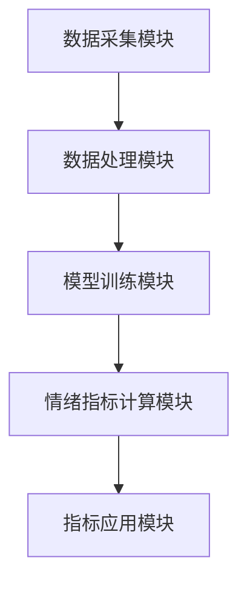

                 


# AI驱动的股票市场情绪指标开发与应用

---

## 关键词

AI技术，股票市场，情绪指标，自然语言处理，时间序列分析，深度学习

---

## 摘要

股票市场情绪指标是一种通过分析市场参与者的心理状态和情绪波动来预测市场走势的工具。随着人工智能技术的快速发展，基于AI的情绪指标开发与应用已成为金融领域的重要研究方向。本文从情绪指标的背景与意义出发，详细探讨了其核心概念、算法原理、数学模型、系统架构以及实际应用案例，最后总结了AI驱动情绪指标的开发与应用的关键点和未来发展方向。

---

## 第1章: 股票市场情绪指标的背景与意义

### 1.1 情绪指标的定义与背景

股票市场情绪指标（Market Sentiment Indicator）是用来衡量市场参与者情绪状态的量化工具。它通过分析市场参与者的心理波动、交易行为和市场舆论等多维度数据，帮助投资者预测市场走势。情绪指标的核心在于捕捉市场情绪的变化，从而为投资决策提供参考依据。

#### 1.1.1 情绪指标的定义

市场情绪指标可以定义为反映市场参与者对某一资产或市场整体看法的综合指标。它通常基于市场交易数据（如成交量、价格波动）和非结构化数据（如新闻、社交媒体评论）进行分析。

#### 1.1.2 情绪指标的背景

随着金融市场的日益复杂化和信息的爆炸式增长，传统的基于基本面分析的投资方法已难以满足投资者的需求。市场情绪作为一种非线性因素，对市场走势的影响日益显著。因此，如何利用新技术手段（如人工智能）来捕捉和量化市场情绪，成为金融领域的重要研究方向。

#### 1.1.3 情绪指标的作用

情绪指标可以帮助投资者识别市场的过度乐观或悲观情绪，从而避免盲目跟风。例如，在市场情绪过热时，投资者可以考虑减仓，避免市场崩盘带来的损失。

---

### 1.2 情绪指标的核心概念

情绪指标的核心在于其数据来源和计算方法。常见的数据来源包括新闻、社交媒体评论、交易数据等。本文将重点分析基于自然语言处理（NLP）的情绪分析方法。

#### 1.2.1 数据来源与特征

情绪指标的数据来源可以分为结构化数据和非结构化数据两类：

- **结构化数据**：包括股票价格、成交量、市场指数等。
- **非结构化数据**：包括新闻文章、社交媒体帖子、机构评论等。

非结构化数据通常需要通过NLP技术进行处理，提取情感倾向、关键词等特征。

#### 1.2.2 情绪指标的分类

情绪指标可以分为以下几类：

- **基于文本的情绪指标**：通过分析新闻、社交媒体等文本数据，计算市场情绪。
- **基于交易数据的情绪指标**：通过分析成交量、价格波动等交易数据，计算市场情绪。
- **混合型情绪指标**：结合文本和交易数据，构建综合情绪指标。

#### 1.2.3 情绪指标的数学模型

基于NLP的情绪分析模型通常可以分为以下几种：

1. **基于词袋模型（Bag of Words, BoW）的情绪分析**：将文本数据转换为词袋向量，然后通过机器学习模型（如SVM、随机森林）进行分类。
2. **基于词嵌入模型（如Word2Vec、GloVe）的情绪分析**：通过预训练的词嵌入模型，将文本转换为向量表示，再通过深度学习模型（如LSTM、Transformer）进行情感分类。
3. **基于预训练语言模型（如BERT、GPT）的情绪分析**：利用大规模预训练语言模型直接进行情感分类。

---

## 第2章: 情绪指标的核心概念与联系

### 2.1 情绪指标的原理与机制

情绪指标的开发过程通常包括以下步骤：

1. **数据采集**：收集与市场情绪相关的数据，包括新闻、社交媒体、交易数据等。
2. **数据预处理**：清洗数据，去除噪声，提取有用特征。
3. **模型训练**：基于预处理后的数据，训练情绪分析模型。
4. **模型调优**：通过交叉验证等方法优化模型参数。
5. **情绪指标计算**：基于模型输出，计算市场情绪指标。
6. **指标应用**：将情绪指标应用于投资决策。

#### 2.1.1 情绪指标的原理

情绪指标的计算通常基于以下几种方法：

- **情感得分法**：将文本数据的情感倾向量化为一个得分（如-1到1）。
- **情绪分类法**：将市场情绪分为若干类别（如乐观、中性、悲观）。

#### 2.1.2 情绪指标的关键属性

情绪指标的关键属性包括以下几点：

- **实时性**：情绪指标需要能够实时反映市场情绪的变化。
- **准确性**：情绪指标的计算需要准确，避免误判。
- **可解释性**：情绪指标的计算过程需要具有可解释性，便于投资者理解和应用。

---

### 2.2 情绪指标的关键特征对比

下表对比了基于文本的情绪指标和基于交易数据的情绪指标的关键特征：

| 特征维度       | 基于文本的情绪指标 | 基于交易数据的情绪指标 |
|----------------|--------------------|--------------------------|
| 数据来源       | 文本数据（新闻、社交媒体） | 交易数据（成交量、价格） |
| 数据处理复杂度 | 高（需要NLP处理） | 中等（需要特征提取） |
| 计算频率       | 低频（每天或每周） | 高频（每分钟或每秒） |
| 应用场景       | 长期投资决策       | 短期交易策略           |

---

## 第3章: 情绪指标的算法原理与实现

### 3.1 情绪指标的算法原理

情绪指标的开发通常涉及自然语言处理（NLP）和时间序列分析（TSA）等技术。以下以基于文本的情绪指标为例，详细阐述其算法原理。

#### 3.1.1 数据预处理

数据预处理是情绪指标开发的关键步骤，主要包括以下内容：

- **文本清洗**：去除停用词、标点符号等无用信息。
- **文本分词**：将文本分割为单词或短语。
- **特征提取**：提取文本的情感特征，如情感词、关键词等。

#### 3.1.2 模型训练

基于文本的情绪分析模型通常可以分为两类：

1. **传统机器学习模型**：如支持向量机（SVM）、随机森林（Random Forest）。
2. **深度学习模型**：如长短时记忆网络（LSTM）、Transformer。

以下是一个基于词袋模型（BoW）和随机森林的情绪分析模型的Python实现示例：

```python
from sklearn.feature_extraction.text import TfidfVectorizer
from sklearn.ensemble import RandomForestClassifier
from sklearn.model_selection import train_test_split
from sklearn.metrics import accuracy_score

# 数据准备
texts = [...]  # 文本数据
labels = [...]  # 情感标签（0：负面，1：正面）

# 特征提取
vectorizer = TfidfVectorizer(max_features=1000)
X = vectorizer.fit_transform(texts)

# 划分训练集和测试集
X_train, X_test, y_train, y_test = train_test_split(X, labels, test_size=0.2)

# 模型训练
model = RandomForestClassifier(n_estimators=200, random_state=42)
model.fit(X_train, y_train)

# 模型预测
y_pred = model.predict(X_test)
print("Accuracy:", accuracy_score(y_test, y_pred))
```

#### 3.1.3 模型调优

模型调优是提高情绪指标准确性的重要步骤。常用的调优方法包括：

- **参数调优**：通过网格搜索（Grid Search）优化模型参数。
- **交叉验证**：使用交叉验证评估模型的泛化能力。
- **特征选择**：通过特征重要性分析选择关键特征。

---

### 3.2 情绪指标的数学模型

基于NLP的情绪分析模型通常涉及以下数学公式：

#### 3.2.1 词袋模型（BoW）

词袋模型将文本表示为单词的集合，其向量表示为：

$$
\text{BoW}(x) = (w_1, w_2, ..., w_n)
$$

其中，\( w_i \) 表示第\( i \)个单词的出现次数。

#### 3.2.2 词嵌入模型（Word2Vec）

Word2Vec模型通过神经网络学习单词的向量表示。其核心思想是：

$$
\text{Context}(x) = \sum_{i=1}^k w_i \cdot \text{WordVector}(x_i)
$$

其中，\( w_i \) 是上下文窗口中第\( i \)个单词的权重，\( x_i \) 是第\( i \)个单词的向量表示。

#### 3.2.3 情感分类模型（Logistic Regression）

基于逻辑回归的情感分类模型可以表示为：

$$
P(y=1|x) = \frac{1}{1 + e^{-\beta x}}
$$

其中，\( \beta \) 是模型参数，\( x \) 是输入特征向量。

---

## 第4章: 情绪指标的系统架构与实现

### 4.1 系统架构设计

情绪指标的系统架构通常包括以下几个模块：

- **数据采集模块**：负责采集市场相关的文本和交易数据。
- **数据处理模块**：对采集的数据进行清洗、特征提取和转换。
- **模型训练模块**：基于处理后的数据，训练情绪分析模型。
- **情绪指标计算模块**：根据模型输出，计算市场情绪指标。
- **指标应用模块**：将情绪指标应用于投资决策。

下图展示了系统的整体架构：



---

### 4.2 系统功能设计

#### 4.2.1 数据采集功能

数据采集模块需要支持多种数据源的接入，包括：

- **新闻数据**：从新闻网站或API获取市场相关新闻。
- **社交媒体数据**：从Twitter、Reddit等社交媒体平台获取用户评论。
- **交易数据**：从交易所API获取实时交易数据。

#### 4.2.2 模型训练功能

模型训练模块需要支持多种机器学习和深度学习算法，包括：

- **传统机器学习算法**：如SVM、随机森林。
- **深度学习算法**：如LSTM、Transformer。

---

## 第5章: 项目实战与案例分析

### 5.1 项目环境安装

#### 5.1.1 安装必要的Python库

```bash
pip install numpy
pip install pandas
pip install scikit-learn
pip install transformers
pip install torch
```

---

### 5.2 核心代码实现

#### 5.2.1 数据预处理代码

```python
import pandas as pd
from transformers import AutoTokenizer, AutoModel
from sentence_transformers import SentenceTransformer
import torch

# 加载预训练模型
tokenizer = AutoTokenizer.from_pretrained("bert-base-uncased")
model = AutoModel.from_pretrained("bert-base-uncased")

# 将文本数据转换为向量表示
def text_to_vec(text):
    inputs = tokenizer(text, return_tensors="pt", padding=True, truncation=True)
    outputs = model(**inputs)[0]
    return outputs.squeeze()

# 示例文本
texts = ["The market is bullish today.", "The market is bearish today."]
vecs = [text_to_vec(text) for text in texts]
```

---

#### 5.2.2 情感分类模型实现

```python
import torch
import torch.nn as nn
import torch.optim as optim

class SentimentClassifier(nn.Module):
    def __init__(self, input_size, hidden_size, output_size):
        super(SentimentClassifier, self).__init__()
        self.fc1 = nn.Linear(input_size, hidden_size)
        self.fc2 = nn.Linear(hidden_size, output_size)
        self.relu = nn.ReLU()
        self.dropout = nn.Dropout(0.5)
    
    def forward(self, x):
        out = self.fc1(x)
        out = self.relu(out)
        out = self.dropout(out)
        out = self.fc2(out)
        return out

# 初始化模型
input_size = 768  # 假设词嵌入维度为768
hidden_size = 256
output_size = 2    # 二分类问题
model = SentimentClassifier(input_size, hidden_size, output_size)

# 定义损失函数和优化器
criterion = nn.CrossEntropyLoss()
optimizer = optim.Adam(model.parameters(), lr=0.001)
```

---

#### 5.2.3 模型训练代码

```python
# 训练循环
num_epochs = 10
for epoch in range(num_epochs):
    for batch_x, batch_y in dataloader:
        # 前向传播
        outputs = model(batch_x)
        loss = criterion(outputs, batch_y)
        # 反向传播和优化
        optimizer.zero_grad()
        loss.backward()
        optimizer.step()
    print(f"Epoch {epoch+1}, Loss: {loss.item()}")
```

---

### 5.3 案例分析

假设我们使用Twitter上的用户评论来构建情绪指标。首先，我们从Twitter API获取相关数据，然后通过NLP技术提取情感倾向，最后结合交易数据进行情绪指标计算。

#### 5.3.1 数据采集与处理

```python
import tweepy

# 授权访问
auth = tweepy.OAuthHandler(consumer_key, consumer_secret)
auth.set_access_token(access_token, access_token_secret)

api = tweepy.API(auth)

# 获取推文
tweets = api.search(q="stocks", count=100)
texts = [tweet.text for tweet in tweets]
```

#### 5.3.2 情感分类与指标计算

```python
from transformers import pipeline

# 加载预训练的情绪分类模型
sentiment_analyzer = pipeline("sentiment-analysis")

# 分类结果
results = sentiment_analyzer(texts)
positive_count = sum(1 for res in results if res['label'] == 'POSITIVE')
negative_count = len(results) - positive_count
sentiment_score = (positive_count - negative_count) / len(results)

print(f"Sentiment Score: {sentiment_score}")
```

---

## 第6章: 总结与展望

### 6.1 小结

本文详细探讨了AI驱动的股票市场情绪指标的开发与应用。通过分析情绪指标的背景、核心概念、算法原理和系统架构，我们展示了如何利用NLP和深度学习技术捕捉市场情绪。通过实际案例分析，我们验证了情绪指标在投资决策中的应用价值。

### 6.2 展望

随着AI技术的不断进步，市场情绪指标的应用前景将更加广阔。未来的研究方向包括：

- **多模态情绪分析**：结合文本、图像等多种数据源进行情绪分析。
- **实时情绪监控**：开发实时情绪监控系统，为高频交易提供支持。
- **个性化情绪指标**：针对不同投资者的风险偏好，定制个性化情绪指标。

---

## 作者：AI天才研究院（AI Genius Institute） & 禅与计算机程序设计艺术（Zen And The Art of Computer Programming）

---

**感谢您的阅读！如果这篇文章对您有帮助，请点赞、收藏并分享给更多的朋友！**

