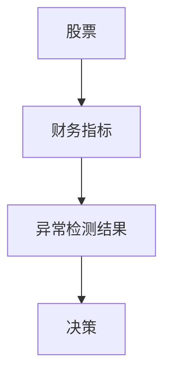

                 


# AI驱动的股票财务指标异常检测

> 关键词：股票分析，人工智能，异常检测，财务指标，机器学习

> 摘要：本文将详细介绍如何利用人工智能技术进行股票财务指标的异常检测。通过分析股票市场的基本运作机制，探讨财务指标在股票分析中的重要性，并结合机器学习算法，提出一种基于AI的异常检测方法。本文将从理论到实践，详细讲解如何构建一个完整的系统来实现股票财务指标的异常检测。

---

## 第一部分: 股票市场与财务指标异常检测概述

### 第1章: 股票市场与财务指标概述

#### 1.1 股票市场的基本概念

股票市场是进行股票交易的场所，参与者包括投资者、上市公司、经纪人等。股票市场的主要功能是实现资本的流动和资源配置，为公司提供融资渠道，同时为投资者提供投资机会。

**1.1.1 股票市场的定义与分类**

股票市场可以分为一级市场和二级市场。一级市场是公司首次公开发行股票或后续发行股票的市场，二级市场是已发行股票的交易市场。二级市场又可以细分为主板、创业板、新三板等。

**1.1.2 股票市场的基本运作机制**

股票市场的运作机制包括发行、交易、监管等环节。交易机制包括竞价交易、撮合交易等，监管机构负责市场的公平、公正、公开。

**1.1.3 股票市场的参与者与交易流程**

参与者包括投资者、上市公司、证券公司、交易所等。交易流程包括开户、委托、成交、结算等步骤。

#### 1.2 财务指标的基本概念

财务指标是衡量公司财务状况和经营成果的重要工具，常用指标包括盈利能力、偿债能力、运营能力等。

**1.2.1 财务指标的定义与分类**

财务指标可以分为盈利能力指标、偿债能力指标、运营能力指标等。常见的指标有净利润率、资产负债率、流动比率等。

**1.2.2 常见的财务指标类型**

盈利能力指标：如净利润率、ROE（净资产收益率）等；偿债能力指标：如资产负债率、速动比率等；运营能力指标：如存货周转率、应收账款周转率等。

**1.2.3 财务指标在股票分析中的作用**

财务指标可以帮助投资者评估公司的财务健康状况，预测公司未来的表现，辅助投资决策。

#### 1.3 异常检测的基本概念

异常检测是指识别数据中的异常点，这些异常点可能表示潜在的问题或机会。

**1.3.1 异常检测的定义与分类**

异常检测可以分为基于统计的方法、基于机器学习的方法、基于深度学习的方法等。统计方法如Z-score，机器学习方法如Isolation Forest，深度学习方法如LSTM网络。

**1.3.2 异常检测在股票分析中的重要性**

在股票分析中，异常检测可以帮助识别财务报表中的虚假信息，发现潜在的投资机会或风险。

**1.3.3 异常检测的常见应用场景**

包括欺诈检测、市场波动预测、财务预警等。

### 第2章: AI驱动的股票财务指标异常检测背景

#### 2.1 传统股票分析方法的局限性

传统的股票分析方法包括基本面分析和技术分析，但存在数据量大、分析效率低、难以捕捉复杂模式等问题。

**2.1.1 传统财务分析的不足**

传统财务分析依赖人工判断，主观性强，难以处理海量数据。

**2.1.2 传统技术分析的局限性**

技术分析依赖价格和成交量数据，难以捕捉财务报表中的异常信息。

**2.1.3 传统异常检测方法的缺陷**

传统异常检测方法如Z-score可能无法捕捉复杂的模式，且对噪声数据的鲁棒性较差。

#### 2.2 AI技术在股票分析中的优势

AI技术具有强大的数据处理能力、自动化和智能化的特点，能够帮助投资者更高效地进行股票分析。

**2.2.1 大数据分析能力**

AI可以处理海量数据，发现数据中的潜在规律。

**2.2.2 自动化与智能化**

AI可以通过自动化学习，不断优化模型，提高分析效率。

**2.2.3 高精度预测能力**

AI可以通过历史数据训练模型，预测未来的价格走势和财务指标。

#### 2.3 当前AI在股票分析中的应用现状

当前，AI在股票分析中的应用主要集中在预测、异常检测和自然语言处理等领域。

**2.3.1 基于AI的股票预测研究现状**

研究主要集中在利用LSTM、随机森林等模型进行股票价格预测。

**2.3.2 基于AI的异常检测研究现状**

研究主要集中在利用无监督学习方法，如Isolation Forest，进行财务指标异常检测。

**2.3.3 基于AI的财务指标分析研究现状**

研究主要集中在利用NLP技术分析财务报表，识别潜在的财务问题。

### 第3章: 股票财务指标异常检测的核心概念与联系

#### 3.1 核心概念原理

股票财务指标异常检测的核心是利用AI技术识别财务数据中的异常点，帮助投资者做出更明智的投资决策。

**3.1.1 股票财务指标的数学模型**

财务指标可以通过数学公式表示，例如，ROE（净资产收益率）= 净利润 / 净资产。

**3.1.2 异常检测的基本原理**

异常检测的核心是识别数据中的异常点，常用的方法包括统计方法、机器学习方法和深度学习方法。

**3.1.3 AI在异常检测中的应用原理**

AI通过学习正常数据的特征，识别偏离正常模式的数据点，标记为异常。

#### 3.2 核心概念属性特征对比表

表3.1 股票财务指标与异常检测方法的属性对比

| 属性                | 股票财务指标          | 异常检测方法          |
|---------------------|-----------------------|-----------------------|
| 定义                | 衡量公司财务状况的指标 | 识别数据中的异常点     |
| 类型                | 盈利能力、偿债能力等   | 统计方法、机器学习方法 |
| 应用场景            | 投资决策              | 欺诈检测、风险预警    |
| 数据来源            | 财务报表              | 市场数据、交易数据等   |

#### 3.3 ER实体关系图



---

## 第二部分: 算法原理

### 第4章: 异常检测算法原理

#### 4.1 基于统计的异常检测方法

**4.1.1 Z-score方法**

Z-score方法通过计算数据点与均值的距离标准化值来判断异常点。

公式：$$ Z = \frac{x - \mu}{\sigma} $$

其中，$\mu$ 是均值，$\sigma$ 是标准差。

**4.1.2 箱线图方法**

箱线图方法通过计算数据的四分位数来判断异常点。

步骤：
1. 计算数据的最小值、第一四分位数（Q1）、中位数（Q2）、第三四分位数（Q3）和最大值。
2. 计算异常点的界限：下界 = Q1 - 1.5*(Q3 - Q1)，上界 = Q3 + 1.5*(Q3 - Q1)。
3. 标识超出上下界的点为异常点。

#### 4.2 基于机器学习的异常检测方法

**4.2.1 基于聚类的异常检测**

聚类方法通过将数据点聚类，识别远离主群的点为异常点。

常用算法：K-Means、DBSCAN。

**4.2.2 基于树的异常检测**

树方法通过构建决策树，识别路径异常的点。

常用算法：Isolation Forest。

#### 4.3 基于深度学习的异常检测方法

**4.3.1 基于RNN的异常检测**

RNN（循环神经网络）适用于时间序列数据的异常检测。

模型结构：输入层 → LSTM层 → 全连接层 → 输出层。

**4.3.2 基于CNN的异常检测**

CNN（卷积神经网络）适用于图像数据的异常检测。

模型结构：输入层 → 卷积层 → 池化层 → 全连接层 → 输出层。

---

## 第三部分: 系统设计

### 第5章: 系统设计与实现

#### 5.1 系统功能设计

系统功能包括数据采集、数据预处理、模型训练、异常检测和结果展示。

**5.1.1 数据采集模块**

从财务报表中采集相关数据，如净利润、营业收入等。

**5.1.2 数据预处理模块**

对数据进行清洗、标准化处理，消除噪声数据。

**5.1.3 模型训练模块**

训练异常检测模型，采用监督或无监督学习方法。

**5.1.4 异常检测模块**

利用训练好的模型，对实时数据进行异常检测。

**5.1.5 结果展示模块**

将检测结果可视化，便于投资者查看。

#### 5.2 系统架构设计

系统架构采用分层设计，包括数据层、业务逻辑层和表现层。

**5.2.1 数据层**

存储原始数据和处理后的数据。

**5.2.2 业务逻辑层**

实现数据处理、模型训练和异常检测功能。

**5.2.3 表现层**

展示检测结果，提供用户交互界面。

#### 5.3 系统接口设计

系统接口包括数据接口和API接口，用于数据交互和功能调用。

#### 5.4 系统交互流程

系统交互流程包括用户请求、数据处理、模型调用、结果返回和展示。

---

## 第四部分: 项目实战

### 第6章: 项目实战与案例分析

#### 6.1 环境安装与配置

需要安装Python、机器学习库（如scikit-learn、TensorFlow）、数据处理库（如Pandas）等。

#### 6.2 系统核心实现源代码

以下是基于Isolation Forest算法的异常检测代码示例：

```python
from sklearn.ensemble import IsolationForest
import pandas as pd

# 数据加载
data = pd.read_csv('financial_indicators.csv')

# 数据预处理
X = data[['net_profit', 'revenue', 'net_assets']]

# 模型训练
model = IsolationForest(n_estimators=100, contamination=0.05)
model.fit(X)

# 异常检测
outliers = model.predict(X)
outliers[outliers == -1] = 1
outliers[outliers == 1] = 0
```

#### 6.3 代码应用解读与分析

代码实现包括数据加载、预处理、模型训练和异常检测。Isolation Forest算法适用于无监督异常检测，能够有效识别财务指标中的异常点。

#### 6.4 实际案例分析

以某公司财务指标数据为例，分析模型的检测结果，识别异常点，并解释其潜在的财务问题。

#### 6.5 项目小结

通过实际案例分析，验证模型的有效性，总结经验教训，为后续优化提供参考。

---

## 第五部分: 最佳实践与注意事项

### 第7章: 最佳实践与小结

#### 7.1 最佳实践 tips

- 数据预处理是关键，需注意数据清洗和标准化。
- 模型选择应根据具体场景和数据特点进行调整。
- 结果可视化有助于更好地理解和应用异常检测结果。

#### 7.2 小结

本文详细介绍了AI驱动的股票财务指标异常检测的背景、核心概念、算法原理、系统设计和项目实战。通过理论与实践相结合，帮助读者掌握如何利用AI技术进行股票分析。

#### 7.3 注意事项

- 异常检测结果需结合实际情况进行分析，避免误判。
- 模型需定期更新，以适应市场变化。
- 数据隐私和安全问题需引起重视。

#### 7.4 拓展阅读

推荐阅读相关领域的书籍和论文，深入学习机器学习和深度学习在金融领域的应用。

---

## 作者信息

作者：AI天才研究院/AI Genius Institute & 禅与计算机程序设计艺术 /Zen And The Art of Computer Programming

