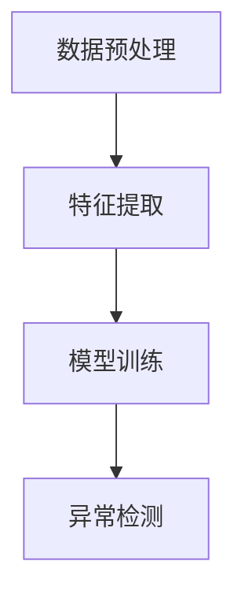

                 


# AI驱动的股票财务指标异常检测

---

## 关键词：AI，股票，财务指标，异常检测，机器学习，深度学习

---

## 摘要：本文详细探讨了如何利用人工智能技术进行股票财务指标异常检测，从问题背景、核心概念到算法原理、系统架构，再到项目实战，全面分析了AI在这一领域的应用。通过具体案例分析，展示了如何利用LSTM等深度学习模型实现财务指标异常检测，并提供了完整的系统设计和代码实现，帮助读者理解和掌握这一技术。

---

# 第一部分：背景介绍

## 第1章：问题背景与目标

### 1.1 财务指标异常检测的重要性

股票市场的波动性极高，投资者需要及时发现财务指标的异常变化，以做出明智的投资决策。传统的财务分析依赖人工检查，效率低下且容易出错。AI技术的应用可以显著提高检测的效率和准确性。

### 1.2 问题描述与解决思路

股票财务指标异常检测的目标是识别公司财务数据中的异常变化，如收入突然下降或成本激增。AI驱动的方法通过分析历史数据，使用机器学习模型自动识别这些异常。

---

## 第2章：核心概念与联系

### 2.1 财务指标异常检测的核心要素

- **财务指标的定义与分类**：包括收入、利润、负债等，每个指标都有其独特的异常特征。
- **异常检测的关键属性**：如波动幅度、趋势变化等。

### 2.2 核心概念的对比分析

- **传统方法与AI方法**：传统方法基于规则，而AI方法通过学习数据模式实现自动检测。
- **不同模型的优缺点**：如LSTM适合时间序列数据，而Isolation Forest适合高维数据。

---

# 第二部分：算法原理与数学模型

## 第4章：算法原理讲解

### 4.1 基于AI的异常检测算法

- **LSTM网络**：用于捕捉时间序列数据中的长期依赖关系。
- **数学模型**：LSTM的基本结构包括输入门、遗忘门和输出门。

  $$ f_{\text{输入门}} = \sigma(W_{x}x + W_{h}h + b) $$
  $$ f_{\text{遗忘门}} = \sigma(W_{x}x + W_{h}h + b) $$
  $$ f_{\text{输出门}} = \tanh(W_{x}x + W_{h}h + b) $$

### 4.2 算法流程图



---

# 第三部分：系统分析与架构设计

## 第5章：系统设计与架构

### 5.1 系统功能设计

- **数据获取**：从数据库中获取财务数据。
- **特征提取**：将财务指标转换为模型可处理的特征。
- **模型训练**：训练LSTM模型。
- **结果展示**：可视化异常检测结果。

### 5.2 系统架构设计


---

# 第四部分：项目实战

## 第6章：项目实现

### 6.1 环境安装

- **Python**：安装最新版本的Python。
- **TensorFlow**：使用pip安装。
- **Keras**：安装依赖库。

### 6.2 核心代码实现

```python
import numpy as np
import pandas as pd
from tensorflow.keras.models import Sequential
from tensorflow.keras.layers import LSTM, Dense, Dropout

# 数据加载
data = pd.read_csv('financial_data.csv')

# 数据预处理
def preprocess(data):
    # 标准化处理
    data = (data - data.mean()) / data.std()
    return data.values

processed_data = preprocess(data)

# 模型构建
model = Sequential()
model.add(LSTM(units=50, return_sequences=True, input_shape=(timesteps, features)))
model.add(Dropout(0.2))
model.add(LSTM(units=50, return_sequences=False))
model.add(Dense(1))

model.compile(optimizer='adam', loss='mean_squared_error')

# 模型训练
model.fit(X_train, y_train, epochs=100, batch_size=32)
```

### 6.3 案例分析

- **案例选择**：分析某公司过去5年的财务数据。
- **异常检测**：模型识别出收入突然下降的情况。
- **结果分析**：结合行业趋势和公司业务，解释异常原因。

---

# 第五部分：总结与展望

## 第7章：总结与展望

### 7.1 最佳实践

- 数据预处理是关键，尤其是标准化和归一化。
- 选择合适的模型，如LSTM适合时间序列数据。
- 结果可视化有助于更好地理解异常。

### 7.2 注意事项

- 数据质量直接影响模型性能。
- 模型部署后需要持续监控和优化。
- 结果验证是确保模型可靠性的必要步骤。

### 7.3 拓展阅读

- 《深度学习》——Ian Goodfellow
- 《Python机器学习》——Andreas Müller

---

# 作者

作者：AI天才研究院 & 禅与计算机程序设计艺术

---

这篇文章详细探讨了AI在股票财务指标异常检测中的应用，从理论到实践，系统地介绍了相关技术和方法，帮助读者全面理解并掌握这一领域。

