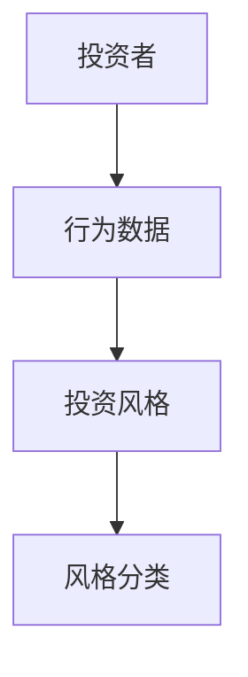
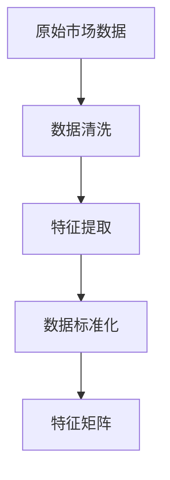
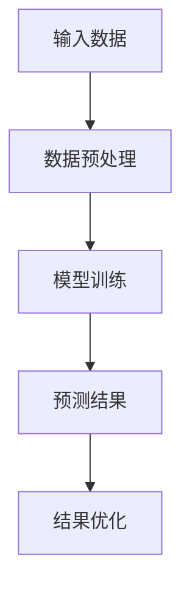
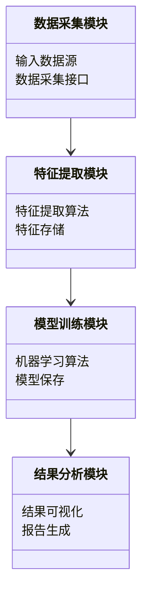
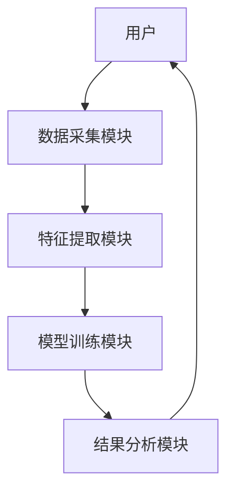

                 


# AI驱动的自动化投资风格识别

> 关键词：AI，投资风格，自动化，机器学习，金融数据分析

> 摘要：本文探讨了利用人工智能技术实现投资风格自动识别的方法与实践。通过分析投资者的行为数据和市场数据，结合机器学习算法，构建自动化识别系统。文章从核心概念、算法原理、系统设计到项目实战，详细阐述了AI在投资风格识别中的应用，并通过实际案例展示了系统的实现过程。

---

## 第二章：核心概念解析

### 2.1 投资者行为分析

投资者的行为数据是识别投资风格的重要来源。以下是投资者行为分析的核心要素对比：

#### 行为数据特征对比表

| 特征维度      | 投资者行为特征 | 投资风格分类 |
|---------------|----------------|--------------|
| 交易频率      | 高频交易       | 抢手型       |
| 交易金额      | 小额交易       | 质朴型       |
| 风险偏好      | 高风险         | 冒险型       |
| 交易时间      | 集中交易       | 聚焦型       |
| 交易策略      | 技术分析       | 理论派       |

#### 投资者行为与投资风格的关系

Mermaid 实体关系图：



### 2.2 市场数据处理

市场数据的处理是投资风格识别的关键步骤。以下是市场数据处理的核心流程：

#### 市场数据处理流程

Mermaid 流程图：



### 2.3 机器学习模型在投资风格识别中的应用

机器学习模型是投资风格识别的核心工具。以下是常见模型的对比：

#### 常见机器学习模型对比表

| 模型名称       | 优点                     | 缺点                     |
|----------------|--------------------------|--------------------------|
| 支持向量机（SVM）| 高精度，适合小样本数据   | 对高维数据敏感           |
| 随机森林       | 抗过拟合，特征重要性可解释 | 计算复杂度较高           |
| 神经网络       | 强大学习能力             | 需要大量数据，易过拟合   |

---

## 第三章：算法原理讲解

### 3.1 支持向量机（SVM）

#### 算法流程

Mermaid 流程图：



#### 核心代码实现

```python
from sklearn.svm import SVC
import numpy as np

# 数据预处理
X = np.array([...])  # 特征矩阵
y = np.array([...])  # 标签

# 模型训练
model = SVC()
model.fit(X, y)

# 预测
y_pred = model.predict(X)
```

#### 数学模型

支持向量机的目标函数：

$$
\text{minimize} \quad \frac{1}{2}||w||^2 + C\sum_{i=1}^{n} \xi_i
$$

约束条件：

$$
y_i(w \cdot x_i + b) \geq 1 - \xi_i
$$

---

## 第四章：系统分析与架构设计方案

### 4.1 系统功能设计

#### 领域模型

Mermaid 类图：



### 4.2 系统架构设计

#### 系统架构图

Mermaid 架构图：



---

## 第五章：项目实战

### 5.1 环境搭建

安装必要的 Python 库：

```bash
pip install numpy pandas scikit-learn matplotlib
```

### 5.2 核心代码实现

```python
import pandas as pd
from sklearn.ensemble import RandomForestClassifier
from sklearn.metrics import accuracy_score

# 数据加载
data = pd.read_csv('investment_style.csv')

# 特征与标签分离
X = data.drop('style', axis=1)
y = data['style']

# 模型训练
model = RandomForestClassifier()
model.fit(X, y)

# 预测与评估
y_pred = model.predict(X)
print("准确率：", accuracy_score(y, y_pred))
```

### 5.3 实际案例分析

#### 数据预处理

```python
# 去除缺失值
data.dropna(inplace=True)

# 标准化处理
from sklearn.preprocessing import StandardScaler
scaler = StandardScaler()
X_scaled = scaler.fit_transform(X)
```

#### 模型训练与评估

```python
# 交叉验证
from sklearn.model_selection import cross_val_score
scores = cross_val_score(model, X_scaled, y, cv=5)
print("交叉验证平均准确率：", np.mean(scores))
```

---

## 第六章：最佳实践与小结

### 6.1 总结

本文详细探讨了AI驱动的自动化投资风格识别的核心概念、算法原理、系统设计与项目实现。通过结合投资者行为分析、市场数据处理和机器学习算法，构建了完整的投资风格识别系统。

### 6.2 注意事项

- 数据质量和完整性对模型性能影响重大，需谨慎处理。
- 模型的解释性与可维护性需在设计阶段充分考虑。
- 实际应用中需结合业务场景进行模型调优。

### 6.3 拓展阅读

- 《机器学习实战》
- 《Python金融数据分析》
- 《深度学习在金融中的应用》

---

作者：AI天才研究院/AI Genius Institute & 禅与计算机程序设计艺术 /Zen And The Art of Computer Programming

