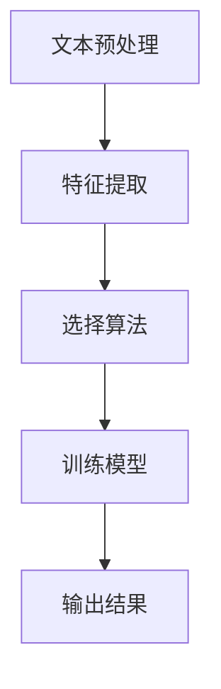
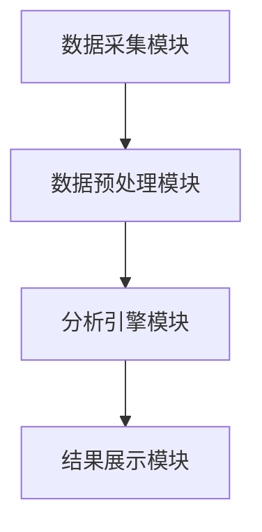

                 


# AI驱动的自动化财报分析系统

> 关键词：AI，自动化，财报分析，自然语言处理，机器学习，财务数据

> 摘要：随着人工智能技术的快速发展，自动化财报分析系统正在改变传统财务报表分析的繁琐与低效。本文将从背景、核心概念、算法原理、系统架构、项目实战等多个角度，详细阐述AI驱动的自动化财报分析系统的构建与应用。通过分析财务数据、文本处理、机器学习算法等技术，结合实际案例，展示如何利用AI技术实现高效的财务数据自动化分析。

---

# 第一部分: AI驱动的自动化财报分析系统概述

# 第1章: 背景与问题背景

## 1.1 问题背景

### 1.1.1 财务报表分析的重要性
财务报表是企业经济活动的重要记录，是投资者、分析师和管理层做出决策的关键依据。然而，传统的财务报表分析依赖于人工阅读和理解，耗时且容易出错。随着企业规模的扩大和数据量的增加，人工分析的效率和准确性已难以满足需求。

### 1.1.2 传统财报分析的局限性
1. **低效性**：人工分析需要逐行阅读和计算，耗时且容易遗漏重要信息。
2. **主观性**：分析结果受分析师的经验和主观判断影响，缺乏客观性。
3. **数据量大**：现代企业产生的财务数据量巨大，人工处理难度大。

### 1.1.3 AI驱动的自动化分析的优势
1. **高效性**：AI可以在短时间内处理大量数据，提高分析效率。
2. **准确性**：通过算法和模型，AI能够减少人为错误，提高分析结果的准确性。
3. **可扩展性**：AI系统可以轻松扩展，适应不同规模和类型的企业。

## 1.2 问题描述

### 1.2.1 财务数据的复杂性
财务数据通常包含结构化和非结构化数据，例如财务报表中的数字数据和注释文本。这些数据需要经过清洗和预处理，才能进行有效的分析。

### 1.2.2 人工分析的低效性
传统的人工分析方式不仅耗时，还需要高度的专注和专业知识，容易因疲劳或疏忽导致错误。

### 1.2.3 数据标准化的挑战
不同企业或行业的财务报表格式和内容可能存在差异，如何将这些数据标准化并进行统一分析是一个重要的挑战。

## 1.3 问题解决

### 1.3.1 自动化财报分析的目标
通过自动化技术，实现财务数据的自动采集、处理、分析和报告生成，提高分析效率和准确性。

### 1.3.2 AI技术在财报分析中的应用
1. **自然语言处理（NLP）**：用于处理财务报表中的文本信息，如注释、说明等。
2. **机器学习**：用于预测财务指标、识别财务风险等。
3. **数据挖掘**：用于从大量财务数据中提取有价值的信息。

### 1.3.3 自动化系统的边界与外延
自动化财报分析系统主要关注数据处理和分析部分，通常不包括数据录入和外部数据源的集成，但可以通过与其他系统的接口实现更广泛的应用。

## 1.4 核心概念与联系

### 1.4.1 核心概念原理
自动化财报分析系统的核心是将财务数据转化为可分析的格式，并利用AI技术进行分析。这包括数据清洗、特征提取、模型训练和预测等步骤。

### 1.4.2 核心概念属性特征对比表格

| 特征       | 人工分析             | AI自动化分析           |
|------------|----------------------|------------------------|
| 效率       | 低                   | 高                     |
| 准确性      | 受主观影响           | 较高                   |
| 处理范围    | 有限                 | 广泛                   |
| 可扩展性    | 差                   | 好                     |

### 1.4.3 ER实体关系图架构

```mermaid
erd
    title ER Entity Relationship Diagram

    系统
        .关联关系-》算法模块
    算法模块
        .关联关系-》数据模块
    数据模块
        .关联关系-》财务数据
```

---

# 第2章: AI驱动的自动化财报分析系统的核心概念

## 2.1 自然语言处理与财务文本分析

### 2.1.1 NLP在财务文本中的应用
自然语言处理技术可以用于从财务报表的文本部分提取关键信息，如公司业绩说明、财务注释等。

### 2.1.2 财务文本的特征提取
1. **分词**：将财务文本中的关键词和短语提取出来。
2. **实体识别**：识别公司名称、财务指标等实体。
3. **情感分析**：分析文本中的情感倾向，如乐观或悲观。

### 2.1.3 基于NLP的财报信息抽取
通过NLP技术，可以从财务文本中自动提取关键信息，例如公司收入、利润、成本等。

## 2.2 机器学习与财务数据分析

### 2.2.1 机器学习在财务预测中的应用
1. **财务预测**：如预测公司未来的收入、利润等。
2. **风险评估**：识别潜在的财务风险，如违约风险。

### 2.2.2 常见机器学习算法的选择
1. **线性回归**：用于预测连续型财务指标。
2. **随机森林**：用于分类和回归问题。
3. **支持向量机（SVM）**：用于分类问题。

### 2.2.3 财务数据的特征工程
特征工程是机器学习的重要步骤，包括数据清洗、特征提取、特征选择等。

## 2.3 自动化分析系统的架构

### 2.3.1 系统的整体架构
自动化财报分析系统通常包括数据采集、数据预处理、模型训练和结果展示四个模块。

### 2.3.2 数据流的处理流程
1. 数据采集：从财务报表中获取数据。
2. 数据预处理：清洗和标准化数据。
3. 模型训练：训练机器学习模型。
4. 结果展示：输出分析结果。

### 2.3.3 系统功能模块的划分

| 模块名称     | 功能描述                     |
|--------------|------------------------------|
| 数据采集模块 | 获取财务报表数据             |
| 数据预处理模块 | 清洗和标准化数据             |
| 分析引擎模块 | 训练和应用机器学习模型       |
| 结果展示模块 | 输出分析结果和可视化报告     |

---

# 第3章: 自动化财报分析系统的算法原理

## 3.1 文本预处理与特征提取

### 3.1.1 文本清洗与标准化
1. **去除停用词**：如“的”、“了”等无意义词汇。
2. **分词**：将文本分割成有意义的词语。
3. **词干提取**：将词语转换为基本词干，如“computing”转换为“compute”。

### 3.1.2 分词与实体识别
使用NLP工具（如spaCy）进行分词和实体识别，提取公司名称、财务指标等实体。

### 3.1.3 文本向量化方法
1. **词袋模型（Bag of Words）**：将文本表示为词汇的向量。
2. **TF-IDF**：计算词的重要性的加权向量。
3. **Word Embedding**：如Word2Vec，将词语映射到向量空间。

## 3.2 基于机器学习的分类算法

### 3.2.1 支持向量机（SVM）原理
SVM是一种监督学习算法，适用于分类和回归问题。其核心思想是将数据映射到高维空间，并找到一个超平面来区分不同类别的数据。

### 3.2.2 随机森林（Random Forest）原理
随机森林是一种基于决策树的集成学习算法，通过构建多棵决策树并取其预测结果的平均值来提高模型的准确性和鲁棒性。

### 3.2.3 神经网络（CNN/RNN）原理
1. **卷积神经网络（CNN）**：适用于图像和序列数据的处理，常用于自然语言处理任务。
2. **循环神经网络（RNN）**：适用于处理序列数据，如时间序列分析。

## 3.3 算法流程图



---

# 第4章: 自动化财报分析系统的系统架构设计

## 4.1 系统功能设计

### 4.1.1 数据采集模块
1. **数据源**：支持多种数据格式，如PDF、Excel等。
2. **数据清洗**：自动去除无效数据和错误数据。

### 4.1.2 数据预处理模块
1. **特征提取**：从财务数据中提取有用的特征。
2. **数据标准化**：将数据归一化，便于模型训练。

### 4.1.3 分析引擎模块
1. **模型训练**：使用机器学习算法训练模型。
2. **模型应用**：将预处理后的数据输入模型，得到预测结果。

### 4.1.4 结果展示模块
1. **可视化**：将分析结果以图表形式展示。
2. **报告生成**：自动生成分析报告。

## 4.2 系统架构设计

### 4.2.1 系统架构图



### 4.2.2 系统功能模块划分
1. **数据采集模块**：负责获取财务数据。
2. **数据预处理模块**：负责清洗和标准化数据。
3. **分析引擎模块**：负责训练和应用模型。
4. **结果展示模块**：负责输出分析结果。

---

# 第5章: 项目实战

## 5.1 环境安装与配置

### 5.1.1 安装Python
```bash
python --version
pip install --upgrade pip
```

### 5.1.2 安装必要的库
```bash
pip install numpy pandas scikit-learn spacy
python -m spacy download en_core_web_sm
```

## 5.2 系统核心实现源代码

### 5.2.1 数据采集模块
```python
import pandas as pd
import requests

# 下载财务报表数据
url = "https://example.com/financial_report.xlsx"
response = requests.get(url)
with open("financial_report.xlsx", "wb") as f:
    f.write(response.content)
```

### 5.2.2 数据预处理模块
```python
import pandas as pd
import spacy

# 加载中文分词模型
nlp = spacy.load("zh_core_web_sm")

# 加载数据
df = pd.read_excel("financial_report.xlsx")

# 文本预处理
def preprocess_text(text):
    doc = nlp(text)
    return " ".join([token.text for token in doc if not token.is_stop])

df["processed_text"] = df["text"].apply(preprocess_text)
```

### 5.2.3 分析引擎模块
```python
from sklearn.feature_extraction.text import TfidfVectorizer
from sklearn.svm import SVC
from sklearn.metrics import accuracy_score

# 特征提取
vectorizer = TfidfVectorizer()
X = vectorizer.fit_transform(df["processed_text"])

# 训练模型
model = SVC()
model.fit(X, df["label"])

# 预测
test_X = vectorizer.transform(new_texts)
predictions = model.predict(test_X)

# 评估
accuracy = accuracy_score(y_true, predictions)
print(f"准确率: {accuracy}")
```

## 5.3 案例分析与详细解读

### 5.3.1 数据采集与预处理
假设我们从某公司获取了财务报表数据，并将其存储为Excel文件。通过Python脚本，我们可以自动下载并解析这些数据。

### 5.3.2 模型训练与应用
使用TF-IDF特征提取方法，将文本数据转换为向量形式，然后训练一个支持向量机模型。通过训练好的模型，我们可以对新的财务文本进行分类，例如识别公司的财务状况是正面、中性还是负面。

## 5.4 项目小结

通过本项目，我们实现了从数据采集到模型训练的完整流程，展示了如何利用AI技术实现自动化财报分析。实际应用中，可以根据具体需求调整模型和算法，以达到最佳效果。

---

# 第6章: 总结与展望

## 6.1 总结
本文详细介绍了AI驱动的自动化财报分析系统的构建与应用，从背景、核心概念、算法原理到系统架构和项目实战，全面覆盖了实现自动化财报分析的各个方面。

## 6.2 未来展望
随着AI技术的不断发展，自动化财报分析系统将更加智能化和高效化。未来的挑战在于如何进一步提高模型的准确性和可解释性，同时探索更多AI在财务领域的应用场景。

## 6.3 最佳实践 Tips
1. **数据质量**：确保数据的准确性和完整性。
2. **模型可解释性**：选择适合业务需求的模型，避免过于复杂的模型。
3. **持续优化**：定期更新模型和数据，保持系统的高效性和准确性。

---

# 作者

作者：AI天才研究院/AI Genius Institute & 禅与计算机程序设计艺术 /Zen And The Art of Computer Programming

