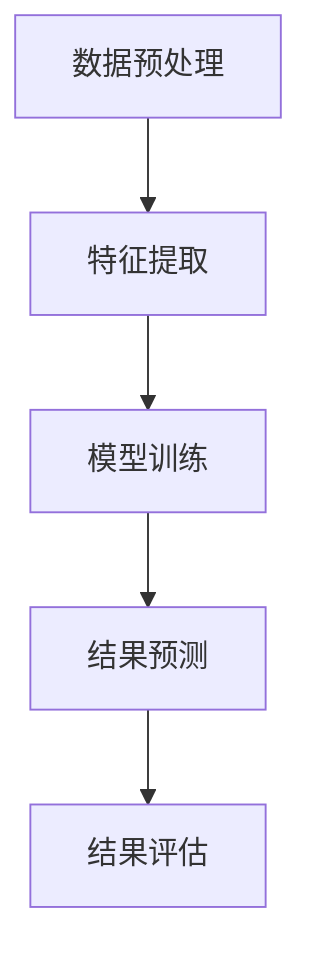
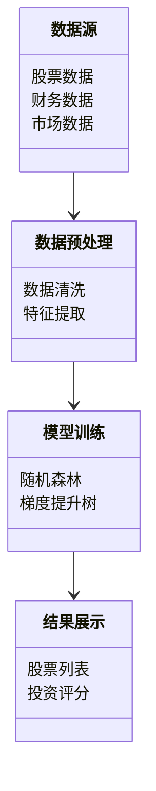

                 


# AI驱动的费雪成长型股票筛选系统

> 关键词：AI, 股票筛选, 费雪成长型, 机器学习, 股票投资

> 摘要：本文详细探讨了如何利用人工智能技术构建一个高效的费雪成长型股票筛选系统。通过分析费雪成长型投资策略的核心要素，结合机器学习算法和系统架构设计，提出了一套基于AI的股票筛选解决方案。文章从理论到实践，系统地介绍了如何利用AI技术实现股票筛选的自动化、智能化和高效化，为投资者提供了新的思路和工具。

---

## 第一部分: AI与费雪成长型投资的结合

### 第1章: AI与费雪成长型投资的结合

#### 1.1 费雪投资理论的核心概念

费雪成长型投资策略是由投资大师菲利普·费雪（Philip Fisher）提出的一种长期投资方法，其核心在于寻找那些具有持续增长潜力的优秀企业。以下是费雪成长型投资的几个核心概念：

1. **管理层质量**：公司管理层的能力和决策是企业成长的关键因素。
2. **产品或服务的市场需求**：企业的产品或服务是否具有广泛的市场需求和增长空间。
3. **财务健康状况**：企业的财务状况是否稳健，包括盈利能力、资产负债情况等。
4. **竞争优势**：企业是否具备独特的竞争优势，例如品牌、技术、成本优势等。

#### 1.2 AI在投资决策中的作用

随着人工智能技术的快速发展，AI在金融领域的应用越来越广泛。AI可以通过对大量数据的分析，发现隐藏在数据中的规律和模式，从而帮助投资者做出更明智的投资决策。具体来说，AI在投资决策中的作用包括：

1. **数据处理能力**：AI能够快速处理海量数据，包括财务数据、市场数据、新闻数据等。
2. **模式识别**：通过机器学习算法，AI可以识别数据中的潜在模式和趋势，帮助投资者发现投资机会。
3. **风险控制**：AI可以通过对风险因子的分析，帮助投资者降低投资风险。

#### 1.3 费雪成长型股票筛选的AI化趋势

传统的费雪成长型股票筛选方法主要依赖于人工分析和判断，这种方法虽然有效，但存在效率低、主观性强、难以量化等缺点。随着AI技术的发展，越来越多的投资者开始尝试将AI应用于费雪成长型股票的筛选过程中。AI驱动的费雪成长型股票筛选系统可以通过自动化的方式，快速筛选出符合费雪成长型标准的股票，从而提高投资效率和准确性。

---

### 第2章: AI驱动的股票筛选系统核心概念

#### 2.1 费雪成长型股票筛选的AI模型

AI驱动的费雪成长型股票筛选系统的核心是一个基于机器学习的AI模型。该模型可以通过对大量的历史数据进行训练，学习如何识别符合费雪成长型标准的股票。以下是AI模型的核心组成部分：

1. **输入数据**：包括企业的财务数据（如收入、利润、资产负债率等）、市场数据（如股价、成交量、市场指数等）、以及其他相关数据（如行业新闻、社交媒体情绪等）。
2. **特征提取**：通过对输入数据的处理，提取出能够反映企业成长潜力的特征，例如收入增长率、净利润率、研发投入占比等。
3. **模型训练**：使用机器学习算法（如随机森林、梯度提升树等）对特征进行训练，生成一个能够预测股票是否符合费雪成长型标准的模型。
4. **输出结果**：模型输出的结果包括符合费雪成长型标准的股票列表、股票的投资价值评分等。

#### 2.2 数据特征与筛选逻辑

在AI驱动的费雪成长型股票筛选系统中，数据特征的提取和筛选逻辑是至关重要的。以下是几个关键的数据特征及其筛选逻辑：

1. **收入增长率**：收入增长率是衡量企业成长潜力的重要指标。AI模型可以通过对历史收入数据的分析，预测未来的收入增长率。
2. **净利润率**：净利润率反映了企业的盈利能力。高净利润率的企业通常具有更强的盈利能力。
3. **研发投入占比**：研发投入占比是衡量企业创新能力的重要指标。高研发投入占比的企业通常具有更强的技术优势。
4. **行业地位**：行业地位反映了企业在行业中的竞争地位。龙头企业通常具有更强的市场影响力和竞争优势。

---

### 第3章: AI驱动的股票筛选算法原理

#### 3.1 机器学习算法的选择与应用

在AI驱动的费雪成长型股票筛选系统中，选择合适的机器学习算法是至关重要的。以下是一些常用的机器学习算法及其应用场景：

1. **线性回归**：用于预测连续型变量，例如股票的价格走势。
2. **逻辑回归**：用于分类问题，例如股票是否符合费雪成长型标准。
3. **随机森林**：用于分类和回归问题，具有较高的准确性和鲁棒性。
4. **梯度提升树**：用于分类和回归问题，能够处理高维数据。

#### 3.2 算法流程图

以下是AI驱动的股票筛选算法的流程图：



#### 3.3 算法实现的数学模型

以下是随机森林算法的数学模型：

$$ y = \text{多数投票} $$

其中，$y$ 是模型预测的结果，$\text{多数投票}$ 表示随机森林模型通过投票的方式选择最终的预测结果。

---

### 第4章: 系统架构与设计

#### 4.1 系统功能模块划分

AI驱动的费雪成长型股票筛选系统可以划分为以下几个功能模块：

1. **数据获取模块**：负责获取股票相关的数据，包括财务数据、市场数据等。
2. **数据预处理模块**：对获取的数据进行清洗和特征提取。
3. **模型训练模块**：使用机器学习算法对数据进行训练，生成股票筛选模型。
4. **结果展示模块**：将模型预测的结果以可视化的方式展示出来。

#### 4.2 系统架构设计图

以下是系统的架构设计图：



---

## 第五部分: 项目实战与案例分析

### 第5章: 项目实战

#### 5.1 环境安装

以下是AI驱动的费雪成长型股票筛选系统的环境安装步骤：

1. **安装Python**：建议使用Python 3.6或更高版本。
2. **安装必要的库**：包括Pandas、NumPy、Scikit-learn、XGBoost等。
3. **数据获取工具**：可以使用Yahoo Finance API获取股票数据。

#### 5.2 核心实现代码

以下是AI驱动的费雪成长型股票筛选系统的核心实现代码：

```python
import pandas as pd
import numpy as np
from sklearn.ensemble import RandomForestClassifier
from sklearn.metrics import accuracy_score

# 数据获取与预处理
data = pd.read_csv('stock_data.csv')
X = data.drop('target', axis=1)
y = data['target']

# 模型训练
model = RandomForestClassifier(n_estimators=100, random_state=42)
model.fit(X, y)

# 模型预测
y_pred = model.predict(X)

# 模型评估
print("准确率:", accuracy_score(y, y_pred))
```

#### 5.3 实际案例分析

以下是一个实际的案例分析：

假设我们有一个包含以下特征的股票数据集：

- 收入增长率
- 净利润率
- 研发投入占比
- 行业地位

通过AI驱动的股票筛选系统，我们可以训练一个随机森林模型，并使用该模型预测哪些股票符合费雪成长型标准。

---

## 第六部分: 总结与扩展

### 第6章: 总结与扩展

#### 6.1 系统总结

AI驱动的费雪成长型股票筛选系统通过结合AI技术和费雪成长型投资策略，能够有效地帮助投资者筛选出具有成长潜力的股票。系统的核心是基于机器学习的AI模型，通过对企业财务数据、市场数据等多方面的分析，生成符合费雪成长型标准的股票列表。

#### 6.2 未来扩展方向

未来，AI驱动的费雪成长型股票筛选系统可以在以下几个方面进行扩展：

1. **多模态数据融合**：将文本数据（如新闻、公司财报）和结构化数据结合起来，进一步提高模型的预测能力。
2. **实时监控与预警**：实现对股票市场的实时监控，及时发现潜在的投资机会和风险。
3. **个性化投资策略**：根据投资者的风险偏好和投资目标，定制个性化的股票筛选策略。

---

## 作者：AI天才研究院/AI Genius Institute & 禅与计算机程序设计艺术/Zen And The Art of Computer Programming

---

**全文完**

