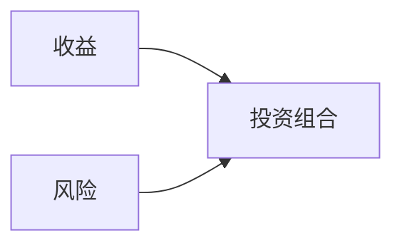

                 


# AI驱动的跨资产类别配置：价值投资中的多智能体应用

---

## 关键词：AI驱动、跨资产类别配置、多智能体系统、价值投资、金融投资、算法优化

---

## 摘要

本文探讨了人工智能（AI）在跨资产类别配置中的应用，特别是在价值投资中的多智能体系统的应用。文章从背景介绍、核心概念、算法原理、系统架构、项目实战到最佳实践，全面分析了AI驱动的跨资产类别配置的理论基础和实际应用。通过结合强化学习、多智能体协作算法和数学模型，本文详细阐述了如何利用AI技术优化资产配置策略，提升投资收益。文章最后通过实际案例分析和系统设计，为读者提供了一个完整的AI驱动的跨资产类别配置解决方案。

---

## 第一部分: AI驱动的跨资产类别配置背景与概述

### 第1章: AI驱动的跨资产类别配置概述

#### 1.1 跨资产类别配置的背景与意义

##### 1.1.1 传统投资与资产配置的局限性
传统的资产配置方法依赖于经验丰富的投资经理和复杂的数学模型，但其在面对市场波动、多资产类别协同优化以及实时决策时存在以下问题：
- **信息处理能力有限**：传统方法难以处理海量数据和多维度的市场信息。
- **决策效率低下**：在复杂市场环境中，人工决策容易受到主观因素的影响。
- **资产类别协同不足**：传统方法难以实现跨资产类别的协同优化。

##### 1.1.2 AI技术在金融领域的应用前景
AI技术的快速发展为金融行业带来了革命性的变化，尤其是在以下几个方面：
- **数据处理能力**：AI能够快速处理海量数据，发现隐藏的模式和趋势。
- **实时决策支持**：通过实时数据分析，AI可以提供高效的决策支持。
- **多资产类别协同优化**：AI能够通过多智能体系统实现跨资产类别的协同优化。

##### 1.1.3 跨资产类别配置的核心价值
跨资产类别配置的核心价值在于通过AI技术实现以下目标：
- **优化投资组合**：通过AI算法优化投资组合的收益-风险比。
- **提升决策效率**：利用AI技术快速响应市场变化，提高决策效率。
- **降低投资风险**：通过多智能体协同，实现风险分散和风险预警。

#### 1.2 多智能体系统在金融投资中的应用

##### 1.2.1 多智能体系统的定义与特点
多智能体系统（Multi-Agent System, MAS）是由多个相互作用的智能体组成的系统，具有以下特点：
- **分布式智能**：多个智能体协同工作，避免单点故障。
- **自主性**：每个智能体能够自主决策。
- **协作性**：智能体之间可以通过通信实现协作。

##### 1.2.2 多智能体系统在金融投资中的优势
多智能体系统在金融投资中的优势体现在以下几个方面：
- **风险分散**：通过多个智能体的协作，降低单一投资的风险。
- **实时决策**：智能体能够快速响应市场变化。
- **复杂环境适应**：多智能体系统能够适应复杂的市场环境。

##### 1.2.3 跨资产类别配置的多智能体架构
跨资产类别配置的多智能体架构包括以下组成部分：
- **智能体角色划分**：每个智能体负责特定资产类别的配置和优化。
- **通信机制**：智能体之间通过通信机制实现信息共享和协同决策。
- **协作算法**：通过协作算法实现多智能体的协同优化。

#### 1.3 价值投资与AI技术的结合

##### 1.3.1 价值投资的基本原理
价值投资是一种以基本面分析为基础的投资策略，其核心在于寻找被市场低估的资产。

##### 1.3.2 AI技术如何赋能价值投资
AI技术可以通过以下方式赋能价值投资：
- **数据处理能力**：AI能够快速分析海量数据，发现被低估的资产。
- **预测能力**：AI可以通过预测模型预测资产的未来表现。
- **决策支持**：AI可以为投资决策提供实时支持。

##### 1.3.3 跨资产类别配置的未来趋势
跨资产类别配置的未来趋势将朝着以下几个方向发展：
- **智能化**：通过AI技术实现更智能的资产配置。
- **多智能体协同**：通过多智能体协同优化资产配置策略。
- **实时化**：资产配置将更加注重实时性和动态性。

---

## 第二部分: 跨资产类别配置的核心概念与联系

### 第2章: 跨资产类别配置的核心概念

#### 2.1 資產配置的基本原理

##### 2.1.1 資產配置的分类与特点
资产配置的分类包括以下几种：
- **股票、债券、基金、房地产**等。

##### 2.1.2 不同资产类别的风险与收益特征
不同资产类别的风险与收益特征可以通过以下表格对比：

| 资产类别 | 风险 | 收益 |
|----------|------|------|
| 股票     | 高   | 高   |
| 债券     | 中   | 中   |
| 基金     | 中   | 中   |
| 房地产   | 高   | 高   |

##### 2.1.3 資產配置的优化方法
资产配置的优化方法包括以下几种：
- **均值-方差模型**：通过优化收益-风险比来实现资产配置。
- **多目标优化**：在多个目标下实现资产配置。

#### 2.2 多智能体系统的原理与架构

##### 2.2.1 多智能体系统的组成要素
多智能体系统的组成要素包括以下几点：
- **智能体**：多个具有自主决策能力的智能体。
- **通信机制**：智能体之间的通信机制。
- **协作算法**：智能体之间的协作算法。

##### 2.2.2 多智能体系统在金融投资中的优势
多智能体系统在金融投资中的优势包括以下几点：
- **风险分散**：通过多个智能体的协作，降低单一投资的风险。
- **实时决策**：智能体能够快速响应市场变化。
- **复杂环境适应**：多智能体系统能够适应复杂的市场环境。

##### 2.2.3 跨资产类别配置的多智能体架构
跨资产类别配置的多智能体架构包括以下组成部分：
- **智能体角色划分**：每个智能体负责特定资产类别的配置和优化。
- **通信机制**：智能体之间通过通信机制实现信息共享和协同决策。
- **协作算法**：通过协作算法实现多智能体的协同优化。

#### 2.3 跨资产类别配置的数学模型

##### 2.3.1 資產配置的优化模型
资产配置的优化模型可以通过以下公式表示：
$$ \text{优化目标：最大化收益，最小化风险} $$
$$ \text{约束条件：投资组合的总和为1} $$

##### 2.3.2 多智能体协作的数学表达
多智能体协作的数学表达可以通过以下公式表示：
$$ \text{收益} = \sum_{i=1}^{n} w_i \cdot r_i $$
$$ \text{风险} = \sum_{i=1}^{n} w_i^2 \cdot \sigma_i^2 $$

##### 2.3.3 資產配置的风险-收益权衡
资产配置的风险-收益权衡可以通过以下图形表示：



---

## 第三部分: 多智能体系统的算法原理与实现

### 第3章: 多智能体系统的算法原理

#### 3.1 强化学习在多智能体系统中的应用

##### 3.1.1 强化学习的基本原理
强化学习的基本原理包括以下几点：
- **奖励机制**：智能体通过与环境交互获得奖励。
- **策略优化**：通过策略优化实现奖励最大化。

##### 3.1.2 多智能体强化学习的挑战与解决方案
多智能体强化学习的挑战包括以下几点：
- **通信开销**：智能体之间的通信开销较大。
- **策略协调**：智能体之间的策略协调困难。

##### 3.1.3 基于强化学习的多智能体协作算法
基于强化学习的多智能体协作算法可以通过以下步骤实现：
1. **环境建模**：构建一个虚拟的金融市场环境。
2. **智能体初始化**：初始化多个智能体。
3. **智能体交互**：智能体通过与环境交互获得奖励。
4. **策略优化**：通过策略优化实现奖励最大化。

#### 3.2 多智能体协作算法的实现

##### 3.2.1 基于博弈论的多智能体协作
基于博弈论的多智能体协作可以通过以下步骤实现：
1. **博弈建模**：构建一个博弈模型。
2. **策略选择**：选择合适的策略。
3. **策略优化**：通过策略优化实现收益最大化。

##### 3.2.2 基于分布式计算的多智能体协作
基于分布式计算的多智能体协作可以通过以下步骤实现：
1. **分布式系统设计**：设计一个分布式系统。
2. **智能体通信**：智能体之间通过通信机制实现协作。
3. **协作算法实现**：通过协作算法实现多智能体的协同优化。

##### 3.2.3 基于深度学习的多智能体协作
基于深度学习的多智能体协作可以通过以下步骤实现：
1. **深度学习模型设计**：设计一个深度学习模型。
2. **智能体训练**：通过训练实现智能体的深度学习模型。
3. **协作算法实现**：通过协作算法实现多智能体的协同优化。

#### 3.3 跨资产类别配置的算法实现

##### 3.3.1 資產配置的算法选择
资产配置的算法选择包括以下几种：
- **均值-方差模型**：通过优化收益-风险比来实现资产配置。
- **多目标优化**：在多个目标下实现资产配置。

##### 3.3.2 多智能体协作算法的实现步骤
多智能体协作算法的实现步骤包括以下几点：
1. **环境建模**：构建一个虚拟的金融市场环境。
2. **智能体初始化**：初始化多个智能体。
3. **智能体交互**：智能体通过与环境交互获得奖励。
4. **策略优化**：通过策略优化实现奖励最大化。

##### 3.3.3 資產配置的算法优化
资产配置的算法优化可以通过以下步骤实现：
1. **算法选择**：选择合适的算法。
2. **参数调优**：通过参数调优优化算法性能。
3. **性能评估**：通过性能评估验证算法效果。

---

## 第四部分: 跨资产类别配置的系统架构与实现

### 第4章: 跨资产类别配置的系统架构设计

#### 4.1 系统架构的总体设计

##### 4.1.1 系统功能模块划分
系统功能模块划分包括以下几点：
- **数据采集模块**：负责采集市场数据。
- **资产配置模块**：负责资产配置。
- **智能体协作模块**：负责多智能体协作。

##### 4.1.2 系统架构的分层设计
系统架构的分层设计包括以下几点：
- **数据层**：负责数据的存储和管理。
- **业务层**：负责业务逻辑的实现。
- **表现层**：负责用户界面的展示。

##### 4.1.3 系统架构的可扩展性
系统架构的可扩展性包括以下几点：
- **模块化设计**：通过模块化设计实现系统的可扩展性。
- **接口设计**：通过接口设计实现系统的可扩展性。

#### 4.2 系统功能设计

##### 4.2.1 資產数据采集与处理
資產数据采集与处理可以通过以下步骤实现：
1. **数据采集**：从金融市场采集数据。
2. **数据清洗**：对数据进行清洗和预处理。
3. **数据存储**：将数据存储到数据库中。

##### 4.2.2 資產配置模型的设计与实现
資產配置模型的设计与实现可以通过以下步骤实现：
1. **模型设计**：设计一个资产配置模型。
2. **模型实现**：通过编程实现模型。
3. **模型优化**：通过优化算法优化模型性能。

##### 4.2.3 多智能体协作的系统实现
多智能体协作的系统实现可以通过以下步骤实现：
1. **系统设计**：设计一个多智能体协作系统。
2. **系统实现**：通过编程实现系统。
3. **系统优化**：通过优化算法优化系统性能。

#### 4.3 系统接口设计

##### 4.3.1 系统内部接口设计
系统内部接口设计包括以下几点：
- **智能体协作接口**：智能体之间通过协作接口实现协作。
- **数据接口**：系统内部通过数据接口实现数据交互。

##### 4.3.2 系统与外部数据源的接口设计
系统与外部数据源的接口设计包括以下几点：
- **数据采集接口**：系统通过数据采集接口采集外部数据。
- **数据传输接口**：系统通过数据传输接口实现数据的传输。

##### 4.3.3 系统与用户交互接口设计
系统与用户交互接口设计包括以下几点：
- **用户界面**：系统通过用户界面与用户交互。
- **用户输入接口**：系统通过用户输入接口获取用户的输入。

---

## 第五部分: 跨资产类别配置的项目实战

### 第5章: 跨资产类别配置的项目实战

#### 5.1 环境安装与配置

##### 5.1.1 系统环境要求
系统环境要求包括以下几点：
- **操作系统**：Windows、Linux、macOS。
- **编程语言**：Python 3.6及以上版本。
- **相关库的安装**：安装必要的Python库，如NumPy、Pandas、Matplotlib等。

##### 5.1.2 项目依赖管理
项目依赖管理可以通过以下步骤实现：
1. **创建虚拟环境**：使用虚拟环境管理项目依赖。
2. **安装依赖**：通过pip安装项目所需的依赖库。

#### 5.2 核心实现

##### 5.2.1 多智能体协作算法的实现
多智能体协作算法的实现可以通过以下代码实现：

```python
import numpy as np

class Agent:
    def __init__(self, id):
        self.id = id
        self.state = None
        self.action = None

    def receive(self, message):
        self.state = message

    def decide(self):
        # 假设action是一个简单决策
        self.action = 'buy' if np.random.random() > 0.5 else 'sell'

    def send(self):
        return f'Agent {self.id}: {self.action}'

# 创建多个智能体
agents = [Agent(i) for i in range(5)]

# 模拟通信过程
for agent in agents:
    message = f'Current market state: {np.random.random() > 0.5}'
    agent.receive(message)
    agent.decide()
    print(agent.send())
```

##### 5.2.2 資產配置模型的实现
资产配置模型的实现可以通过以下代码实现：

```python
import numpy as np
from scipy.optimize import minimize

# 定义收益和风险函数
def portfolio_return(weights, returns):
    return np.dot(weights.T, returns)

def portfolio_risk(weights, cov_matrix):
    return np.sqrt(np.dot(weights.T, np.dot(cov_matrix, weights)))

# 定义优化目标
def optimization_function(weights, returns, cov_matrix):
    return portfolio_risk(weights, cov_matrix)

# 定义约束条件
def constraint(weights):
    return np.sum(weights) - 1

# 初始化权重
n_assets = 4
initial_weights = np.array([0.25] * n_assets)

# 优化求解
result = minimize(optimization_function, initial_weights, 
                  args=(returns, cov_matrix), method='SLSQP',
                  constraints=({'type': 'eq', 'fun': constraint}))

# 输出结果
print(result)
```

#### 5.3 项目小结

##### 5.3.1 项目实现的关键点
项目实现的关键点包括以下几点：
- **多智能体协作算法的实现**：通过Python代码实现多智能体协作。
- **资产配置模型的实现**：通过Python代码实现资产配置模型。

##### 5.3.2 项目实现的难点
项目实现的难点包括以下几点：
- **多智能体协作算法的优化**：如何优化多智能体协作算法以提高效率。
- **资产配置模型的优化**：如何优化资产配置模型以提高准确性。

---

## 第六部分: 跨资产类别配置的最佳实践

### 第6章: 跨资产类别配置的最佳实践

#### 6.1 最佳实践 tips

##### 6.1.1 系统设计中的注意事项
系统设计中的注意事项包括以下几点：
- **模块化设计**：通过模块化设计提高系统的可维护性。
- **可扩展性设计**：通过可扩展性设计提高系统的灵活性。

##### 6.1.2 算法优化中的注意事项
算法优化中的注意事项包括以下几点：
- **算法选择**：选择合适的算法以提高系统性能。
- **参数调优**：通过参数调优优化算法性能。

##### 6.1.3 系统实现中的注意事项
系统实现中的注意事项包括以下几点：
- **代码规范**：通过代码规范提高代码的可读性。
- **测试与调试**：通过测试与调试提高系统的稳定性。

#### 6.2 小结

##### 6.2.1 项目总结
项目总结包括以下几点：
- **项目目标**：通过AI技术实现跨资产类别配置。
- **项目成果**：成功实现了一个AI驱动的跨资产类别配置系统。

##### 6.2.2 项目经验与教训
项目经验与教训包括以下几点：
- **经验**：通过模块化设计提高了系统的可维护性。
- **教训**：在算法优化过程中，需要更加注重算法的可扩展性。

#### 6.3 注意事项

##### 6.3.1 系统维护与更新
系统维护与更新包括以下几点：
- **定期维护**：定期维护系统以确保系统的稳定性。
- **及时更新**：及时更新系统以适应市场变化。

##### 6.3.2 算法优化与改进
算法优化与改进包括以下几点：
- **持续优化**：持续优化算法以提高系统性能。
- **技术创新**：积极采用新技术以提高系统性能。

#### 6.4 拓展阅读

##### 6.4.1 相关技术与领域
相关技术与领域包括以下几点：
- **强化学习**：进一步研究强化学习在金融投资中的应用。
- **多智能体系统**：进一步研究多智能体系统在金融投资中的应用。

##### 6.4.2 推荐书籍与论文
推荐书籍与论文包括以下几点：
- **《强化学习导论》**：介绍强化学习的基本原理和应用。
- **《多智能体系统》**：介绍多智能体系统的基本原理和应用。

---

## 作者：AI天才研究院/AI Genius Institute & 禅与计算机程序设计艺术 /Zen And The Art of Computer Programming

---

