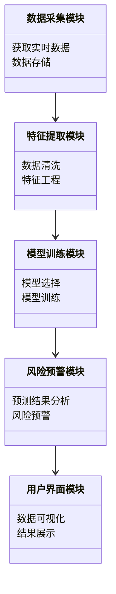
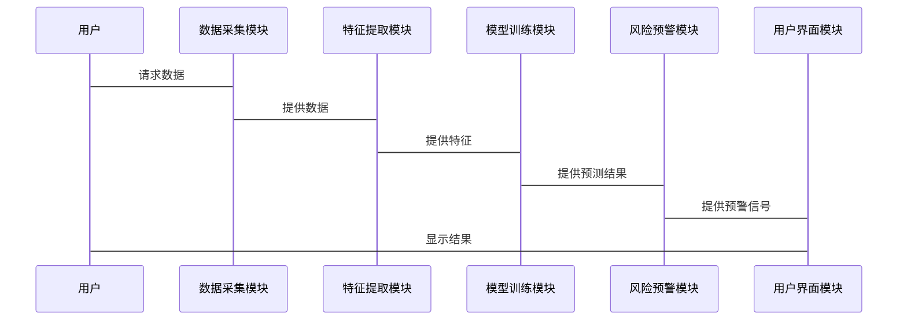

                 


# AI驱动的金融市场泡沫识别系统

## 关键词：
AI技术，金融市场，泡沫识别，深度学习，预测模型，风险控制

## 摘要：
本文详细探讨了AI技术在金融市场泡沫识别中的应用，从理论到实践，结合深度学习模型，如LSTM和CNN，分析金融市场数据特征，构建预测模型，设计系统架构，并通过实际案例展示系统的实现与效果。文章还讨论了模型优化、系统可扩展性以及风险控制策略，为金融从业者和AI工程师提供实用指导。

---

# 第1章: AI驱动的金融市场泡沫识别系统概述

## 1.1 金融市场概述
### 1.1.1 金融市场的定义与组成
- 金融市场的基本概念：股票市场、债券市场、期货市场等。
- 市场参与者的角色：投资者、机构、监管机构。
- 交易机制：订单驱动、撮合交易等。

### 1.1.2 金融市场的作用与功能
- 资金配置：帮助企业融资，促进资本流动。
- 价格发现：通过供需关系确定资产价格。
- 风险管理：提供套期保值工具。

## 1.2 金融市场泡沫的概念与特征
### 1.2.1 泡沫的定义与形成机制
- 资产价格显著偏离其内在价值。
- 投资者非理性行为： herd mentality，过度乐观。

### 1.2.2 泡沫的常见类型与表现形式
- 股票市场泡沫：如互联网泡沫、2008年次贷危机。
- 房地产泡沫：如2008年美国次贷危机。
- 货币市场泡沫：如比特币价格波动。

### 1.2.3 泡沫的经济影响与风险
- 系统性风险：泡沫破裂引发金融危机。
- 经济波动：泡沫破裂导致经济衰退。
- 投资者损失：泡沫破裂时投资者面临重大损失。

## 1.3 AI技术在金融市场的应用前景
### 1.3.1 AI在金融分析中的作用
- 数据挖掘：从海量数据中提取有用信息。
- 预测模型：基于历史数据预测未来走势。
- 自动交易：算法交易提高交易效率。

### 1.3.2 AI在风险控制中的应用
- 风险评估：预测市场风险，优化投资组合。
- 异常检测：识别市场中的异常交易行为。
- 风险预警：提前预警潜在风险，减少损失。

### 1.3.3 AI在金融市场预测中的潜力
- 提高预测精度：AI能够处理复杂数据，捕捉市场趋势。
- 实时监控：AI系统能够实时监控市场动态，快速做出反应。
- 自适应调整：AI模型可以根据市场变化自动调整预测策略。

## 1.4 本章小结
本章介绍了金融市场的基本概念、泡沫的定义与特征，以及AI技术在金融市场中的应用前景。通过分析，我们可以看到AI技术在金融市场中的巨大潜力，特别是在泡沫识别和风险控制方面。

---

# 第2章: AI驱动的金融市场泡沫识别系统的核心概念

## 2.1 数据特征分析
### 2.1.1 市场数据的特征提取
- 时间序列数据：股票价格、指数走势等。
- 市场情绪数据：新闻、社交媒体 sentiment。
- 宏观经济指标：GDP、利率、通货膨胀率。

### 2.1.2 数据特征的分类与选择
- 分类依据：相关性、重要性、可解释性。
- 特征选择方法：主成分分析（PCA）、Lasso回归等。

### 2.1.3 数据特征的可视化分析
- 时间序列图：展示价格走势。
- 热力图：显示相关性较高的特征。
- 投影追踪图：展示数据分布。

## 2.2 模型选择与优化
### 2.2.1 常见的金融预测模型
- 线性回归：简单但可能无法捕捉复杂关系。
- 支持向量机（SVM）：适用于小样本数据。
- 随机森林：适用于特征较多的情况。

### 2.2.2 AI模型在金融预测中的优势
- 深度学习：能够捕捉非线性关系。
- 自然语言处理（NLP）：分析新闻、社交媒体情绪。
- 强化学习：模拟投资者决策过程。

### 2.2.3 模型的训练与优化策略
- 超参数调优：使用网格搜索或随机搜索。
- 正则化：防止过拟合。
- 集成学习：结合多个模型结果，提高准确率。

## 2.3 系统架构与功能模块
### 2.3.1 系统的整体架构设计
- 数据采集模块：收集市场数据。
- 特征提取模块：处理数据，提取特征。
- 模型训练模块：训练预测模型。
- 风险预警模块：根据模型预测结果，发出预警信号。
- 用户界面模块：展示结果，供用户查询和分析。

### 2.3.2 功能模块的实现方式
- 数据采集：使用API接口获取实时数据。
- 特征提取：使用Python库如Pandas进行数据处理。
- 模型训练：使用深度学习框架如TensorFlow或Keras。
- 风险预警：设置阈值，触发预警机制。

### 2.3.3 系统的可扩展性与维护性
- 模块化设计：便于功能扩展和维护。
- 可扩展接口：支持未来新增功能模块。
- 定期更新：根据市场变化更新模型和数据。

## 2.4 本章小结
本章详细探讨了AI驱动的金融市场泡沫识别系统的核心概念，包括数据特征分析、模型选择与优化、系统架构与功能模块。通过合理设计系统架构和功能模块，可以有效提高泡沫识别的准确性和实时性。

---

# 第3章: AI驱动的金融市场泡沫识别系统的算法原理

## 3.1 LSTM模型的原理与应用
### 3.1.1 LSTM的基本结构与工作原理
- LSTM的三个门控机制：输入门、遗忘门、输出门。
- 细胞状态：记忆单元，保存长期信息。

### 3.1.2 LSTM在时间序列预测中的优势
- 能够捕捉时间序列中的长期依赖关系。
- 适用于金融时间序列数据的预测。

### 3.1.3 LSTM模型的训练与优化
- 模型训练：使用反向传播算法（BPTT）。
- 模型优化：调整学习率、批量大小、层数等参数。
- 模型评估：使用均方误差（MSE）、准确率等指标。

## 3.2 CNN模型的原理与应用
### 3.2.1 CNN的基本结构与工作原理
- 卷积层：提取局部特征。
- 池化层：降低计算复杂度，提取特征。
- 全连接层：分类或回归。

### 3.2.2 CNN在金融数据中的应用
- 金融时间序列数据的特征提取。
- 图像化数据的处理，如K线图。

### 3.2.3 CNN模型的训练与优化
- 模型训练：使用随机梯度下降（SGD）或Adam优化器。
- 模型优化：调整卷积核大小、池化步长等参数。
- 模型评估：使用准确率、F1分数等指标。

## 3.3 深度学习模型的数学公式
### 3.3.1 LSTM的数学公式
$$
f_t = \sigma(W_f x_t + U_f h_{t-1} + b_f)
$$
$$
i_t = \sigma(W_i x_t + U_i h_{t-1} + b_i)
$$
$$
o_t = \sigma(W_o x_t + U_o h_{t-1} + b_o)
$$
$$
c_t = f_t \cdot c_{t-1} + i_t \cdot tanh(W_c x_t + U_c h_{t-1} + b_c)
$$
$$
h_t = o_t \cdot tanh(c_t)
$$

### 3.3.2 CNN的数学公式
$$
y = \sigma(W \cdot x + b)
$$
其中，\( W \) 是卷积核，\( x \) 是输入数据，\( b \) 是偏置项，\( \sigma \) 是激活函数。

## 3.4 算法实现的代码示例
### 3.4.1 LSTM模型的Python代码示例
```python
import numpy as np
from keras.models import Sequential
from keras.layers import LSTM, Dense

# 创建数据集
X = np.random.randn(1000, 1, 10)
y = np.random.randn(1000, 1)

# 构建LSTM模型
model = Sequential()
model.add(LSTM(64, input_shape=(1, 10)))
model.add(Dense(1, activation='linear'))

# 编译模型
model.compile(optimizer='adam', loss='mean_squared_error')

# 训练模型
model.fit(X, y, epochs=10, batch_size=32)
```

### 3.4.2 CNN模型的Python代码示例
```python
import numpy as np
from keras.models import Sequential
from keras.layers import Conv1D, MaxPooling1D, Dense

# 创建数据集
X = np.random.randn(1000, 10, 10)
y = np.random.randn(1000, 1)

# 构建CNN模型
model = Sequential()
model.add(Conv1D(64, 3, activation='relu', input_shape=(10, 10)))
model.add(MaxPooling1D(2))
model.add(Dense(1, activation='sigmoid'))

# 编译模型
model.compile(optimizer='adam', loss='binary_crossentropy')

# 训练模型
model.fit(X, y, epochs=10, batch_size=32)
```

## 3.5 算法流程图
```mermaid
graph TD
    A[开始] -> B[数据预处理]
    B -> C[特征提取]
    C -> D[模型训练]
    D -> E[模型评估]
    E -> F[结果输出]
    F -> G[结束]
```

## 3.6 本章小结
本章详细讲解了LSTM和CNN模型的原理及其在金融数据预测中的应用，并通过Python代码示例展示了模型的实现过程。通过这些算法，我们可以有效地识别金融市场中的泡沫。

---

# 第4章: AI驱动的金融市场泡沫识别系统的系统架构

## 4.1 系统架构设计
### 4.1.1 系统整体架构


### 4.1.2 系统功能模块
- 数据采集模块：负责收集金融市场数据。
- 特征提取模块：对数据进行清洗和特征提取。
- 模型训练模块：选择合适的模型并进行训练。
- 风险预警模块：根据模型预测结果发出预警信号。
- 用户界面模块：展示系统运行结果，方便用户查询和分析。

## 4.2 系统交互流程


## 4.3 系统实现的注意事项
- 数据实时性：确保数据采集模块能够实时获取最新数据。
- 模型更新：定期更新模型，以适应市场变化。
- 系统安全性：保护数据和系统的安全性，防止数据泄露和攻击。

## 4.4 本章小结
本章详细描述了AI驱动的金融市场泡沫识别系统的系统架构，包括各个功能模块的设计和交互流程。通过合理设计系统架构，可以提高系统的稳定性和可扩展性。

---

# 第5章: AI驱动的金融市场泡沫识别系统的项目实战

## 5.1 项目背景与目标
### 5.1.1 项目背景
- 当前金融市场波动加剧，泡沫识别需求迫切。
- AI技术在金融领域的应用日益广泛。

### 5.1.2 项目目标
- 实现一个能够识别金融市场泡沫的AI系统。
- 提供风险预警功能，帮助投资者做出决策。

## 5.2 项目实施步骤
### 5.2.1 环境安装与配置
- 安装Python环境：如Anaconda。
- 安装必要的库：如NumPy、Pandas、TensorFlow、Keras等。

### 5.2.2 数据采集与预处理
- 数据来源：获取股票价格数据，如Yahoo Finance。
- 数据清洗：处理缺失值、异常值。
- 数据转换：标准化、归一化。

### 5.2.3 模型实现与训练
- 选择合适的模型：如LSTM、CNN。
- 模型训练：使用训练数据进行模型训练。
- 模型优化：调整超参数，提高预测精度。

### 5.2.4 系统部署与测试
- 部署系统：搭建服务器，部署模型。
- 系统测试：进行功能测试、性能测试。
- 用户反馈：收集用户反馈，优化系统。

## 5.3 项目代码实现
### 5.3.1 数据采集代码
```python
import pandas as pd
import requests

# 获取股票数据
def get_stock_data(ticker):
    url = f"https://query1.finance.yahoo.com/quote/{ticker}/history"
    response = requests.get(url)
    data = response.json()
    df = pd.DataFrame(data['chart']['result'][0]['prices'])
    df['date'] = pd.to_datetime(df['date'])
    return df[['date', 'open', 'high', 'low', 'close', 'volume']]
```

### 5.3.2 模型训练代码
```python
import numpy as np
from keras.models import Sequential
from keras.layers import LSTM, Dense, Dropout

# 创建模型
model = Sequential()
model.add(LSTM(128, return_sequences=True, input_shape=(None, 5)))
model.add(Dropout(0.2))
model.add(LSTM(64, return_sequences=False))
model.add(Dense(1, activation='linear'))

# 编译模型
model.compile(optimizer='adam', loss='mean_squared_error')

# 训练模型
model.fit(x_train, y_train, epochs=50, batch_size=64)
```

## 5.4 项目小结
本章通过一个实际项目展示了AI驱动的金融市场泡沫识别系统的实现过程，包括环境配置、数据采集与预处理、模型训练与优化、系统部署与测试等步骤。通过实际操作，读者可以更好地理解系统的实现细节。

---

# 第6章: AI驱动的金融市场泡沫识别系统的最佳实践

## 6.1 模型优化技巧
### 6.1.1 超参数调优
- 学习率：过高的学习率可能导致模型不稳定，过低的学习率可能导致收敛速度慢。
- 批量大小：小批量训练可以提高模型的泛化能力，大批量训练可以提高训练速度。
- 模型层数：增加层数可以提高模型的表达能力，但可能导致过拟合。

### 6.1.2 数据增强
- 数据扩充：增加训练数据的多样性，防止过拟合。
- 数据预处理：如标准化、归一化等。

### 6.1.3 正则化技术
- L1/L2正则化：防止权重过大，降低模型复杂度。
- Dropout：随机丢弃部分节点，防止过拟合。

## 6.2 系统维护与更新
### 6.2.1 系统维护
- 数据更新：及时更新市场数据，保持模型的有效性。
- 模型更新：定期重新训练模型，适应市场变化。
- 系统监控：监控系统运行状态，及时发现和解决问题。

### 6.2.2 系统扩展
- 功能扩展：增加更多的功能模块，如多市场分析、多模型融合。
- 性能优化：优化系统性能，提高处理速度和效率。

## 6.3 风险控制策略
### 6.3.1 风险预警机制
- 设置预警阈值，当预测结果超过阈值时，触发预警。
- 多模型融合：结合多个模型的结果，提高预警的准确性。

### 6.3.2 投资组合管理
- 分散投资：将资金分配到不同的资产类别，降低风险。
- 定期调整：根据市场变化，定期调整投资组合。

## 6.4 本章小结
本章总结了AI驱动的金融市场泡沫识别系统的最佳实践，包括模型优化技巧、系统维护与更新、风险控制策略等方面。通过这些方法，可以提高系统的稳定性和准确性，更好地服务于金融市场的参与者。

---

# 第7章: 总结与展望

## 7.1 本文总结
本文详细探讨了AI技术在金融市场泡沫识别中的应用，从理论到实践，结合深度学习模型，如LSTM和CNN，分析金融市场数据特征，构建预测模型，设计系统架构，并通过实际案例展示系统的实现与效果。文章还讨论了模型优化、系统可扩展性和风险控制策略，为金融从业者和AI工程师提供实用指导。

## 7.2 未来展望
### 7.2.1 技术进步
- 更先进的AI技术：如量子计算、类脑计算等。
- 更复杂的模型：如Transformer、图神经网络等。

### 7.2.2 应用扩展
- 更多金融场景：如外汇交易、加密货币、衍生品等。
- 更多行业应用：如供应链金融、智能投顾等。

### 7.2.3 数据共享与合作
- 数据共享：建立金融数据共享平台，促进技术创新。
- 跨机构合作：联合开发，共同应对金融市场的挑战。

## 7.3 本章小结
本文总结了AI驱动的金融市场泡沫识别系统的实现过程和应用效果，并展望了未来的发展方向。通过不断的技术进步和应用创新，AI技术将在金融市场的泡沫识别中发挥更大的作用。

---

# 作者：AI天才研究院 & 禅与计算机程序设计艺术

---

通过以上目录和内容设计，我们可以系统地了解AI技术在金融市场泡沫识别中的应用，从理论到实践，结合实际案例，为读者提供全面的指导和参考。

