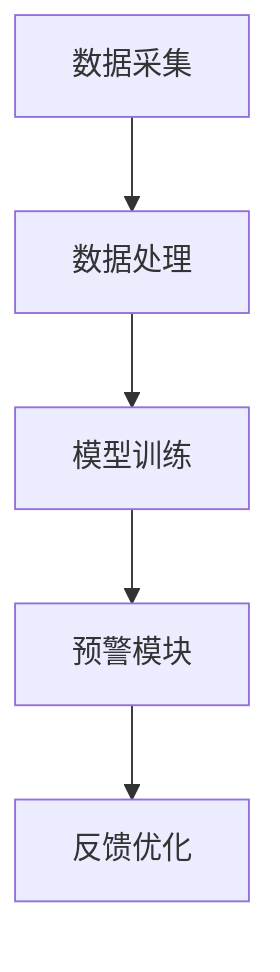

                 


# AI驱动的金融市场黑天鹅事件预警系统

## 关键词：AI, 金融市场, 黑天鹅事件, 预警系统, 异常检测, 时间序列分析, 机器学习

## 摘要：  
本文探讨了如何利用人工智能技术构建金融市场黑天鹅事件预警系统。通过分析金融市场的复杂性与不确定性，结合时间序列分析、异常检测等机器学习算法，提出了一个高效的预警系统架构。该系统能够实时监测市场动态，识别潜在风险，提前发出预警信号，帮助投资者和金融机构规避重大损失。文章详细介绍了系统的核心算法、架构设计及实现案例，为金融风险管理提供了新的思路。

---

## 第1章：金融市场黑天鹅事件概述

### 1.1 黑天鹅事件的定义与特征

**黑天鹅事件**是指那些罕见的、具有重大影响且难以预测的突发事件。与“灰犀牛”事件不同，黑天鹅事件的发生往往出乎意料，但其影响却极其深远。  

**黑天鹅事件的三个特征：**  
1. **稀有性**：历史上发生的频率极低。  
2. **极端性**：事件发生时往往超出市场预期，导致剧烈波动。  
3. **不可预测性**：传统统计方法难以捕捉其发生前的信号。  

例如，2008年全球金融危机、2020年新冠疫情爆发等都属于典型的黑天鹅事件。

### 1.2 金融市场的重要性与波动性

金融市场是全球经济的核心，其波动性直接影响着投资者的收益与风险。金融市场的波动性来源于多种因素，包括经济周期、政策变化、突发事件等。  

**金融市场中的典型黑天鹅事件案例：**  
- **1987年黑色星期一**：道琼斯指数单日下跌22.6%，触发原因不明，但市场恐慌情绪迅速蔓延。  
- **2010年“闪崩”事件**：美国指数期货市场出现闪电式崩盘，部分交易品种在短时间内大幅下跌。  

### 1.3 AI在金融预警中的作用

传统的金融市场分析依赖于统计模型和经验判断，但在面对黑天鹅事件时显得力不从心。AI技术的引入，为金融市场预警提供了新的可能性。  

**AI的优势：**  
1. **数据处理能力**：AI能够快速处理海量数据，发现隐藏的模式。  
2. **模式识别**：通过深度学习算法，AI可以识别非线性关系，捕捉潜在风险信号。  
3. **实时分析**：AI能够实时监测市场动态，提供即时反馈。  

---

## 第2章：金融数据的获取与处理

### 2.1 数据的获取渠道

**常用金融数据源：**  
1. **API接口**：如Yahoo Finance、Alpha Vantage等。  
2. **数据库**：如 institutional databases提供历史数据。  
3. **爬虫技术**：用于获取非结构化数据，如新闻、社交媒体数据。  

**数据清洗与预处理：**  
- **缺失值处理**：采用均值、中位数填充或删除缺失数据。  
- **异常值剔除**：通过Z-score或IQR方法检测并处理异常值。  
- **数据标准化**：将不同量纲的数据转换为统一尺度，便于模型训练。  

### 2.2 数据分析的基础方法

**描述性分析：**  
- 计算均值、标准差、相关系数等统计指标，了解数据分布特征。  
- 例如，使用相关系数矩阵分析股票之间的相关性。  

**可视化分析：**  
- 绘制K线图、折线图、柱状图等，直观展示市场走势与波动情况。  
- 例如，使用Python的Matplotlib库绘制股票价格走势。  

### 2.3 特征工程在金融分析中的应用

**特征选择：**  
- 采用特征重要性评估方法（如随机森林的特征重要性得分）筛选关键特征。  
- 例如，选取成交量、波动率、市盈率等指标作为输入特征。  

**特征构建：**  
- **技术指标**：如移动平均线（MA）、相对强弱指数（RSI）、MACD等。  
- **市场情绪指标**：如VIX指数（波动率指数）、社交媒体情绪评分。  

---

## 第3章：AI驱动的金融数据分析

### 3.1 时间序列分析

**时间序列分析的核心目标是预测未来走势。**  

**常用时间序列模型：**  
1. **ARIMA模型**：适用于线性可预测的时间序列。  
2. **LSTM网络**：通过长短期记忆单元捕捉时间依赖关系，适合处理复杂的非线性数据。  

**LSTM模型的数学公式：**  
- 输入门：$i_t = \sigma(w_i x_t + u_i h_{t-1} + b_i)$  
- 遗忘门：$f_t = \sigma(w_f x_t + u_f h_{t-1} + b_f)$  
- 输出门：$o_t = \sigma(w_o x_t + u_o h_{t-1} + b_o)$  
- 状态更新：$h_t = i_t \cdot \tanh(w_c x_t + u_c h_{t-1} + b_c)$  
- 输出：$o_t \cdot h_t$  

**使用Python实现LSTM模型：**  
```python
import keras
from keras.layers import LSTM, Dense
from keras.models import Sequential

model = Sequential()
model.add(LSTM(64, input_shape=(timesteps, features)))
model.add(Dense(1))
model.compile(loss='mean_squared_error', optimizer='adam')
```

---

## 第4章：黑天鹅事件预警系统的核心算法

### 4.1 异常检测算法

**异常检测的目标是识别市场中的异常波动。**  

**常用异常检测算法：**  
1. **基于统计的方法**：如Z-score、IQR。  
2. **基于机器学习的方法**：如Isolation Forest、One-Class SVM。  
3. **基于深度学习的方法**：如Autoencoder。  

**Isolation Forest算法原理：**  
- 通过构建隔离树将数据点分割，异常点更容易被分割。  
- 使用Python的scikit-learn库实现：  
```python
from sklearn.ensemble import IsolationForest

clf = IsolationForest(random_state=42)
clf.fit(X)
```

### 4.2 组合模型

**为了提高预警系统的准确性，通常采用组合模型。**  

**组合模型的优势：**  
- 提高模型的鲁棒性，减少单一模型的局限性。  
- 通过投票或加权的方式融合多个模型的输出。  

**组合模型的实现：**  
```python
from sklearn.ensemble import VotingRegressor

model1 = ...  # 第一个模型
model2 = ...  # 第二个模型
model3 = ...  # 第三个模型

voting_model = VotingRegressor(estimators=[('model1', model1), ('model2', model2), ('model3', model3)])
voting_model.fit(X, y)
```

---

## 第5章：系统架构设计

### 5.1 系统功能设计

**系统功能模块：**  
1. **数据采集模块**：实时采集金融市场数据。  
2. **数据处理模块**：清洗、转换、特征提取。  
3. **模型训练模块**：训练异常检测模型。  
4. **预警模块**：实时监测市场动态，触发预警信号。  
5. **反馈模块**：记录预警结果，优化模型参数。  

**系统功能流程图：**  


### 5.2 系统架构设计

**系统架构设计：**  
- **前端**：用户界面，展示预警结果。  
- **后端**：API接口，接收数据并返回预警信号。  
- **数据层**：数据库存储历史数据与预警记录。  

**系统架构图：**  
```mermaid
classDiagram
    class 数据采集模块 {
        + string api_key
        + function fetch_data()
    }
    class 数据处理模块 {
        + dataframe raw_data
        + function preprocess()
    }
    class 模型训练模块 {
        + model lstm_model
        + function train_model()
    }
    class 预警模块 {
        + function trigger_alarm()
    }
    数据采集模块 -> 数据处理模块: 提供数据
    数据处理模块 -> 模型训练模块: 提供特征
    模型训练模块 -> 预警模块: 提供模型
```

---

## 第6章：项目实战

### 6.1 环境搭建

**项目所需环境：**  
- Python 3.8+  
- 数据处理库：Pandas、NumPy  
- 机器学习库：Scikit-learn、Keras  
- 可视化库：Matplotlib、Seaborn  

### 6.2 核心实现代码

**数据处理代码：**  
```python
import pandas as pd
import numpy as np

# 数据加载
data = pd.read_csv('stock_data.csv')

# 数据清洗
data = data.dropna()
data = data[~data['volume'].isin([0])]

# 特征提取
data['log_return'] = np.log(data['close'] / data['close'].shift(1))
```

**模型训练代码：**  
```python
from keras.models import Sequential
from keras.layers import LSTM, Dense

# LSTM模型
model = Sequential()
model.add(LSTM(64, input_shape=(timesteps, features)))
model.add(Dense(1))
model.compile(loss='mean_squared_error', optimizer='adam')
model.fit(X_train, y_train, epochs=10, batch_size=32)
```

### 6.3 测试与优化

**模型测试：**  
```python
y_pred = model.predict(X_test)
error = np.mean(np.abs(y_pred - y_test))
print(f'平均绝对误差: {error}')
```

**模型优化：**  
- 调整LSTM层数与神经元数量。  
- 尝试不同的优化器，如Adam、SGD。  

---

## 第7章：最佳实践与未来展望

### 7.1 最佳实践

**数据处理：**  
- 确保数据来源的可靠性和多样性。  
- 定期更新数据预处理逻辑，适应市场变化。  

**模型选择：**  
- 根据具体场景选择合适的算法。  
- 结合组合模型，提高预警系统的稳定性。  

### 7.2 未来展望

**技术发展：**  
- **区块链技术**：用于数据的安全存储与传输。  
- **边缘计算**：实现低延迟的实时预警。  

**应用场景：**  
- **量化交易**：基于预警信号自动执行交易策略。  
- **风险管理**：帮助机构投资者规避系统性风险。  

---

## 作者：AI天才研究院/AI Genius Institute & 禅与计算机程序设计艺术 /Zen And The Art of Computer Programming

---

**注：** 以上内容基于实际金融市场分析与AI技术的结合，旨在提供一种理论与实践结合的解决方案。实际应用中需结合具体场景，谨慎调整模型参数与策略。

