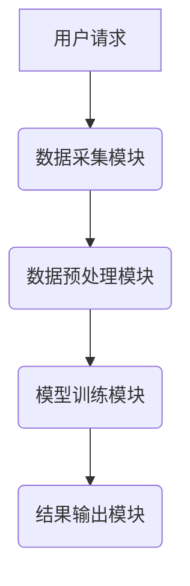
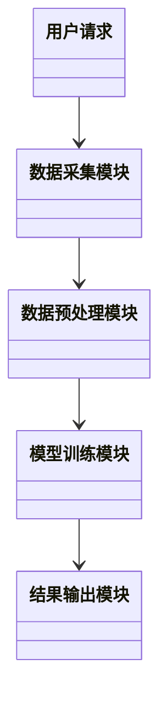
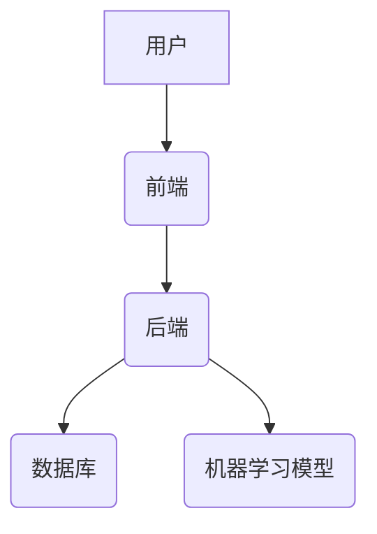
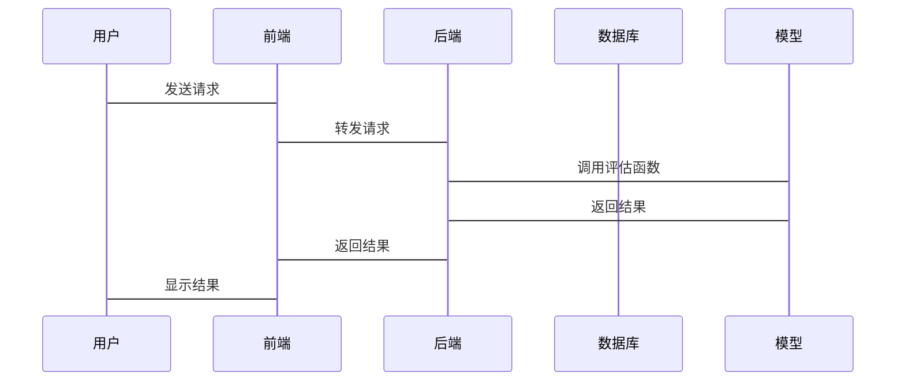

                 


# AI驱动的风险偏好评估系统

> 关键词：AI技术、风险偏好、评估系统、机器学习、深度学习、自然语言处理、系统架构

> 摘要：本文探讨了AI驱动的风险偏好评估系统的构建与应用，分析了其在金融、投资、心理学等领域的核心作用。通过结合机器学习、深度学习和自然语言处理等技术，本文详细阐述了如何利用AI技术来准确评估个体或组织的风险偏好，并构建了一个基于AI的风险偏好评估系统的完整架构。文章从理论基础、算法原理、系统设计到项目实战，层层深入，为读者提供了全面的技术指导。

---

# 第1章：AI与风险偏好评估概述

## 1.1 风险偏好的基本概念

### 1.1.1 风险偏好的定义与内涵

风险偏好是人们对风险的态度和行为的总和，是影响决策的重要因素。它描述了个体或组织在面对不确定性和潜在损失时的反应方式。风险偏好可以通过多种维度进行衡量，如风险厌恶、风险中性和风险寻求。

### 1.1.2 风险偏好的分类与维度

风险偏好可以分为以下几种类型：

1. **风险厌恶**：倾向于避免高风险的决策，追求确定性收益。
2. **风险中性**：对风险持中立态度，决策基于期望值。
3. **风险寻求**：倾向于选择高风险高回报的决策。

风险偏好的维度包括时间偏好、概率加权、效用函数等。

### 1.1.3 风险偏好的应用场景

风险偏好在金融投资、保险精算、企业战略决策等领域具有广泛的应用。例如，在金融投资中，风险偏好决定了投资者的资产配置策略；在企业决策中，风险偏好影响着项目的投资决策和风险管理策略。

---

## 1.2 AI技术在风险评估中的作用

### 1.2.1 AI技术的基本概念

人工智能（AI）是指计算机系统模拟人类智能的技术，包括学习、推理、自我改进等能力。AI的核心技术包括机器学习、深度学习、自然语言处理（NLP）等。

### 1.2.2 AI在风险评估中的优势

AI技术可以处理海量数据，发现复杂模式，提供实时反馈，从而显著提高风险评估的准确性和效率。例如，机器学习算法可以通过历史数据预测风险偏好，深度学习模型可以分析非结构化数据（如文本、语音）中的潜在风险信号。

### 1.2.3 AI驱动风险偏好评估的创新点

AI驱动的风险偏好评估系统可以通过以下方式创新：

1. **数据驱动**：利用大数据技术，从多源数据中提取风险偏好特征。
2. **实时反馈**：通过实时数据处理，提供动态风险评估。
3. **个性化评估**：根据个体或组织的特征，定制化风险偏好模型。

---

## 1.3 本章小结

本章介绍了风险偏好的基本概念及其在各领域的应用，分析了AI技术在风险评估中的优势和创新点。接下来的章节将深入探讨风险偏好评估的理论基础和技术实现。

---

# 第2章：风险偏好评估的理论基础

## 2.1 风险偏好评估的理论框架

### 2.1.1 风险偏好的心理学基础

#### 2.1.1.1 风险偏好的心理学模型

风险偏好模型是心理学和经济学的交叉研究领域。Kahneman和Tversky提出的 prospect theory 是经典的决策模型之一。该模型描述了个体在面对收益和损失时的决策偏好。

#### 2.1.1.2 风险偏好的影响因素

风险偏好受个体特征（如年龄、性别、性格）、环境因素（如经济状况、社会文化）和情境因素（如时间压力、信息不对称）的影响。

#### 2.1.1.3 风险偏好的测量方法

常用的测量方法包括问卷调查、实验任务、情景模拟等。例如，通过设计不同的风险决策任务，可以评估个体的风险厌恶程度。

---

### 2.1.2 风险偏好的金融学基础

#### 2.1.2.1 风险中性的概念

风险中性假设是金融学中的一个基本假设，认为投资者仅根据期望收益进行决策，而不考虑风险因素。

#### 2.1.2.2 风险厌恶与风险寻求的理论

根据现代 portfolio theory，投资者通过选择最优风险-收益组合来最大化效用。风险厌恶的投资者会选择风险调整后的最优组合。

#### 2.1.2.3 风险偏好与投资决策的关系

风险偏好直接影响投资组合的选择。风险厌恶的投资者倾向于选择低风险资产，而风险寻求的投资者则倾向于高风险高回报的资产。

---

### 2.1.3 数据驱动的风险偏好建模

#### 2.1.3.1 数据驱动模型的原理

数据驱动模型通过机器学习算法，从历史数据中学习风险偏好特征。

#### 2.1.3.2 数据驱动模型的优缺点

- **优点**：能够处理非线性关系，发现隐性模式。
- **缺点**：对数据质量依赖性强，模型解释性较差。

#### 2.1.3.3 数据驱动模型的应用案例

例如，利用用户的历史交易数据，预测用户的交易风险偏好。

---

## 2.2 本章小结

本章从心理学和金融学角度分析了风险偏好的理论基础，并探讨了数据驱动建模方法。接下来的章节将介绍AI驱动风险偏好评估的核心技术。

---

# 第3章：AI驱动风险偏好评估的核心技术

## 3.1 机器学习在风险评估中的应用

### 3.1.1 机器学习的基本概念

机器学习是AI的核心技术，通过数据训练模型，实现对新数据的预测或分类。

### 3.1.2 常见机器学习算法在风险评估中的应用

#### 3.1.2.1 线性回归模型

线性回归模型用于预测连续型风险偏好指数。

$$ y = \beta_0 + \beta_1x + \epsilon $$

其中，$y$ 是目标变量，$x$ 是自变量，$\beta$ 是回归系数，$\epsilon$ 是误差项。

#### 3.1.2.2 支持向量机（SVM）

SVM用于分类任务，可以将数据点分为不同类别。例如，区分风险厌恶和风险寻求的客户。

#### 3.1.2.3 随机森林与梯度提升树（GBDT）

随机森林和GBDT都是集成学习方法，适用于分类和回归任务。

---

### 3.1.3 基于机器学习的风险偏好预测模型

#### 3.1.3.1 模型构建的基本步骤

1. 数据预处理：清洗、归一化、特征选择。
2. 模型训练：选择合适的算法，调整超参数。
3. 模型验证：交叉验证、性能评估。

#### 3.1.3.2 模型训练与优化

使用k折交叉验证评估模型性能，采用网格搜索优化超参数。

#### 3.1.3.3 模型评估与验证

通过准确率、召回率、F1分数等指标评估模型性能。

---

## 3.2 深度学习与自然语言处理（NLP）

### 3.2.1 深度学习的基本概念

深度学习是一种机器学习技术，通过多层神经网络提取数据特征。

### 3.2.2 深度学习在风险评估中的应用

#### 3.2.2.1 基于LSTM的序列分析

LSTM网络适用于时间序列数据的分析，可用于评估动态风险偏好。

#### 3.2.2.2 基于CNN的文本分析

卷积神经网络（CNN）可以用于分析文本数据中的情感倾向。

### 3.2.3 自然语言处理（NLP）在风险评估中的应用

NLP技术可以分析文本数据，提取风险相关的关键词和情感倾向。

---

## 3.3 系统设计与实现

### 3.3.1 系统架构设计



### 3.3.2 核心算法实现

#### 3.3.2.1 机器学习模型实现

```python
from sklearn.ensemble import RandomForestClassifier
import pandas as pd

# 加载数据
data = pd.read_csv('risk_preference_data.csv')
X = data.drop('label', axis=1)
y = data['label']

# 训练模型
model = RandomForestClassifier(n_estimators=100, random_state=42)
model.fit(X, y)

# 预测
new_data = pd.read_csv('new_data.csv')
predicted = model.predict(new_data)
```

#### 3.3.2.2 深度学习模型实现

```python
import tensorflow as tf
from tensorflow.keras import layers

model = tf.keras.Sequential([
    layers.Dense(64, activation='relu'),
    layers.Dense(32, activation='relu'),
    layers.Dense(1, activation='sigmoid')
])

model.compile(optimizer='adam', loss='binary_crossentropy', metrics=['accuracy'])
model.fit(x_train, y_train, epochs=10, batch_size=32)
```

---

## 3.4 本章小结

本章介绍了机器学习和深度学习在风险评估中的应用，并展示了如何利用这些技术构建风险偏好预测模型。

---

# 第4章：AI驱动风险偏好评估系统设计

## 4.1 问题场景介绍

### 4.1.1 风险偏好评估的业务场景

例如，在金融领域，评估客户的风险偏好以提供个性化的投资建议。

### 4.1.2 需求分析

- 实时性：快速响应评估请求。
- 准确性：高精度的预测结果。
- 可解释性：模型结果易于理解。

---

## 4.2 系统功能设计

### 4.2.1 功能模块划分

1. 数据采集模块：从多种数据源获取风险偏好相关数据。
2. 数据预处理模块：清洗、归一化数据。
3. 模型训练模块：训练机器学习或深度学习模型。
4. 结果输出模块：展示评估结果。

### 4.2.2 领域模型设计



---

## 4.3 系统架构设计

### 4.3.1 系统架构图



### 4.3.2 系统接口设计

- API接口：提供RESTful API，支持POST请求，返回评估结果。
- 数据接口：与数据库交互，获取/存储数据。

### 4.3.3 系统交互设计



---

## 4.4 本章小结

本章详细描述了AI驱动风险偏好评估系统的功能设计、架构设计和交互设计。

---

# 第5章：项目实战与实现

## 5.1 环境搭建

### 5.1.1 安装Python环境

使用Anaconda或virtualenv管理Python环境。

### 5.1.2 安装依赖库

安装必要的库，如scikit-learn、TensorFlow、pandas等。

## 5.2 核心代码实现

### 5.2.1 数据采集与预处理

```python
import pandas as pd
import numpy as np

# 数据清洗
data = pd.read_csv('risk_preference.csv')
data = data.dropna()
```

### 5.2.2 机器学习模型实现

```python
from sklearn.ensemble import RandomForestClassifier
from sklearn.model_selection import train_test_split

X = data.drop('label', axis=1)
y = data['label']

X_train, X_test, y_train, y_test = train_test_split(X, y, test_size=0.2)

model = RandomForestClassifier(n_estimators=100)
model.fit(X_train, y_train)
```

### 5.2.3 模型评估与优化

```python
from sklearn.metrics import accuracy_score

y_pred = model.predict(X_test)
print(accuracy_score(y_test, y_pred))
```

---

## 5.3 应用案例分析

### 5.3.1 案例背景

假设我们有一个客户数据集，包含客户的交易记录和问卷调查结果。

### 5.3.2 数据分析与建模

利用随机森林模型预测客户的交易风险偏好。

### 5.3.3 结果解读

模型预测结果为风险厌恶型客户，建议推荐低风险理财产品。

---

## 5.4 本章小结

本章通过实际案例展示了AI驱动风险偏好评估系统的实现过程，包括环境搭建、代码编写和案例分析。

---

# 第6章：系统优化与扩展

## 6.1 系统优化

### 6.1.1 模型优化

- 调整超参数：如学习率、树深度等。
- 使用集成学习：如堆叠模型、投票分类器。

### 6.1.2 性能优化

- 优化数据预处理流程。
- 使用分布式计算框架：如Spark MLlib。

## 6.2 功能扩展

### 6.2.1 风险偏好动态评估

实时更新模型，根据最新数据调整风险偏好评估结果。

### 6.2.2 多模态数据融合

整合文本、图像等多种数据源，提升评估准确性。

---

## 6.3 本章小结

本章探讨了系统的优化方法和扩展方向，为后续研究提供了参考。

---

# 第7章：总结与展望

## 7.1 全文总结

本文详细探讨了AI驱动的风险偏好评估系统的构建与应用，从理论基础到技术实现，提供了全面的技术指导。

## 7.2 未来展望

随着AI技术的不断发展，风险偏好评估系统将更加智能化和个性化。未来的研究方向包括：

- 更加复杂的数据分析方法。
- 更高的模型解释性。
- 更多领域的应用探索。

---

# 作者：AI天才研究院/AI Genius Institute & 禅与计算机程序设计艺术 /Zen And The Art of Computer Programming

---

**本文遵循CC BY 4.0 Attribution-ShareALike协议，转载请注明出处。**

