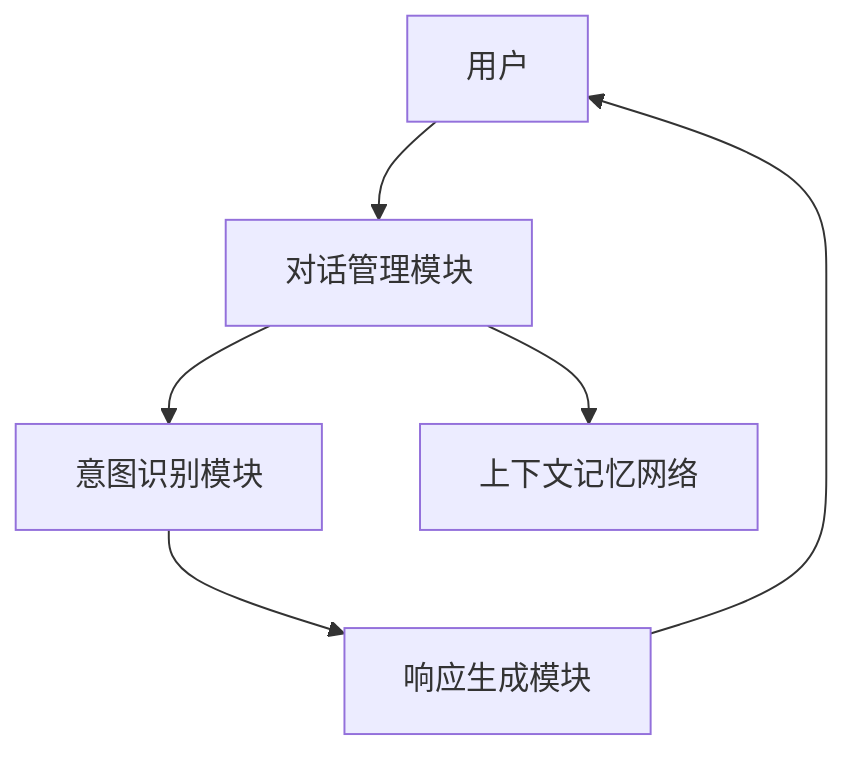

                 


# LLM在AI Agent上下文理解中的应用

> **关键词**：LLM, AI Agent, 上下文理解, 自然语言处理, 大语言模型

> **摘要**：本文详细探讨了大语言模型（LLM）在AI Agent上下文理解中的应用。首先，我们介绍了LLM和AI Agent的基本概念及其在上下文理解中的重要性。接着，我们分析了上下文理解的核心概念与LLM的关系，详细讲解了LLM的上下文理解机制。随后，我们深入探讨了LLM在上下文理解中的算法原理，并通过实际项目展示了如何在系统中实现这一功能。最后，我们总结了最佳实践和未来的研究方向。

---

## 第一部分: LLM与AI Agent概述

### 第1章: LLM的基本概念

#### 1.1 大语言模型的定义
大语言模型（LLM）是指通过大规模数据预训练的深度学习模型，能够理解和生成人类语言。例如，GPT系列模型通过预训练海量文本数据，可以进行文本生成、问答、翻译等多种任务。

#### 1.2 LLM的核心特点
- **大规模训练**：基于海量数据，提升模型的泛化能力。
- **上下文理解**：通过注意力机制，模型能够理解上下文关系。
- **生成能力**：能够生成连贯且有意义的文本。

#### 1.3 LLM与传统NLP模型的区别
| 特性        | LLM                              | 传统NLP模型                     |
|-------------|-----------------------------------|---------------------------------|
| 数据量       | 大规模数据预训练                 | 小规模数据微调                 |
| 任务多样性   | 支持多种任务，如生成、问答等     | 专注于特定任务                   |
| 上下文理解   | 强大的上下文理解能力             | 较弱的上下文理解能力             |

### 第2章: AI Agent的基本概念

#### 2.1 AI Agent的定义
AI Agent是一种智能体，能够感知环境、自主决策并执行任务。例如，智能音箱、聊天机器人等都是AI Agent的典型应用。

#### 2.2 AI Agent的类型
- **简单反射型**：基于规则的简单响应。
- **基于模型的反应型**：使用内部模型进行决策。
- **基于目标的**：具有明确的目标，主动采取行动。
- **基于效用的**：通过优化效用函数进行决策。

#### 2.3 AI Agent的应用场景
- **客服机器人**：处理客户咨询和问题。
- **智能家居**：控制家电，提供生活便利。
- **虚拟助手**：帮助用户完成日程管理、信息查询等任务。

### 第3章: 上下文理解的定义与重要性

#### 3.1 上下文理解的定义
上下文理解是指模型在处理输入时，能够理解当前对话或任务的背景信息，从而生成更准确和相关的响应。

#### 3.2 上下文理解在AI Agent中的作用
- **提升交互体验**：通过理解上下文，AI Agent能够提供更自然和连贯的对话。
- **增强任务处理能力**：上下文理解使AI Agent能够更好地理解任务需求，提高任务执行效率。
- **支持复杂场景**：在复杂场景下，上下文理解能够帮助AI Agent处理多轮对话和动态变化的环境。

#### 3.3 上下文理解的挑战
- **数据稀疏性**：某些情况下，训练数据不足，导致模型无法准确理解上下文。
- **语义歧义性**：同一句话可能有多种含义，模型需要准确判断上下文中的正确含义。
- **动态性**：上下文信息可能随时间变化，模型需要动态更新理解。

---

## 第二部分: LLM在AI Agent上下文理解中的应用背景

### 第4章: 当前AI Agent的发展现状

#### 4.1 AI Agent在各领域的应用现状
- **电子商务**：推荐系统、客户支持。
- **医疗健康**：辅助诊断、健康咨询。
- **金融服务**：智能投顾、风险评估。

#### 4.2 LLM对AI Agent的推动作用
- **提升自然语言处理能力**：LLM的强大语言模型能力使得AI Agent能够更自然地与用户交互。
- **增强上下文理解**：LLM通过预训练掌握了大量知识，能够更好地理解上下文信息。
- **降低开发成本**：LLM的通用性减少了AI Agent的定制化开发需求。

### 第5章: 上下文理解在AI Agent中的问题背景

#### 5.1 数据稀疏性问题
- **问题描述**：在某些领域或特定场景中，训练数据不足，导致模型无法准确理解上下文。
- **解决方案**：通过数据增强或迁移学习来缓解数据稀疏性问题。

#### 5.2 语义歧义性问题
- **问题描述**：同一句话在不同上下文中可能有不同的含义，模型需要准确判断当前的语义。
- **解决方案**：结合上下文信息和外部知识库来减少歧义性。

#### 5.3 动态上下文变化问题
- **问题描述**：上下文信息随时间变化，模型需要动态更新理解。
- **解决方案**：引入实时反馈机制和动态更新的上下文记忆网络。

---

## 第三部分: LLM与上下文理解的核心概念

### 第6章: LLM的上下文理解机制

#### 6.1 注意力机制在上下文理解中的作用
- **注意力机制**：通过权重分配，模型能够关注对话中的重要部分，理解上下文关系。
- **实现方式**：使用自注意力机制，计算序列中每个位置的注意力权重。

#### 6.2 基于上下文的推理过程
- **推理过程**：模型根据上下文信息进行推理，生成合理的响应。
- **推理示例**：在对话中，根据用户的历史信息，推理出用户的意图。

#### 6.3 上下文记忆网络的构建
- **记忆网络**：通过外部存储器，记录对话历史或其他上下文信息。
- **记忆更新**：根据新的输入，更新记忆内容，保持上下文的一致性。

### 第7章: 上下文理解的关键属性

#### 7.1 上下文的相关性
- **相关性定义**：上下文信息与当前任务的相关程度。
- **影响因素**：任务目标、对话历史、用户意图等。

#### 7.2 上下文的连贯性
- **连贯性定义**：上下文信息之间的逻辑连贯性。
- **提升方法**：通过模型训练和规则约束，确保对话的连贯性。

#### 7.3 上下文的动态性
- **动态性定义**：上下文信息随时间或事件变化的特性。
- **动态更新机制**：通过实时反馈和动态模型调整，保持上下文的准确性。

---

## 第四部分: LLM在上下文理解中的算法原理

### 第8章: LLM的上下文理解算法

#### 8.1 基于自注意力机制的上下文理解
- **算法流程**：
  1. 输入序列经过嵌入层，转换为向量表示。
  2. 计算自注意力权重，确定每个位置的重要性。
  3. 根据注意力权重生成最终的上下文表示。

#### 8.2 基于上下文记忆网络的算法
- **算法流程**：
  1. 接收输入序列，生成初步的上下文表示。
  2. 通过记忆网络，记录和更新上下文信息。
  3. 根据记忆内容，生成最终的响应。

#### 8.3 算法的数学模型
- **自注意力机制公式**：
  $$ \text{Attention}(Q, K, V) = \text{softmax}\left(\frac{QK^T}{\sqrt{d_k}}\right)V $$
  其中，$Q$、$K$、$V$分别是查询、键、值向量，$d_k$是键的维度。

---

## 第五部分: 系统分析与架构设计

### 第9章: 系统分析

#### 9.1 问题场景介绍
- **场景描述**：用户与AI Agent进行多轮对话，需要理解对话中的上下文信息。

#### 9.2 系统功能设计
- **功能模块**：对话管理、上下文记忆、意图识别。
- **功能流程**：用户输入 -> 分析上下文 -> 理解意图 -> 生成响应。

### 第10章: 系统架构设计

#### 10.1 系统架构图


#### 10.2 接口与交互设计
- **输入接口**：接收用户的自然语言输入。
- **输出接口**：生成自然语言响应或触发特定操作。
- **交互流程**：
  1. 用户输入问题，系统接收并解析。
  2. 对话管理模块协调各功能模块，理解上下文和意图。
  3. 生成响应并返回给用户。

---

## 第六部分: 项目实战

### 第11章: 项目实战

#### 11.1 环境安装
```bash
pip install transformers torch
```

#### 11.2 核心代码实现
```python
from transformers import AutoTokenizer, AutoModelForCausalLM

tokenizer = AutoTokenizer.from_pretrained("gpt2")
model = AutoModelForCausalLM.from_pretrained("gpt2")

def generate_response(input_text):
    inputs = tokenizer(input_text, return_tensors="pt")
    outputs = model.generate(**inputs, max_length=50)
    return tokenizer.decode(outputs[0], skip_special_tokens=True)
```

#### 11.3 实际案例分析
- **案例背景**：用户与AI Agent讨论旅行计划。
- **对话流程**：
  1. 用户：“我计划去巴黎旅游，你有什么建议吗？”
  2. 系统：“巴黎有很多景点，您最感兴趣的是艺术、历史还是美食？”
  3. 用户：“艺术和历史。”
  4. 系统：“推荐参观卢浮宫和埃菲尔铁塔。”

---

## 第七部分: 最佳实践与总结

### 第12章: 最佳实践

#### 12.1 小结
- LLM在AI Agent上下文理解中的应用显著提升了交互体验和任务处理能力。
- 通过注意力机制和上下文记忆网络，模型能够更好地理解和处理上下文信息。

#### 12.2 注意事项
- **数据隐私**：处理用户数据时，需注意隐私保护。
- **模型优化**：在实际应用中，需对模型进行微调和优化，以适应特定场景需求。
- **用户体验**：确保对话的连贯性和自然性，提升用户满意度。

#### 12.3 拓展阅读
- 推荐阅读《深度学习入门：基于Python的理论与实践》和《自然语言处理入门：基于Python和TensorFlow》。

---

## 作者信息

**作者：AI天才研究院/AI Genius Institute & 禅与计算机程序设计艺术 /Zen And The Art of Computer Programming**

---

以上是《LLM在AI Agent上下文理解中的应用》的技术博客文章的完整内容。

