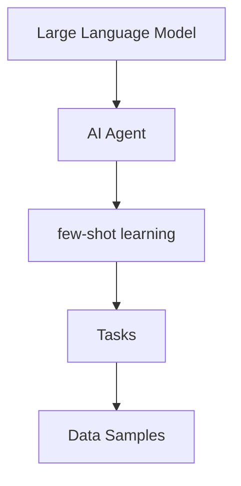
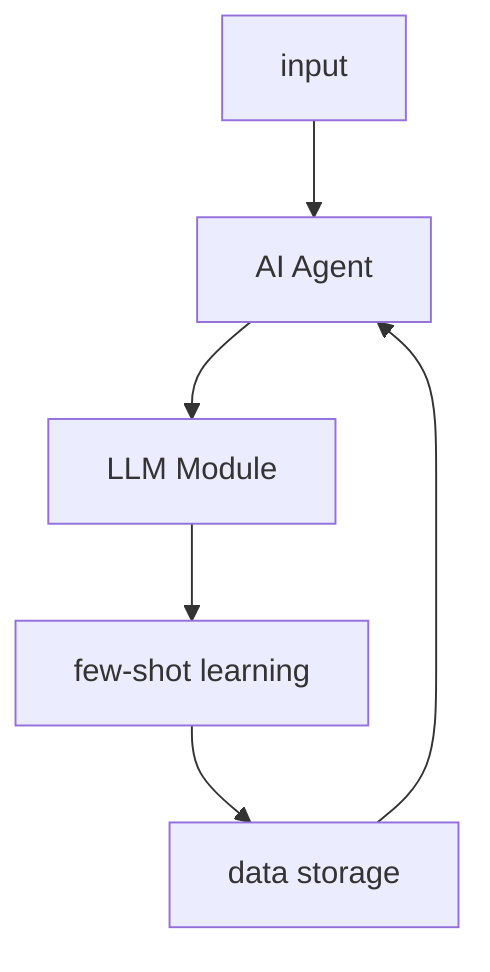
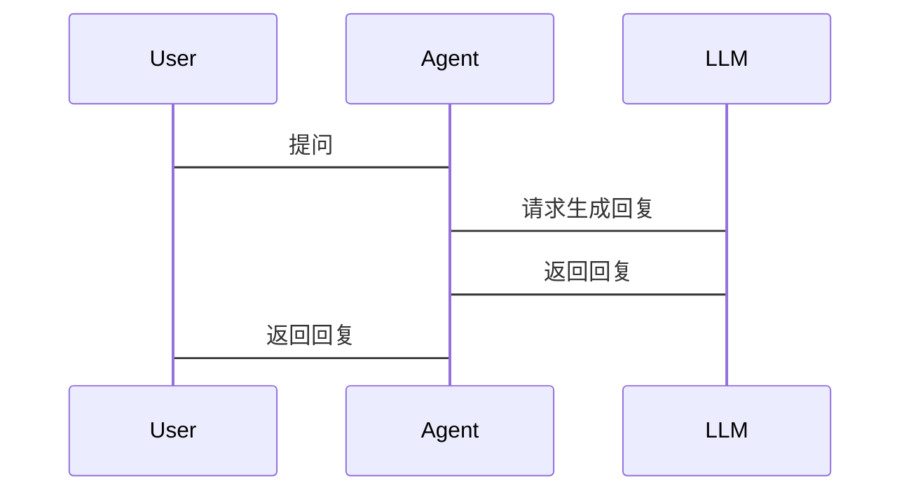

                 


# LLM在AI Agent中的few-shot learning优化策略

---

## 关键词：LLM，AI Agent，few-shot learning，优化策略，算法原理，系统设计，项目实战

---

## 摘要：本文深入探讨了大型语言模型（LLM）在AI Agent中的few-shot学习优化策略。通过分析核心概念、算法原理、系统设计和项目实战，本文为读者提供了从理论到实践的全面指导。我们通过对比分析、流程图和代码示例，详细讲解了如何优化LLM在AI Agent中的few-shot学习性能，帮助读者在实际应用中实现高效、准确的智能代理系统。

---

## 第1章：背景介绍

### 1.1 LLM的定义与特点

大型语言模型（LLM）是一种基于深度学习的自然语言处理模型，具有以下特点：
- **大规模训练数据**：通常使用海量文本数据进行预训练，如GPT系列模型。
- **上下文理解能力**：能够处理长上下文，理解复杂的语义关系。
- **生成能力强**：能够生成高质量的文本，支持多种任务，如问答、翻译、对话等。

### 1.2 AI Agent的定义与特点

AI Agent（智能代理）是一种能够感知环境并采取行动以实现目标的智能系统，具有以下特点：
- **自主性**：能够在没有外部干预的情况下运行。
- **反应性**：能够实时感知环境并做出响应。
- **目标导向**：通过设定目标来指导行为。

### 1.3 few-shot learning的定义与特点

few-shot learning是一种机器学习技术，能够在少量训练数据的情况下完成学习任务，具有以下特点：
- **数据效率高**：仅需少量样本即可完成任务。
- **适用性广**：适用于数据 scarce 的场景。
- **依赖于模型泛化能力**：对模型的泛化能力要求较高。

---

## 第2章：核心概念与联系

### 2.1 LLM与AI Agent的关系

- **LLM作为AI Agent的核心模块**：LLM能够为AI Agent提供强大的自然语言处理能力，支持对话生成、意图识别等功能。
- **LLM在AI Agent中的功能实现**：通过LLM，AI Agent能够理解和生成自然语言，与用户进行交互。

### 2.2 few-shot learning在AI Agent中的应用

- **应用场景**：在用户行为分析、意图识别、对话生成等任务中，few-shot learning能够快速适应新数据。
- **优势**：通过few-shot学习，AI Agent能够在少量用户数据的情况下快速适应新任务。

### 2.3 LLM与few-shot learning的结合

- **结合方式**：通过在LLM的基础上引入few-shot学习技术，能够进一步提升AI Agent的泛化能力和适应性。
- **对比分析**：通过对比分析表格，展示LLM与传统语言模型、AI Agent与传统AI、few-shot学习与传统学习方法的区别与联系。

| 对比维度 | LLM | 传统语言模型 | AI Agent | 传统AI |
|----------|-----|--------------|----------|--------|
| 核心能力 | 自然语言生成与理解 | 仅支持特定任务 | 自主决策与交互 | 仅支持特定任务 |
| 数据需求 | 需要大量数据 | 需要大量数据 | 少量数据即可 | 需要大量数据 |
| 适应性 | 高 | 低 | 高 | 低 |

### 2.4 ER实体关系图架构



---

## 第3章：算法原理讲解

### 3.1 Meta-Learning算法原理

- **Meta-Learning的核心思想**：通过在多个任务上进行联合优化，使模型能够在少量样本下快速适应新任务。
- **算法步骤**：
  1. 在多个源任务上训练模型，提取任务间共同特征。
  2. 对目标任务进行微调，快速适应新数据。

### 3.2 Prompt-Based方法

- **Prompt-Based方法的核心思想**：通过设计合适的提示（prompt），将few-shot学习任务转化为语言模型能够理解的格式。
- **实现步骤**：
  1. 设计提示模板，包含任务描述和少量样本。
  2. 使用提示模板生成输入，引导模型完成任务。

### 3.3 算法实现代码示例

```python
import torch
import torch.nn as nn
from transformers import AutoTokenizer, AutoModel

# 加载预训练模型
model = AutoModel.from_pretrained('gpt2')
tokenizer = AutoTokenizer.from_pretrained('gpt2')

# 定义Meta-Learning优化器
class MetaOptimizer:
    def __init__(self, model, learning_rate=1e-5):
        self.model = model
        self.learning_rate = learning_rate
        
    def optimize(self, batch):
        optimizer = torch.optim.Adam(self.model.parameters(), lr=self.learning_rate)
        optimizer.zero_grad()
        # 前向传播
        outputs = self.model(batch['input_ids'])
        # 计算损失
        loss = outputs.loss
        # 反向传播
        loss.backward()
        optimizer.step()
        return loss.item()

# 使用Prompt-Based方法生成输入
def generate_prompt(task_description, samples):
    prompt = f"Given task: {task_description}\nSamples: {samples}\nPlease generate the output."
    return prompt

# 示例任务
task_description = "classify text into positive or negative"
samples = ["positive", "negative"]
prompt = generate_prompt(task_description, samples)
input_ids = tokenizer(prompt, return_tensors='pt')['input_ids']
```

### 3.4 数学模型与公式

- **Meta-Learning的优化目标**：
  $$ \min_{\theta} \sum_{i=1}^{N} \mathcal{L}_i(\theta) $$
  
  其中，$\mathcal{L}_i$ 是第i个任务的损失函数。

- **Prompt-Based方法的损失函数**：
  $$ \mathcal{L} = \sum_{j=1}^{M} \mathcal{L}_j(x_j, y_j) $$

  其中，$x_j$ 是输入样本，$y_j$ 是对应的标签。

---

## 第4章：系统分析与架构设计方案

### 4.1 问题场景介绍

- **场景描述**：构建一个基于LLM的客服AI Agent，用于处理用户的咨询和问题。
- **目标**：通过few-shot学习优化模型，使其能够快速适应不同用户的问题。

### 4.2 系统功能设计

- **功能模块**：
  - 数据收集与预处理
  - 模型训练与优化
  - 用户交互与反馈

### 4.3 系统架构设计



### 4.4 系统接口设计

- **输入接口**：用户输入的问题或指令。
- **输出接口**：模型生成的回复或操作结果。

### 4.5 系统交互序列图



---

## 第5章：项目实战

### 5.1 环境安装

- **Python版本**：3.8+
- **依赖库**：transformers、torch、mermaid

### 5.2 核心代码实现

```python
from transformers import AutoTokenizer, AutoModelForCausalLM

# 加载模型
model = AutoModelForCausalLM.from_pretrained('gpt2')
tokenizer = AutoTokenizer.from_pretrained('gpt2')

# 定义Prompt-Based方法
def generate_response(prompt, max_length=100):
    inputs = tokenizer.encode(prompt, return_tensors='pt')
    outputs = model.generate(inputs, max_length=max_length, num_return_sequences=1)
    response = tokenizer.decode(outputs[0])
    return response

# 示例使用
prompt = "Please answer the following question: What is few-shot learning?"
response = generate_response(prompt)
print(response)
```

### 5.3 实际案例分析

- **案例描述**：构建一个基于LLM的客服AI Agent，用于回答用户的技术问题。
- **实现步骤**：
  1. 数据收集：收集用户的技术问题和对应答案。
  2. 模型训练：使用Meta-Learning优化模型。
  3. 用户交互：用户提问，AI Agent生成回答。

### 5.4 代码解读与分析

- **代码功能**：上述代码实现了基于LLM的Prompt-Based方法，能够根据输入的提示生成回答。
- **优化建议**：可以进一步优化提示模板，提升回答的准确性和相关性。

---

## 第6章：总结与展望

### 6.1 最佳实践 tips

- **数据质量**：确保训练数据的质量和多样性，有助于提升模型的泛化能力。
- **模型选择**：选择适合任务的LLM模型，如GPT系列模型。
- **持续优化**：通过不断收集用户反馈，优化模型和提示模板。

### 6.2 小结

本文系统地介绍了LLM在AI Agent中的few-shot学习优化策略，从理论到实践，详细讲解了核心概念、算法原理、系统设计和项目实战。通过本文的指导，读者能够掌握如何在实际应用中优化LLM的性能，构建高效的AI Agent系统。

### 6.3 注意事项

- **数据隐私**：在处理用户数据时，需要注意数据隐私和安全。
- **模型调优**：需要根据具体任务需求，进行模型的调优和优化。

### 6.4 拓展阅读

- **推荐书籍**：《Deep Learning》、《Transformers: A Tutorial》
- **推荐论文**：《Meta-Learning for Few-Shot Image Classification》

---

## 作者信息

作者：AI天才研究院（AI Genius Institute） & 禅与计算机程序设计艺术（Zen And The Art of Computer Programming）

---

以上是《LLM在AI Agent中的few-shot learning优化策略》的完整目录和内容框架，涵盖了从理论到实践的各个方面，帮助读者全面理解并掌握相关知识。

