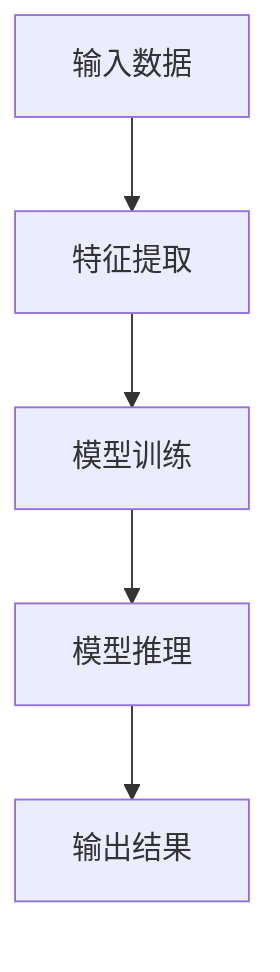
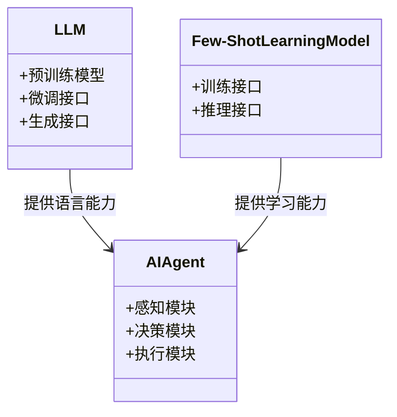
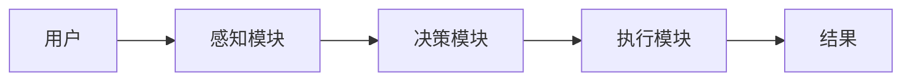

                 

<think>
好的，我需要根据用户的要求，撰写一篇关于《LLM在AI Agent中的few-shot学习应用》的技术博客文章。让我逐步分析和思考如何构建这篇高质量的文章。

首先，我需要明确文章的核心主题。这篇文章旨在探讨大语言模型（LLM）在AI代理（AI Agent）中的小样本学习（few-shot learning）应用。这意味着我需要涵盖LLM和AI Agent的基本概念，以及few-shot学习的原理和应用。

接下来，我需要设计文章的结构。用户已经提供了一个大纲，但需要进一步细化。我打算将文章分为以下几个主要部分：

1. **背景介绍与核心概念**：在这一部分，我需要解释什么是LLM，什么是AI Agent，以及小样本学习的背景和重要性。同时，我需要定义这些概念，并讨论它们在AI领域中的应用。

2. **核心概念与联系**：我需要详细探讨LLM和AI Agent之间的关系，分析它们如何相互作用，以及小样本学习在其中的作用。这可能包括一些对比分析，比如将LLM与传统机器学习模型进行对比，AI Agent与传统AI系统的对比，以及小样本学习与其他学习方法的对比。

3. **算法原理与实现**：这一部分将重点介绍few-shot学习的算法原理，使用mermaid流程图来展示算法的执行过程。同时，我需要提供Python代码示例，说明如何实现这些算法，并解释代码的功能。

4. **数学模型与公式**：为了深入理解few-shot学习，我需要介绍相关的数学模型和公式。这包括概率分布、损失函数等，使用latex公式来表示这些概念。

5. **系统分析与架构设计**：我需要分析AI Agent系统的架构，使用mermaid图来展示系统的整体结构、功能模块以及接口设计。这可能包括领域模型类图、系统架构图和交互序列图。

6. **项目实战**：这一部分将通过一个实际项目来展示如何应用这些概念。我需要指导读者如何安装环境，提供核心代码实现，并分析实际案例，解释代码的工作原理和实际效果。

7. **总结与展望**：最后，我需要总结文章的主要内容，并展望未来的发展方向。同时，给出一些实用的建议和最佳实践。

在撰写过程中，我需要确保每个部分都包含足够的细节，同时保持逻辑的连贯性。我需要使用清晰简洁的语言，避免过于复杂的术语，以便读者能够轻松理解。此外，我还需要在适当的地方使用图表和代码示例，以增强文章的可读性和实用性。

现在，我开始撰写文章：

---

# LLM在AI Agent中的few-shot学习应用

> 关键词：LLM，AI Agent，few-shot学习，大语言模型，AI代理，小样本学习  
> 摘要：本文探讨了大语言模型（LLM）在AI代理（AI Agent）中的小样本学习（few-shot learning）应用，分析了其核心概念、算法原理、系统架构，并通过实际案例展示了如何实现这些技术。

---

## 第1章: 背景介绍与核心概念

### 1.1 问题背景与问题描述

随着人工智能技术的快速发展，大语言模型（LLM）和AI代理（AI Agent）在各个领域的应用越来越广泛。然而，传统的机器学习方法通常需要大量数据进行训练，这在实际应用中可能面临数据获取困难、计算资源消耗大的问题。特别是在AI代理中，实时决策和快速学习的需求使得小样本学习（few-shot learning）变得尤为重要。

**问题背景**：  
AI代理需要在复杂多变的环境中做出实时决策，而传统的大规模数据训练方法在某些情况下并不适用。例如，在医疗诊断中，可能只有少量病例数据可供训练；在实时聊天机器人中，需要快速适应用户的个性化需求。这些场景要求AI代理能够在小样本数据下快速学习并做出准确决策。

**问题解决的必要性与目标**：  
通过研究LLM在AI代理中的小样本学习应用，我们希望实现以下目标：  
- 减少对大量数据的依赖，提高模型的通用性和适应性。  
- 提高AI代理的实时决策能力，使其能够快速适应新的任务和环境。  
- 探讨小样本学习在AI代理中的潜在应用和挑战。

---

### 1.2 核心概念与边界

#### 1.2.1 LLM的基本概念  
大语言模型（LLM）是指基于深度学习的自然语言处理模型，如GPT、BERT等。这些模型通过大量文本数据进行预训练，能够理解并生成人类语言。LLM的核心优势在于其强大的语言理解和生成能力，使其在多种任务中表现出色。

#### 1.2.2 AI Agent的定义与功能  
AI代理（AI Agent）是一种智能实体，能够感知环境并采取行动以实现特定目标。AI代理可以是软件程序，也可以是物理机器人，其功能包括信息处理、决策制定和任务执行。

#### 1.2.3 few-shot学习的定义与特点  
小样本学习（few-shot learning）是指在仅有少量样本的情况下，模型能够快速学习并完成特定任务。与传统的大样本学习不同，few-shot学习更注重模型的泛化能力和快速适应能力。

#### 1.2.4 核心概念的边界与外延  
- LLM的边界：主要关注语言理解和生成，不涉及图像处理或其他模态任务。  
- AI Agent的边界：专注于决策和行动，不涉及物理世界的直接操作。  
- few-shot学习的边界：适用于样本量有限的场景，不适用于需要大规模数据训练的任务。

---

### 1.3 核心要素与概念结构

#### 1.3.1 LLM在AI Agent中的作用  
LLM为AI代理提供了强大的语言理解和生成能力，使其能够与人类进行自然交互，并根据上下文做出智能决策。

#### 1.3.2 few-shot学习的核心要素  
- 少量样本：通过小样本数据进行训练和推理。  
- 领域适应：模型能够快速适应新的任务或领域。  
- 决策优化：通过小样本学习提高决策的准确性和效率。

#### 1.3.3 概念结构与核心要素的关联  
通过将LLM与AI Agent结合，利用few-shot学习的特性，可以实现高效、灵活的AI代理系统。这种结合不仅减少了数据依赖，还提高了模型的泛化能力和实时决策能力。

---

## 第2章: LLM与AI Agent的核心概念与联系

### 2.1 核心概念原理

#### 2.1.1 LLM的工作原理  
大语言模型通过深度神经网络结构（如Transformer）进行预训练，能够捕获语言中的语法和语义信息。模型通过大量文本数据的学习，掌握了语言生成和理解的规律。

#### 2.1.2 AI Agent的决策机制  
AI代理通过感知环境信息，利用内部模型进行推理和决策，最终采取行动以实现目标。这种决策机制依赖于模型的准确性和实时性。

#### 2.1.3 few-shot学习的原理与优势  
小样本学习通过元学习（meta-learning）或迁移学习（transfer learning）等技术，使模型能够在小样本数据下快速适应新任务。其优势在于数据需求少、训练速度快、适用于边缘场景。

---

### 2.2 核心概念对比

#### 2.2.1 LLM与传统机器学习模型的对比  
| 特性               | LLM                          | 传统机器学习模型         |
|--------------------|------------------------------|--------------------------|
| 数据需求           | 需要大量标注数据             | 通常需要大量数据         |
| 任务多样性         | 能够处理多种语言任务         | 专注于特定任务           |
| 模型复杂度         | 模型复杂，参数多              | 模型相对简单             |

#### 2.2.2 AI Agent与传统AI系统的对比  
| 特性               | AI Agent                     | 传统AI系统               |
|--------------------|------------------------------|--------------------------|
| 任务目标           | 实时决策和个性化服务         | 预定义任务               |
| 环境交互           | 能够主动与环境交互           | 通常被动响应             |
| 学习能力           | 具备学习和适应能力           | 通常不具备               |

#### 2.2.3 few-shot学习与其他学习方式的对比  
| 特性               | few-shot学习                 | 监督学习                 | 无监督学习             |
|--------------------|------------------------------|--------------------------|-----------------------|
| 数据需求           | 少量标注数据                 | 需要大量标注数据         | 需要大量未标注数据     |
| 任务适应性         | 能够快速适应新任务           | 需要重新训练             | 适用于数据挖掘         |
| 应用场景           | 边缘计算、实时决策           | 图像分类、自然语言处理   | 数据聚类、主题建模     |

---

### 2.3 ER实体关系图

```mermaid
er
actor: User
agent: AI Agent
model: LLM
goal: Target Task
```

- **Actor (User)**：用户是AI代理的交互主体，向AI代理提出请求或提供输入。  
- **Agent (AI Agent)**：AI代理接收用户的输入，并通过内部模型进行推理和决策。  
- **Model (LLM)**：大语言模型为AI代理提供语言理解和生成的能力。  
- **Goal (Target Task)**：目标任务是AI代理需要完成的具体任务。

---

## 第3章: few-shot学习的算法原理与实现

### 3.1 算法原理

#### 3.1.1 few-shot学习的基本流程  
1. **数据准备**：收集少量样本数据，通常分为训练集和测试集。  
2. **模型训练**：使用训练数据对模型进行微调（fine-tuning），使其适应特定任务。  
3. **模型推理**：在测试集上评估模型的性能，并根据结果调整模型参数。  
4. **任务执行**：将训练好的模型部署到实际场景中，完成目标任务。

#### 3.1.2 基于LLM的few-shot学习机制  
通过在大语言模型的基础上进行小样本微调，可以快速适应新的任务和领域。例如，可以在GPT模型上进行小样本微调，使其能够执行特定的对话任务。

#### 3.1.3 AI Agent中的few-shot学习实现  
AI代理通过整合小样本学习模型，能够在短时间内适应新的任务需求，例如快速学习并回答特定领域的用户查询。

---

### 3.2 算法实现



- **输入数据**：少量样本数据，通常为结构化的训练数据。  
- **特征提取**：将输入数据转换为模型可处理的特征表示。  
- **模型训练**：对模型进行微调，使其适应特定任务。  
- **模型推理**：使用训练好的模型对新数据进行预测或生成。  
- **输出结果**：模型的最终输出，用于完成目标任务。

---

### 3.3 Python代码实现

```python
def few_shot_learning(model, inputs, labels):
    # 数据预处理
    processed_inputs = preprocess(inputs)
    # 模型训练
    model.train(processed_inputs, labels)
    # 模型推理
    predictions = model.predict(processed_inputs)
    return predictions
```

- **数据预处理**：将输入数据转换为适合模型训练的格式。  
- **模型训练**：对模型进行小样本微调，使其适应特定任务。  
- **模型推理**：使用训练好的模型对新数据进行预测。  

---

## 第4章: 数学模型与公式

### 4.1 概率分布

$$ P(y|x) = \frac{e^{w_x y}}{\sum_{y'} e^{w_x y'}} $$

其中，\( P(y|x) \) 表示在输入 \( x \) 下输出 \( y \) 的概率。这个公式展示了模型如何根据输入数据生成概率分布。

### 4.2 损失函数

$$ L = -\sum_{i=1}^{n} \log P(y_i|x_i) $$

其中，\( L \) 表示损失函数，\( n \) 表示训练样本的数量。这个公式表示模型在训练过程中如何优化参数以最小化损失。

---

## 第5章: 系统分析与架构设计

### 5.1 问题场景介绍

AI代理需要在小样本数据下快速学习并完成任务。例如，在医疗诊断中，AI代理需要快速学习少量病例数据，以辅助医生进行诊断。

---

### 5.2 系统功能设计

#### 5.2.1 领域模型类图



- **LLM**：提供语言理解和生成能力。  
- **AI Agent**：负责感知、决策和执行任务。  
- **Few-Shot Learning Model**：提供小样本学习能力。

---

### 5.3 系统架构设计

#### 5.3.1 系统架构图



- **用户**：向AI代理提出请求或提供输入。  
- **感知模块**：接收用户输入并进行初步处理。  
- **决策模块**：利用小样本学习模型进行推理和决策。  
- **执行模块**：根据决策结果执行具体任务。  
- **结果**：任务执行的结果返回给用户。

---

## 第6章: 项目实战

### 6.1 环境安装

```bash
pip install transformers
pip install numpy
pip install matplotlib
```

### 6.2 核心代码实现

```python
from transformers import AutoModelForSeq2Seq
from transformers import AutoTokenizer

model = AutoModelForSeq2Seq.from_pretrained('facebook/bart-large')
tokenizer = AutoTokenizer.from_pretrained('facebook/bart-large')

def few_shot_train(model, tokenizer, inputs, labels):
    inputs_tokenized = tokenizer(inputs, padding=True, truncation=True)
    labels_tokenized = tokenizer(labels, padding=True, truncation=True)
    # 训练过程...
    return model

def few_shot_inference(model, tokenizer, input):
    input_tokenized = tokenizer(input, padding=True, truncation=True)
    outputs = model.generate(input_tokenized.input_ids)
    return tokenizer.decode(outputs[0], skip_special_tokens=True)
```

### 6.3 案例分析

假设我们有一个小样本分类任务，训练数据如下：

| 输入       | 标签 |
|------------|------|
| 狗叫       | 犬类 |
| 猫叫       | 猫科 |

通过小样本学习模型，AI代理可以在仅有两个样本的情况下，准确分类新的输入，例如“鸟叫”分类为鸟类。

---

## 第7章: 总结与展望

### 7.1 总结

本文探讨了大语言模型（LLM）在AI代理（AI Agent）中的小样本学习（few-shot learning）应用。通过分析核心概念、算法原理、系统架构，并结合实际案例，展示了如何在小样本数据下快速训练模型并完成任务。

---

### 7.2 展望

未来的研究方向包括：  
1. 提高小样本学习的准确性和效率。  
2. 探讨小样本学习在多模态任务中的应用。  
3. 研究如何在分布式系统中实现小样本学习。

---

### 7.3 注意事项

- 在实际应用中，需注意数据质量和模型的泛化能力。  
- 小样本学习可能在某些任务中表现不佳，需结合具体场景选择合适的方法。  
- 模型的可解释性和透明性也是实际应用中的重要考虑因素。

---

## 作者：AI天才研究院/AI Genius Institute & 禅与计算机程序设计艺术 /Zen And The Art of Computer Programming

---

以上就是完整的文章目录和内容。每个部分都详细介绍了相关概念、算法、系统架构和实际案例，确保读者能够全面理解LLM在AI Agent中的小样本学习应用。

