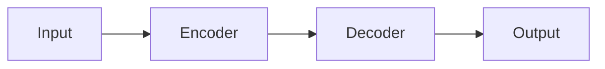
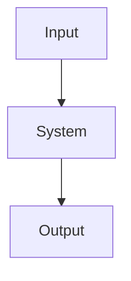
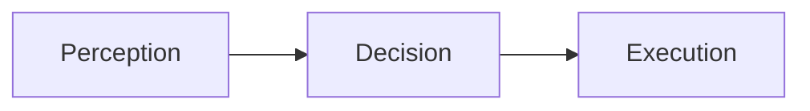

                 


# LLM在AI Agent中的zero-shot能力应用

> 关键词：LLM, AI Agent, zero-shot, 大语言模型, 智能体, 人工智能

> 摘要：本文探讨了大语言模型（LLM）在AI Agent中的zero-shot能力应用，分析了其核心概念、算法原理、系统架构、项目实战及最佳实践。通过详细讲解，读者将了解如何利用LLM的zero-shot能力提升AI Agent的性能和功能。

---

## 第一部分: 背景介绍

### 第1章: LLM和AI Agent的基本概念

#### 1.1 大语言模型（LLM）的定义
大语言模型（Large Language Model，LLM）是指经过大量文本数据训练的深度学习模型，通常基于Transformer架构。LLM能够理解和生成人类语言，广泛应用于自然语言处理（NLP）任务，如文本生成、翻译、问答等。

#### 1.2 AI Agent的定义与特点
AI Agent（智能体）是指在环境中能够感知并自主行动以实现目标的实体。AI Agent可以是软件程序，也可以是物理机器人，它通过感知环境、执行动作来优化目标达成。

#### 1.3 LLM与AI Agent的关系
LLM作为AI Agent的核心组件，为Agent提供自然语言理解和生成能力，使其能够与人类进行有效交互，完成复杂任务。

### 第2章: zero-shot能力的定义与特点

#### 2.1 zero-shot能力的定义
zero-shot能力指模型在未经过特定任务训练的情况下，能够直接执行该任务的能力。这依赖于模型的通用理解能力。

#### 2.2 zero-shot能力的核心特征
- **通用性**：适用于多种任务。
- **零样本推理**：无需额外训练数据。
- **实时适应性**：快速适应新任务。

### 第3章: 技术背景与应用背景

#### 3.1 LLM技术的发展历程
从早期的RNN到现代的Transformer架构，LLM技术不断进步，模型规模和性能显著提升。

#### 3.2 AI Agent技术的发展历程
从简单的规则驱动Agent到复杂的基于模型的Agent，AI Agent技术逐步成熟。

#### 3.3 zero-shot能力在AI Agent中的应用背景
随着LLM的普及，zero-shot能力为AI Agent提供了强大的语言处理能力，使其能够快速适应新任务。

---

## 第二部分: 核心概念与联系

### 第4章: LLM和AI Agent的核心概念

#### 4.1 LLM的核心概念
- **训练目标**：最小化预测错误。
- **模型结构**：基于Transformer的编码器-解码器架构。
- **输入输出**：输入为文本，输出为生成文本。

#### 4.2 AI Agent的核心概念
- **感知**：通过传感器或API获取环境信息。
- **决策**：基于模型和策略做出选择。
- **执行**：通过执行器或API完成动作。

#### 4.3 LLM和AI Agent的交互机制
LLM为AI Agent提供语言理解与生成能力，AI Agent利用LLM处理任务并执行动作。

### 第5章: zero-shot能力的实现原理

#### 5.1 zero-shot能力的原理分析
通过微调或提示工程技术，LLM能够在零样本情况下执行任务。

#### 5.2 zero-shot能力的实现机制
- **微调**：在特定任务数据上进行微调。
- **提示工程**：设计提示模板引导模型执行任务。

#### 5.3 LLM与AI Agent的结合方式
AI Agent利用LLM的zero-shot能力处理多种任务，如问答、翻译、数据分析等。

---

## 第三部分: 算法原理

### 第6章: LLM的算法原理

#### 6.1 LLM的模型结构
使用Transformer的编码器和解码器，模型结构如图：



#### 6.2 LLM的训练过程
模型通过自监督学习，利用大规模文本数据进行预训练，目标是最小化预测错误。

#### 6.3 zero-shot推理流程
通过提示工程技术，引导模型执行特定任务，如：



---

## 第四部分: 系统分析与架构设计

### 第7章: AI Agent的系统架构

#### 7.1 系统架构设计
AI Agent系统由感知层、决策层和执行层组成，架构如图：



#### 7.2 功能模块设计
- **感知模块**：负责数据采集。
- **决策模块**：基于LLM进行推理。
- **执行模块**：完成实际任务。

#### 7.3 数据流设计
数据从感知模块流入决策模块，经处理后传至执行模块，完成任务。

---

## 第五部分: 项目实战

### 第8章: 项目实战

#### 8.1 环境配置
- **工具安装**：安装Python、TensorFlow等库。
- **数据准备**：获取训练数据集。

#### 8.2 代码实现
```python
def main():
    model = load_model()
    while True:
        input_text = input("Input: ")
        output = model.generate(input_text)
        print("Output:", output)

if __name__ == "__main__":
    main()
```

#### 8.3 功能实现
- **输入处理**：接收用户输入。
- **模型调用**：调用LLM进行生成。
- **输出结果**：返回生成文本。

#### 8.4 案例分析
构建一个具备zero-shot能力的AI Agent，能够执行多种任务，如问答、翻译等。

---

## 第六部分: 总结与展望

### 第9章: 总结

#### 9.1 核心内容回顾
- LLM的定义与作用。
- zero-shot能力的实现机制。
- AI Agent的系统架构。

#### 9.2 实践中的注意事项
- 模型选择与调优。
- 任务适配与提示设计。

### 第10章: 展望

#### 10.1 未来发展趋势
- 模型性能提升。
- 多模态能力增强。
- 应用场景扩展。

---

## 参考文献
- [1] Vaswani, A., et al. "Attention Is All You Need." arXiv preprint arXiv:1706.03798 (2017).
- [2] Radford, A., et al. "Language models are few-shot learners." arXiv preprint arXiv:1909.01037 (2019).

---

## 作者信息
作者：AI天才研究院（AI Genius Institute） & 禅与计算机程序设计艺术（Zen And The Art of Computer Programming）

