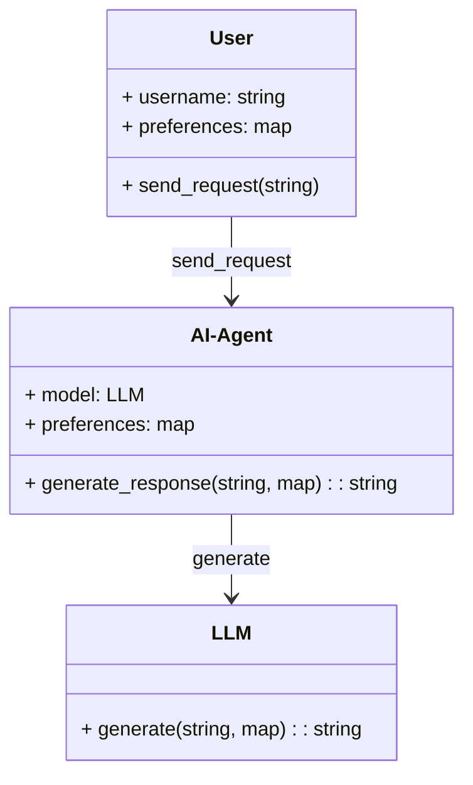
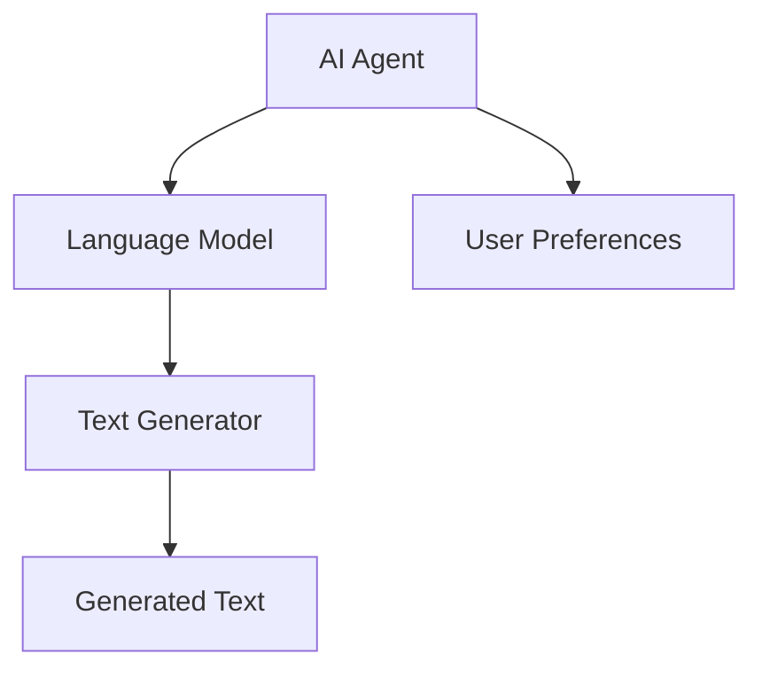
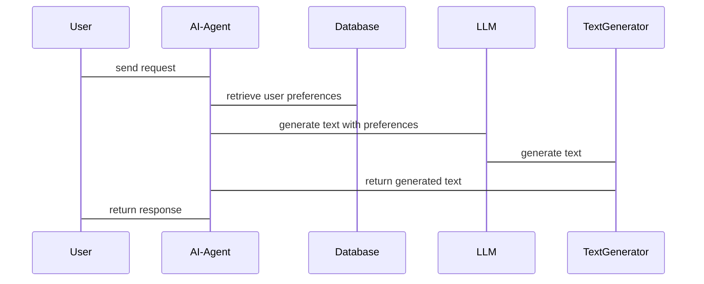

                 


# LLM在AI Agent中的文本复杂性调整能力

> 关键词：LLM, AI Agent, 文本复杂性调整, 自然语言处理, 人工智能, 语言模型

> 摘要：本文探讨了大语言模型（LLM）在AI代理（AI Agent）中的文本复杂性调整能力。通过分析LLM与AI Agent的结合方式，详细阐述了文本复杂性调整的核心问题、算法原理、系统架构设计及实际应用案例。文章内容涵盖了从理论到实践的各个方面，旨在为技术开发者和研究者提供深入的洞察和指导。

---

# 第一部分: 背景与问题描述

## 第1章: 背景与问题描述

### 1.1 问题背景
#### 1.1.1 LLM的定义与特点
- 大语言模型（LLM）是基于大量数据训练的深度学习模型，具备理解和生成自然语言文本的能力。
- LLM的特点包括：
  - **大规模**：通常基于数十亿参数，能够捕捉复杂的语言模式。
  - **多任务能力**：可以通过微调或提示工程技术，适应多种任务。
  - **上下文理解**：能够处理长上下文，生成连贯的文本。

#### 1.1.2 AI Agent的基本概念
- AI Agent是指具备自主决策和行动能力的智能体，能够根据环境信息做出反应。
- AI Agent的核心功能包括：
  - **感知**：通过传感器或API获取外部信息。
  - **决策**：基于感知信息进行推理和选择。
  - **行动**：执行决策结果，与环境交互。

#### 1.1.3 文本复杂性调整的必要性
- 在实际应用场景中，AI Agent需要根据用户需求或环境动态调整输出文本的复杂性。
- 文本复杂性调整的目标是平衡可读性和信息量，确保用户获得合适的信息量。

### 1.2 问题描述
#### 1.2.1 LLM在AI Agent中的作用
- LLM作为AI Agent的核心模块，负责生成和理解自然语言文本。
- LLM的文本生成能力为AI Agent提供了强大的表达能力。

#### 1.2.2 文本复杂性调整的核心问题
- 如何量化文本复杂性。
- 如何根据目标用户的需求动态调整文本复杂性。

#### 1.2.3 问题的边界与外延
- 边界：文本复杂性调整仅针对生成文本的复杂度，不涉及语义理解和逻辑推理。
- 外延：文本复杂性调整可能与文本生成、文本摘要、文本压缩等相关联。

### 1.3 问题解决思路
#### 1.3.1 LLM与AI Agent的结合方式
- LLM作为AI Agent的“大脑”，负责处理自然语言输入和生成自然语言输出。
- AI Agent通过LLM生成文本，结合上下文信息进行动态调整。

#### 1.3.2 文本复杂性调整的实现路径
- 通过参数调整或提示工程技术，控制生成文本的复杂性。
- 根据用户反馈动态调整文本复杂性。

#### 1.3.3 技术选型与实现方案
- 技术选型：选择合适的LLM模型（如GPT、PaLM等）。
- 实现方案：通过API调用或模型集成实现动态调整。

---

# 第二部分: 核心概念与联系

## 第2章: LLM与AI Agent的核心概念

### 2.1 LLM的核心原理
#### 2.1.1 大语言模型的基本原理
- LLM基于Transformer架构，通过自注意力机制捕捉文本中的长距离依赖关系。
- 模型通过大量的语料库训练，学习语言的统计规律。

#### 2.1.2 LLM的训练与推理过程
- **训练阶段**：模型通过反向传播优化参数，最小化预测错误。
- **推理阶段**：根据输入序列生成后续文本。

#### 2.1.3 LLM的文本生成机制
- 基于概率分布生成文本，通过采样方法（如贪心采样、随机采样）选择最优或多样化的输出。

### 2.2 AI Agent的体系结构
#### 2.2.1 AI Agent的定义与分类
- **定义**：AI Agent是一个能够感知环境、自主决策并执行任务的智能体。
- **分类**：根据智能水平分为简单反射型、基于模型的反应型、目标驱动型和效用驱动型。

#### 2.2.2 AI Agent的核心功能模块
- **感知模块**：负责获取环境信息。
- **推理模块**：负责处理信息并做出决策。
- **行动模块**：负责执行决策。

#### 2.2.3 AI Agent的交互模式
- **单轮交互**：用户发送指令，AI Agent立即响应。
- **多轮交互**：用户与AI Agent进行对话，逐步细化需求。

### 2.3 LLM与AI Agent的联系
#### 2.3.1 LLM作为AI Agent的核心模块
- LLM为AI Agent提供自然语言处理能力。
- AI Agent通过LLM生成自然语言文本与用户交互。

#### 2.3.2 LLM在AI Agent中的应用场景
- 生成用户友好的交互文本。
- 根据上下文动态调整回复内容。

#### 2.3.3 LLM与AI Agent的协同工作流程
1. 用户发送指令或问题。
2. AI Agent通过LLM解析用户意图。
3. LLM根据意图生成合适文本。
4. AI Agent根据反馈调整生成内容。

### 2.4 核心概念对比表
| 概念       | 属性               | 描述                                         |
|------------|--------------------|---------------------------------------------|
| LLM        | 输入               | 文本输入                                     |
| LLM        | 输出               | 文本输出                                     |
| AI Agent    | 输入               | 用户指令或环境信息                           |
| AI Agent    | 输出               | 动作或生成文本                               |

---

# 第三部分: 算法原理与实现

## 第3章: 算法原理

### 3.1 算法概述
- 通过调整LLM的生成参数实现文本复杂性控制。

### 3.2 文本复杂性调整算法
#### 3.2.1 文本复杂性量化指标
- 字数：文本长度。
- 词汇复杂度：词汇的多样性。
- 句法复杂度：句子的结构复杂性。
- 语义复杂度：文本内容的深度。

#### 3.2.2 文本复杂性调整方法
1. **参数调整**：
   - 通过调节生成的温度（temperature）和重复惩罚（repetition penalty）参数，控制生成文本的复杂性。
2. **分段生成**：
   - 将复杂内容拆分成多个简单部分，逐步生成。

---

## 第3章: 算法原理（续）

### 3.3 数学模型
#### 3.3.1 概率生成模型
- 通过调整生成的概率分布，控制文本复杂性。
- 公式：
  $$ P(w_{i+1}|w_1,w_2,...,w_i) $$
  
#### 3.3.2 参数调节方法
- 温度调整：
  $$ P(w) = \frac{1}{\text{temperature}} \cdot \log P(w) $$
- 重复惩罚：
  $$ P(w) = P(w) \cdot \exp(-\lambda \cdot \text{freq}(w)) $$

### 3.4 实现步骤
1. 安装必要的库：
   ```bash
   pip install transformers
   pip install torch
   ```
2. 加载预训练模型：
   ```python
   from transformers import AutoModelWithLM, AutoTokenizer
   model = AutoModelWithLM.from_pretrained('gpt2')
   tokenizer = AutoTokenizer.from_pretrained('gpt2')
   ```
3. 定义生成函数：
   ```python
   def generate_text(prompt, temperature=1.0, repetition_penalty=1.0):
       inputs = tokenizer.encode(prompt, return_tensors='pt')
       outputs = model.generate(inputs, temperature=temperature, repetition_penalty=repetition_penalty)
       return tokenizer.decode(outputs[0])
   ```
4. 调整复杂性示例：
   ```python
   # 高复杂性
   print(generate_text("Explain quantum mechanics", temperature=0.7, repetition_penalty=1.2))
   # 低复杂性
   print(generate_text("Explain quantum mechanics simply", temperature=1.2, repetition_penalty=1.5))
   ```

### 3.5 案例分析
- 通过调整温度和重复惩罚参数，观察生成文本的复杂性变化。

---

# 第四部分: 系统分析与架构设计

## 第4章: 系统分析与架构设计

### 4.1 问题场景介绍
- AI Agent需要根据用户需求生成不同复杂度的文本。

### 4.2 系统功能设计
#### 4.2.1 领域模型


#### 4.2.2 系统架构


#### 4.2.3 接口与交互


### 4.3 系统实现
#### 4.3.1 实现步骤
1. 安装依赖：
   ```bash
   pip install mermaid
   pip install transformers
   pip install fastapi
   ```
2. 编写代码：
   ```python
   from fastapi import FastAPI
   from transformers import AutoModelWithLM, AutoTokenizer

   app = FastAPI()

   model = AutoModelWithLM.from_pretrained('gpt2')
   tokenizer = AutoTokenizer.from_pretrained('gpt2')

   @app.post("/generate")
   async def generate_text(prompt: str, temperature: float = 1.0, repetition_penalty: float = 1.0):
       inputs = tokenizer.encode(prompt, return_tensors='pt')
       outputs = model.generate(inputs, temperature=temperature, repetition_penalty=repetition_penalty)
       return tokenizer.decode(outputs[0])
   ```

3. 测试接口：
   ```bash
   curl -X POST "http://localhost:8000/generate?prompt=Explain%20quantum%20mechanics%20simply"
   ```

---

# 第五部分: 项目实战

## 第5章: 项目实战

### 5.1 环境安装与配置
```bash
pip install fastapi
pip install uvicorn
pip install transformers
pip install torch
```

### 5.2 系统核心实现
#### 5.2.1 核心代码
```python
from fastapi import FastAPI
from transformers import AutoModelWithLM, AutoTokenizer

app = FastAPI()

model = AutoModelWithLM.from_pretrained('gpt2')
tokenizer = AutoTokenizer.from_pretrained('gpt2')

@app.post("/generate")
async def generate_text(prompt: str, temperature: float = 1.0, repetition_penalty: float = 1.0):
    inputs = tokenizer.encode(prompt, return_tensors='pt')
    outputs = model.generate(inputs, temperature=temperature, repetition_penalty=repetition_penalty)
    return tokenizer.decode(outputs[0])
```

#### 5.2.2 代码功能解读
- **模型加载**：加载预训练的GPT-2模型和分词器。
- **API定义**：定义一个POST接口，接收用户提示和调整参数。
- **文本生成**：根据输入生成文本，并返回结果。

### 5.3 实际案例分析
#### 5.3.1 案例一：简单说明
- 输入：`Explain quantum mechanics simply`
- 输出：简明扼要的量子力学解释。

#### 5.3.2 案例二：复杂说明
- 输入：`Explain quantum mechanics in detail`
- 输出：详细的量子力学解释。

### 5.4 项目总结
- 通过调整LLM的生成参数，实现了文本复杂性调整。
- 系统设计通过API接口实现了动态调整功能。

---

# 第六部分: 最佳实践与总结

## 第6章: 最佳实践

### 6.1 小结
- LLM在AI Agent中的文本复杂性调整能力可以通过参数调节实现。
- 系统设计需要考虑用户偏好和动态调整逻辑。

### 6.2 注意事项
- 参数调整需要根据具体场景进行微调。
- 复杂性量化指标需要根据实际需求选择。

### 6.3 拓展阅读
- 《Transformers: Pre-training of Self-attention in Deep Neural Networks》
- 《Large Language Models: The New AI Paradigm》

---

# 作者：AI天才研究院/AI Genius Institute & 禅与计算机程序设计艺术 /Zen And The Art of Computer Programming

---

以上为完整的技术博客文章大纲，涵盖了从理论到实践的各个方面，结合了详细的算法原理、系统架构设计和项目实战内容，旨在为技术开发者和研究者提供深入的指导和参考。

