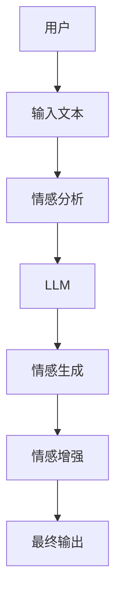
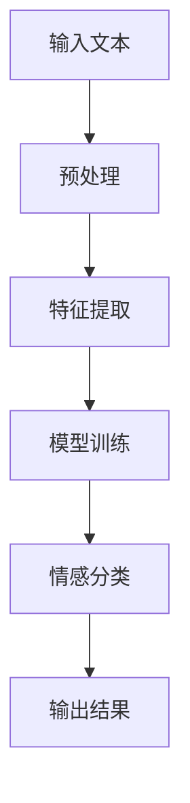
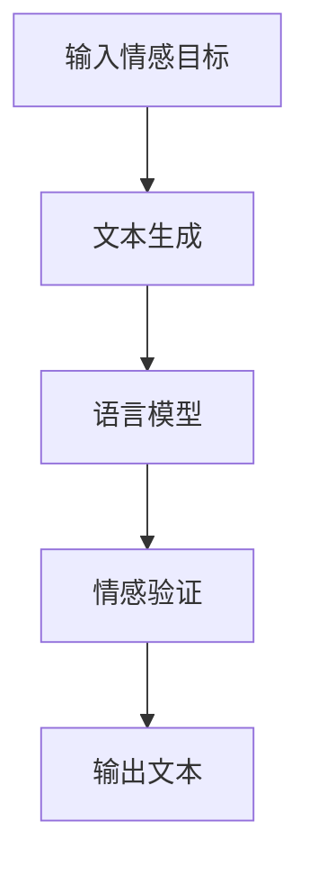
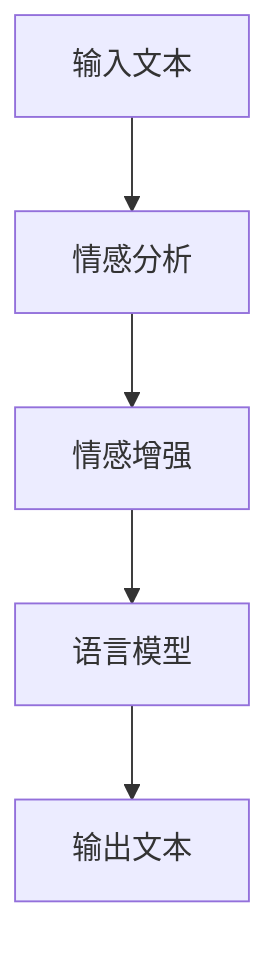
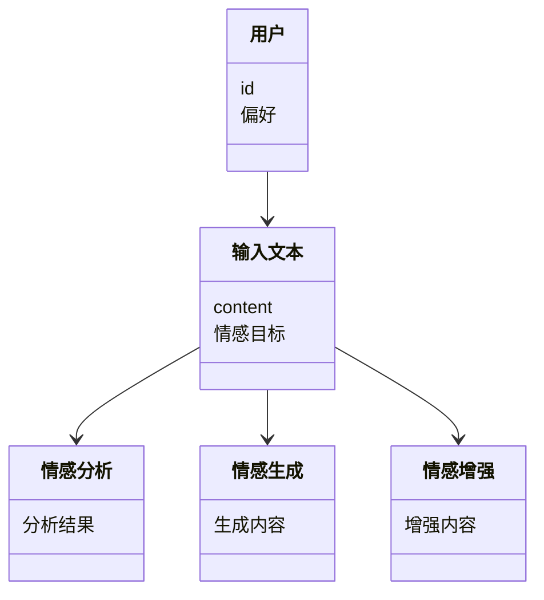

                 


```markdown
# LLM在AI Agent中的文本情感操纵能力

> 关键词：LLM, AI Agent, 文本情感操纵, 情感分析, 情感生成, 情感增强

> 摘要：本文深入探讨了大语言模型（LLM）在AI Agent中的情感操纵能力，分析了情感分析、生成和增强的核心概念与算法原理，结合系统设计与实际案例，揭示了LLM在文本情感操纵中的潜力与挑战。

---

## 第一部分: 情感操纵的背景与问题描述

### 第1章: 情感操纵的背景

#### 1.1 情感操纵的背景
- 1.1.1 从传统文本处理到情感操纵的演进
  - 传统文本处理的局限性
  - 情感理解的引入
  - 情感操纵的需求与动机

- 1.1.2 大语言模型（LLM）的崛起与情感理解能力
  - LLM的定义与特点
  - LLM在情感分析中的应用
  - LLM的情感生成与增强能力

- 1.1.3 AI Agent在情感操纵中的角色与意义
  - AI Agent的定义与功能
  - 情感操纵在AI Agent中的应用场景
  - 情感操纵对人机交互的影响

#### 1.2 情感操纵的核心问题
- 1.2.1 情感分析与情感生成的定义
  - 情感分析的目标与方法
  - 情感生成的任务与挑战
  - 情感操纵的多目标优化

- 1.2.2 情感操纵的边界与外延
  - 情感操纵的伦理与边界
  - 情感操纵的技术限制与可能性
  - 情感操纵的潜在风险与应对

- 1.2.3 情感操纵的概念结构与核心要素
  - 情感操纵的多维度分析
  - 核心要素的层次结构
  - 情感操纵的实现机制

---

## 第二部分: 情感操纵的核心概念与联系

### 第2章: 情感分析与情感生成的原理

#### 2.1 情感分析与情感生成的对比
- 情感分析的关键技术
  - 基于词袋模型的简单实现
  - 基于深度学习的复杂模型
- 情感生成的实现方式
  - 基于生成对抗网络的情感生成
  - 基于预训练模型的文本生成
- 情感分析与生成的联系与区别

#### 2.2 情感操纵的核心概念对比表
| 情感类型 | 情感分析 | 情感生成 | 情感增强 |
|---------|----------|----------|----------|
| 分析目标 | 判断情感倾向 | 生成特定情感内容 | 增强情感表达 |
| 技术难点 | 情感的多维度性 | 文本生成的质量 | 情感与语言的平衡 |
| 应用场景 | 情感分类任务 | 情感内容生成 | 情感强化表达 |

#### 2.3 情感操纵的ER实体关系图


---

## 第三部分: 情感操纵的算法原理

### 第3章: 情感分析的算法流程

#### 3.1 情感分析的算法流程


#### 3.2 情感生成的算法流程


#### 3.3 情感增强的算法流程


#### 3.4 情感操纵的数学模型
- 情感分析的损失函数
  $$ L = -\sum_{i=1}^{n} y_i \log p(y_i) + (1 - y_i) \log(1 - p(y_i)) $$
- 情感生成的生成模型
  $$ P(y|x) = \text{生成模型的输出概率} $$

---

## 第四部分: 情感操纵的系统设计与实现

### 第4章: 问题场景与系统功能设计

#### 4.1 问题场景介绍
- 情感操纵的具体应用场景
- 系统的目标与功能需求
- 系统的边界与限制

#### 4.2 系统功能设计
- 领域模型设计


---

## 第五部分: 项目实战与案例分析

### 第5章: 项目实战

#### 5.1 环境安装与配置
- 必要的开发环境
- 依赖库的安装
- 环境配置示例

#### 5.2 核心代码实现
- 情感分析代码实现
```python
def情感分析（文本）：
    # 具体实现
```

- 情感生成代码实现
```python
def情感生成（情感目标）：
    # 具体实现
```

- 情感增强代码实现
```python
def情感增强（文本）：
    # 具体实现
```

#### 5.3 案例分析与解读
- 具体案例的分析过程
- 代码实现的详细解读
- 案例结果的展示与讨论

#### 5.4 项目小结
- 项目实现的关键点总结
- 项目中的难点与解决方案
- 项目经验的总结与反思

---

## 第六部分: 总结与展望

### 第6章: 总结与展望

#### 6.1 最佳实践 Tips
- 技术建议
- 开发注意事项
- 经验分享

#### 6.2 小结
- 对全文的总结
- 对情感操纵能力的再认识
- 对未来研究方向的思考

#### 6.3 注意事项
- 技术实现中的注意事项
- 应用中的伦理问题
- 需要注意的潜在风险

#### 6.4 拓展阅读
- 推荐的相关书籍与论文
- 指定的学习资源
- 未来的研究方向与趋势

---

## 作者：AI天才研究院/AI Genius Institute & 禅与计算机程序设计艺术 /Zen And The Art of Computer Programming

---

本文通过系统的分析与讲解，深入探讨了LLM在AI Agent中的情感操纵能力，从理论到实践，全面解析了情感分析、生成与增强的核心算法与实现方案。通过实际案例的分析与代码实现，展示了LLM在情感操纵中的巨大潜力，同时也提出了未来研究的方向与挑战。
```

