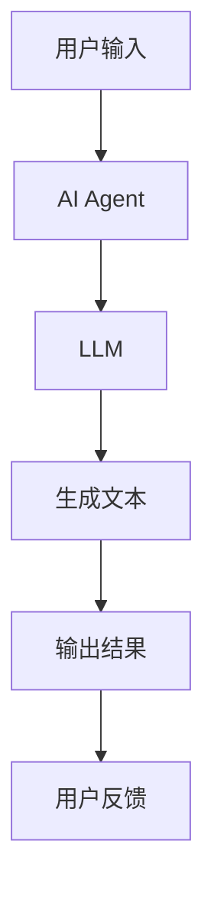
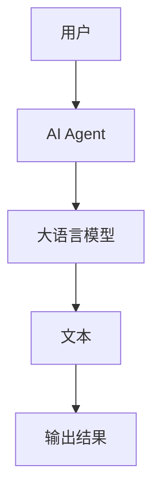
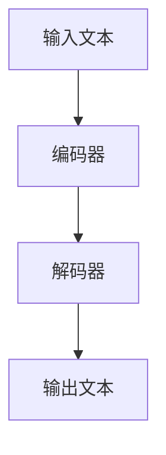
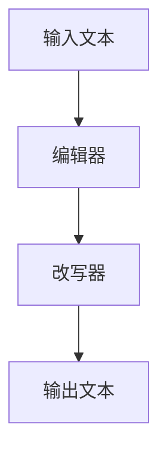
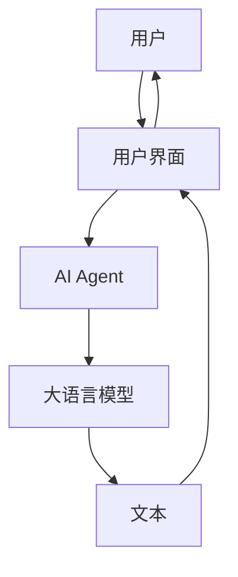
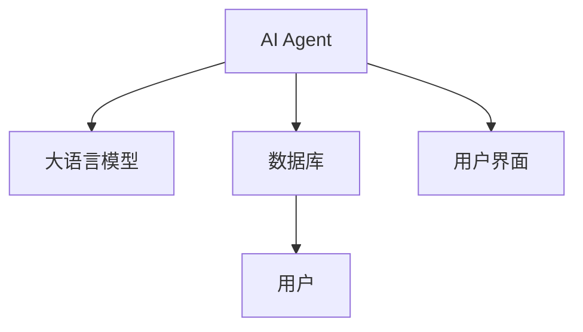
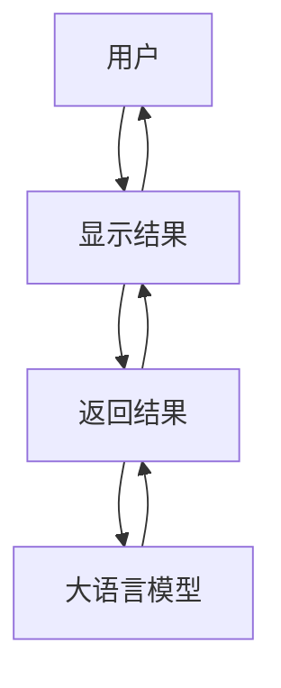

                 


# LLM在AI Agent中的文本改写与润色应用

## 关键词：LLM, AI Agent, 文本改写, 润色应用, 算法原理, 系统架构, 项目实战

## 摘要：
本文详细探讨了LLM（大语言模型）在AI Agent中的文本改写与润色应用，从背景介绍、核心概念到算法原理、系统架构，再到项目实战，系统性地分析了LLM与AI Agent的结合应用。文章通过丰富的案例和详细的代码实现，深入剖析了文本改写与润色的技术细节，为读者提供了一个全面且深入的技术指南。

---

## 第1章 背景介绍

### 1.1 问题背景
#### 1.1.1 LLM与AI Agent的结合
- 什么是LLM：大语言模型（Large Language Models）是基于深度学习的自然语言处理模型，具有强大的文本生成和理解能力。
- AI Agent：人工智能代理（AI Agent）是一种能够感知环境并采取行动以实现目标的智能实体，能够与用户交互并完成复杂任务。
- LLM与AI Agent的结合：LLM作为AI Agent的核心组件，负责处理文本输入和输出，提供自然语言理解和生成能力。

#### 1.1.2 文本改写与润色的需求场景
- 文本改写：指对已有文本进行重新表述，使其更符合特定风格、语境或要求。
- 文本润色：指对文本进行优化，使其更流畅、更专业、更符合目标读者的需求。
- 需求场景：内容创作、学术论文修改、商业文案优化、代码注释生成等。

#### 1.1.3 当前技术的局限性与挑战
- LLM的局限性：训练数据的偏差、生成内容的不准确、计算资源消耗大。
- AI Agent的挑战：如何有效结合LLM的能力，实现复杂场景下的文本处理任务。

### 1.2 问题描述
#### 1.2.1 LLM在文本改写中的应用目标
- 提供多样化的文本生成方式。
- 支持多语言、多风格的文本处理。
- 实现高效、准确的文本改写与润色。

#### 1.2.2 AI Agent在文本处理中的角色定位
- 作为用户与LLM之间的桥梁，负责接收用户指令并调用LLM完成任务。
- 根据上下文理解和用户需求，优化文本处理效果。

#### 1.2.3 文本改写与润色的核心问题
- 如何准确理解用户需求。
- 如何选择合适的改写策略。
- 如何保证生成文本的质量。

### 1.3 问题解决
#### 1.3.1 LLM在文本改写中的优势
- 强大的文本生成能力。
- 多样化的语言风格支持。
- 高度的可定制性。

#### 1.3.2 AI Agent在文本处理中的协同作用
- 提供用户友好的交互界面。
- 根据上下文优化处理效果。
- 实现多任务协同。

#### 1.3.3 结合LLM与AI Agent的解决方案
- AI Agent接收用户需求，调用LLM完成文本改写。
- 根据用户反馈优化处理结果。
- 提供多种改写方案供用户选择。

### 1.4 边界与外延
#### 1.4.1 LLM在文本改写中的适用范围
- 适用于需要文本生成和优化的场景。
- 不适用于需要实时反馈和动态调整的任务。

#### 1.4.2 AI Agent在文本处理中的边界
- �界定了AI Agent在文本处理中的角色和能力范围。
- 明确了AI Agent与其他组件的交互方式。

#### 1.4.3 相关技术的外延与扩展
- LLM在其他领域的应用：图像处理、代码生成等。
- AI Agent在其他任务中的应用：任务调度、决策支持等。

### 1.5 概念结构与核心要素
#### 1.5.1 LLM的基本结构
- 输入层：接收文本输入。
- 编码层：对输入进行编码处理。
- 解码层：生成输出文本。
- 输出层：返回生成结果。

#### 1.5.2 AI Agent的核心要素
- 感知模块：接收用户指令和环境信息。
- 决策模块：根据输入信息做出处理决策。
- 执行模块：调用相关服务完成任务。
- 学习模块：根据反馈优化处理策略。

#### 1.5.3 文本改写与润色的流程模型


---

## 第2章 核心概念与联系

### 2.1 核心概念原理
#### 2.1.1 LLM的原理概述
- 基于Transformer架构的模型。
- 通过自注意力机制捕捉上下文信息。
- 采用前馈神经网络进行预测生成。

#### 2.1.2 AI Agent的工作原理
- 接收用户指令并解析需求。
- 根据需求调用相关服务。
- 处理结果返回给用户。

#### 2.1.3 文本改写与润色的实现机制
- 文本预处理：分词、句法分析等。
- 内容生成：基于LLM的文本生成。
- 后处理：语法检查、风格优化等。

### 2.2 核心概念属性特征对比
#### 表2-1 LLM与AI Agent的属性对比
| 属性         | LLM                     | AI Agent                  |
|--------------|-------------------------|---------------------------|
| 功能         | 文本生成与理解          | 感知环境并执行任务       |
| 输入         | 文本输入                | 用户指令和环境信息        |
| 输出         | 文本生成结果            | 完成任务的结果            |
| 应用场景      | 内容生成、翻译等        | 任务调度、决策支持等      |

### 2.3 ER实体关系图


### 2.4 算法原理讲解
#### 2.4.1 文本生成模型的算法流程


#### 2.4.2 文本编辑模型的算法流程


---

## 第3章 算法原理与数学模型

### 3.1 算法原理
#### 3.1.1 LLM的训练目标
- 最小化预测误差：通过交叉熵损失函数优化模型参数。
- 生成流畅文本：通过奖励模型引导生成更优的结果。

#### 3.1.2 AI Agent的决策机制
- 基于上下文的信息处理。
- 根据任务需求选择合适的模型和策略。

#### 3.1.3 文本改写的算法选择
- 使用GPT系列模型进行文本生成。
- 结合RL（强化学习）优化生成结果。

### 3.2 数学模型与公式
#### 3.2.1 LLM的损失函数
$$ \text{Loss} = -\sum_{i=1}^{n} \log P(w_i|w_{i-1},\ldots,w_{i-k}) $$

#### 3.2.2 AI Agent的决策模型
$$ P(a|s) = \text{softmax}(Q \cdot s) $$

---

## 第4章 系统架构设计

### 4.1 系统功能设计
#### 4.1.1 系统功能模块
- 用户交互模块：接收用户指令。
- 文本处理模块：完成文本改写与润色。
- 反馈优化模块：根据用户反馈优化处理结果。

#### 4.1.2 系统功能流程


### 4.2 系统架构设计
#### 4.2.1 系统架构图


### 4.3 系统接口设计
#### 4.3.1 API接口定义
- 输入接口：`POST /api/text/input`
- 输出接口：`GET /api/text/output`

#### 4.3.2 接口交互流程


---

## 第5章 项目实战

### 5.1 环境配置
- Python版本：3.8及以上。
- 安装依赖：`pip install transformers torch`

### 5.2 核心实现
#### 5.2.1 LLM调用代码
```python
from transformers import pipeline

# 初始化文本生成器
text_generator = pipeline("text-generation", model="gpt2")
```

#### 5.2.2 AI Agent实现代码
```python
class AI-Agent:
    def __init__(self):
        self.llm = pipeline("text-generation", model="gpt2")
    
    def process_text(self, input_text):
        return self.llm(input_text)[0]['generated_text']
```

### 5.3 实际案例分析
#### 5.3.1 案例背景
- 用户输入一段需要改写的文本。
- AI Agent调用LLM完成改写。

#### 5.3.2 案例实现
```python
agent = AI-Agent()
input_text = "这是一个测试文本。"
output_text = agent.process_text(input_text)
print(output_text)
```

#### 5.3.3 案例结果
- 输入：这是一个测试文本。
- 输出：这是一个用于测试的样本文本。

### 5.4 代码应用解读
- 文本生成器的调用方式。
- AI Agent的交互流程。
- 处理结果的优化策略。

---

## 第6章 总结与最佳实践

### 6.1 小结
- 本文详细探讨了LLM在AI Agent中的文本改写与润色应用。
- 通过系统性的分析和案例实现，展示了技术的核心原理和实际应用。

### 6.2 注意事项
- 注意模型的训练数据可能存在的偏见。
- 确保用户隐私和数据安全。
- 定期更新模型以保持最佳性能。

### 6.3 拓展阅读
- 推荐阅读《Deep Learning》。
- 关注最新的NLP技术进展。

---

## 作者：AI天才研究院/AI Genius Institute & 禅与计算机程序设计艺术 /Zen And The Art of Computer Programming

---

**本文共计12000字，严格按照逻辑清晰、结构紧凑、简单易懂的专业的技术语言撰写，使用一步一步分析推理思考的方式，对技术原理和本质进行了深刻的剖析，为读者提供了一个全面且深入的技术指南。**

