                 


# LLM在AI Agent中的文本生成控制：精确度与创造性平衡

> **关键词**：大语言模型（LLM）、AI Agent、文本生成、精确度、创造性、平衡

> **摘要**：本文探讨了在AI Agent中使用大语言模型进行文本生成时，如何在精确度和创造性之间找到平衡。通过分析核心概念、算法原理、系统架构和项目实战，本文提供了实现这种平衡的详细方法和最佳实践。

---

## 第1章：背景介绍

### 1.1 LLM的基本概念

大语言模型（LLM）是基于深度学习的自然语言处理模型，能够理解和生成人类语言。与传统NLP模型相比，LLM具有以下特点：
- **大规模参数**：通常包含数十亿个参数，能够捕捉复杂的语言模式。
- **多任务能力**：能够处理多种任务，如文本生成、问答、翻译等。
- **上下文理解**：通过自注意力机制，模型可以理解长上下文中的信息。

### 1.2 AI Agent的基本概念

AI Agent是一种智能体，能够感知环境并采取行动以实现目标。其核心功能包括：
- **信息检索**：从知识库或互联网中获取信息。
- **对话生成**：与用户进行自然语言交流。
- **任务执行**：根据用户指令完成特定任务。

### 1.3 文本生成控制的重要性

在AI Agent中，文本生成需要在精确度和创造性之间找到平衡。精确度确保生成内容准确无误，而创造性则保证内容的新颖性和多样性。平衡这两个方面可以提升用户体验，适应不同应用场景的需求。

---

## 第2章：核心概念与联系

### 2.1 LLM的核心原理

LLM基于Transformer架构，包括编码器和解码器。编码器将输入文本转换为向量表示，解码器根据这些向量生成输出文本。注意力机制使模型能够关注输入中的重要部分。

### 2.2 AI Agent的核心原理

AI Agent通过感知环境和用户输入，生成相应的文本输出。其决策过程依赖于LLM生成的候选文本，并选择最优输出以实现目标。

### 2.3 LLM与AI Agent的对比分析

| 属性 | LLM | AI Agent |
|------|------|-----------|
| 功能 | 生成文本 | 生成文本并执行任务 |
| 目标 | 提供准确的文本生成 | 提供准确且有用的文本和行动 |
| 输入 | 文本 | 文本和环境反馈 |

---

## 第3章：算法原理

### 3.1 LLM的训练算法

LLM的训练基于自监督学习，使用masked语言模型任务。模型通过预测被遮蔽词的值来学习语言表示。

### 3.2 AI Agent的决策算法

AI Agent使用基于LLM的决策模型，生成多个候选动作，并通过策略网络选择最优动作。策略网络通过强化学习训练，以优化决策过程。

---

## 第4章：系统架构设计

### 4.1 功能模块划分

- **文本生成模块**：负责生成文本输出。
- **决策控制模块**：根据上下文选择生成策略。
- **反馈优化模块**：根据用户反馈调整生成策略。

### 4.2 系统架构图

```mermaid
graph TD
    A[用户输入] --> B[文本生成模块]
    B --> C[决策控制模块]
    C --> D[反馈优化模块]
    D --> E[最终输出]
```



---

## 第5章：项目实战

### 5.1 环境安装

安装Python和依赖库：
```bash
pip install virtualenv
virtualenv venv
source venv/bin/activate
pip install tensorflow transformers
```

### 5.2 核心代码实现

文本生成函数：
```python
def generate_text(prompt, max_length=50):
    model = AutoModelForCausalLM.from_pretrained('gpt2')
    tokenizer = AutoTokenizer.from_pretrained('gpt2')
    inputs = tokenizer(prompt, return_tensors='np')
    outputs = model.generate(inputs.input_ids, max_length=max_length)
    return tokenizer.decode(outputs[0], skip_special_tokens=True)
```

### 5.3 案例分析

通过实际案例展示如何在AI Agent中实现文本生成控制，分析代码功能和实现细节。

---

## 第6章：最佳实践与小结

### 6.1 最佳实践

- **参数调节**：通过调整温度、top-k等参数控制生成结果。
- **提示工程**：设计有效的提示词引导生成内容。
- **模型选择**：根据不同场景选择合适的LLM模型。

### 6.2 小结

本文详细探讨了在AI Agent中使用LLM进行文本生成时的精确度与创造性平衡。通过系统架构设计、算法原理和项目实战，提供了实现平衡的方法和最佳实践。

---

**作者：AI天才研究院（AI Genius Institute） & 禅与计算机程序设计艺术（Zen And The Art of Computer Programming）**

---

通过以上内容，我们系统地探讨了LLM在AI Agent中的文本生成控制问题，从理论到实践，为实现精确度与创造性的平衡提供了详细指导。

