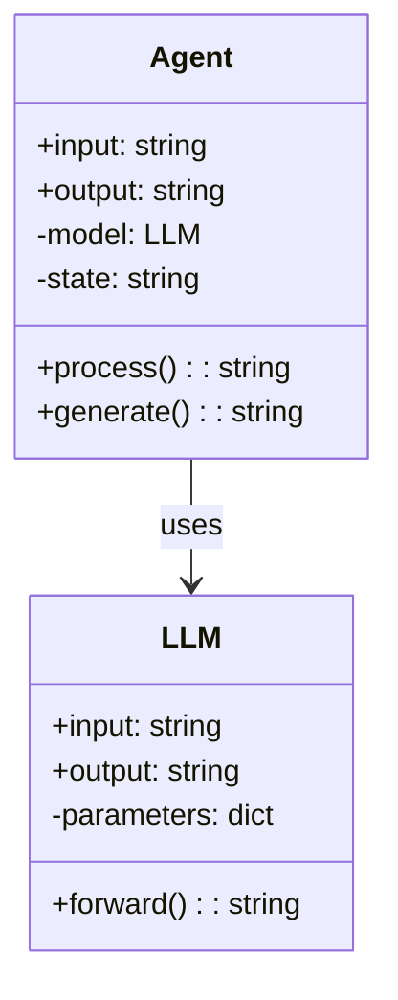
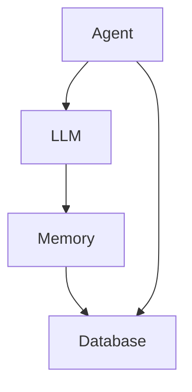

                 


# LLM在AI Agent中的文本简化与复杂化能力

---

## 关键词：  
LLM, AI Agent, 文本简化, 文本复杂化, 语言模型, 生成式AI, 自然语言处理

---

## 摘要：  
本文深入探讨了大语言模型（LLM）在AI Agent中的文本简化与复杂化能力。通过分析LLM的核心原理、文本处理技术及应用场景，结合实际案例和系统设计，详细阐述了如何利用LLM实现高效的文本生成与优化。文章内容涵盖了从理论到实践的全过程，旨在为AI Agent的开发者和研究者提供有价值的参考。

---

# 第一部分：引言

## 第1章：AI Agent与LLM概述

### 1.1 AI Agent的基本概念

#### 1.1.1 AI Agent的定义与特点
AI Agent（人工智能代理）是一种能够感知环境并采取行动以实现目标的智能系统。它具备以下特点：  
- **自主性**：能够在没有外部干预的情况下独立运作。  
- **反应性**：能够实时感知环境并做出反应。  
- **目标导向性**：所有行为都以实现特定目标为导向。  
- **学习能力**：能够通过经验或数据优化自身行为。

#### 1.1.2 LLM在AI Agent中的作用
LLM（Large Language Model）通过自然语言处理技术，赋予AI Agent理解和生成人类语言的能力，使其能够与人类进行自然交互，并执行复杂任务。

#### 1.1.3 文本简化与复杂化的意义
文本简化是指将复杂信息转化为简洁易懂的语言；文本复杂化则是指将信息以更复杂、更具专业性的语言表达。这两种能力对AI Agent的任务执行和用户体验至关重要。

---

## 第2章：LLM的基本原理

### 2.1 LLM的模型结构

#### 2.1.1 Transformer模型的基本结构
Transformer模型由编码器和解码器两部分组成，编码器负责将输入文本转化为向量表示，解码器负责根据向量生成目标文本。

- **编码器**：  
  - 输入：原始文本。  
  - 输出：文本的向量表示，捕捉文本中的语义信息。  
- **解码器**：  
  - 输入：向量表示。  
  - 输出：目标语言的文本。

#### 2.1.2 注意力机制的原理
注意力机制通过计算输入序列中每个词的重要性，将模型的注意力集中在关键词上，从而提高生成文本的质量。

### 2.2 LLM的训练与优化

#### 2.2.1 预训练目标与损失函数
LLM的训练目标是通过大量文本数据的预训练，优化模型的生成能力。损失函数通常采用交叉熵损失函数：

$$
\text{Loss} = -\sum_{i=1}^{n} \log p(y_i|x_i)
$$

其中，$y_i$是目标词，$x_i$是输入词。

#### 2.2.2 优化算法的选择与应用
常用的优化算法包括Adam、SGD等。Adam优化器因其高效性和稳定性，被广泛应用于LLM的训练中。

### 2.3 LLM的文本生成机制

#### 2.3.1 解码策略
- **贪心搜索**：每次选择概率最高的词生成下一个词。  
- **随机采样**：基于概率分布随机选择词，以生成多样化文本。

#### 2.3.2 模型的可控性
通过调整温度（temperature）和重复惩罚（repetition penalty）等参数，可以控制生成文本的多样性和创造性。

---

## 第3章：文本简化的技术与方法

### 3.1 文本简化的核心目标

#### 3.1.1 信息保留与语义损失的平衡
文本简化的目标是在减少文本长度的同时，保持语义信息不丢失。这需要在简化过程中权衡信息保留和简洁性。

### 3.2 基于LLM的文本简化方法

#### 3.2.1 直接生成简化文本
LLM可以直接生成简化文本，例如将长句拆分为短句，或用更简单的词汇替换复杂的词汇。

#### 3.2.2 分段处理与逐步优化
将文本分段处理，逐步优化每一部分的表达，最终生成简化的文本。

#### 3.2.3 结合外部知识库的简化
利用外部知识库（如Wikipedia）进行上下文推理，进一步优化文本简化效果。

---

## 第4章：文本复杂化的技术与方法

### 4.1 文本复杂化的核心目标

#### 4.1.1 增加文本的复杂性
通过引入专业术语、复杂句式和多义词，增加文本的复杂性。

#### 4.1.2 保持语义一致性的挑战
在增加文本复杂性的同时，必须确保语义的一致性，避免信息失真。

### 4.2 基于LLM的文本复杂化方法

#### 4.2.1 增加复杂句式的生成
LLM可以通过生成复杂句式，如长从句、条件句和被动语态，增加文本的复杂性。

#### 4.2.2 引入专业术语与复杂概念
通过引入专业术语和复杂概念，提升文本的专业性和复杂性。

---

## 第5章：系统分析与架构设计

### 5.1 系统功能设计

#### 5.1.1 领域模型


#### 5.1.2 系统架构设计


---

## 第6章：项目实战

### 6.1 环境安装与配置

#### 6.1.1 安装依赖
```bash
pip install transformers torch
```

#### 6.1.2 下载模型
```bash
from transformers import AutoTokenizer, AutoModelForCausalLM
tokenizer = AutoTokenizer.from_pretrained("gpt2")
model = AutoModelForCausalLM.from_pretrained("gpt2")
```

### 6.2 核心功能实现

#### 6.2.1 文本简化代码
```python
def simplify_text(text, model, tokenizer):
    inputs = tokenizer(text, return_tensors="pt")
    outputs = model.generate(**inputs, max_length=100, temperature=0.7)
    return tokenizer.decode(outputs[0], skip_special_tokens=True)
```

#### 6.2.2 文本复杂化代码
```python
def complexify_text(text, model, tokenizer):
    inputs = tokenizer(text, return_tensors="pt")
    outputs = model.generate(**inputs, max_length=200, temperature=1.2, top_k=50)
    return tokenizer.decode(outputs[0], skip_special_tokens=True)
```

---

## 第7章：总结与展望

### 7.1 总结

#### 7.1.1 核心内容回顾
本文详细探讨了LLM在AI Agent中的文本简化与复杂化能力，从理论到实践，全面分析了相关技术与方法。

#### 7.1.2 未来研究方向
未来研究可以进一步优化LLM的生成能力，探索更高效的文本处理算法。

### 7.2 最佳实践 tips

#### 7.2.1 开发建议
- 在实际应用中，根据具体需求选择合适的文本处理方法。  
- 定期优化模型参数，提升生成效果。

#### 7.2.2 注意事项
- 文本简化可能导致信息损失，需谨慎处理关键信息。  
- 文本复杂化需避免歧义，确保语义清晰。

### 7.3 拓展阅读
建议深入研究多模态生成技术，探索LLM在图像生成等领域的应用。

---

## 作者：AI天才研究院/AI Genius Institute & 禅与计算机程序设计艺术 /Zen And The Art of Computer Programming

---

以上是文章的完整目录和部分章节内容。如需进一步扩展或调整，请随时告知！

