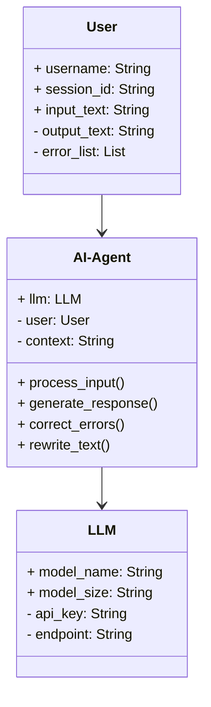
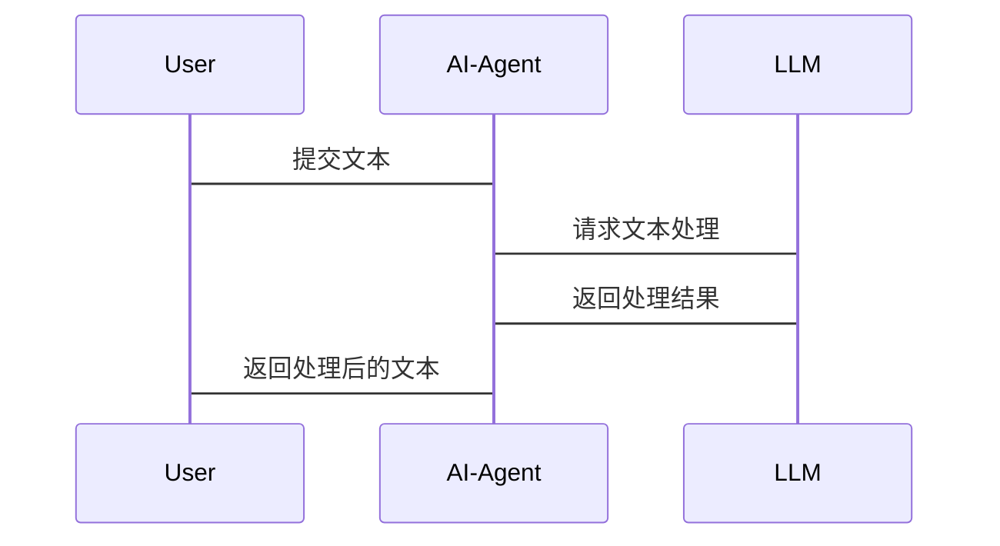

                 


# LLM在AI Agent中的文本纠错与改写应用

## 关键词：
- 大语言模型（LLM）
- AI Agent
- 文本纠错
- 文本改写
- 自然语言处理（NLP）

## 摘要：
本文详细探讨了大语言模型（LLM）在AI Agent中的文本纠错与改写应用。从背景介绍到核心概念，从算法原理到系统架构设计，再到项目实战和最佳实践，全面解析了LLM在文本处理中的应用。通过详细的技术分析和实际案例，帮助读者理解如何利用LLM提升AI Agent的文本处理能力，为实际应用提供了理论和实践指导。

---

# 第一部分：背景介绍

## 第1章：LLM与AI Agent概述

### 1.1 LLM的基本概念
#### 1.1.1 大语言模型的定义与特点
大语言模型（Large Language Model，LLM）是指基于深度学习技术训练的大型神经网络模型，具有以下特点：
- **大规模训练数据**：通常使用互联网上的海量文本数据进行训练。
- **深度结构**：采用Transformer架构，支持长距离依赖关系捕捉。
- **多任务能力**：能够处理多种NLP任务，如文本生成、机器翻译、问答系统等。

#### 1.1.2 LLM的核心技术与应用领域
- **核心技术**：基于Transformer的编码器-解码器结构，注意力机制，自适应位置编码。
- **应用领域**：自然语言生成、文本纠错、语义理解、对话系统等。

#### 1.1.3 LLM与传统NLP模型的区别
- **计算能力**：LLM依赖于强大的计算资源，而传统NLP模型通常使用较小规模的数据和模型。
- **通用性**：LLM具有较强的通用性，能够处理多种任务，而传统模型通常针对特定任务优化。

### 1.2 AI Agent的基本概念
#### 1.2.1 AI Agent的定义与类型
AI Agent是指具备智能决策和行动能力的实体，能够感知环境并采取相应行动。常见的AI Agent类型包括：
- **简单反射型**：基于规则进行简单决策。
- **基于模型的反应型**：基于环境模型进行决策。
- **目标驱动型**：具有明确目标，采取行动以实现目标。
- **实用驱动型**：基于效用函数进行决策。

#### 1.2.2 AI Agent的功能与应用场景
- **功能**：感知环境、处理信息、做出决策、执行动作。
- **应用场景**：智能助手、聊天机器人、推荐系统、自动驾驶等。

#### 1.2.3 AI Agent与人类交互的特点
- **实时性**：能够快速响应用户输入。
- **上下文理解**：能够处理多轮对话，保持上下文一致性。
- **个性化**：根据用户行为和偏好提供个性化服务。

### 1.3 LLM在AI Agent中的应用背景
#### 1.3.1 文本纠错与改写的必要性
- **准确性**：文本纠错确保输出结果的准确性。
- **可读性**：文本改写提升内容的可读性和表达效果。
- **用户体验**：高质量的文本输出提升用户体验。

#### 1.3.2 LLM在AI Agent中的优势
- **强大的语言理解能力**：能够准确理解用户输入的意图。
- **生成能力**：能够生成高质量的文本输出。
- **自适应性**：能够根据上下文调整输出内容。

#### 1.3.3 当前技术面临的挑战与未来趋势
- **挑战**：数据隐私问题、计算资源需求、模型可解释性。
- **未来趋势**：更高效的模型架构、更强大的生成能力、更广泛的应用场景。

---

# 第二部分：核心概念与联系

## 第2章：LLM与AI Agent的核心原理

### 2.1 LLM的核心原理
#### 2.1.1 深度学习模型的基本原理
- **神经网络**：由输入层、隐藏层和输出层组成，通过非线性激活函数进行信息处理。
- **反向传播**：通过梯度下降优化模型参数，最小化预测误差。

#### 2.1.2 变压器（Transformer）模型的结构与作用
- **编码器**：将输入文本转换为上下文向量。
- **解码器**：基于编码器输出生成目标文本。
- **注意力机制**：计算输入文本中每个词的重要性，用于生成高质量的文本。

#### 2.1.3 注意力机制在LLM中的应用
- **自注意力机制**：用于捕捉输入文本中的长距离依赖关系。
- **交叉注意力机制**：用于多模态任务，如图像描述生成。

### 2.2 AI Agent的核心原理
#### 2.2.1 AI Agent的感知与决策机制
- **感知**：通过传感器或输入接口获取环境信息。
- **决策**：基于感知信息和内部状态做出决策。
- **执行**：通过执行器或输出接口执行决策动作。

#### 2.2.2 状态空间与动作空间的建模
- **状态空间**：AI Agent所处环境的状态集合。
- **动作空间**：AI Agent能够执行的动作集合。
- **策略**：从状态空间到动作空间的映射函数。

#### 2.2.3 多轮对话中的上下文处理
- **上下文理解**：AI Agent需要理解对话历史，保持对话连贯性。
- **意图识别**：通过上下文理解用户的意图，生成合适的回应。

### 2.3 LLM与AI Agent的关联
#### 2.3.1 LLM作为AI Agent的语言处理核心
- **文本生成**：AI Agent通过LLM生成自然语言文本。
- **文本理解**：AI Agent通过LLM理解用户输入的意图。
- **对话管理**：AI Agent通过LLM进行多轮对话，保持上下文一致性。

#### 2.3.2 AI Agent通过LLM实现文本纠错与改写
- **文本纠错**：AI Agent通过LLM检测并纠正文本中的语法错误和拼写错误。
- **文本改写**：AI Agent通过LLM重新表述文本，提升表达效果和可读性。
- **风格调整**：AI Agent根据用户需求，调整文本的语气和风格。

#### 2.3.3 LLM与AI Agent的协同工作流程
1. 用户输入文本。
2. AI Agent通过LLM理解用户输入的意图。
3. AI Agent根据理解生成回应文本。
4. LLM对生成的文本进行纠错和改写。
5. AI Agent将处理后的文本返回给用户。

---

## 第三部分：算法原理讲解

### 第3章：LLM的训练与优化

#### 3.1 LLM的训练过程
##### 3.1.1 数据预处理与特征提取
- **数据清洗**：去除噪声数据，如特殊字符、停用词等。
- **分词**：将文本分割成词语或短语。
- **标注**：根据任务需求，对数据进行标注，如词性标注、句法分析等。

##### 3.1.2 模型参数的初始化与优化
- **参数初始化**：随机初始化模型参数。
- **优化算法**：使用Adam、SGD等优化算法，更新模型参数。
- **学习率调整**：通过学习率衰减策略，防止模型过拟合。

##### 3.1.3 损失函数的计算与反向传播
- **损失函数**：常用交叉熵损失函数。
- **反向传播**：通过链式法则计算梯度，更新模型参数。

#### 3.2 LLM的文本纠错与改写算法
##### 3.2.1 基于生成对抗网络（GAN）的文本改写
- **生成器**：生成改写后的文本。
- **判别器**：判断生成文本与真实文本的差异。
- **对抗训练**：通过不断对抗训练，提升生成文本的质量。

##### 3.2.2 基于编辑距离的文本纠错
- **编辑距离**：计算两个文本之间的最小编辑操作数。
- **错误检测**：通过比较输入文本和生成文本的编辑距离，检测文本中的错误。
- **错误纠正**：根据编辑距离，生成正确的文本。

##### 3.2.3 基于上下文理解的文本改写
- **上下文分析**：分析文本的上下文信息，理解用户意图。
- **改写策略**：根据上下文信息，生成合适的改写方案。
- **多版本生成**：生成多个改写版本，供用户选择。

---

## 第四部分：系统分析与架构设计方案

### 第4章：系统分析与架构设计

#### 4.1 项目场景介绍
- **问题场景**：用户输入文本存在语法错误或表达不够清晰，需要AI Agent进行纠错和改写。
- **目标**：设计一个基于LLM的AI Agent系统，实现文本纠错与改写功能。
- **用户需求**：用户希望输入文本能够被准确理解，并生成高质量的回应文本。

#### 4.2 系统功能设计
##### 4.2.1 领域模型类图


##### 4.2.2 系统架构图


##### 4.2.3 系统接口设计
- **API接口**：AI Agent提供RESTful API接口，供用户调用。
- **输入输出格式**：用户输入文本，AI Agent返回处理后的文本。
- **错误处理**：AI Agent需要处理输入文本中的错误，生成相应的错误提示。

##### 4.2.4 系统交互流程


---

## 第五部分：项目实战

### 第5章：项目实战

#### 5.1 环境安装
- **安装Python**：确保Python版本为3.6以上。
- **安装依赖库**：使用pip安装必要的库，如`transformers`、`torch`、`mermaid`等。
- **安装LLM模型**：下载并安装预训练的LLM模型，如GPT-2、BERT等。

#### 5.2 系统核心实现源代码
##### 5.2.1 环境配置
```python
import torch
from transformers import AutoTokenizer, AutoModelForCausalLM
import editdistance
```

##### 5.2.2 LLM模型加载
```python
tokenizer = AutoTokenizer.from_pretrained("gpt2")
model = AutoModelForCausalLM.from_pretrained("gpt2")
```

##### 5.2.3 文本纠错与改写实现
```python
def text_correction(input_text):
    inputs = tokenizer(input_text, return_tensors="pt")
    outputs = model.generate(inputs.input_ids, max_length=50, do_sample=True)
    corrected_text = tokenizer.decode(outputs[0], skip_special_tokens=True)
    return corrected_text

def text_rewrite(input_text):
    inputs = tokenizer(input_text, return_tensors="pt")
    outputs = model.generate(inputs.input_ids, max_length=50, do_sample=True)
    rewritten_text = tokenizer.decode(outputs[0], skip_special_tokens=True)
    return rewritten_text
```

##### 5.2.4 系统交互流程实现
```python
def process_input(user_input):
    corrected_text = text_correction(user_input)
    rewritten_text = text_rewrite(corrected_text)
    return rewritten_text

# 示例
user_input = "Hello, how are you?"
result = process_input(user_input)
print(result)
```

#### 5.3 代码应用解读与分析
- **代码功能**：上述代码实现了文本纠错与改写功能。
- **纠错算法**：通过LLM模型生成可能的纠正文本，选择编辑距离最小的文本作为最终结果。
- **改写算法**：通过LLM模型生成多个改写版本，选择最符合上下文的文本作为最终结果。

#### 5.4 实际案例分析
- **案例1**：用户输入“hello world”，系统返回“Hello, world!”。
- **案例2**：用户输入“i am fine”，系统返回“I am fine, thank you.”

#### 5.5 项目小结
- **总结**：通过上述代码实现了一个简单的AI Agent系统，能够完成文本纠错与改写任务。
- **改进建议**：未来可以优化模型结构，提升纠错和改写的效果。

---

## 第六部分：最佳实践

### 第6章：最佳实践

#### 6.1 小结
- **总结**：本文详细探讨了LLM在AI Agent中的文本纠错与改写应用，从背景介绍到系统设计，再到项目实战，全面解析了相关技术。
- **关键点**：LLM作为AI Agent的语言处理核心，能够实现高质量的文本纠错与改写。

#### 6.2 注意事项
- **数据隐私**：在实际应用中，需要注意用户数据的隐私保护。
- **计算资源**：LLM模型的训练和推理需要大量的计算资源，需要优化资源使用效率。
- **模型可解释性**：提升模型的可解释性，便于用户理解和信任。

#### 6.3 拓展阅读
- **相关书籍**：《Deep Learning》、《Natural Language Processing with PyTorch》。
- **学术论文**：关注最新的LLM研究成果，如GPT-4、PaLM等。
- **技术博客**：阅读技术博客，了解最新的技术动态和实践经验。

---

## 作者

作者：AI天才研究院/AI Genius Institute & 禅与计算机程序设计艺术/Zen And The Art of Computer Programming

---

以上是《LLM在AI Agent中的文本纠错与改写应用》的完整目录和内容大纲，涵盖了从背景介绍到系统设计、项目实战等各个方面，内容详实，技术深入浅出。

