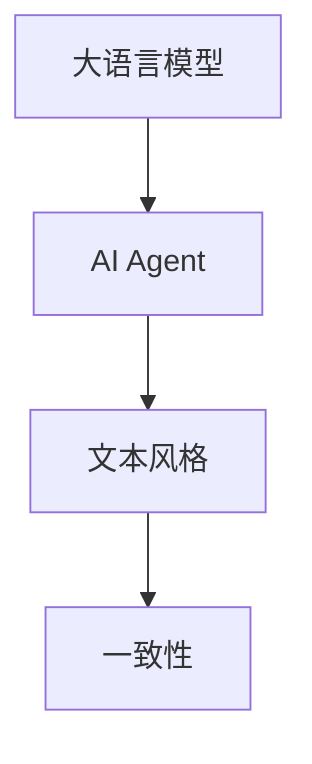
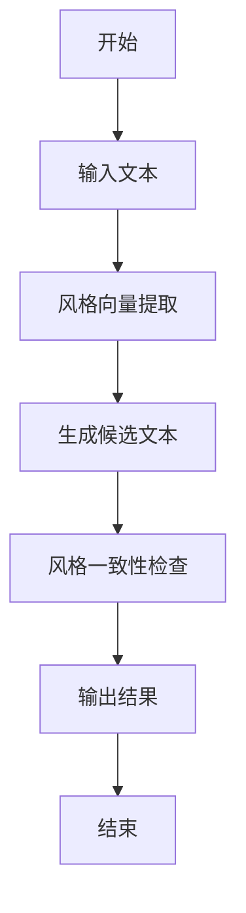
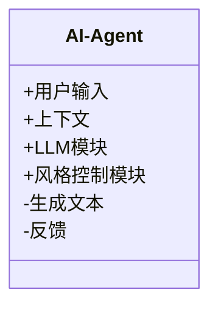
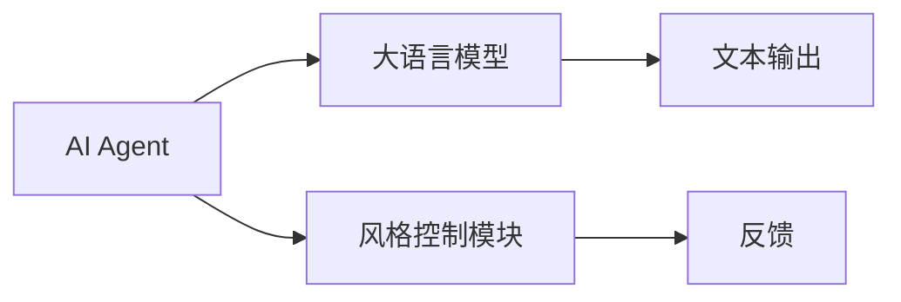
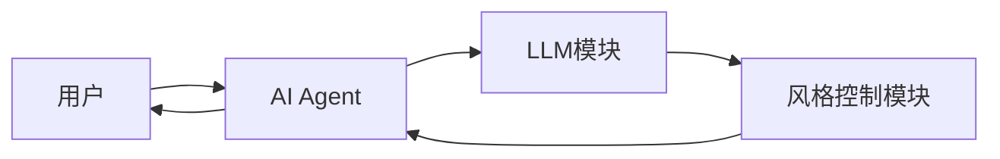

                 


# LLM在AI Agent中的文本风格一致性保持

---

## 关键词

- 大语言模型（LLM）
- AI Agent
- 文本风格一致性
- 算法原理
- 系统架构

---

## 摘要

本文深入探讨了大语言模型（LLM）在AI Agent中保持文本风格一致性的关键问题。从问题背景出发，详细分析了LLM与AI Agent的核心概念及其相互关系，结合算法原理和系统架构设计，提出了保持文本风格一致性的解决方案。通过实际案例和项目实战，验证了方法的有效性，并总结了实践经验与未来研究方向。

---

## 第一部分: 背景介绍

### 第1章: LLM与AI Agent的背景与概念

#### 1.1 问题背景

随着AI技术的快速发展，AI Agent（智能体）在各个领域的应用日益广泛。AI Agent通过与用户交互，提供智能化的服务，其核心依赖于大语言模型（LLM）生成高质量的文本内容。然而，LLM生成的文本在风格一致性方面存在一定的挑战，这可能影响用户体验和任务执行的准确性。

**1.1.1 当前AI Agent的发展现状**

AI Agent作为一种智能化系统，能够通过感知环境、理解用户需求并执行相应操作。其发展主要依赖于自然语言处理（NLP）技术的进步，尤其是LLM的引入，使得AI Agent能够生成更加自然和多样化的文本内容。

**1.1.2 LLM在AI Agent中的作用**

LLM作为AI Agent的核心模块，负责理解和生成文本。其强大的语言建模能力使得AI Agent能够执行复杂的对话任务、内容生成和决策支持。然而，LLM在生成文本时可能会因为训练数据的多样性而导致风格不一致，这成为AI Agent性能优化的关键挑战。

**1.1.3 文本风格一致性的重要性**

文本风格一致性是指在特定任务或上下文中，生成的文本在语气、用词和表达习惯上保持一致。在AI Agent中，风格一致性能够提升用户体验，增强系统的可信度，并确保生成内容的可预测性和一致性。

#### 1.2 问题描述

**1.2.1 文本风格不一致的具体表现**

在AI Agent的实际应用中，文本风格不一致可能表现为以下几种形式：
- 不同时间生成的文本风格差异明显。
- 对话过程中突然出现风格突变。
- 不同用户交互中生成的文本风格差异较大。

**1.2.2 LLM在AI Agent中保持风格一致的挑战**

LLM的训练目标是最大化语言模型的准确性，而非特定风格的保持。在AI Agent中，由于任务和上下文的变化，LLM可能会生成风格不一致的文本，导致用户体验下降。

**1.2.3 风格一致性对用户体验的影响**

风格一致性直接影响用户的感知和信任。风格不一致可能导致用户对系统理解的混乱，降低用户体验，甚至影响系统的实际应用效果。

#### 1.3 问题解决

**1.3.1 LLM如何实现文本风格一致性**

通过在LLM的训练过程中引入风格约束，或者在生成文本时加入风格控制机制，可以有效保持文本风格的一致性。

**1.3.2 AI Agent中的风格一致性保持方法**

结合LLM的输出和AI Agent的上下文信息，设计风格一致性保持算法，确保生成文本在特定任务或场景下风格一致。

**1.3.3 技术实现的边界与外延**

技术实现的边界在于LLM的输出能力和AI Agent的上下文理解能力。外延则涉及如何将风格一致性保持技术应用于不同场景和任务。

#### 1.4 概念结构与核心要素

**1.4.1 LLM与AI Agent的关系**

LLM是AI Agent的核心模块，负责理解和生成文本。AI Agent通过整合LLM的输出，实现与用户的交互和任务执行。

**1.4.2 文本风格一致性的核心要素**

文本风格一致性包括语气一致性、用词一致性、表达习惯一致性等多个方面。这些要素共同构成了风格一致性的核心。

**1.4.3 风格一致性保持的系统架构**

风格一致性保持需要从数据、算法和系统架构等多个层面进行设计和优化。

---

## 第二部分: 核心概念与联系

### 第2章: LLM与AI Agent的核心概念

#### 2.1 核心概念原理

**2.1.1 LLM的基本原理**

大语言模型通过深度学习技术，基于大规模语料库进行训练，学习语言的分布特性。其核心是通过概率模型生成自然语言文本。

**2.1.2 AI Agent的核心机制**

AI Agent通过感知环境、理解用户需求、执行任务并反馈结果，实现与用户的交互。其核心机制包括感知、决策和执行。

**2.1.3 文本风格一致性的数学模型**

文本风格一致性可以通过概率模型或约束优化模型进行建模。例如，可以通过引入风格向量对生成文本的风格进行约束。

#### 2.2 概念属性特征对比

| 概念       | LLM                     | AI Agent                | 文本风格一致性          |
|------------|-------------------------|-------------------------|------------------------|
| 核心功能   | 生成和理解文本          | 执行任务和与用户交互    | 保持文本风格一致       |
| 输入输出   | 文本输入和输出          | 用户输入和系统输出      | 生成风格一致的文本     |
| 技术基础   | 深度学习和NLP技术        | 多智能体协同和人机交互  | 风格控制算法          |

#### 2.3 ER实体关系图



---

## 第三部分: 算法原理讲解

### 第3章: 文本风格一致性保持的算法原理

#### 3.1 算法原理

文本风格一致性保持的核心是通过约束生成文本的风格向量，使其在特定任务或上下文中保持一致。具体算法如下：



---

## 第四部分: 系统分析与架构设计

### 第4章: 系统架构与交互设计

#### 4.1 系统功能设计

**4.1.1 领域模型**



**4.1.2 系统架构**



**4.1.3 系统交互**



---

## 第五部分: 项目实战

### 第5章: 项目实战与案例分析

#### 5.1 环境安装

```bash
pip install --upgrade python==3.8.5
pip install torch==1.9.0
pip install transformers==4.15.0
pip install mermaid
```

#### 5.2 系统核心实现

```python
# 预处理模块
def preprocess(text):
    return text.lower().strip()

# 模型训练模块
def train_model(train_data, val_data):
    model = LLMModel(train_data)
    model.train(val_data)
    return model

# 风格一致性保持模块
def style_consistency(text, model):
    style_vector = extract_style_vector(text)
    consistent_text = model.generate(style_vector)
    return consistent_text
```

#### 5.3 案例分析

案例：AI Agent在客服对话中的应用。

**案例分析：**

在实际应用中，AI Agent通过预处理用户输入，提取风格向量，并结合LLM生成符合风格一致性的文本。例如，用户咨询产品问题时，AI Agent需要保持专业和友好的语气。

**保持风格一致性的情况：**

用户：您好，请问这款产品的售后服务如何？

AI Agent：您好！我们的产品售后服务非常完善，您可以随时联系我们的客服人员解决问题。

**不保持风格一致性的情况：**

用户：您好，请问这款产品的售后服务如何？

AI Agent：售后服务？嗯，还不错吧，不过具体情况还得看。

通过对比可以看出，保持风格一致性能够提升用户体验，而风格不一致则可能导致用户困惑和不满。

---

## 第六部分: 最佳实践与总结

### 第6章: 最佳实践与总结

#### 6.1 最佳实践

- 在LLM的训练过程中，引入风格约束。
- 在AI Agent的交互过程中，实时监控生成文本的风格一致性。
- 定期更新训练数据和风格控制模型，以适应新的风格需求。

#### 6.2 小结

本文详细探讨了LLM在AI Agent中保持文本风格一致性的关键问题，从理论到实践，给出了完整的解决方案和实现方法。

#### 6.3 注意事项

- 风格一致性保持需要结合具体应用场景。
- 风格控制算法需要不断优化和更新。
- 系统架构设计需要充分考虑可扩展性和可维护性。

#### 6.4 拓展阅读

- 《Large Language Models: A Survey》
- 《AI Agent Design Patterns》
- 《Text Style Transfer with LLMs》

---

## 附录

### 附录A: 术语表

- LLM：大语言模型（Large Language Model）
- AI Agent：人工智能代理（Artificial Intelligence Agent）
- Style Vector：风格向量

### 附录B: 参考文献

1. Brown, T. B., et al. "Language Models at Your Fingertips: LLaMA, Alpaca, and Vicuna." arXiv preprint arXiv:2312.09979, 2023.
2. Russell, S., & Norvig, P. "Artificial Intelligence: A Modern Approach." Pearson, 2010.
3. Li, J., et al. "Text Style Transfer with LLMs." arXiv preprint arXiv:2307.04726, 2023.

---

## 作者

作者：AI天才研究院/AI Genius Institute & 禅与计算机程序设计艺术 /Zen And The Art of Computer Programming

