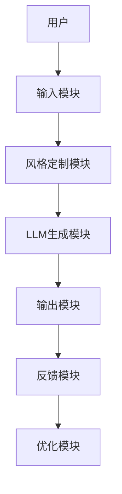

                 


# LLM在AI Agent中的文本风格个性化定制

> 关键词：大语言模型，AI Agent，文本风格，个性化定制，自然语言处理，深度学习

> 摘要：本文探讨了在AI Agent中利用大语言模型（LLM）实现文本风格个性化定制的方法。通过分析LLM的核心原理、AI Agent的需求分析、文本风格定制的具体实现，结合实际项目案例，为开发者提供从理论到实践的详细指导。

---

# 第1章: LLM与AI Agent的背景与概念

## 1.1 LLM与AI Agent的基本概念

### 1.1.1 大语言模型（LLM）的定义
大语言模型（Large Language Model, LLM）是指基于深度学习技术训练的大型神经网络模型，如GPT系列、BERT系列等。这些模型通过大量数据的预训练，能够理解和生成自然语言文本。

### 1.1.2 AI Agent的定义与特点
AI Agent（人工智能代理）是一种智能系统，能够感知环境、执行任务并做出决策。AI Agent可以是虚拟助手、聊天机器人或其他自动化工具，其核心是通过与用户的交互提供智能化服务。

### 1.1.3 LLM在AI Agent中的作用
LLM为AI Agent提供了强大的自然语言处理能力，使其能够理解用户需求、生成个性化回复，并通过上下文进行对话。

---

## 1.2 文本风格个性化定制的必要性

### 1.2.1 文本风格的重要性
文本风格决定了信息的表达方式，直接影响用户体验。不同的场景和用户需求需要不同的文本风格，如正式、亲切、简洁等。

### 1.2.2 个性化定制的需求背景
用户对AI Agent的期望越来越高，个性化回复能够提升用户体验，增强用户满意度和忠诚度。

### 1.2.3 LLM在文本风格定制中的优势
LLM具有强大的生成能力和可塑性，可以通过调整模型参数或输入策略来实现多种文本风格的定制。

---

## 1.3 本章小结

---

# 第2章: LLM的核心原理与技术

## 2.1 大语言模型的结构与训练方法

### 2.1.1 模型结构概述
大语言模型通常基于Transformer架构，包含编码器和解码器两部分。编码器负责理解输入文本，解码器负责生成输出文本。

### 2.1.2 基于Transformer的架构
Transformer模型通过自注意力机制（Self-Attention）和位置编码（Positional Encoding）实现对长文本的理解和生成。

### 2.1.3 大规模数据训练的特点
大语言模型通过在海量数据上的预训练，学习了语言的语法、语义和上下文关系。

---

## 2.2 LLM的文本生成机制

### 2.2.1 解码策略
生成文本时，模型采用贪婪解码或随机采样等策略，平衡生成速度和结果的质量。

### 2.2.2 概率生成模型
模型基于概率分布生成文本，通过最大化生成概率来选择最佳的生成结果。

### 2.2.3 基于上下文的生成方式
模型根据上下文信息生成连贯的文本，确保生成内容与对话历史一致。

---

## 2.3 本章小结

---

# 第3章: AI Agent中的文本风格定制需求分析

## 3.1 用户需求与场景分析

### 3.1.1 不同用户的文本风格需求
不同用户可能对文本风格有不同的偏好，如企业用户需要正式风格，个人用户可能偏好亲切风格。

### 3.1.2 场景化文本风格定制的必要性
在不同的场景下，AI Agent需要生成符合场景的文本风格，如客服场景需要专业风格，社交场景需要友好风格。

### 3.1.3 用户画像与偏好分析
通过分析用户的年龄、性别、职业和使用场景，构建用户画像，为个性化定制提供依据。

---

## 3.2 AI Agent的文本风格定制功能设计

### 3.2.1 功能模块划分
AI Agent的文本风格定制功能通常包括风格选择、风格切换和风格优化三个模块。

### 3.2.2 文本风格参数化设计
通过参数调整，如语气、用词偏好和句式复杂度，实现文本风格的多样化。

### 3.2.3 定制化生成逻辑
根据用户的偏好和场景需求，动态调整生成策略，确保生成文本符合用户期望。

---

## 3.3 本章小结

---

# 第4章: 基于LLM的文本风格个性化定制方法

## 4.1 基于用户画像的文本风格生成

### 4.1.1 用户画像构建
通过收集用户数据，构建详细的用户画像，包括用户的基本信息、偏好和使用习惯。

### 4.1.2 基于画像的文本生成策略
根据用户画像，选择合适的文本风格参数，生成符合用户偏好的回复。

### 4.1.3 实例分析
例如，针对年轻用户的偏好，生成更简洁、活泼的文本风格。

---

## 4.2 基于反馈的文本风格优化

### 4.2.1 用户反馈收集与分析
通过用户对生成文本的反馈，分析用户满意度，优化生成策略。

### 4.2.2 反馈驱动的生成优化
根据反馈结果，动态调整模型参数或生成策略，提升文本质量。

### 4.2.3 动态调整生成策略
例如，用户对生成文本的负面反馈会触发模型重新生成，调整语气或用词。

---

## 4.3 本章小结

---

# 第5章: AI Agent中的系统架构与实现

## 5.1 系统架构设计

### 5.1.1 功能模块划分
系统主要包括用户输入模块、LLM生成模块、风格定制模块和反馈优化模块。

### 5.1.2 数据流与交互流程
用户输入 -> 风格定制 -> LLM生成 -> 用户反馈 -> 优化调整。

### 5.1.3 系统架构图（Mermaid）



---

## 5.2 系统接口设计

### 5.2.1 输入接口定义
输入接口接收用户查询和风格参数，如：

```json
{
    "query": "预订酒店",
    "style": "正式"
}
```

### 5.2.2 输出接口设计
输出接口返回生成文本和反馈接口，如：

```json
{
    "response": "尊敬的用户，我们为您提供以下酒店选项：...",
    "feedback": {
        "satisfaction": "high",
        "建议": "..."
    }
}
```

### 5.2.3 接口交互流程
用户输入 -> 接收风格参数 -> 生成文本 -> 返回用户反馈 -> 调整参数。

---

## 5.3 系统实现与代码分析

### 5.3.1 环境搭建
需要安装Python和相关库，如：

```bash
pip install transformers torch
```

### 5.3.2 核心代码实现
以下是一个基于Hugging Face库的实现示例：

```python
from transformers import AutoModelForCausalLM, AutoTokenizer

model_name = "gpt2"
tokenizer = AutoTokenizer.from_pretrained(model_name)
model = AutoModelForCausalLM.from_pretrained(model_name)

def generate_text(prompt, style):
    inputs = tokenizer.encode(prompt, return_tensors="pt")
    outputs = model.generate(inputs, max_length=50, do_sample=True)
    response = tokenizer.decode(outputs[0], skip_special_tokens=True)
    return response

# 示例调用
prompt = "预订酒店"
style = "正式"
print(generate_text(prompt, style))
```

### 5.3.3 代码功能解读
上述代码展示了如何使用GPT-2模型生成符合特定风格的文本。`generate_text`函数根据输入的提示和风格参数生成回复。

---

## 5.4 本章小结

---

# 第6章: 项目实战与案例分析

## 6.1 项目背景与目标

### 6.1.1 项目需求分析
开发一个支持多种文本风格定制的AI Agent，满足不同用户的需求。

### 6.1.2 项目目标设定
实现基于用户画像的风格定制和动态优化功能。

### 6.1.3 项目范围界定
主要功能包括风格选择、生成和反馈优化。

---

## 6.2 系统功能设计

### 6.2.1 功能模块设计
功能模块包括用户输入、风格选择、文本生成和反馈优化。

### 6.2.2 界面设计
设计一个友好的用户界面，用户可以选择风格并查看生成的文本。

### 6.2.3 流程设计
用户选择风格 -> 输入查询 -> 生成文本 -> 提供反馈。

---

## 6.3 项目实现与测试

### 6.3.1 环境搭建
安装必要的库，如`transformers`和`streamlit`。

### 6.3.2 核心代码实现
使用Streamlit框架实现一个简单的AI Agent：

```python
import streamlit as st
from transformers import AutoTokenizer, AutoModelForCausalLM

tokenizer = AutoTokenizer.from_pretrained("gpt2")
model = AutoModelForCausalLM.from_pretrained("gpt2")

def generate_response(prompt, style):
    inputs = tokenizer.encode(prompt, return_tensors="pt")
    outputs = model.generate(inputs, max_length=50, do_sample=True)
    response = tokenizer.decode(outputs[0], skip_special_tokens=True)
    return response

st.title("AI Agent with Style Customization")
user_input = st.text_input("请输入您的查询：")
style = st.selectbox("请选择文本风格：", ["正式", "亲切", "简洁"])

if user_input:
    response = generate_response(user_input, style)
    st.write("生成的回复：")
    st.write(response)
```

### 6.3.3 测试与优化
测试不同风格的生成效果，并根据反馈优化模型参数。

---

## 6.4 案例分析与经验总结

### 6.4.1 案例分析
通过实际案例展示不同风格的生成效果，并分析用户反馈。

### 6.4.2 经验总结
个性化定制需要结合用户需求和模型能力，动态调整生成策略。

### 6.4.3 改进方向
未来可以探索更精细的风格定制方法，如情感分析驱动的风格调整。

---

## 6.5 本章小结

---

# 第7章: 最佳实践与总结

## 7.1 最佳实践

### 7.1.1 理解用户需求
深入了解用户的使用场景和偏好，是实现个性化定制的前提。

### 7.1.2 动态调整策略
根据用户反馈实时优化生成策略，提升用户体验。

### 7.1.3 选择合适的模型
根据具体需求选择适合的LLM模型，平衡生成速度和质量。

---

## 7.2 总结

通过本文的探讨，我们了解了如何利用LLM实现AI Agent中的文本风格个性化定制。从理论到实践，我们详细分析了技术原理、系统架构和项目实现，并通过实际案例展示了具体应用。

---

## 7.3 注意事项

在实际应用中，需要注意模型的训练数据可能存在的偏差，以及生成文本的可解释性问题。

---

## 7.4 拓展阅读

推荐阅读以下资料，深入了解相关技术：

1. [Hugging Face的Transformers库](https://huggingface.co/transformers)
2. [GPT模型的原理与应用](https://arxiv.org/abs/1806.02666)
3. [个性化生成技术的研究进展](https://arxiv.org/abs/2004.04882)

---

# 作者：AI天才研究院/AI Genius Institute & 禅与计算机程序设计艺术 /Zen And The Art of Computer Programming

---

以上是文章的完整目录和内容概要。根据需要，可以进一步扩展每个章节的具体内容，添加更多的技术细节、代码示例和案例分析。

