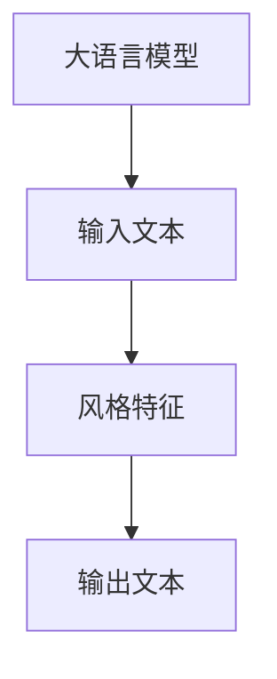
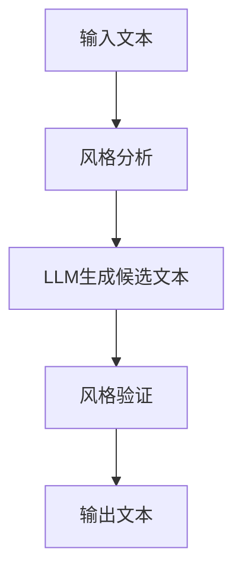
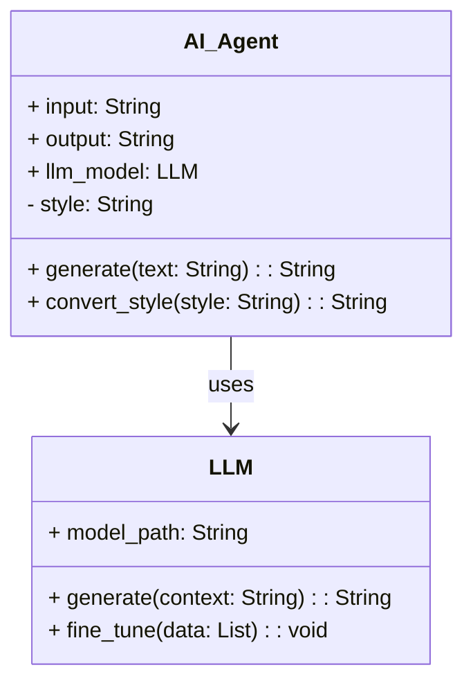
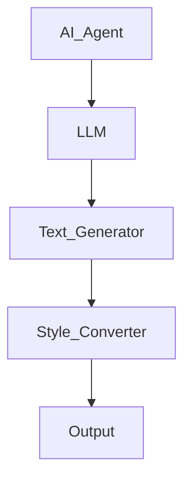

                 


# LLM在AI Agent中的文本风格保持与转换

> **关键词**：LLM, AI Agent, 文本风格保持, 文本风格转换, 自然语言处理, 大模型技术, 人工智能

> **摘要**：本文深入探讨了大语言模型（LLM）在AI Agent中的文本风格保持与转换技术，从背景到核心概念，从算法原理到系统架构，结合实际案例，详细分析了LLM在文本风格处理中的应用，为AI Agent的开发和优化提供了理论支持和实践指导。

---

## 第一章：背景介绍

### 1.1 问题背景与描述

在人工智能领域，自然语言处理（NLP）技术的进步推动了AI Agent的发展。AI Agent需要与用户进行自然的对话交互，而文本风格的保持与转换是实现这一目标的关键。LLM（Large Language Model）凭借其强大的文本生成能力，为AI Agent提供了强大的技术支持。

**问题背景**：
- AI Agent需要根据上下文和用户需求，生成符合特定风格的文本。
- 文本风格的多样性要求AI Agent能够灵活调整输出内容的语气、语气、格式等。

**问题描述**：
- 如何利用LLM实现文本风格的保持与转换？
- 在AI Agent中，如何确保生成文本的风格一致性与多样性？

**解决方法**：
- 利用LLM的文本生成能力，结合上下文和用户意图，动态调整文本风格。
- 通过预训练和微调，提升模型对不同风格文本的生成能力。

**边界与外延**：
- 文本风格保持与转换的范围：语气、用词习惯、格式等。
- 外延：结合情感分析、意图识别等技术，进一步提升风格处理能力。

### 1.2 LLM与AI Agent的核心概念

**LLM的核心概念**：
- LLM通过大量数据训练，能够生成与训练数据风格一致的文本。
- LLM的生成机制基于概率分布，能够根据输入生成多样化的输出。

**AI Agent的核心概念**：
- AI Agent是一种智能体，能够感知环境并采取行动以实现目标。
- 在文本交互中，AI Agent需要具备生成符合上下文和用户需求的文本能力。

**概念结构与组成**：
- 输入：用户输入的文本或指令。
- 处理：LLM分析输入文本，提取风格特征。
- 输出：生成符合目标风格的文本。

---

## 第二章：核心概念与联系

### 2.1 LLM与文本风格转换的原理

**LLM的工作原理**：
- LLM通过自注意力机制（Self-Attention）捕捉文本中的语义关系。
- 生成文本时，模型会根据上下文调整生成策略，确保风格一致性。

**文本风格转换的实现逻辑**：
1. 分析输入文本的风格特征。
2. 生成目标风格的文本。
3. 验证生成文本是否符合目标风格。
4. 根据反馈优化生成策略。

**实体关系图**：


---

## 第三章：算法原理与数学模型

### 3.1 算法流程

**流程图**：


### 3.2 数学模型与公式

**概率生成模型**：
$$ P(y|x) = \text{softmax}(h(x)) $$
其中，$h(x)$表示模型对输入$x$的处理结果，$y$为输出文本。

**注意力机制**：
$$ \text{Attention}(Q, K, V) = \text{softmax}\left(\frac{QK^T}{\sqrt{d_k}}\right)V $$
其中，$Q$、$K$、$V$分别为查询、键、值向量，$d_k$为键的维度。

---

## 第四章：系统分析与架构设计

### 4.1 问题场景

**AI Agent的文本交互场景**：
- 用户与AI Agent进行对话，系统需要根据对话历史生成符合用户期望的回复。
- 不同场景下，文本风格可能需要调整（如正式、亲切、幽默等）。

### 4.2 系统功能设计

**功能模块划分**：
- **输入处理模块**：接收用户输入并解析。
- **风格分析模块**：分析输入文本的风格特征。
- **LLM生成模块**：生成符合目标风格的文本。
- **风格验证模块**：验证生成文本的风格是否符合要求。
- **输出模块**：将生成文本返回给用户。

**领域模型**：


### 4.3 系统架构设计

**系统架构图**：


---

## 第五章：项目实战

### 5.1 环境安装

**Python环境与工具包安装**：
```bash
pip install transformers torch
```

### 5.2 核心实现代码

**风格转换代码示例**：
```python
from transformers import AutoModelWithLM, AutoTokenizer

model_name = "gpt2"
tokenizer = AutoTokenizer.from_pretrained(model_name)
model = AutoModelWithLM.from_pretrained(model_name)

def generate_text(prompt, style):
    inputs = tokenizer(prompt, return_tensors="pt")
    outputs = model.generate(**inputs, max_length=100)
    return tokenizer.decode(outputs[0], skip_special_tokens=True)

# 示例：将正式风格转换为亲切风格
prompt = "Please provide a detailed explanation."
converted_text = generate_text(prompt, "friendly")
print(converted_text)
```

### 5.3 案例分析

**案例分析与解读**：
- **输入文本**：用户输入的正式风格文本。
- **生成文本**：AI Agent根据目标风格生成相应的文本。
- **验证**：检查生成文本是否符合目标风格。

### 5.4 项目小结

**实现总结**：
- 成功利用LLM实现了文本风格转换。
- 系统架构设计合理，功能模块划分清晰。

---

## 第六章：总结与展望

### 6.1 总结

**关键点回顾**：
- LLM在AI Agent中的重要性。
- 文本风格保持与转换的核心算法与实现。

### 6.2 展望

**未来发展方向**：
- 更加多样化的文本风格生成。
- 提升模型的鲁棒性和生成质量。
- 结合情感分析和意图识别，进一步优化文本风格处理能力。

### 6.3 注意事项

- 数据质量对模型性能的影响。
- 模型调优与微调的重要性。
- 遵守相关法律法规，确保生成内容的合规性。

---

## 附录

### 附录A：常用工具包

- **Transformers库**：https://huggingface.co/transformers
- **Hugging Face Hub**：https://huggingface.co/models

### 附录B：推荐数据集

- **风格转换数据集**：https://www.kaggle.com/datasets
- **文本风格分析数据集**：https://catalog.data.gov/

---

**作者：AI天才研究院/AI Genius Institute & 禅与计算机程序设计艺术 /Zen And The Art of Computer Programming**

