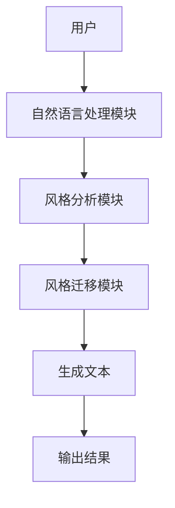

                 


# LLM在AI Agent中的文本风格模仿与创新

> 关键词：LLM、AI Agent、文本风格、模仿与创新、自然语言处理、算法原理、系统架构

> 摘要：本文深入探讨了大语言模型（LLM）在AI Agent中的应用，重点分析了文本风格的模仿与创新机制。文章从背景介绍、核心概念、算法原理、系统架构到项目实战，全面解析了LLM如何赋能AI Agent实现智能文本生成与风格调整。通过详细的技术分析和实际案例，展示了如何在AI Agent中实现高效的文本风格模仿与创新。

---

## 第一部分：背景介绍

### 第1章：LLM和AI Agent的基本概念

#### 1.1 LLM的定义与特点
- **1.1.1 大语言模型（LLM）的定义**
  - 大语言模型（Large Language Models, LLMs）是指经过训练的深度神经网络模型，能够理解和生成人类语言文本。
  - LLMs通常基于Transformer架构，具有强大的上下文理解和生成能力。

- **1.1.2 LLM的核心特点**
  - **大规模训练数据**：LLMs通过海量数据训练，掌握了丰富的语言知识。
  - **多任务通用性**：LLMs能够适应多种任务，如文本生成、翻译、问答等。
  - **生成能力强**：LLMs可以生成高质量的文本，接近人类语言表达。

- **1.1.3 LLM在AI Agent中的作用**
  - LLM为AI Agent提供了强大的语言理解和生成能力。
  - 通过LLM，AI Agent能够实现与用户的自然对话、信息提取和任务执行。

#### 1.2 AI Agent的定义与特点
- **1.2.1 AI Agent的定义**
  - AI Agent是一种智能代理系统，能够感知环境、理解用户需求并执行任务。
  - AI Agent可以是软件程序，也可以是硬件设备，具备自主决策能力。

- **1.2.2 AI Agent的核心特点**
  - **智能性**：能够理解用户需求并提供智能服务。
  - **自主性**：能够在没有人工干预的情况下独立执行任务。
  - **交互性**：支持多种交互方式，如语音、文本、图形界面等。

- **1.2.3 AI Agent与传统软件的区别**
  - AI Agent具备学习和适应能力，能够根据反馈优化行为。
  - AI Agent结合了AI技术，能够处理复杂任务。

#### 1.3 LLM与AI Agent的关系
- **1.3.1 LLM如何赋能AI Agent**
  - LLM为AI Agent提供了强大的自然语言处理能力，使其能够理解用户输入的文本。
  - LLM使得AI Agent能够生成自然流畅的回复，提升用户体验。

- **1.3.2 LLM在AI Agent中的应用场景**
  - 对话式AI Agent：如智能客服、虚拟助手。
  - 内容生成AI Agent：如自动化写作工具、新闻生成器。
  - 个性化推荐AI Agent：根据用户偏好生成定制化内容。

- **1.3.3 LLM对AI Agent性能的提升**
  - 提高文本生成质量，使AI Agent的回复更贴近人类语言。
  - 提升任务执行效率，通过语义理解快速定位用户需求。

#### 1.4 本章小结
- 本章介绍了LLM和AI Agent的基本概念及其特点，重点阐述了LLM在AI Agent中的应用价值和实际意义。

---

## 第二部分：核心概念与联系

### 第2章：文本风格模仿与创新的机制

#### 2.1 文本风格分析的基本原理
- **2.1.1 文本风格的定义**
  - 文本风格指的是文本在表达方式、语言习惯、情感倾向等方面的独特特征。
  - 例如，正式风格、口语风格、幽默风格等。

- **2.1.2 文本风格分析的目标**
  - 理解文本的风格特征，为风格模仿和创新提供基础。
  - 通过风格分析，识别文本的作者或背景信息。

- **2.1.3 文本风格分析的方法**
  - 基于统计的风格分析：通过词频、句式等统计特征进行风格分类。
  - 基于深度学习的风格分析：利用神经网络提取文本的高阶特征。

#### 2.2 LLM在文本风格模仿中的应用
- **2.2.1 LLM的文本生成机制**
  - LLM通过自注意力机制（Self-Attention）捕捉文本中的长距离依赖关系。
  - 解码器（Decoder）通过逐步生成字符或单词来构建文本。

- **2.2.2 LLM的风格迁移方法**
  - 风格迁移是指将源文本的风格迁移到目标风格的过程。
  - LLM可以通过调整生成参数或引入风格编码来实现风格迁移。

- **2.2.3 基于LLM的风格模仿流程**
  1. **输入源文本**：用户提供需要模仿的文本。
  2. **分析源风格**：LLM提取源文本的风格特征。
  3. **生成目标风格文本**：根据目标风格，生成新的文本内容。

#### 2.3 LLM在文本风格创新中的应用
- **2.3.1 风格创新的目标**
  - 在保持原有内容的基础上，生成新的表达方式或风格。
  - 结合多种风格特征，创造独特的文本风格。

- **2.3.2 风格创新的实现方法**
  - 基于LLM的风格混合：结合多种风格特征，生成新的文本。
  - 基于生成模型的风格创新：利用生成对抗网络（GAN）等技术创造新的风格。

- **2.3.3 LLM创新风格的优势**
  - 能够快速生成多样化风格的文本。
  - 创新风格的过程更加灵活，可以根据需求动态调整。

#### 2.4 文本风格模仿与创新的对比分析
- **2.4.1 模仿与创新的定义对比**
  - 模仿：复制或近似已有风格。
  - 创新：创造新的风格或表达方式。

- **2.4.2 模仿与创新在LLM中的实现差异**
  - 模仿：需要精确提取源风格特征。
  - 创新：需要结合多种风格特征，创造新的表达。

- **2.4.3 模仿与创新的实际应用**
  - 模仿：用于文本修复、风格统一等场景。
  - 创新：用于内容创作、个性化推荐等场景。

#### 2.5 本章小结
- 本章详细探讨了LLM在文本风格模仿与创新中的应用，分析了两种风格处理方式的实现方法及其区别。

---

## 第三部分：算法原理

### 第3章：文本生成的算法原理

#### 3.1 基于Transformer的文本生成模型
- **3.1.1 Transformer模型的结构**
  - 编码器（Encoder）：负责将输入文本转换为向量表示。
  - 解码器（Decoder）：负责根据向量生成目标文本。

- **3.1.2 自注意力机制**
  - 通过计算输入序列中每个位置与其他位置的相关性，生成位置权重。
  - 通过加权求和得到每个位置的上下文表示。

- **3.1.3 解码器中的位置编码**
  - 通过位置编码（Positional Encoding）引入位置信息，帮助模型生成有序的文本序列。

#### 3.2 基于LLM的风格迁移算法
- **3.2.1 风格迁移的定义**
  - 风格迁移是指将源文本的风格特征迁移到目标文本的过程。

- **3.2.2 风格迁移的实现步骤**
  1. **特征提取**：提取源文本的风格特征。
  2. **风格编码**：将目标风格编码为向量表示。
  3. **文本生成**：结合源内容和目标风格向量，生成目标风格的文本。

#### 3.3 风格迁移的具体实现
- **3.3.1 风格特征提取**
  - 使用预训练的LLM提取文本的风格特征向量。
  - 特征向量可以表示为文本的情感、语气、词汇选择等信息。

- **3.3.2 风格编码方法**
  - 将目标风格编码为向量，可以使用预训练模型或自定义编码器。
  - 风格向量可以与文本内容向量结合，指导生成过程。

- **3.3.3 文本生成过程**
  - 在生成文本时，解码器不仅考虑输入内容，还结合风格向量进行调整。

#### 3.4 本章小结
- 本章详细讲解了基于LLM的文本生成算法，重点分析了风格迁移的具体实现步骤。

---

## 第四部分：系统分析与架构设计

### 第4章：AI Agent的系统架构设计

#### 4.1 问题场景介绍
- 用户需要一个支持多种文本风格生成的AI Agent，能够根据需求调整文本风格。

#### 4.2 项目介绍
- 项目目标：开发一个支持风格模仿与创新的AI Agent系统。
- 项目范围：涵盖文本生成、风格分析、风格迁移等功能。

#### 4.3 系统功能设计
- **领域模型设计**：
  - 用户需求：输入需要生成的文本内容和目标风格。
  - 系统功能：提取源风格特征，生成目标风格文本。
  - 输出结果：生成的文本内容。

- **系统架构设计**：
  - **自然语言处理模块**：负责文本的预处理和解析。
  - **风格分析模块**：提取源文本的风格特征。
  - **风格迁移模块**：根据目标风格生成文本。

#### 4.4 系统架构图


#### 4.5 系统接口设计
- **输入接口**：用户输入文本内容和目标风格。
- **输出接口**：生成的文本内容和结果状态。

#### 4.6 系统交互流程
```mermaid
sequenceDiagram
    participant 用户
    participant 自然语言处理模块
    participant 风格分析模块
    participant 风格迁移模块
    用户 -> 自然语言处理模块：输入文本内容和目标风格
    自然语言处理模块 -> 风格分析模块：提取源风格特征
    风格分析模块 -> 风格迁移模块：生成目标风格文本
    风格迁移模块 -> 用户：输出生成文本
```

#### 4.7 本章小结
- 本章详细分析了AI Agent系统的架构设计，重点描述了各模块的功能和交互流程。

---

## 第五部分：项目实战

### 第5章：基于LLM的AI Agent实现

#### 5.1 环境安装
- **Python版本**：Python 3.8+
- **依赖库安装**：
  - `transformers`：用于加载预训练的LLM模型。
  - `torch`：用于深度学习模型的训练和推理。
  - `numpy`：用于数值计算。

#### 5.2 系统核心实现源代码
```python
from transformers import AutoTokenizer, AutoModelForCausalLM
import torch

# 加载预训练模型和tokenizer
model_name = "gpt2-large"
tokenizer = AutoTokenizer.from_pretrained(model_name)
model = AutoModelForCausalLM.from_pretrained(model_name)

# 定义风格迁移函数
def style_transfer(source_text, target_style):
    # 提取源风格特征
    source_features = extract_style_features(source_text)
    
    # 编码目标风格
    target_style_vector = encode_style(target_style)
    
    # 生成目标风格文本
    input_ids = tokenizer.encode(source_text, return_tensors="pt")
    input_ids = torch.cat([input_ids, target_style_vector.unsqueeze(0)], dim=-1)
    output = model.generate(input_ids, max_length=500, temperature=0.7)
    return tokenizer.decode(output[0], skip_special_tokens=True)

# 定义风格提取函数
def extract_style_features(text):
    # 这里可以使用预训练的风格分类模型提取特征
    pass

# 定义风格编码函数
def encode_style(style):
    # 这里可以将目标风格编码为向量
    pass
```

#### 5.3 代码应用解读与分析
- **代码功能**：
  - 加载预训练的LLM模型和tokenizer。
  - 定义风格迁移函数，实现从源风格到目标风格的文本生成。
  - 提供风格提取和编码的接口，便于后续优化和扩展。

- **代码优化点**：
  - 使用预训练模型减少计算开销。
  - 通过调整温度参数控制生成文本的多样性。

#### 5.4 实际案例分析
- **案例描述**：
  - 用户输入源文本：“今天天气很好，我们去公园玩吧。”
  - 目标风格：幽默风格。

- **案例分析**：
  - 系统提取源文本的风格特征。
  - 编码目标风格为幽默向量。
  - 生成目标风格文本：“哇，今天阳光明媚，我们去公园疯玩吧！”

#### 5.5 本章小结
- 本章通过实际案例展示了如何基于LLM实现AI Agent的文本风格模仿与创新。

---

## 第六部分：最佳实践和小结

### 第6章：总结与展望

#### 6.1 最佳实践
- **数据质量的重要性**：高质量的训练数据能够显著提升模型性能。
- **模型调优的必要性**：通过微调和优化参数，提升生成文本的质量。
- **用户体验的优化**：设计友好的交互界面，提升用户的使用体验。

#### 6.2 小结
- 本文系统介绍了LLM在AI Agent中的应用，重点分析了文本风格模仿与创新的实现方法。
- 通过详细的算法解析和实际案例，展示了如何在AI Agent中实现高效的文本生成和风格调整。

#### 6.3 展望
- 随着LLM技术的不断发展，AI Agent的功能将更加智能化。
- 未来的研究方向包括更高效的风格迁移算法和多模态风格生成。

---

## 作者信息

作者：AI天才研究院/AI Genius Institute & 禅与计算机程序设计艺术 /Zen And The Art of Computer Programming

---

以上是《LLM在AI Agent中的文本风格模仿与创新》的完整目录和文章内容，涵盖了从背景介绍到项目实战的各个方面，结构清晰，内容详实，适合技术博客的发布和读者的深入学习。

