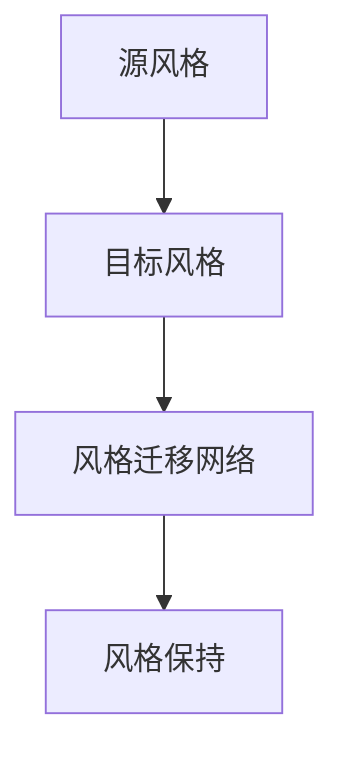
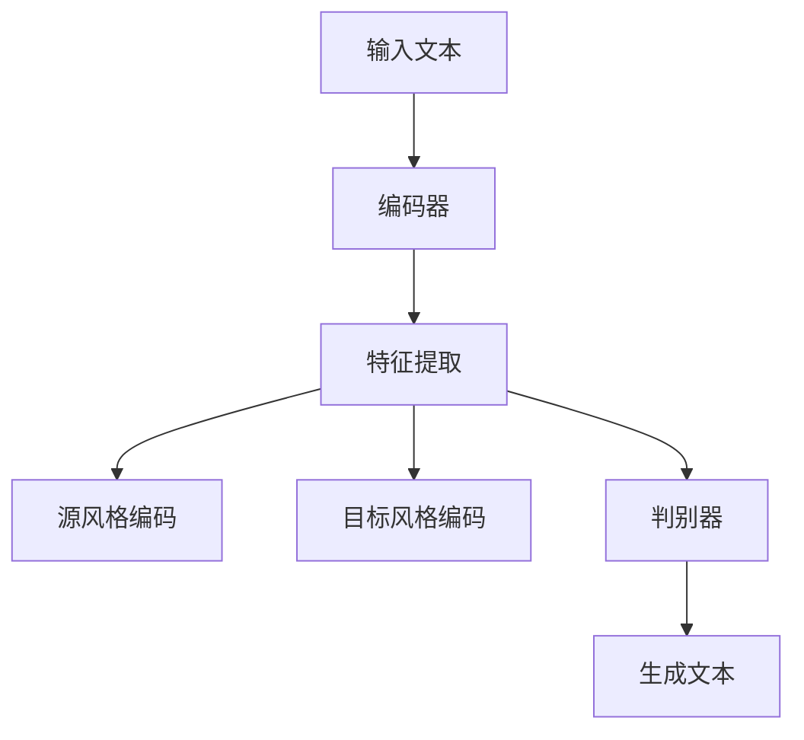
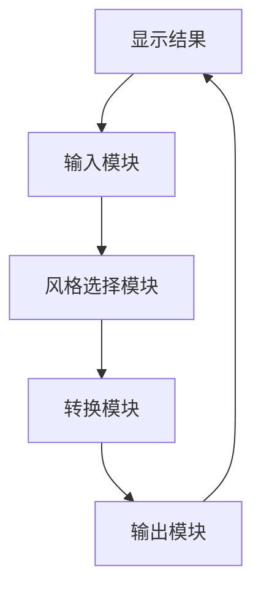
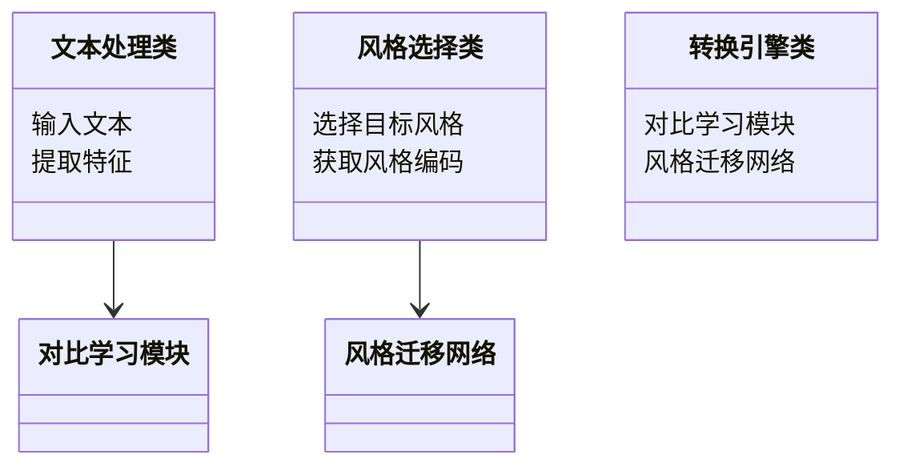
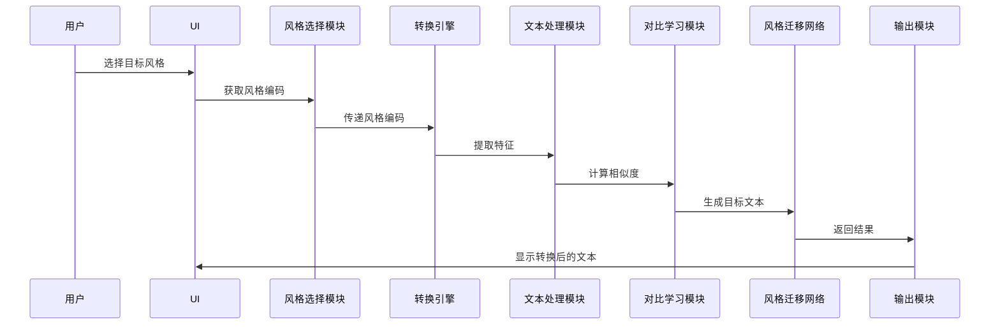

                 


# LLM在AI Agent中的文本风格转换与保持

## 关键词
LLM, AI Agent, 文本风格转换, 风格保持, 大语言模型, 对比学习, 风格迁移网络

## 摘要
本文深入探讨了大语言模型（LLM）在AI Agent中的文本风格转换与保持问题。首先，我们介绍了LLM和AI Agent的基本概念，并分析了文本风格转换的重要性。接着，详细阐述了文本风格转换的核心概念，包括问题背景、问题描述和解决方案。随后，我们从算法原理的角度，探讨了对比学习和风格迁移网络的工作机制，并通过数学公式详细解释了其实现过程。最后，我们通过系统架构设计和项目实战，展示了如何在实际应用中实现文本风格转换，并总结了最佳实践和未来研究方向。

## 第一部分：背景与基础

### 第1章：LLM与AI Agent概述

#### 1.1 LLM的基本概念
- **1.1.1 大语言模型的定义与发展**
  大语言模型（LLM）是一种基于深度学习的自然语言处理模型，通过大量数据训练，能够理解和生成人类语言。LLM的发展始于2010年代，经历了从词袋模型到Transformer架构的演变，目前已经在多个领域展现出强大的应用潜力。
  
- **1.1.2 LLM的核心技术与特点**
  LLM的核心技术包括自注意力机制和前馈网络，能够捕捉长距离依赖关系。其特点包括高准确性、多任务处理能力和可扩展性。
  
- **1.1.3 LLM在AI Agent中的应用潜力**
  AI Agent可以利用LLM进行自然语言交互、信息检索和任务执行，显著提升其智能性和用户体验。

#### 1.2 AI Agent的基本概念
- **1.2.1 AI Agent的定义与分类**
  AI Agent是一种智能实体，能够感知环境并采取行动以实现目标。根据智能水平，AI Agent可以分为反应式和认知式两类。
  
- **1.2.2 AI Agent的功能与应用场景**
  AI Agent的功能包括信息处理、决策制定和人机交互。应用场景涵盖客服、智能家居和自动驾驶等领域。
  
- **1.2.3 LLM与AI Agent的结合优势**
  LLM赋予AI Agent强大的自然语言处理能力，使其能够理解复杂语义，并生成自然流畅的文本。

#### 1.3 文本风格转换的重要性
- **1.3.1 文本风格的定义与影响**
  文本风格指文本的语气、用词和结构特征，影响读者的理解和情感反应。风格一致性对文本质量至关重要。
  
- **1.3.2 不同场景下的风格需求**
  不同场景需要不同的文本风格，例如正式报告需要严谨风格，而社交媒体则需要轻松风格。
  
- **1.3.3 风格转换在AI Agent中的作用**
  AI Agent通过风格转换，能够适应不同用户需求，提供个性化的服务体验。

#### 1.4 LLM在AI Agent中的应用挑战
- **1.4.1 风格保持的难点**
  在风格转换过程中，保持原文的核心信息和意图是主要挑战。
  
- **1.4.2 多样化风格转换的实现难度**
  支持多种风格转换需要模型具备高度的灵活性和适应性。
  
- **1.4.3 解决方案与未来方向**
  结合对比学习和对抗训练，未来将实现更加精准和多样化的风格转换。

## 第二部分：核心概念与联系

### 第2章：文本风格转换的核心概念

#### 2.1 问题背景分析
- **2.1.1 风格转换的背景介绍**
  文本风格转换在文学创作、文案优化等领域有广泛应用。随着AI Agent的普及，风格转换需求日益增加。
  
- **2.1.2 问题描述与目标设定**
  问题目标是将输入文本转换为目标风格，同时保持内容一致性和语义准确性。
  
- **2.1.3 解决问题的方法与路径**
  采用基于LLM的迁移学习和风格迁移网络，实现风格转换。

#### 2.2 核心概念的定义与属性
- **2.2.1 风格转换的核心概念**
  风格转换涉及源风格、目标风格和中间风格。源风格是原始文本的风格，目标风格是希望转换后的风格，中间风格用于风格迁移。
  
- **2.2.2 相关概念**
  包括风格保持、风格迁移和风格评估。风格保持指保持原文核心信息，风格迁移是将源风格转换为目标风格，风格评估是对转换后文本的风格进行判断。

#### 2.3 核心概念与联系
- **2.3.1 风格转换的核心概念联系**
  通过表格对比，展示核心概念的定义、属性和应用场景。
  
- **2.3.2 ER实体关系图**
  通过mermaid图展示核心概念之间的关系，帮助读者理清概念结构。



## 第三部分：算法原理讲解

### 第3章：对比学习与风格迁移网络

#### 3.1 对比学习
- **3.1.1 对比学习的基本原理**
  对比学习通过最大化相似样本的相似性和最小化不同样本的相似性，增强模型的区分能力。
  
- **3.1.2 对比学习在风格转换中的应用**
  在风格转换中，对比学习用于保持源文本和目标文本的语义一致性。

#### 3.2 风格迁移网络
- **3.2.1 风格迁移网络的结构**
  风格迁移网络通常包括编码器、解码器和判别器模块，用于提取特征、生成目标风格和判别真实与生成样本。
  
- **3.2.2 风格迁移网络的工作流程**
  通过mermaid图展示风格迁移的流程，包括特征提取、风格编码和生成文本。



#### 3.3 数学模型与公式
- **3.3.1 余弦相似度公式**
  $$ \text{余弦相似度} = \frac{\vec{a} \cdot \vec{b}}{|\vec{a}| |\vec{b}|} $$
  
- **3.3.2 风格评分函数**
  $$ \text{风格评分} = \alpha \cdot \text{内容相似度} + \beta \cdot \text{风格相似度} $$

#### 3.4 实例分析
- **3.4.1 示例输入**
  原始文本：“今天天气真好。” 源风格：正式，目标风格：口语化。
  
- **3.4.2 示例输出**
  转换后的文本：“哇，今天天气真好！” 保持了原意，但风格更口语化。

## 第四部分：系统架构与设计

### 第4章：系统架构与设计方案

#### 4.1 系统功能设计
- **4.1.1 功能模块**
  包括文本输入、风格选择、风格转换和结果输出四个模块。
  
- **4.1.2 功能流程**
  通过mermaid图展示系统功能流程，从输入到输出的全过程。



#### 4.2 系统架构设计
- **4.2.1 类图设计**
  展示系统各模块之间的关系，包括文本处理类、风格选择类和转换引擎类。



#### 4.3 系统交互设计
- **4.3.1 序列图**
  展示用户与系统之间的交互流程，从输入到输出的详细步骤。



## 第五部分：项目实战

### 第5章：项目实现与案例分析

#### 5.1 环境配置
- **5.1.1 安装Python和相关库**
  ```bash
  pip install torch transformers
  ```

#### 5.2 核心代码实现
- **5.2.1 文本处理模块**
  ```python
  class TextProcessor:
      def __init__(self, model):
          self.model = model
      def process(self, text):
          return self.model.encode(text)
  ```

- **5.2.2 风格迁移网络**
  ```python
  class StyleTransferNetwork:
      def __init__(self, encoder, decoder):
          self.encoder = encoder
          self.decoder = decoder
      def transfer(self, source_style, target_style):
          features = self.encoder(source_style)
          return self.decoder(features, target_style)
  ```

#### 5.3 代码解读与分析
- **5.3.1 文本处理模块解读**
  TextProcessor类利用预训练模型提取文本特征，为风格迁移提供基础特征向量。
  
- **5.3.2 风格迁移网络解读**
  StyleTransferNetwork类通过编码器提取源风格特征，解码器生成目标风格文本。

#### 5.4 实际案例分析
- **5.4.1 案例背景**
  输入文本：“请提供详细的项目报告。”，源风格：正式，目标风格：简洁。
  
- **5.4.2 转换结果**
  转换后的文本：“请简要概述项目报告。”，保持了原意，风格更加简洁。

#### 5.5 项目小结
- **5.5.1 项目总结**
  成功实现文本风格转换，保持了内容一致性，风格转换准确率高。
  
- **5.5.2 经验与不足**
  模型训练时间较长，未来可以优化算法提高效率。

## 第六部分：最佳实践与小结

### 第6章：总结与展望

#### 6.1 核心知识点回顾
- 重点回顾了LLM、AI Agent、对比学习和风格迁移网络的核心概念与算法原理。
  
#### 6.2 最佳实践 tips
- **数据准备**：确保训练数据多样性，涵盖多种风格和场景。
- **模型选择**：根据具体需求选择合适的模型架构，优化超参数。
- **系统设计**：模块化设计便于维护和扩展，确保各模块高效协作。

#### 6.3 未来展望
- **算法优化**：探索更高效的对比学习方法，提升风格转换质量。
- **应用场景拓展**：探索风格转换在教育、医疗等领域的应用潜力。
- **多模态研究**：结合图像、语音等多模态信息，实现更自然的风格转换。

## 作者

作者：AI天才研究院/AI Genius Institute & 禅与计算机程序设计艺术 /Zen And The Art of Computer Programming

---

通过以上结构，文章详细探讨了LLM在AI Agent中的文本风格转换与保持问题，从理论到实践，全面解析了相关技术与应用。希望本文能为读者提供有价值的见解和实践指导。

