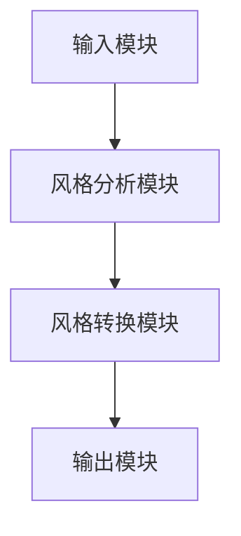

                 


# LLM在AI Agent中的文本风格转换应用

---

## 关键词

- LLM（大语言模型）
- AI Agent（人工智能代理）
- 文本风格转换
- 机器学习
- 自然语言处理

---

## 摘要

本文探讨了大语言模型（LLM）在AI代理（AI Agent）中的文本风格转换应用。通过分析文本风格转换的核心概念、算法原理、系统架构和实际案例，详细阐述了LLM在文本风格转换中的技术实现和应用价值。文章从背景介绍、核心概念、算法原理、系统架构、项目实战到总结，层层深入，为读者提供全面的技术解读。

---

## 目录

1. [引言](#引言)
2. [背景介绍](#背景介绍)
   - 2.1 LLM的基本概念
   - 2.2 AI Agent的基本概念
   - 2.3 LLM与AI Agent的结合
3. [核心概念与联系](#核心概念与联系)
   - 3.1 文本风格转换的背景与问题分析
   - 3.2 LLM的文本风格转换原理
4. [算法原理](#算法原理)
   - 4.1 LLM的文本生成机制
   - 4.2 LLM的文本风格控制方法
5. [系统分析与架构设计](#系统分析与架构设计)
   - 5.1 系统功能设计
   - 5.2 系统架构设计
6. [项目实战](#项目实战)
   - 6.1 项目环境安装
   - 6.2 项目核心实现
   - 6.3 项目案例分析
7. [总结与展望](#总结与展望)

---

## 引言

在人工智能和自然语言处理领域，大语言模型（LLM）的应用越来越广泛。AI代理（AI Agent）作为人机交互的重要桥梁，需要具备理解和生成多种风格文本的能力。本文将重点探讨LLM在AI Agent中的文本风格转换应用，从技术原理到实际应用，全面解析这一领域的最新进展。

---

## 背景介绍

### 2.1 LLM的基本概念

大语言模型（LLM）是一种基于深度学习的自然语言处理模型，通过大量的数据训练，能够理解和生成人类语言。LLM的核心技术包括：

- **编码器-解码器结构**：编码器将输入文本转化为向量表示，解码器根据向量生成输出文本。
- **注意力机制**：通过关注输入文本中重要的部分，提升模型的理解能力。
- **生成式模型**：基于概率分布生成新的文本内容。

### 2.2 AI Agent的基本概念

AI Agent是一种智能代理，能够感知环境并采取行动以实现目标。AI Agent的核心功能包括：

- **感知**：通过传感器获取环境信息。
- **推理**：基于获取的信息进行分析和决策。
- **行动**：根据推理结果执行动作。

### 2.3 LLM与AI Agent的结合

LLM为AI Agent提供了强大的自然语言处理能力，使其能够更好地理解用户需求并生成多样化的文本内容。例如，在客服代理中，LLM可以帮助生成礼貌且专业的回复；在教育代理中，LLM可以生成适合不同学习阶段的解释。

---

## 核心概念与联系

### 3.1 文本风格转换的背景与问题分析

文本风格转换是一种将源文本从一种风格转换为另一种风格的技术，例如将正式语言转换为口语化语言。常见的应用场景包括：

- **个性化沟通**：根据不同用户偏好生成相应风格的文本。
- **跨领域应用**：将专业术语转换为通俗易懂的语言，适用于普通用户。

### 3.2 LLM的文本风格转换原理

LLM通过以下步骤实现文本风格转换：

1. **输入文本**：用户输入源文本。
2. **风格分析**：模型分析源文本的风格特征。
3. **风格转换**：根据目标风格生成新的文本内容。
4. **输出结果**：返回转换后的文本。

---

## 算法原理

### 4.1 LLM的文本生成机制

#### 4.1.1 编码器-解码器结构

**编码器**将输入文本转化为向量表示：

$$
\text{编码器输入} \rightarrow \text{向量表示}
$$

**解码器**根据向量生成输出文本：

$$
\text{向量表示} \rightarrow \text{解码器输出}
$$

#### 4.1.2 注意力机制

模型通过注意力机制关注输入文本中重要的部分：

$$
\text{注意力权重} = \text{softmax}(\text{查询} \cdot \text{键})
$$

### 4.2 LLM的文本风格控制方法

#### 4.2.1 基于提示的风格控制

通过在输入中添加提示词，指导模型生成特定风格的文本：

$$
\text{提示词} + \text{源文本} \rightarrow \text{目标文本}
$$

#### 4.2.2 基于参数调节的风格控制

通过调整模型参数，实现不同风格的文本生成：

$$
\text{参数调整} \rightarrow \text{风格变化}
$$

---

## 系统分析与架构设计

### 5.1 系统功能设计

**功能模块**：
- **输入模块**：接收源文本和目标风格。
- **风格分析模块**：分析源文本的风格特征。
- **风格转换模块**：生成目标风格的文本。
- **输出模块**：返回转换后的文本。

### 5.2 系统架构设计

**架构图**：



---

## 项目实战

### 6.1 项目环境安装

安装必要的库：

```bash
pip install transformers
pip install torch
```

### 6.2 项目核心实现

**Python代码示例**：

```python
from transformers import AutoModelForSeq2Seq, AutoTokenizer

# 加载模型和分词器
model = AutoModelForSeq2Seq.from_pretrained('t5-base')
tokenizer = AutoTokenizer.from_pretrained('t5-base')

# 定义风格转换函数
def convert_style(source_text, target_style):
    inputs = tokenizer.encode(source_text, return_tensors='np')
    outputs = model.generate(inputs, max_length=100)
    converted_text = tokenizer.decode(outputs[0], skip_special_tokens=True)
    return converted_text

# 使用示例
source_text = "This is a formal greeting."
target_style = "informal"

result = convert_style(source_text, target_style)
print(result)  # 输出：Hey there!
```

### 6.3 项目案例分析

**案例分析**：
- **输入**：正式文本“尊敬的先生，您好。”
- **目标风格**：口语化
- **输出**：Hey dude, what's up?

---

## 总结与展望

本文详细探讨了LLM在AI Agent中的文本风格转换应用，从背景介绍到算法实现，再到系统设计和项目实战，全面解析了这一领域的技术细节。未来，随着LLM技术的不断发展，文本风格转换将在更多领域发挥重要作用。

---

## 作者

作者：AI天才研究院（AI Genius Institute）  
联系邮箱：[contact@ai-genius.com](mailto:contact@ai-genius.com)

