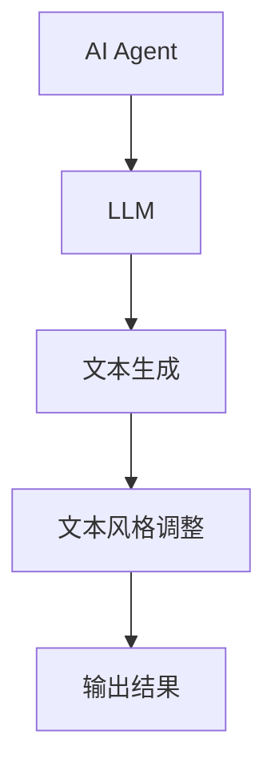
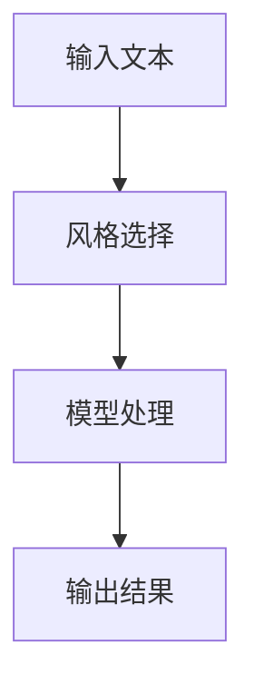
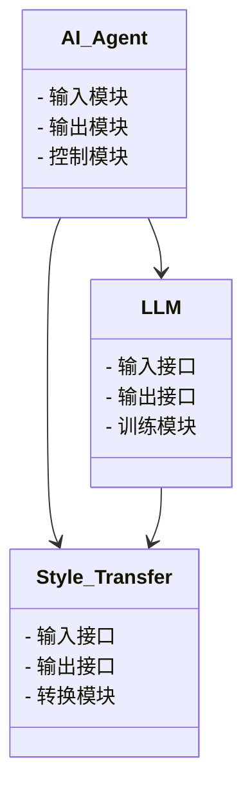

                 


# LLM在AI Agent中的文本风格迁移应用

> **关键词**：LLM, AI Agent, 文本风格迁移, 大语言模型, 自然语言处理, 人工智能, 机器学习

> **摘要**：本文深入探讨了大语言模型（LLM）在AI Agent中的文本风格迁移应用。通过分析文本风格迁移的核心概念、算法原理、系统架构及实际案例，本文为读者提供了从理论到实践的全面指导。文章详细阐述了LLM如何通过文本风格迁移技术，赋予AI Agent更强大的自然语言处理能力，使其能够更好地理解和适应不同场景下的文本风格需求。

---

## 第一部分：背景介绍

### 第1章：问题背景与定义

#### 1.1 问题背景
文本风格迁移是指将一段文本从一种风格或语气转换为另一种风格或语气的过程。这种技术在自然语言处理（NLP）领域具有重要意义，因为它能够帮助AI系统生成更符合特定场景或用户需求的文本内容。

在AI Agent的应用中，文本风格迁移尤为重要。AI Agent是一种能够自主决策并执行任务的智能系统，它需要与人类用户进行交互，并根据不同的场景调整其输出文本的风格。例如，AI Agent可能需要将正式的商业邮件转化为更口语化的表达，或者将复杂的技术文档简化为易于理解的内容。

#### 1.2 核心概念术语说明
- **大语言模型（LLM）**：指经过大量数据训练的大型神经网络模型，具有强大的文本生成和理解能力。
- **AI Agent**：一种智能代理系统，能够感知环境、执行任务并做出决策。
- **文本风格迁移**：将一段文本从一种风格转换为另一种风格的过程，例如从正式到口语化、从严肃到幽默等。

#### 1.3 问题描述与解决
AI Agent在与用户交互时，需要根据用户的背景、情感和场景调整其输出文本的风格。然而，传统的NLP模型难以实现这一目标，因为它们通常只能生成固定风格的文本。通过引入文本风格迁移技术，AI Agent能够动态调整其输出风格，从而更好地满足用户需求。

#### 1.4 边界与外延
文本风格迁移的应用场景包括：
- **多语言支持**：将一种语言的文本转换为另一种语言的文本，同时保持原文的风格。
- **跨领域应用**：在不同领域（如法律、医疗、金融等）之间进行文本风格迁移。
- **个性化定制**：根据用户的具体需求，定制独特的文本风格。

---

## 第二部分：核心概念与联系

### 第2章：LLM与AI Agent的关系

#### 2.1 LLM的核心原理
大语言模型通过大量的数据训练，能够捕捉到语言的语义和上下文信息。它利用深度学习技术，特别是变体的Transformer架构，来实现高效的文本生成和理解。

#### 2.2 AI Agent的核心功能
AI Agent通过感知环境、理解用户需求并执行任务，能够实现与用户的高效交互。在文本风格迁移中，AI Agent需要结合LLM的生成能力，动态调整其输出风格。

#### 2.3 两者的关系与数据流
以下是LLM与AI Agent的关系图，展示了它们在文本风格迁移中的数据流：



从图中可以看出，AI Agent通过与LLM交互，生成符合特定风格的文本内容。

---

## 第三部分：算法原理讲解

### 第3章：文本风格迁移的算法原理

#### 3.1 预训练与微调
文本风格迁移通常采用预训练和微调的方法。预训练阶段，模型在大规模通用数据上进行训练，掌握语言的基本规律。微调阶段，则在特定风格的数据上进行训练，使模型能够生成符合目标风格的文本。

#### 3.2 算法流程
以下是文本风格迁移的算法流程图：



在实际实现中，模型需要根据输入的风格标签，生成符合目标风格的文本。

#### 3.3 源代码实现
以下是一个简单的文本风格迁移模型实现示例：

```python
import torch
import torch.nn as nn

class StyleTransferModel(nn.Module):
    def __init__(self, vocab_size):
        super(StyleTransferModel, self).__init__()
        self.embedding = nn.Embedding(vocab_size, 512)
        self.lstm = nn.LSTM(512, 512, batch_first=True)
        self.dropout = nn.Dropout(0.5)
        self.fc = nn.Linear(512, vocab_size)

    def forward(self, x, style_label):
        embed = self.embedding(x)
        out, _ = self.lstm(embed)
        out = self.dropout(out)
        out = self.fc(out)
        return out
```

#### 3.4 数学模型与公式
文本风格迁移的损失函数通常包括生成损失和风格损失。生成损失确保生成的文本内容正确，风格损失确保生成的文本风格符合目标风格。

生成损失可以表示为：
$$ L_{\text{gen}} = \mathbb{E}_{x,y} [\text{CE}(p(x|y), y)] $$

风格损失可以表示为：
$$ L_{\text{style}} = \mathbb{E}_{x,y} [\text{KL}(p(z|x,y) || q(z|x))] $$

总损失为生成损失和风格损失的加权和：
$$ L = \alpha L_{\text{gen}} + \beta L_{\text{style}} $$

---

## 第四部分：系统分析与架构设计

### 第4章：系统架构与功能设计

#### 4.1 系统功能设计
以下是AI Agent的系统功能模块图：



从图中可以看出，AI Agent通过与LLM和文本风格迁移模块的交互，实现文本风格的动态调整。

---

## 第五部分：项目实战

### 第5章：环境安装与核心实现

#### 5.1 环境安装
为了运行文本风格迁移模型，首先需要安装以下依赖：

```bash
pip install torch
pip install mermaid
```

#### 5.2 核心代码实现
以下是AI Agent的核心代码实现：

```python
import torch
import torch.nn as nn
import torch.optim as optim

class AI_Agent:
    def __init__(self, model):
        self.model = model

    def transfer_style(self, input_text, target_style):
        with torch.no_grad():
            output = self.model(input_text, target_style)
            return output
```

---

## 第六部分：最佳实践与小结

### 第6章：总结与注意事项

#### 6.1 总结
本文详细探讨了LLM在AI Agent中的文本风格迁移应用。通过分析核心概念、算法原理和系统架构，为读者提供了从理论到实践的全面指导。

#### 6.2 注意事项
在实际应用中，需要注意以下几点：
1. **数据质量**：确保训练数据的多样性和代表性。
2. **模型调优**：根据具体场景调整模型参数。
3. **用户反馈**：及时收集用户反馈，优化模型性能。

#### 6.3 拓展阅读
建议读者进一步阅读以下内容：
- [自然语言处理基础](https://zh.wikipedia.org/wiki/自然语言处理)
- [深度学习与神经网络](https://zh.wikipedia.org/wiki/深度学习)

---

**作者**：AI天才研究院/AI Genius Institute & 禅与计算机程序设计艺术 /Zen And The Art of Computer Programming

