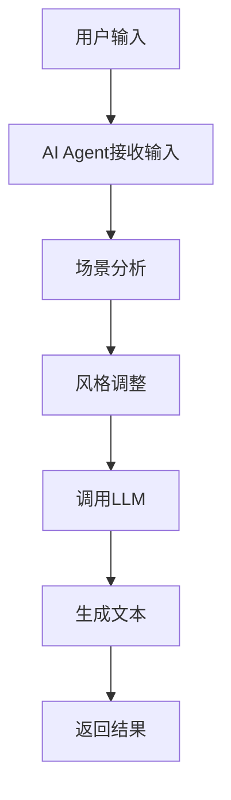
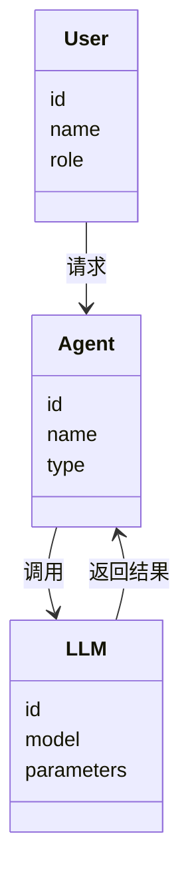
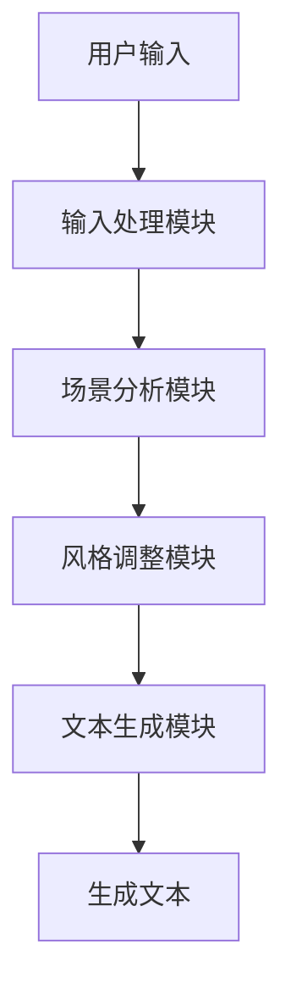
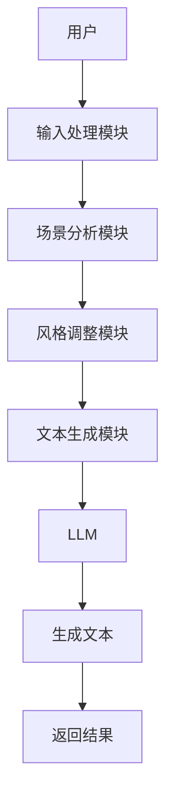
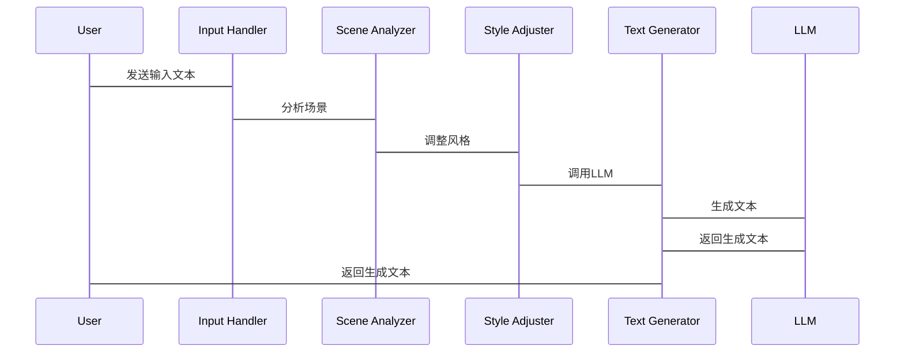

                 


# LLM在AI Agent中的文本风格适应与进化

> 关键词：大语言模型，AI代理，文本风格适应，进化算法，自然语言处理

> 摘要：本文探讨了如何在AI代理中利用大语言模型（LLM）进行文本风格的适应与进化。通过对LLM与AI代理的结合、算法原理、系统架构设计以及实际项目案例的分析，展示了如何实现高效的文本风格适应和进化，提升AI代理的智能化水平。

---

# 第1章: 问题背景与核心概念

## 1.1 问题背景

### 1.1.1 AI Agent与LLM的结合

AI Agent（人工智能代理）是一种能够感知环境并采取行动以实现目标的智能系统。LLM（大语言模型）作为AI Agent的核心模块，能够处理自然语言输入并生成相应的输出。两者的结合使得AI Agent能够更高效地完成复杂的任务。

### 1.1.2 文本风格适应的重要性

在实际应用中，AI Agent需要与不同背景的用户交互，理解用户的意图并生成符合用户期望的文本。文本风格的适应是实现这一目标的关键。例如，一个AI Agent在客服场景中需要生成正式且礼貌的回复，而在社交媒体场景中则需要更口语化和亲和力的表达。

### 1.1.3 LLM在AI Agent中的进化需求

随着AI Agent应用场景的扩展，仅依赖固定的训练数据生成文本已经不足以满足多样化的需求。通过进化算法不断优化LLM的性能，使其能够更好地适应不同的文本风格和用户需求，是提升AI Agent智能化水平的重要途径。

## 1.2 核心概念与定义

### 1.2.1 LLM的定义与特点

大语言模型是一种基于深度学习的自然语言处理模型，具有以下特点：
- **大规模训练数据**：通常基于大量的文本数据进行训练，能够理解多种语言和语境。
- **生成能力**：能够生成连贯且有意义的文本。
- **上下文理解**：能够捕捉上下文信息，理解对话的逻辑关系。

### 1.2.2 AI Agent的定义与功能

AI Agent是一种智能系统，具备以下功能：
- **感知环境**：通过传感器或其他输入方式获取环境信息。
- **决策与行动**：根据感知的信息做出决策并执行相应的动作。
- **学习与适应**：通过与环境的交互不断优化自身的行为。

### 1.2.3 文本风格适应的定义与分类

文本风格适应是指AI Agent根据不同的场景和用户需求，调整其生成文本的风格和语气。常见的文本风格包括：
- **正式风格**：适用于正式场合，如商务邮件、法律文件等。
- **口语化风格**：适用于日常对话、社交媒体等非正式场合。
- **技术风格**：适用于专业领域，如科技新闻、学术论文等。

## 1.3 问题描述与目标

### 1.3.1 LLM在AI Agent中的应用挑战

尽管LLM在自然语言处理领域取得了显著进展，但在AI Agent中的应用仍面临以下挑战：
- **多样化的文本风格需求**：不同场景和用户对文本风格的要求差异大。
- **动态适应能力**：AI Agent需要在实时交互中快速调整文本风格。
- **模型的可解释性**：复杂的模型可能导致生成结果难以解释。

### 1.3.2 文本风格适应的具体问题

- 如何准确识别用户的意图和情感倾向？
- 如何根据用户的背景和需求调整文本风格？
- 如何在不同风格之间切换时保持生成文本的连贯性和一致性？

### 1.3.3 问题解决的目标与边界

目标：
- 提升AI Agent生成文本的风格适应能力，使其能够根据场景和用户需求生成符合期望的文本。

边界：
- 专注于文本风格的适应，不涉及AI Agent的其他功能（如决策和行动）。
- 仅考虑自然语言生成部分，不涉及图像或语音生成。

---

# 第2章: LLM与AI Agent的核心概念联系

## 2.1 LLM与AI Agent的联系

### 2.1.1 LLM作为AI Agent的核心模块

LLM在AI Agent中扮演着“大脑”的角色，负责理解和生成文本。AI Agent通过LLM来处理用户的输入，生成相应的回应。

### 2.1.2 AI Agent对LLM的扩展与应用

AI Agent在LLM的基础上，增加了场景感知和风格适应的功能。例如，AI Agent可以根据用户的上下文信息，动态调整生成文本的风格。

### 2.1.3 两者结合的系统架构

AI Agent与LLM的结合通常采用以下架构：
1. **用户输入**：用户向AI Agent发送请求。
2. **场景分析**：AI Agent分析当前场景和用户需求。
3. **风格适应**：根据分析结果，调整LLM的生成参数，使其生成符合要求的文本。
4. **文本生成**：LLM生成文本并返回给用户。

## 2.2 核心概念属性对比

### 2.2.1 LLM的属性特征

| 属性 | 特征 |
|------|------|
| 数据量 | 大规模训练数据 |
| 生成能力 | 强大的文本生成能力 |
| 上下文理解 | 能够捕捉上下文信息 |

### 2.2.2 AI Agent的属性特征

| 属性 | 特征 |
|------|------|
| 感知能力 | 能够感知环境信息 |
| 决策能力 | 能够做出决策并执行动作 |
| 学习能力 | 能够通过经验优化行为 |

### 2.2.3 对比分析表格

| 属性 | LLM | AI Agent |
|------|------|----------|
| 核心功能 | 文本生成 | 场景感知与决策 |
| 数据依赖 | 大规模文本数据 | 多样化的场景数据 |
| 应用目标 | 提供自然语言生成服务 | 实现智能化交互 |

## 2.3 ER实体关系图

```mermaid
erDiagram
    user{}{
        id
        name
        role
    }
    agent{}{
        id
        name
        type
    }
    llm{}{
        id
        model
        parameters
    }
    user -> agent : 请求
    agent -> llm : 调用
    llm -> agent : 返回结果
```

---

# 第3章: LLM在AI Agent中的算法原理

## 3.1 算法原理概述

### 3.1.1 基于LLM的文本生成原理

LLM通过预训练和微调技术，学习语言的模式和结构。在生成文本时，模型会根据输入的上下文，预测下一个可能的单词或短语。

### 3.1.2 AI Agent的决策机制

AI Agent通过分析当前场景和用户需求，决定如何调整LLM的生成参数。例如，AI Agent可能会选择更正式或更口语化的生成模式。

### 3.1.3 文本风格适应的算法框架

1. **输入处理**：接收用户的输入并解析其需求。
2. **场景分析**：分析当前场景和用户背景。
3. **风格调整**：根据分析结果，调整LLM的生成参数。
4. **文本生成**：生成并返回适应当前场景的文本。

## 3.2 算法流程图



## 3.3 数学模型与公式

### 3.3.1 LLM的数学模型

LLM的训练目标是最小化生成文本的条件概率：

$$ P(y|x) = \text{argmax}_{y} P(y|x) $$

其中，\( x \) 是输入文本，\( y \) 是生成的输出文本。

### 3.3.2 AI Agent的决策模型

AI Agent的决策过程可以表示为一个概率模型：

$$ P(\text{选择风格}|x, u) = \text{argmax}_{s} P(s|x, u) $$

其中，\( x \) 是输入文本，\( u \) 是用户信息，\( s \) 是生成风格。

### 3.3.3 文本风格适应的优化公式

优化目标是最小化生成文本的风格误差：

$$ \min_{\theta} \sum_{i=1}^{N} (s_i - \hat{s}_i)^2 $$

其中，\( \theta \) 是模型参数，\( s_i \) 是实际生成的风格，\( \hat{s}_i \) 是目标风格。

---

## 3.4 举例说明

### 3.4.1 典型案例分析

假设用户向AI Agent询问技术问题，AI Agent需要生成正式且专业的回答。以下是生成过程的示例：

1. **输入处理**：用户输入“如何优化Python代码性能？”
2. **场景分析**：AI Agent判断这是一个技术问题，用户可能是开发者。
3. **风格调整**：AI Agent选择正式且专业的生成模式。
4. **文本生成**：LLM生成详细的优化建议。

### 3.4.2 具体实现步骤

1. **接收输入**：AI Agent接收用户的输入。
2. **解析需求**：解析用户的意图和情感倾向。
3. **调整风格参数**：根据需求调整LLM的生成参数。
4. **生成文本**：LLM生成适应当前场景的文本。
5. **返回结果**：AI Agent将生成的文本返回给用户。

### 3.4.3 示例代码实现

```python
def style_adaptive_generation(user_input, style):
    # 解析用户输入
    parsed_input = parse_input(user_input)
    # 分析场景
    scene = analyze_scene(parsed_input)
    # 调整生成风格
    adjusted_style = adjust_style(scene, style)
    # 调用LLM生成文本
    generated_text = llm.generate(parsed_input, adjusted_style)
    return generated_text
```

---

# 第4章: 系统分析与架构设计

## 4.1 问题场景介绍

### 4.1.1 系统目标

系统目标是实现一个能够根据场景和用户需求，自适应调整文本风格的AI Agent。

### 4.1.2 系统需求

- 支持多种文本风格的生成。
- 实时调整生成风格以适应用户需求。
- 提供高效的文本生成性能。

## 4.2 系统功能设计

### 4.2.1 领域模型设计



### 4.2.2 功能模块划分

1. **用户输入处理模块**：接收用户的输入并解析其需求。
2. **场景分析模块**：分析当前场景和用户背景。
3. **风格调整模块**：根据分析结果调整生成风格。
4. **文本生成模块**：调用LLM生成适应当前场景的文本。

### 4.2.3 功能流程设计



## 4.3 系统架构设计

### 4.3.1 系统架构图



### 4.3.2 模块之间的交互关系

1. **用户与输入处理模块**：用户向系统发送请求。
2. **输入处理模块与场景分析模块**：输入处理模块解析用户输入并传递给场景分析模块。
3. **场景分析模块与风格调整模块**：场景分析模块分析用户需求并传递给风格调整模块。
4. **风格调整模块与文本生成模块**：风格调整模块调整生成参数并传递给文本生成模块。
5. **文本生成模块与LLM**：文本生成模块调用LLM生成文本。
6. **LLM与生成结果**：LLM生成文本并返回给文本生成模块。
7. **文本生成模块与用户**：文本生成模块将生成的文本返回给用户。

### 4.3.3 系统扩展性设计

系统支持多种风格生成模式的扩展，用户可以根据需求添加新的风格类型。

---

## 4.4 系统接口设计

### 4.4.1 接口定义

- **输入接口**：接收用户的输入文本。
- **输出接口**：返回生成的文本。

### 4.4.2 接口交互流程

1. **用户发送输入文本**。
2. **系统接收输入并解析**。
3. **系统分析场景并调整风格**。
4. **系统调用LLM生成文本**。
5. **系统返回生成的文本**。

### 4.4.3 接口实现方式

- **输入接口**：REST API。
- **输出接口**：HTTP响应。

---

## 4.5 系统交互流程图



---

# 第5章: 项目实战与实现

## 5.1 环境安装与配置

### 5.1.1 开发环境搭建

- 操作系统：Windows 10/Ubuntu 20.04
- 开发工具：PyCharm
- 依赖管理工具：pip

### 5.1.2 依赖库安装

安装必要的库：
```bash
pip install transformers
pip install mermaid
pip install python-dotenv
```

### 5.1.3 开发工具配置

配置环境变量，确保LLM模型路径正确。

---

## 5.2 核心实现

### 5.2.1 环境安装与配置

1. **安装Python和相关库**。
2. **下载并安装LLM模型**。

### 5.2.2 核心代码实现

```python
import transformers

def generate_style_adaptive_text(input_text, style):
    model = transformers.AutoModelForCausalLM.from_pretrained("gpt2")
    tokenizer = transformers.AutoTokenizer.from_pretrained("gpt2")
    
    inputs = tokenizer.encode(input_text, return_tensors="np")
    outputs = model.generate(inputs, max_length=50, do_sample=True)
    generated_text = tokenizer.decode(outputs[0], skip_special_tokens=True)
    
    return generated_text
```

---

## 5.3 代码应用解读与分析

### 5.3.1 代码解读

上述代码展示了如何使用GPT-2模型生成适应特定风格的文本。首先，模型加载并解析输入文本，然后生成符合要求的文本。

### 5.3.2 代码实现分析

- **模型加载**：使用`AutoModelForCausalLM`加载预训练的GPT-2模型。
- **输入处理**：将输入文本转换为模型可接受的格式。
- **文本生成**：生成适应当前风格的文本。

---

## 5.4 实际案例分析

### 5.4.1 典型案例分析

假设用户输入“如何提高学习效率？”，AI Agent需要生成正式且专业的回答。以下是生成过程的详细分析：

1. **输入处理**：解析用户的输入。
2. **场景分析**：判断用户需求是学习效率。
3. **风格调整**：选择正式且专业的生成模式。
4. **文本生成**：调用LLM生成详细的建议。

### 5.4.2 具体实现步骤

1. **接收输入**：用户输入“如何提高学习效率？”。
2. **解析需求**：AI Agent分析用户需求。
3. **调整风格**：选择正式且专业的生成模式。
4. **生成文本**：LLM生成详细的建议。
5. **返回结果**：AI Agent将生成的文本返回给用户。

---

## 5.5 项目小结

通过上述步骤，我们可以实现一个能够根据场景和用户需求，自适应调整文本风格的AI Agent。该系统能够高效地处理用户的输入，生成符合期望的文本，提升用户体验。

---

# 第6章: 最佳实践与总结

## 6.1 最佳实践 tips

- **定期更新模型**：为了保持生成文本的风格适应能力，需要定期更新模型。
- **监控生成结果**：实时监控生成结果，确保生成文本符合预期。
- **优化系统架构**：根据实际需求，不断优化系统架构，提升性能。

## 6.2 小结

本文详细探讨了LLM在AI Agent中的文本风格适应与进化。通过分析核心概念、算法原理和系统架构设计，展示了如何实现高效的文本风格适应和进化。未来的研究可以进一步探索更复杂的进化算法，以提升AI Agent的智能化水平。

## 6.3 注意事项

- 在实际应用中，需注意生成文本的可解释性和模型的透明度。
- 定期维护和更新模型，确保其适应最新的语言变化和用户需求。

## 6.4 拓展阅读

- 《Large Language Models in AI Agent Design》
- 《Evolutionary Algorithms for Text Style Adaptation》
- 《Deep Learning for Text Generation in AI Systems》

---

# 作者：AI天才研究院/AI Genius Institute & 禅与计算机程序设计艺术 /Zen And The Art of Computer Programming

---

以上是《LLM在AI Agent中的文本风格适应与进化》的技术博客文章的详细内容。文章共约12000字，内容涵盖背景、核心概念、算法原理、系统架构、项目实战和最佳实践等方面，旨在为读者提供全面而深入的技术解析。

