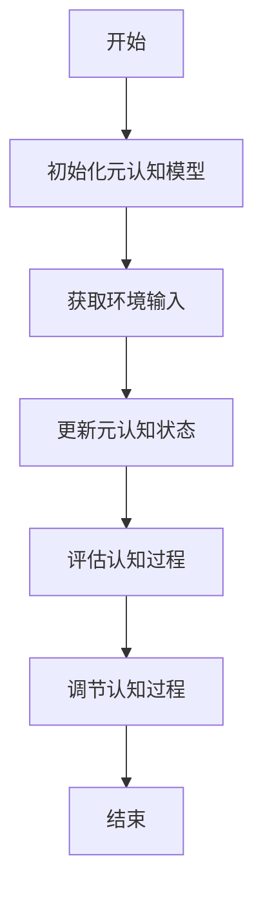
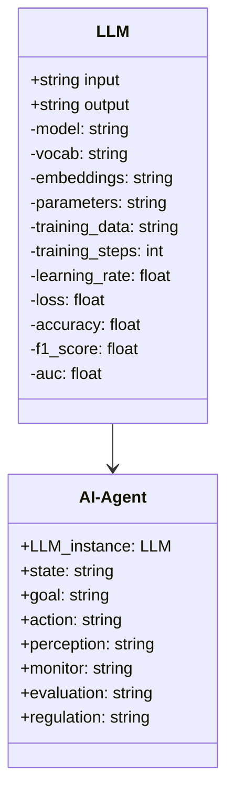
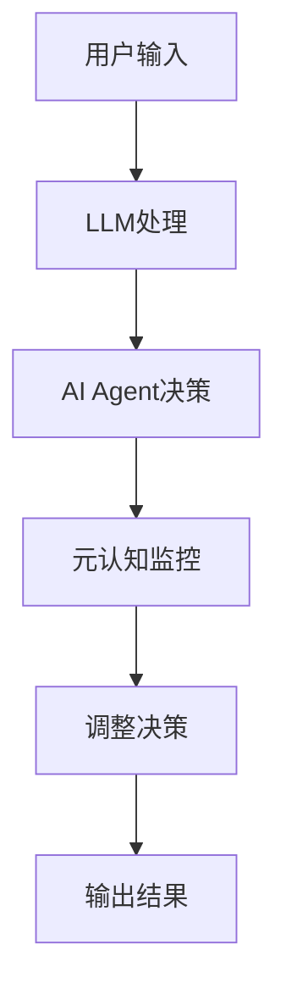
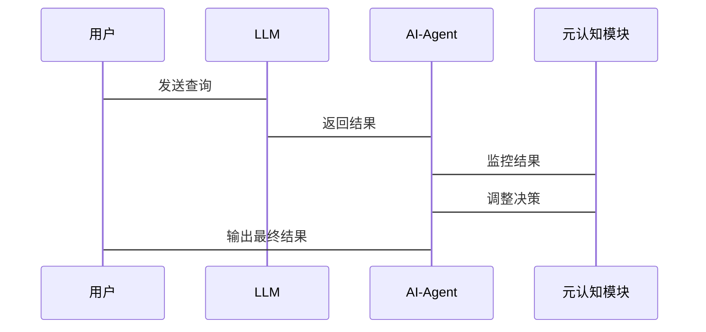

                 


# LLM在AI Agent元认知能力培养中的应用

> 关键词：LLM, AI Agent, 元认知能力, 人工智能, 大语言模型

> 摘要：本文深入探讨了大语言模型（LLM）在AI Agent元认知能力培养中的应用。通过分析LLM与AI Agent的结合，阐述了元认知能力的核心要素、实现方法及其在AI Agent中的作用。文章还详细介绍了元认知能力的算法原理、系统架构设计以及项目实战，为读者提供了全面的理论与实践指导。

---

## 第1章 LLM与AI Agent概述

### 1.1 LLM的基本概念与特点
#### 1.1.1 大语言模型的定义与发展
大语言模型（Large Language Model, LLM）是指基于深度学习技术构建的大型神经网络模型，能够理解和生成人类语言。近年来，随着计算能力的提升和数据量的增加，LLM在自然语言处理（NLP）领域取得了突破性进展，如GPT系列模型。

#### 1.1.2 LLM的核心特点与技术优势
- **大规模训练数据**：LLM通常使用海量文本数据进行训练，能够捕捉语言的复杂模式。
- **自动生成文本**：通过解码机制，LLM可以生成连贯且合理的文本。
- **上下文理解**：LLM能够通过上下文理解语义，支持对话生成和内容创作。

#### 1.1.3 LLM在AI Agent中的应用潜力
AI Agent需要具备理解、推理和决策能力，而LLM提供了强大的语言理解和生成能力，能够增强AI Agent的智能性。

### 1.2 AI Agent的基本概念与分类
#### 1.2.1 AI Agent的定义与功能
AI Agent是一种智能体，能够感知环境、执行任务并做出决策。其核心功能包括感知、推理、规划和执行。

#### 1.2.2 AI Agent的分类与应用场景
- **简单反射型**：基于规则执行任务。
- **基于模型的反应型**：利用环境模型进行决策。
- **目标驱动型**：以目标为导向执行任务。
- **实用驱动型**：根据效用函数优化决策。

#### 1.2.3 AI Agent与传统AI的区别
AI Agent强调自主性和适应性，能够根据环境动态调整行为，而传统AI通常是在静态环境中执行任务。

### 1.3 元认知能力的定义与重要性
#### 1.3.1 元认知能力的定义
元认知能力是指个体对自身认知过程的认知和调控能力，包括监控、评估和调节认知活动。

#### 1.3.2 元认知能力的核心要素
- **自我监控**：监控自身的认知过程。
- **自我评估**：评估认知过程的正确性。
- **自我调节**：根据评估结果调节认知过程。

#### 1.3.3 元认知能力在AI Agent中的作用
元认知能力使AI Agent能够监控自身的行为，评估决策的合理性，并根据需要调整策略，从而提高智能体的适应性和灵活性。

### 1.4 本章小结
本章介绍了LLM和AI Agent的基本概念，分析了元认知能力的定义及其在AI Agent中的重要性，为后续内容奠定了基础。

---

## 第2章 LLM与AI Agent的结合

### 2.1 LLM在AI Agent中的角色
#### 2.1.1 LLM作为知识库的作用
LLM可以作为AI Agent的知识库，提供丰富的语言理解和生成能力，支持智能体完成复杂任务。

#### 2.1.2 LLM作为推理引擎的作用
通过LLM的解码能力，AI Agent可以生成合理的推理结果，提升决策的准确性。

#### 2.1.3 LLM作为对话生成器的作用
LLM支持自然语言对话，使AI Agent能够与人类用户进行流畅的交流。

### 2.2 AI Agent中的元认知能力
#### 2.2.1 元认知能力在AI Agent中的实现
AI Agent通过元认知能力监控自身的认知过程，评估决策的正确性，并根据需要调整策略。

#### 2.2.2 元认知能力与LLM的结合
LLM为AI Agent提供强大的语言处理能力，支持元认知能力的实现。

#### 2.2.3 元认知能力在AI Agent决策中的应用
元认知能力帮助AI Agent在复杂环境中做出更合理的选择，提升智能体的智能化水平。

### 2.3 LLM与AI Agent的协同工作流程
#### 2.3.1 LLM与AI Agent的交互流程
1. AI Agent感知环境，生成任务需求。
2. LLM根据任务需求生成相关信息或决策。
3. AI Agent监控LLM的输出，评估其合理性。
4. 根据评估结果调整任务或决策。

#### 2.3.2 元认知能力在协同中的作用
元认知能力帮助AI Agent监控LLM的输出，评估决策的正确性，并根据需要调整策略。

#### 2.3.3 LLM与AI Agent的优化方向
未来研究可以进一步优化LLM与AI Agent的协同机制，提升元认知能力的智能化水平。

### 2.4 本章小结
本章探讨了LLM在AI Agent中的角色，分析了元认知能力在其中的作用，提出了优化方向。

---

## 第3章 元认知能力的培养与实现

### 3.1 元认知能力的核心要素
#### 3.1.1 自我监控
AI Agent通过自我监控，实时感知自身的认知过程。

#### 3.1.2 自我评估
AI Agent对自身的认知过程进行评估，判断其正确性和有效性。

#### 3.1.3 自我调节
根据评估结果，AI Agent调整自身的认知过程，优化决策和行为。

### 3.2 元认知能力的培养方法
#### 3.2.1 基于LLM的元认知训练
通过LLM的生成能力，训练AI Agent的自我监控和调节能力。

#### 3.2.2 基于AI Agent的元认知训练
AI Agent通过实际任务的执行，不断优化自身的元认知能力。

#### 3.2.3 综合训练方法
结合LLM和AI Agent的优势，设计综合训练方法，提升元认知能力。

### 3.3 元认知能力的实现步骤
#### 3.3.1 确定目标
明确元认知能力的培养目标，如提高决策的准确性。

#### 3.3.2 设计训练方案
根据目标设计训练方案，选择合适的训练数据和方法。

#### 3.3.3 实施与优化
执行训练方案，实时监控效果，并根据反馈进行优化。

### 3.4 本章小结
本章详细探讨了元认知能力的核心要素及其培养方法，为后续实现提供了指导。

---

## 第4章 元认知能力的算法原理

### 4.1 元认知模型的构建
#### 4.1.1 元认知模型的定义
元认知模型是一种用于描述和模拟元认知过程的数学模型。

#### 4.1.2 元认知模型的构建方法
通过分析元认知能力的核心要素，构建能够描述其动态变化的数学模型。

#### 4.1.3 元认知模型的数学表示
元认知模型可以用以下数学公式表示：
$$
C(t) = f(C(t-1), A(t))
$$
其中，$C(t)$ 表示第 $t$ 时刻的元认知状态，$A(t)$ 表示第 $t$ 时刻的环境输入。

### 4.2 LLM在元认知模型中的应用
#### 4.2.1 LLM作为元认知模型的输入
LLM的输出作为元认知模型的输入，提供语言理解和生成能力。

#### 4.2.2 LLM作为元认知模型的输出
元认知模型的输出通过LLM生成自然语言表达，增强人机交互的流畅性。

#### 4.2.3 LLM与元认知模型的交互
LLM与元认知模型协同工作，实现对AI Agent认知过程的监控和调节。

### 4.3 元认知能力的算法实现
#### 4.3.1 算法流程图
以下为元认知能力的算法流程图：



#### 4.3.2 算法的数学模型
元认知能力的算法可以用以下数学公式表示：
$$
R = \theta \cdot C + (1-\theta) \cdot D
$$
其中，$R$ 表示最终的调节结果，$\theta$ 表示调节权重，$C$ 表示当前认知状态，$D$ 表示决策结果。

### 4.4 本章小结
本章详细介绍了元认知模型的构建方法及其在LLM中的应用，为后续系统设计提供了理论基础。

---

## 第5章 系统架构设计

### 5.1 问题场景介绍
本章以一个智能客服系统为例，设计一个基于LLM的AI Agent系统，重点实现其元认知能力。

### 5.2 系统功能设计
#### 5.2.1 领域模型
以下为领域模型的类图：



#### 5.2.2 系统架构设计
以下为系统架构设计的流程图：



### 5.3 系统接口设计
系统接口设计包括：
- LLM与AI Agent的交互接口
- 元认知监控模块的接口
- 用户与AI Agent的交互接口

### 5.4 系统交互设计
以下为系统交互的序列图：



### 5.5 本章小结
本章设计了一个基于LLM的AI Agent系统架构，重点实现其元认知能力，为后续实现奠定了基础。

---

## 第6章 项目实战

### 6.1 环境安装
需要安装以下工具和库：
- Python 3.8+
- transformers库
- numpy库
- torch库
- mermaid-cli

### 6.2 系统核心实现源代码
以下为AI Agent的实现代码：

```python
from transformers import AutoTokenizer, AutoModelForCausalLM
import torch

class LLM:
    def __init__(self, model_name):
        self.tokenizer = AutoTokenizer.from_pretrained(model_name)
        self.model = AutoModelForCausalLM.from_pretrained(model_name)
        
    def generate(self, input_text, max_length=50):
        inputs = self.tokenizer(input_text, return_tensors="pt")
        outputs = self.model.generate(inputs.input_ids, max_length=max_length)
        return self.tokenizer.decode(outputs[0], skip_special_tokens=True)

class AI-Agent:
    def __init__(self, llm):
        self.llm = llm
        self.state = ""
        self.goal = ""
        self.action = ""
        self.monitor = ""
        self.evaluation = ""
        self.regulation = ""
        
    def process(self, input_text):
        self.state = input_text
        self.goal = "提供智能客服服务"
        self.action = self.llm.generate(input_text)
        self.monitor = self.llm.generate(f"监控{input_text}")
        self.evaluation = self.llm.generate(f"评估{input_text}")
        self.regulation = self.llm.generate(f"调节{input_text}")
        return self.regulation
```

### 6.3 代码应用解读与分析
- `LLM`类实现了大语言模型的生成功能。
- `AI-Agent`类通过调用LLM进行决策，并通过元认知能力监控和调节决策过程。

### 6.4 实际案例分析
以用户咨询问题为例，AI Agent通过LLM生成回复，并通过元认知能力监控回复的合理性，根据需要进行调整。

### 6.5 本章小结
本章通过实际案例展示了LLM在AI Agent中的应用，验证了元认知能力的实现效果。

---

## 第7章 总结与展望

### 7.1 本章总结
本文详细探讨了LLM在AI Agent元认知能力培养中的应用，分析了其核心概念、算法原理和系统架构，通过实际案例验证了理论的可行性。

### 7.2 未来展望
未来研究可以进一步优化LLM与AI Agent的协同机制，探索更高级的元认知能力，如情感理解和意图识别。

### 7.3 最佳实践 tips
- 在实际应用中，建议结合具体场景设计元认知能力。
- 定期监控和优化AI Agent的行为，确保其适应性。
- 注重数据质量和多样性，提升LLM的泛化能力。

### 7.4 本章小结
本文总结了研究成果，并展望了未来发展方向，为读者提供了宝贵的参考。

---

## 作者：AI天才研究院/AI Genius Institute & 禅与计算机程序设计艺术 /Zen And The Art of Computer Programming

---

以上是《LLM在AI Agent元认知能力培养中的应用》的完整内容，涵盖了从理论到实践的各个方面，为读者提供了全面的指导。

