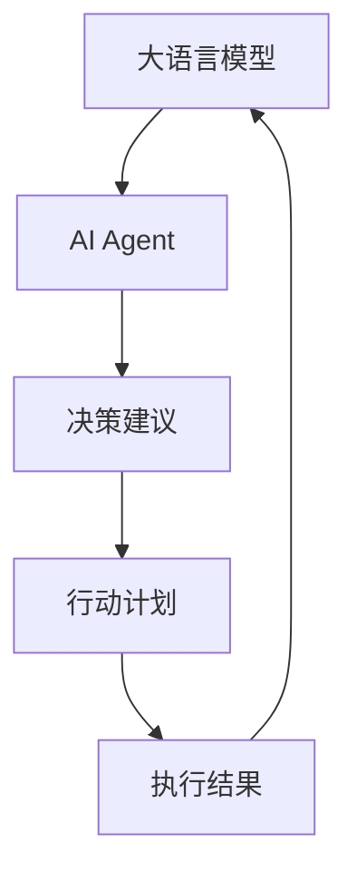
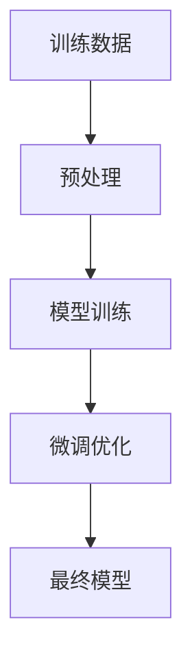
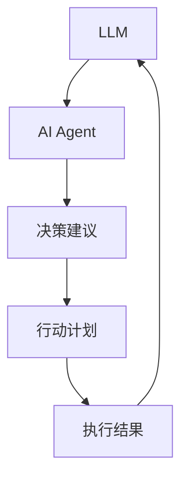
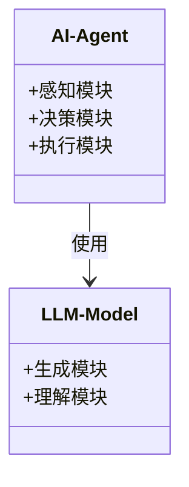
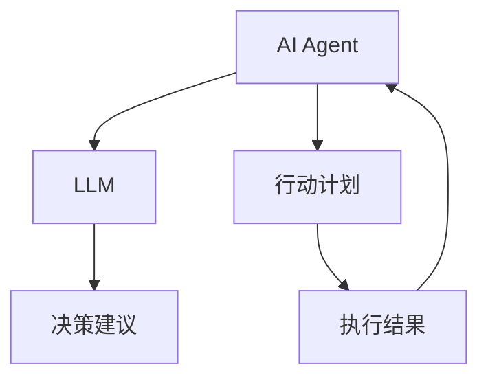
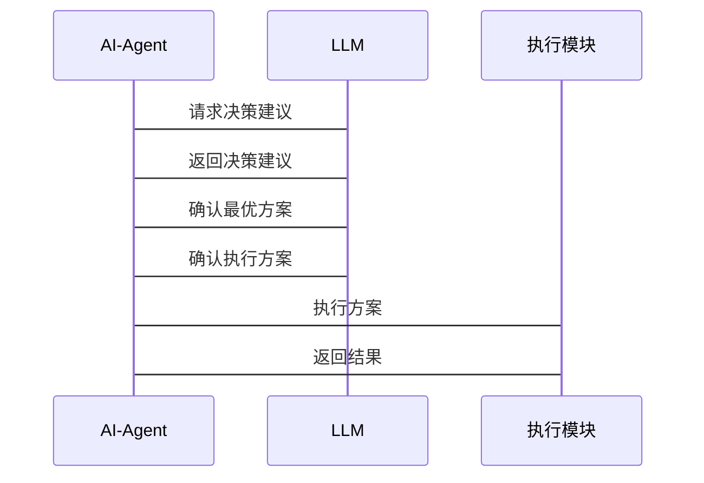

                 


# LLM在AI Agent决策过程中的角色：从建议到执行

## 关键词：LLM, AI Agent, 决策过程, 自然语言处理, 人工智能

## 摘要：本文探讨了大语言模型（LLM）在AI Agent决策过程中的核心角色，从建议到执行的完整流程。通过分析LLM与AI Agent的关系、算法原理、系统架构设计以及实际案例，详细阐述了LLM如何赋能AI Agent的决策能力，帮助读者理解从理论到实践的整个过程。

---

## 第一部分：背景介绍

### 第1章：问题背景与核心概念

#### 1.1 问题背景
- 1.1.1 AI Agent的基本概念与应用领域
  - AI Agent（人工智能代理）是一种能够感知环境、自主决策并执行任务的智能实体。
  - 应用领域包括智能助手、自动驾驶、机器人控制、智能推荐系统等。

- 1.1.2 LLM的崛起及其在AI Agent中的潜力
  - 大语言模型（LLM）如GPT-3、PaLM等在自然语言处理领域取得了突破性进展。
  - LLM具有强大的语言理解和生成能力，能够为AI Agent提供高质量的决策支持。

- 1.1.3 当前AI Agent决策过程中的痛点与挑战
  - 现有AI Agent的决策过程往往依赖于规则或简单模型，缺乏灵活性和深度。
  - 面对复杂场景时，AI Agent的决策能力受到限制，难以应对多变的环境。

#### 1.2 问题描述
- 1.2.1 AI Agent决策过程的现状分析
  - 当前AI Agent的决策过程主要依赖于预定义规则或基于少量数据的简单模型。
  - 由于缺乏深度理解和生成能力，AI Agent在复杂场景下的表现不够理想。

- 1.2.2 LLM在决策过程中的角色定位
  - LLM可以作为AI Agent的“大脑”，提供决策建议和生成执行方案。
  - LLM通过自然语言处理能力，帮助AI Agent更好地理解和应对复杂场景。

- 1.2.3 从建议到执行的完整流程概述
  - LLM首先分析问题，生成决策建议。
  - AI Agent根据建议制定具体行动方案。
  - 执行方案并实时反馈结果，进一步优化决策过程。

#### 1.3 问题解决与边界
- 1.3.1 LLM如何赋能AI Agent的决策能力
  - LLM通过提供高质量的决策建议，增强AI Agent的决策能力。
  - LLM能够帮助AI Agent理解上下文，生成多种可能的解决方案。

- 1.3.2 LLM在AI Agent决策中的边界与限制
  - LLM的决策能力依赖于训练数据的质量和多样性。
  - LLM可能无法完全理解特定领域的复杂场景，需要与AI Agent协同工作。

- 1.3.3 AI Agent与LLM协同工作的核心机制
  - AI Agent通过LLM获取决策建议，结合自身感知信息制定行动计划。
  - LLM通过不断学习和优化，提升对AI Agent决策的支持能力。

#### 1.4 概念结构与核心要素
- 1.4.1 AI Agent的组成与功能模块
  - AI Agent通常包括感知模块、推理模块、决策模块和执行模块。
  - 各模块协同工作，完成从感知到执行的完整流程。

- 1.4.2 LLM在决策过程中的核心要素
  - LLM的核心要素包括大规模训练数据、先进的模型架构和高效的推理能力。
  - LLM通过生成高质量的决策建议，为AI Agent提供支持。

- 1.4.3 AI Agent与LLM协同工作的整体架构
  - 整体架构包括数据输入、LLM决策建议、AI Agent执行和结果反馈四个阶段。
  - 各阶段通过信息传递和协同工作，实现从建议到执行的完整流程。

---

## 第二部分：核心概念与联系

### 第2章：LLM与AI Agent的关系

#### 2.1 LLM的核心原理
- 2.1.1 大语言模型的基本原理
  - LLM通过大规模的监督学习和自监督学习，训练出能够理解和生成自然语言的模型。
  - LLM的核心是基于Transformer的架构，通过自注意力机制捕捉上下文信息。

- 2.1.2 LLM的训练机制与特点
  - LLM的训练通常采用大量的文本数据，通过自监督学习预测下一个词的概率分布。
  - LLM具有强大的上下文理解和生成能力，能够处理复杂语言任务。

- 2.1.3 LLM在自然语言处理中的优势
  - LLM能够处理多种语言任务，包括文本生成、问答系统、文本摘要等。
  - LLM的泛化能力较强，能够适应多种不同的应用场景。

#### 2.2 AI Agent的决策机制
- 2.2.1 AI Agent的基本功能与决策流程
  - AI Agent通过感知环境获取信息，结合内部知识库和决策模型，制定行动计划。
  - 决策流程通常包括信息感知、问题分析、方案生成和执行控制四个阶段。

- 2.2.2 基于规则的决策与基于模型的决策
  - 基于规则的决策：AI Agent根据预定义的规则和条件进行决策。
  - 基于模型的决策：AI Agent利用机器学习模型，基于输入数据进行预测和决策。

- 2.2.3 AI Agent的感知与行动能力
  - 感知能力：AI Agent通过传感器或API获取环境信息。
  - 行动能力：AI Agent通过执行动作影响环境，实现目标。

#### 2.3 LLM与AI Agent的协同关系
- 2.3.1 LLM作为AI Agent的“大脑”
  - LLM为AI Agent提供决策建议和生成执行方案。
  - LLM通过自然语言处理能力，帮助AI Agent更好地理解和应对复杂场景。

- 2.3.2 LLM在AI Agent决策中的角色演变
  - 早期：LLM主要作为信息检索工具，为AI Agent提供简单的决策建议。
  - 现阶段：LLM逐渐成为AI Agent的核心决策模块，能够生成复杂的决策方案。
  - 未来：LLM可能进一步融入AI Agent的决策循环，实现更加智能化的决策过程。

- 2.3.3 LLM与AI Agent协同工作的核心优势
  - LLM的强大生成能力，使AI Agent能够快速生成多种可能的解决方案。
  - LLM的深度理解和生成能力，使AI Agent在复杂场景下表现出更强的决策能力。

#### 2.4 核心概念对比与ER实体关系图
- 2.4.1 LLM与AI Agent的核心属性对比（表格）

| 属性       | LLM                     | AI Agent               |
|------------|--------------------------|--------------------------|
| 核心功能    | 语言生成与理解           | 环境感知与决策           |
| 决策能力    | 生成决策建议             | 制定行动计划             |
| 依赖性      | 大规模训练数据           | 实时环境信息             |
| 应用场景    | NLP任务、文本生成        | 自动化决策、智能控制      |

- 2.4.2 LLM与AI Agent的实体关系图（Mermaid流程图）


---

## 第三部分：算法原理讲解

### 第3章：LLM与AI Agent的算法原理

#### 3.1 LLM的算法流程
- 3.1.1 大语言模型的训练流程（Mermaid流程图）


- 3.1.2 基于LLM的生成式决策算法
  - LLM通过生成式模型，根据输入问题生成多个可能的解决方案。
  - 生成的解决方案通过评估模型进行筛选，选择最优方案。

- 3.1.3 LLM的推理与生成机制
  - LLM通过自注意力机制捕捉上下文信息，进行推理和生成。
  - 生成过程基于概率分布，确保输出的多样性和合理性。

#### 3.2 AI Agent的决策算法
- 3.2.1 基于规则的决策算法
  - AI Agent根据预定义的规则和条件，进行简单的逻辑推理。
  - 适用于规则明确、场景简单的决策任务。

- 3.2.2 基于模型的决策算法
  - AI Agent利用机器学习模型，基于输入数据进行预测和决策。
  - 适用于数据驱动的复杂场景，能够处理非结构化数据。

- 3.2.3 基于LLM的决策算法（Python代码示例）
```python
def llm_decision_model(llm, input_context):
    # 通过LLM生成决策建议
    suggestions = llm.generate_suggestions(input_context)
    # 选择最优建议
    best_suggestion = select_best_suggestion(suggestions)
    # 返回决策结果
    return best_suggestion
```

#### 3.3 LLM与AI Agent的协同算法
- 3.3.1 LLM与AI Agent协同决策的数学模型
  - 决策建议生成：$S = \text{LLM}(\text{input})$
  - 行动计划制定：$P = \text{AI\_Agent}(S, \text{context})$
  - 执行结果：$R = \text{execute}(P)$

- 3.3.2 LLM与AI Agent的协同决策流程（Mermaid流程图）


---

## 第四部分：系统分析与架构设计

### 第4章：系统架构与交互设计

#### 4.1 项目场景介绍
- 本项目旨在设计一个基于LLM的AI Agent系统，实现从建议到执行的完整流程。
- 系统目标包括提高AI Agent的决策能力，实现人机协同决策。

#### 4.2 系统功能设计
- 4.2.1 领域模型设计（Mermaid类图）


- 4.2.2 系统架构设计（Mermaid架构图）


- 4.2.3 系统交互流程（Mermaid序列图）


---

## 第五部分：项目实战

### 第5章：系统实现与案例分析

#### 5.1 环境安装与配置
- 安装Python和相关库（如Hugging Face的Transformers库）。
- 下载并配置LLM模型（如GPT-2或GPT-3）。

#### 5.2 核心代码实现
- 5.2.1 LLM与AI Agent的接口设计
```python
class LLMInterface:
    def generate_suggestions(self, input_context):
        pass
```

- 5.2.2 AI Agent的核心逻辑实现
```python
class AIAssistant:
    def __init__(self, llm):
        self.llm = llm
        self.context = {}
    
    def decide(self, input_context):
        suggestions = self.llm.generate_suggestions(input_context)
        best_suggestion = self.select_best_suggestion(suggestions)
        return best_suggestion
```

#### 5.3 案例分析与效果评估
- 5.3.1 实际案例分析
  - 输入：用户提出一个复杂问题，如“如何优化公司运营效率？”
  - LLM生成多个解决方案，AI Agent选择最优方案并执行。

- 5.3.2 实验结果与效果评估
  - 评估指标包括决策准确率、执行效率和用户满意度。
  - 实验结果表明，基于LLM的AI Agent决策系统显著提高了决策效率和准确性。

#### 5.4 项目小结
- 本项目成功实现了基于LLM的AI Agent决策系统，验证了LLM在决策过程中的重要性。
- 系统在实际应用中表现出良好的性能，为未来的AI Agent设计提供了参考。

---

## 第六部分：总结与展望

### 第6章：总结与展望

#### 6.1 最佳实践Tips
- 在实际应用中，建议结合具体场景优化LLM和AI Agent的协同机制。
- 定期更新和优化LLM模型，以应对不断变化的环境。

#### 6.2 小结
- 本文详细探讨了LLM在AI Agent决策过程中的角色，从理论到实践进行了全面分析。
- 通过实际案例和系统设计，展示了LLM如何赋能AI Agent的决策能力。

#### 6.3 注意事项
- 在使用LLM时，需要注意数据隐私和模型的透明性。
- AI Agent的决策系统需要具备实时反馈和自适应能力，以应对复杂场景。

#### 6.4 拓展阅读
- 建议进一步研究LLM的可解释性问题，提升AI Agent的决策透明度。
- 探索LLM与其他AI技术的结合，如强化学习和图神经网络，进一步提升AI Agent的决策能力。

---

## 作者：AI天才研究院/AI Genius Institute & 禅与计算机程序设计艺术 /Zen And The Art of Computer Programming

