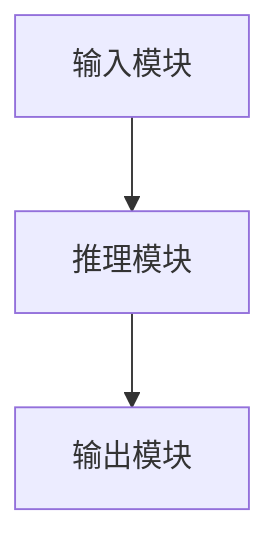
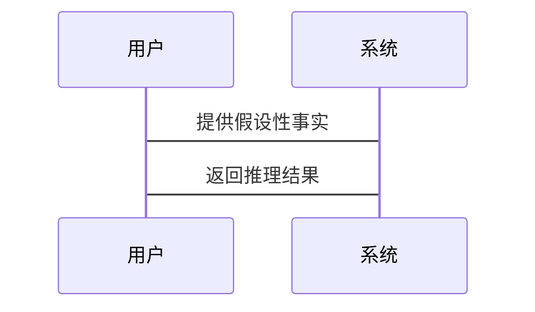

                 


# LLM在AI Agent反事实推理中的应用

> 关键词：反事实推理, 大语言模型, AI Agent, 自然语言处理, 人工智能, 逻辑推理

> 摘要：本文探讨了如何利用大语言模型（LLM）在AI Agent中实现反事实推理。通过分析反事实推理的核心概念、算法原理、系统架构设计以及实际项目案例，本文详细阐述了LLM在反事实推理中的应用及其优势，为AI Agent的开发提供了新的思路和方法。

---

# 第一部分: LLM在AI Agent反事实推理中的应用背景介绍

## 第1章: 反事实推理的定义与特点

### 1.1 反事实推理的定义与特点

#### 1.1.1 反事实推理的定义
反事实推理是一种基于假设性事实的推理方式，即通过假设某个事实与实际情况相反，推导出可能的结果或影响。例如，在医疗领域，医生可以通过反事实推理来评估不同治疗方案的效果。

#### 1.1.2 反事实推理的核心特点
1. **假设性**：反事实推理基于假设的事实进行推理。
2. **逻辑性**：推理过程需要遵循逻辑规则，确保结果的合理性。
3. **多样性**：可以应用于多个领域，如医疗、金融、教育等。

#### 1.1.3 反事实推理在AI Agent中的作用
1. **决策优化**：通过反事实推理，AI Agent可以评估不同决策的后果，从而做出更优化的选择。
2. **风险评估**：在金融领域，AI Agent可以通过反事实推理评估不同投资策略的风险。

---

## 第2章: 大语言模型（LLM）的定义与特点

### 2.1 LLM的定义与特点

#### 2.1.1 LLM的定义
大语言模型（LLM）是一种基于深度学习的自然语言处理模型，能够理解和生成人类语言。例如，GPT系列模型。

#### 2.1.2 LLM的核心特点
1. **大规模数据训练**：LLM通常基于海量数据训练，具有强大的语言理解能力。
2. **生成能力**：能够生成自然流畅的文本，适用于多种任务。
3. **上下文理解**：能够根据上下文理解语义，回答复杂问题。

#### 2.1.3 LLM与传统NLP模型的区别
- **传统NLP模型**：通常针对特定任务训练，如关键词提取、情感分析。
- **LLM**：通用性强，能够处理多种任务，无需额外训练。

---

## 第3章: 反事实推理与LLM的结合

### 3.1 反事实推理与LLM的联系

#### 3.1.1 反事实推理需要LLM的支持
反事实推理需要生成大量假设性文本，而LLM能够高效生成符合逻辑的文本。

#### 3.1.2 LLM为反事实推理提供数据支持
LLM通过海量数据训练，能够理解不同场景下的假设性事实。

#### 3.1.3 LLM为反事实推理提供推理能力
LLM的自然语言理解能力使其能够支持复杂的逻辑推理。

---

### 3.2 反事实推理与LLM的区别

#### 3.2.1 反事实推理的核心任务
- 评估假设性事实的影响。
- 推导可能的结果。

#### 3.2.2 LLM的核心任务
- 理解人类语言。
- 生成符合逻辑的文本。

#### 3.2.3 两者任务的差异与互补
- 反事实推理需要逻辑推理能力，而LLM提供这种能力。
- 两者结合能够实现复杂的假设性推理任务。

---

## 第4章: 反事实推理与LLM的结合模型

### 4.1 反事实推理与LLM结合的模型框架

#### 4.1.1 模型框架概述
1. **输入**：假设性事实或问题。
2. **处理**：LLM生成可能的后果或影响。
3. **输出**：推理结果。

#### 4.1.2 模型框架的实现步骤
1. **输入处理**：将假设性事实输入LLM。
2. **推理过程**：LLM生成可能的结果。
3. **结果输出**：展示推理结果。

---

### 4.2 反事实推理与LLM结合的实现流程

#### 4.2.1 输入处理
- 假设性事实：例如“如果今天下雨，那么会议是否会延迟？”

#### 4.2.2 推理过程
- LLM生成可能的结果：会议可能延迟，交通不便。

#### 4.2.3 结果输出
- 最终结论：会议可能延迟，建议提前安排备用计划。

---

## 第5章: 反事实推理与LLM结合的优势与挑战

### 5.1 优势

#### 5.1.1 高效性
- LLM能够快速生成假设性文本，提高推理效率。

#### 5.1.2 多领域适用性
- 反事实推理适用于多个领域，LLM能够适应不同场景。

### 5.2 挑战

#### 5.2.1 数据质量问题
- 假设性事实的准确性可能影响推理结果。

#### 5.2.2 推理的不确定性
- 反事实推理的结果往往存在不确定性，需要谨慎处理。

---

# 第二部分: 反事实推理与LLM的核心算法原理

## 第6章: 反事实推理的算法原理

### 6.1 反事实推理的基本算法

#### 6.1.1 基于逻辑推理的算法
- 通过逻辑规则推导可能的结果。

#### 6.1.2 基于概率推理的算法
- 使用概率模型评估不同结果的可能性。

---

### 6.2 LLM在反事实推理中的应用

#### 6.2.1 基于生成模型的反事实推理
- LLM生成假设性文本，模拟不同场景的结果。

---

## 第7章: LLM的算法原理

### 7.1 LLM的核心算法

#### 7.1.1 基于Transformer的模型
- 使用自注意力机制生成文本。

---

### 7.2 LLM在反事实推理中的应用

#### 7.2.1 基于生成模型的反事实推理
- LLM生成假设性事实的结果。

---

# 第三部分: 系统分析与架构设计方案

## 第8章: 系统分析与架构设计

### 8.1 问题场景介绍

#### 8.1.1 问题背景
- 在医疗领域，医生需要评估不同治疗方案的效果。

#### 8.1.2 问题描述
- 如何通过反事实推理评估不同治疗方案的风险和效果。

---

### 8.2 系统功能设计

#### 8.2.1 系统功能模块
- **输入模块**：接收假设性事实。
- **推理模块**：生成可能的结果。
- **输出模块**：展示推理结果。

---

### 8.3 系统架构设计

#### 8.3.1 系统架构图


---

### 8.4 系统接口设计

#### 8.4.1 输入接口
- 接收假设性事实的输入。

#### 8.4.2 输出接口
- 展示推理结果。

---

### 8.5 系统交互流程

#### 8.5.1 交互流程图


---

## 第9章: 项目实战

### 9.1 环境安装

#### 9.1.1 环境配置
- 安装Python 3.8及以上版本。
- 安装必要的库：`transformers`, `torch`.

---

### 9.2 核心实现代码

#### 9.2.1 代码实现
```python
from transformers import GPT2LMHeadModel, GPT2Tokenizer
import torch

# 初始化模型
model_name = "gpt2"
tokenizer = GPT2Tokenizer.from_pretrained(model_name)
model = GPT2LMHeadModel.from_pretrained(model_name)

# 定义输入
input_text = "如果今天下雨，会议是否会延迟？"

# 编码输入
input_ids = tokenizer.encode(input_text, return_tensors="pt")

# 生成假设性文本
output = model.generate(
    input_ids,
    max_length=50,
    temperature=0.7,
    top_p=0.9,
    no_repeat_ngram_size=2
)

# 解码输出
response = tokenizer.decode(output[0], skip_special_tokens=True)
print(response)
```

---

### 9.3 案例分析

#### 9.3.1 案例背景
- 医疗领域，评估不同治疗方案的效果。

#### 9.3.2 实施步骤
1. 输入假设性事实：患者不按时服药。
2. 生成可能的结果：病情加重。

---

## 第10章: 最佳实践、小结、注意事项与拓展阅读

### 10.1 最佳实践

#### 10.1.1 数据质量
- 确保输入数据的准确性，避免推理错误。

#### 10.1.2 推理结果的验证
- 对生成的假设性结果进行验证，确保逻辑合理。

---

### 10.2 小结

本文详细探讨了LLM在AI Agent反事实推理中的应用，从理论到实践，系统介绍了如何利用LLM实现反事实推理。

---

### 10.3 注意事项

1. **数据质量**：确保输入数据的准确性。
2. **推理结果的验证**：对生成的假设性结果进行验证。

---

### 10.4 拓展阅读

1. [《The Anatomy of Large Language Models》](https://arxiv.org/abs/2303.2155)
2. [《Transformers: A tutorial》](https://transformers.huggingface.co)

---

# 结论

通过本文的分析，我们可以看到，LLM在AI Agent反事实推理中的应用具有巨大的潜力。未来，随着模型性能的提升和算法的优化，反事实推理将在更多领域得到广泛应用。

---

作者：AI天才研究院/AI Genius Institute & 禅与计算机程序设计艺术 /Zen And The Art of Computer Programming

