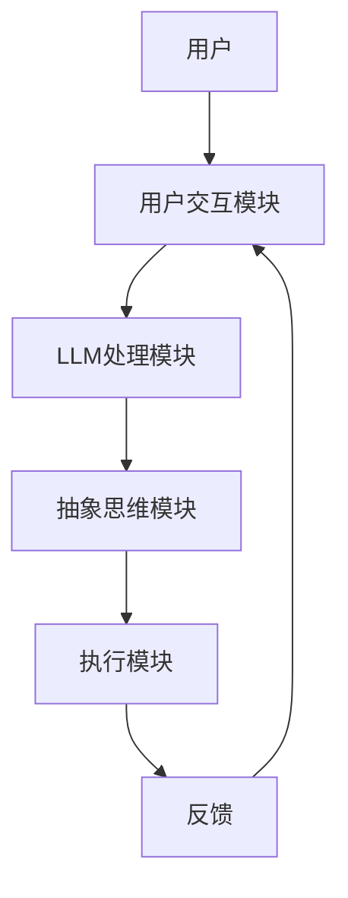
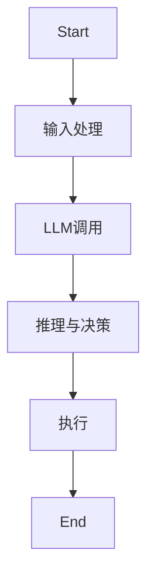

                 


# LLM在AI Agent抽象思维形成中的应用

> 关键词：LLM, AI Agent, 抽象思维, 自然语言处理, 人工智能, 系统架构

> 摘要：本文探讨了大语言模型（LLM）在AI Agent抽象思维形成中的应用，分析了LLM的核心原理、AI Agent的定义与架构，详细讲解了LLM在抽象思维中的具体应用，并通过系统架构设计、算法实现和项目实战，展示了如何利用LLM提升AI Agent的抽象思维能力。本文还提供了最佳实践和优化建议，为读者提供了全面的指导。

---

# 第一部分：引言

## 第1章：问题背景与应用现状

### 1.1 问题背景

#### 1.1.1 从传统AI到AI Agent的演进
- 传统AI的局限性：基于规则的系统难以应对复杂场景。
- AI Agent的出现：具有自主决策和问题解决能力的智能体。
- LLM的引入：为AI Agent提供强大的自然语言处理能力。

#### 1.1.2 LLM在AI Agent中的核心作用
- 提供自然语言理解和生成能力。
- 支持复杂场景下的推理和决策。
- 实现人机交互的自然化。

#### 1.1.3 当前LLM与AI Agent结合的主要挑战
- 抽象思维能力的缺失。
- 多模态数据处理能力不足。
- 系统架构的复杂性。

### 1.2 问题描述与目标

#### 1.2.1 LLM在AI Agent中的具体问题
- 如何利用LLM构建抽象思维能力。
- LLM与AI Agent的集成方法。
- 抽象思维能力的评估标准。

#### 1.2.2 AI Agent抽象思维形成的关键问题
- 抽象思维的定义与特征。
- LLM在抽象思维中的应用边界。
- 抽象思维能力的实现路径。

#### 1.2.3 本书的研究目标与范围
- 探讨LLM在AI Agent中的应用。
- 分析抽象思维形成的机制。
- 提供系统架构和实现方案。

### 1.3 问题解决与技术路线

#### 1.3.1 LLM在AI Agent中的技术路线
- LLM作为核心模块的集成。
- 抽象思维能力的构建方法。
- 系统架构的设计与优化。

#### 1.3.2 AI Agent抽象思维形成的技术实现
- 基于LLM的推理框架。
- 多模态数据融合方法。
- 抽象思维能力的评估与优化。

#### 1.3.3 本书的结构安排
- 各章节的主要内容概述。
- 从理论到实践的逻辑安排。
- 从基础到高级的递进式结构。

### 1.4 本章小结

#### 1.4.1 核心问题总结
- LLM与AI Agent的结合是当前研究热点。
- 抽象思维能力的形成是关键问题。

#### 1.4.2 技术路线总结
- 以LLM为核心，构建AI Agent的抽象思维能力。
- 通过系统架构优化实现能力提升。

#### 1.4.3 本书结构总结
- 引言部分明确了研究目标和问题。
- 后续章节将逐步展开理论和实践内容。

---

## 第2章：LLM的定义与特点

### 2.1 LLM的定义

#### 2.1.1 大语言模型的定义
- LLM：基于深度学习的大型神经网络模型，用于处理自然语言数据。
- 核心特点：大规模训练数据、自注意力机制、生成能力。

#### 2.1.2 LLM的核心特点
- 大规模参数：通常拥有 billions级别的参数。
- 自监督学习：通过预训练任务（如Masked LM）学习语言规律。
- 多任务能力：可以处理多种NLP任务（如分类、生成、问答等）。

#### 2.1.3 LLM与传统NLP模型的区别
- 模型规模：参数量更大，训练数据更广泛。
- 任务适应性：支持零样本和小样本学习。
- 表达能力：能够捕捉更复杂的语言模式。

### 2.2 LLM的训练原理

#### 2.2.1 基于Transformer的模型结构
- Transformer架构：由编码器和解码器组成。
- 自注意力机制：捕捉序列中的全局依赖关系。

#### 2.2.2 自监督学习与预训练
- 预训练任务：如Masked LM（遮蔽语言模型）。
- 目标：学习语言的分布和上下文关系。

#### 2.2.3 微调与适应特定任务
- 微调：在特定任务上进行有监督训练。
- 适应性：通过任务特定的优化调整模型。

### 2.3 LLM的应用领域

#### 2.3.1 自然语言处理任务
- 文本生成、问答系统、机器翻译等。

#### 2.3.2 AI Agent中的语言交互
- 人机对话、意图识别、多轮交互等。

#### 2.3.3 LLM在抽象思维中的应用
- 抽象推理、概念形成、知识整合等。

### 2.4 本章小结

#### 2.4.1 LLM的核心概念总结
- LLM基于Transformer架构，通过自监督学习进行预训练。

#### 2.4.2 LLM在AI Agent中的潜力
- 提供强大的语言理解和生成能力，支持复杂的交互和推理。

#### 2.4.3 本章内容回顾
- 介绍了LLM的定义、训练原理和主要应用领域。

---

## 第3章：AI Agent的定义与架构

### 3.1 AI Agent的定义

#### 3.1.1 AI Agent的定义
- AI Agent：具有感知环境、自主决策和执行任务能力的智能体。
- 核心特征：主动性、反应性、目标导向。

#### 3.1.2 基于任务的AI Agent分类
- 监督式Agent：基于外部指令执行任务。
- � 强化学习式Agent：通过与环境互动学习策略。
- 混合式Agent：结合监督和强化学习方法。

#### 3.1.3 基于智能水平的AI Agent分类
- 感知型Agent：处理感知数据，执行简单任务。
- 理解型Agent：具备一定理解能力，执行复杂任务。
- 抽象型Agent：具备抽象思维能力，解决复杂问题。

### 3.2 AI Agent的核心功能

#### 3.2.1 问题理解与分析
- 解释用户需求，识别问题的关键点。
- 通过LLM进行意图识别和需求分析。

#### 3.2.2 信息处理与推理
- 整合多源信息，进行逻辑推理。
- 基于LLM进行知识推理和逻辑推理。

#### 3.2.3 行动决策与执行
- 根据推理结果制定行动方案。
- 执行决策并反馈结果。

### 3.3 AI Agent的抽象思维能力

#### 3.3.1 抽象思维的定义与特征
- 抽象思维：超越具体实例，理解概念和关系的能力。
- 特征：概括性、关联性、层次性。

#### 3.3.2 LLM在AI Agent抽象思维中的作用
- 提供概念理解和生成能力。
- 支持逻辑推理和关联分析。
- 实现抽象层次的表达和处理。

#### 3.3.3 抽象思维能力的评估标准
- 概念理解的准确性。
- 推理的逻辑性。
- 行为的合理性。

### 3.4 本章小结

#### 3.4.1 AI Agent的核心功能总结
- 问题理解、信息处理和行动决策是AI Agent的核心功能。

#### 3.4.2 抽象思维能力的重要性
- 抽象思维能力是AI Agent智能化的关键。

#### 3.4.3 本章内容回顾
- 介绍了AI Agent的定义、分类和核心功能。
- 强调了抽象思维能力在AI Agent中的重要性。

---

## 第4章：LLM在AI Agent抽象思维中的应用

### 4.1 LLM与AI Agent的结合

#### 4.1.1 LLM作为核心模块的集成
- 在AI Agent中嵌入LLM模块。
- 利用LLM进行语言理解和生成。

#### 4.1.2 抽象思维能力的构建
- 利用LLM进行概念学习和推理。
- 支持多模态数据的融合与处理。

#### 4.1.3 抽象思维能力的评估与优化
- 设计评估指标，如准确率、响应时间。
- 通过反馈优化LLM的表现。

### 4.2 抽象思维能力的具体应用

#### 4.2.1 基于LLM的推理框架
- 建立推理模型，支持逻辑推理。
- 利用LLM进行知识整合和关联分析。

#### 4.2.2 多模态数据的处理
- 整合文本、图像、语音等多种数据类型。
- 利用LLM进行跨模态理解和生成。

#### 4.2.3 抽象层次的表达与处理
- 支持概念级别的表达。
- 处理抽象层次的推理和决策。

### 4.3 应用案例分析

#### 4.3.1 任务型AI Agent
- 在特定任务中应用LLM进行抽象思维。
- 如智能客服中的问题解决。

#### 4.3.2 通用型AI Agent
- 在复杂场景中应用LLM进行抽象思维。
- 如智能助手的多任务处理。

#### 4.3.3 领域专用型AI Agent
- 在特定领域（如医疗、金融）中应用LLM。
- 通过领域知识增强抽象思维能力。

### 4.4 本章小结

#### 4.4.1 LLM在AI Agent中的应用总结
- LLM为AI Agent提供了强大的语言理解和生成能力。
- 抽象思维能力的构建是关键。

#### 4.4.2 应用案例的启示
- 不同类型AI Agent对LLM的需求不同。
- 领域知识的整合是提升抽象思维能力的重要手段。

#### 4.4.3 本章内容回顾
- 探讨了LLM在AI Agent中的具体应用。
- 通过案例分析展示了不同场景下的应用方法。

---

## 第5章：系统架构与实现

### 5.1 系统架构设计

#### 5.1.1 系统功能模块划分
- 用户交互模块：处理用户输入。
- LLM处理模块：进行语言理解和生成。
- 抽象思维模块：进行概念推理和决策。
- 执行模块：根据推理结果执行行动。

#### 5.1.2 系统架构的mermaid图


#### 5.1.3 模块之间的交互流程
- 用户输入通过交互模块传递给LLM处理模块。
- LLM处理模块进行语言理解和生成，传递给抽象思维模块。
- 抽象思维模块进行推理和决策，传递给执行模块。
- 执行模块执行行动并反馈结果。

### 5.2 算法实现

#### 5.2.1 算法的mermaid流程图


#### 5.2.2 算法的Python代码实现
```python
def llm_agent(input):
    # 输入处理
    processed_input = preprocess(input)
    
    # LLM调用
    response = call_llm(processed_input)
    
    # 推理与决策
    decision = make_decision(response)
    
    # 执行
    execute(decision)
```

#### 5.2.3 数学模型的详细讲解
- 输入处理：将输入转化为模型可接受的格式。
- LLM调用：通过API调用LLM进行处理。
- 推理与决策：基于LLM的输出进行逻辑推理，生成决策。
- 执行：根据决策执行具体操作。

### 5.3 本章小结

#### 5.3.1 系统架构总结
- 分模块设计，明确各模块的功能和交互流程。

#### 5.3.2 算法实现总结
- 通过分步骤实现，确保系统的可扩展性和可维护性。

#### 5.3.3 本章内容回顾
- 介绍了系统的架构设计和算法实现。
- 通过图表和代码展示了系统的具体实现方法。

---

## 第6章：项目实战与优化

### 6.1 项目环境安装

#### 6.1.1 需要的工具与库
- Python：3.8+
- LLM框架：如Hugging Face的GPT模型。
- 其他依赖：如 requests、numpy。

#### 6.1.2 环境配置
```bash
pip install python-gpt transformers requests
```

### 6.2 系统核心实现

#### 6.2.1 代码实现
```python
from transformers import GPT2Tokenizer, GPT2ModelWithLMHead
import requests

def preprocess(input_str):
    return input_str

def call_llm(processed_input):
    # 调用LLM API
    response = requests.post("http://localhost:5000/api/predict", json={"input": processed_input})
    return response.json()['output']

def make_decision(response):
    # 简单的决策逻辑
    if 'yes' in response.lower():
        return 'execute_task'
    else:
        return 'abort'

def execute(action):
    print(f"Executing action: {action}")

def main():
    input_str = input("请输入指令：")
    processed_input = preprocess(input_str)
    response = call_llm(processed_input)
    decision = make_decision(response)
    execute(decision)

if __name__ == "__main__":
    main()
```

#### 6.2.2 代码解读
- `preprocess`函数：对输入进行预处理。
- `call_llm`函数：通过API调用LLM进行处理。
- `make_decision`函数：根据LLM的输出生成决策。
- `execute`函数：根据决策执行具体操作。
- `main`函数：主程序入口。

### 6.3 项目优化

#### 6.3.1 系统性能优化
- 提高LLM调用的效率。
- 优化决策逻辑，减少错误率。

#### 6.3.2 系统可扩展性优化
- 设计模块化的架构，便于功能扩展。
- 支持多种LLM模型的切换。

### 6.4 本章小结

#### 6.4.1 项目实战总结
- 通过实际项目展示了系统的设计与实现。
- 强调了代码实现的重要性。

#### 6.4.2 优化建议总结
- 从性能和可扩展性两方面进行优化。

#### 6.4.3 本章内容回顾
- 介绍了项目环境的安装和核心代码的实现。
- 提供了系统的优化建议。

---

## 第7章：总结与展望

### 7.1 总结

#### 7.1.1 核心观点总结
- LLM为AI Agent提供了强大的语言处理能力。
- 抽象思维能力的构建是关键。

#### 7.1.2 主要内容回顾
- 从理论到实践，系统地探讨了LLM在AI Agent中的应用。

### 7.2 展望

#### 7.2.1 未来的研究方向
- 提升LLM的抽象思维能力。
- 探索多模态数据的处理方法。
- 优化系统架构，提升性能。

#### 7.2.2 技术发展趋势
- 更强大的LLM模型。
- 更复杂的多模态处理能力。
- 更智能化的AI Agent系统。

### 7.3 本章小结

#### 7.3.1 总结部分
- 重申了LLM在AI Agent中的重要性。

#### 7.3.2 对未来的展望
- 展望了技术发展的可能性。

---

## 附录

### 附录A：数学公式总结

### 附录B：工具与资源

---

## 参考文献

---

作者：AI天才研究院/AI Genius Institute & 禅与计算机程序设计艺术 /Zen And The Art of Computer Programming

