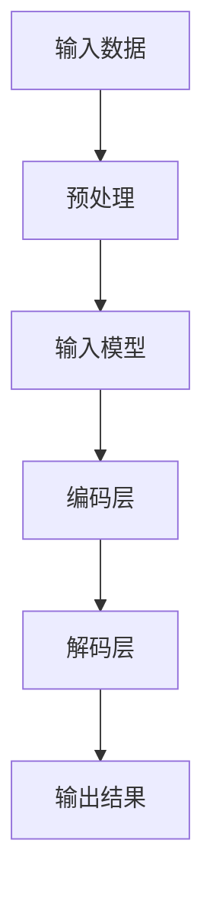
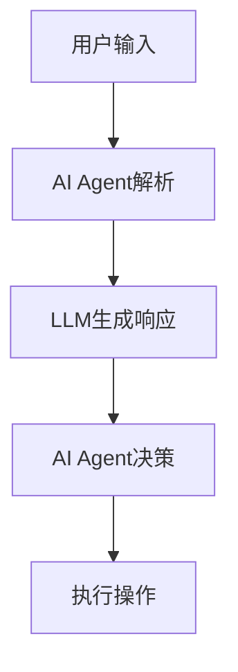
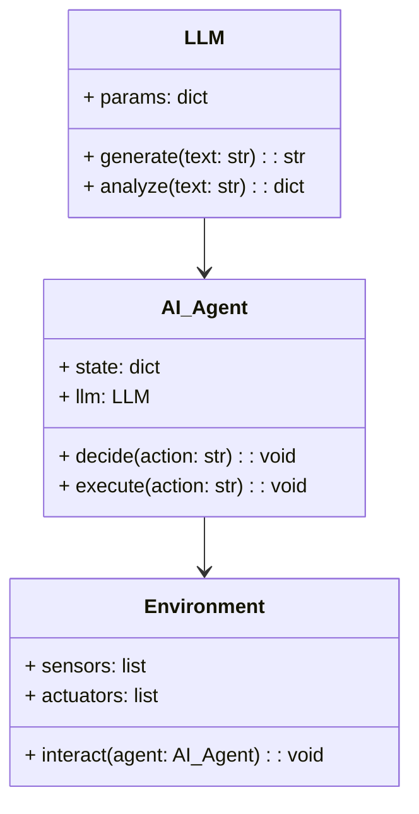
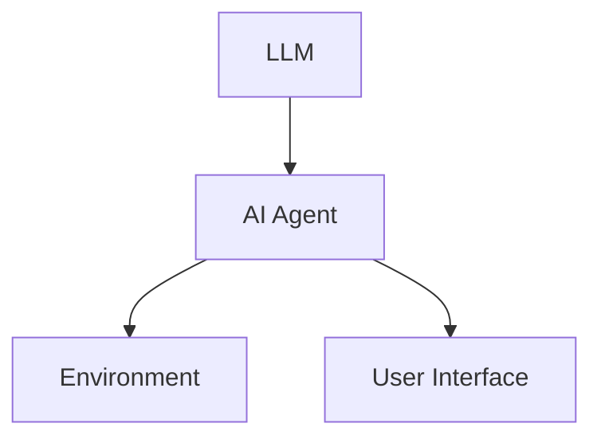
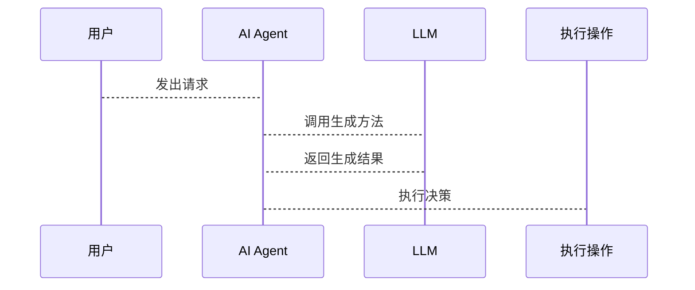

                 


# 《LLM在AI Agent抽象思维能力上的应用》

## 关键词：大语言模型（LLM）、AI Agent、抽象思维、算法原理、系统架构

## 摘要：本文探讨了大语言模型（LLM）如何赋能AI Agent的抽象思维能力，通过分析LLM与AI Agent的结合，提升AI Agent的决策效率和应用场景，为技术开发者和研究者提供深入的技术解析和实践指导。

---

## 第1章：背景与概述

### 1.1 LLM的定义与特点

#### 1.1.1 大语言模型的定义
大语言模型（LLM）是指经过大量数据训练的深度学习模型，如GPT系列，能够理解和生成人类语言。

#### 1.1.2 LLM的核心特点
- **大规模训练**：使用海量数据进行预训练，提升模型的通用性。
- **生成能力**：能够生成自然语言文本，用于回答问题、翻译等。
- **上下文理解**：通过上下文理解语义，生成连贯的回复。

#### 1.1.3 LLM与传统NLP模型的区别
| 特性 | LLM | 传统NLP模型 |
|------|------|--------------|
| 数据量 | 大 | 小           |
| 任务通用性 | 高 | 低           |
| 模型复杂度 | 高 | 中/低         |

### 1.2 AI Agent的定义与特点

#### 1.2.1 AI Agent的定义
AI Agent是一种智能体，能够感知环境、自主决策并执行任务。

#### 1.2.2 AI Agent的核心特点
- **自主性**：无需外部干预，自主决策。
- **反应性**：能实时感知环境并做出反应。
- **目标导向**：基于目标进行决策和行动。

#### 1.2.3 AI Agent与传统程序的区别
| 特性 | AI Agent | 传统程序 |
|------|----------|----------|
| 智能性 | 高 | 低         |
| 自主性 | 高 | 无/低      |
| 学习能力 | 高 | 无/低      |

### 1.3 LLM在AI Agent中的应用背景

#### 1.3.1 AI Agent的抽象思维需求
AI Agent需要具备抽象思维能力，以便处理复杂的逻辑推理和问题分析。

#### 1.3.2 LLM如何赋能AI Agent的抽象思维
通过LLM的强大语言处理能力，AI Agent能够更好地理解和分析问题，提升抽象思维能力。

#### 1.3.3 当前技术发展现状
当前，LLM与AI Agent的结合已成为研究热点，但在实际应用中仍面临诸多挑战，如模型训练成本高、交互效率等问题。

---

## 第2章：LLM与AI Agent的结合

### 2.1 LLM与AI Agent的协同工作原理

#### 2.1.1 LLM作为AI Agent的核心模块
LLM为AI Agent提供语言理解和生成能力，支持其进行复杂任务的处理。

#### 2.1.2 LLM与AI Agent的交互流程
1. AI Agent接收输入并解析需求。
2. 调用LLM进行语义分析和生成。
3. 根据LLM的输出，AI Agent做出决策并执行任务。

#### 2.1.3 LLM与AI Agent的协同优势
- **提升决策能力**：通过LLM的强大生成能力，AI Agent能够做出更精准的决策。
- **增强交互体验**：LLM使得AI Agent的交互更加自然流畅。
- **扩展应用场景**：LLM赋能AI Agent，使其能够在更多场景中应用。

### 2.2 LLM在AI Agent抽象思维中的具体应用

#### 2.2.1 问题分析与解决
- **问题分析**：AI Agent通过LLM分析问题，提取关键信息。
- **解决方案生成**：LLM生成多种解决方案供AI Agent选择。

#### 2.2.2 复杂任务处理
- **多步骤推理**：AI Agent利用LLM进行多步骤推理，解决复杂问题。
- **知识推理**：基于LLM的知识库，AI Agent能够进行推理和验证。

#### 2.2.3 创意生成与优化
- **创意生成**：LLM辅助AI Agent生成创新性的解决方案。
- **优化建议**：AI Agent利用LLM对生成的方案进行优化。

### 2.3 LLM与AI Agent结合的优势与挑战

#### 2.3.1 优势
- **提升效率**：LLM帮助AI Agent快速完成任务。
- **增强智能性**：LLM赋予AI Agent更强的语言理解和生成能力。
- **扩展应用**：LLM使得AI Agent能够在更多领域发挥作用。

#### 2.3.2 挑战
- **计算资源消耗**：LLM的运行需要大量计算资源。
- **模型训练成本**：训练高质量的LLM需要巨大的资源投入。
- **结果准确性**：LLM生成的内容可能存在偏差，影响AI Agent的决策。

---

## 第3章：LLM在AI Agent中的应用价值

### 3.1 提升AI Agent的抽象思维能力

#### 3.1.1 增强逻辑推理能力
- LLM帮助AI Agent进行复杂的逻辑推理，提升抽象思维能力。

#### 3.1.2 提高问题解决能力
- LLM为AI Agent提供多种解决方案，提升其问题解决能力。

### 3.2 优化AI Agent的决策效率

#### 3.2.1 提高决策速度
- LLM快速生成决策方案，优化AI Agent的决策效率。

#### 3.2.2 增强决策准确性
- 通过LLM的语义分析能力，AI Agent做出更准确的决策。

### 3.3 扩展AI Agent的应用场景

#### 3.3.1 新领域应用
- LLM使得AI Agent能够在更多领域中应用，如法律咨询、医疗诊断等。

#### 3.3.2 多模态交互
- LLM支持AI Agent进行多模态交互，提升用户体验。

---

## 第4章：核心概念与原理

### 4.1 LLM的核心原理

#### 4.1.1 大语言模型的训练过程
1. **预训练**：使用大量无标签数据进行自监督学习。
2. **微调**：在特定任务上进行有监督微调。

#### 4.1.2 模型的参数与语义表示
- **参数量**：大语言模型通常拥有 billions 量级的参数。
- **语义表示**：通过高维向量表示词语和句子的语义。

#### 4.1.3 模型的推理机制
- **生成式推理**：基于上下文生成新内容。
- **理解式推理**：理解输入内容并进行分析。

### 4.2 AI Agent的核心原理

#### 4.2.1 AI Agent的感知与决策过程
1. **感知环境**：通过传感器或API获取环境信息。
2. **分析信息**：利用LLM进行语义分析和推理。
3. **做出决策**：基于分析结果，选择最优行动方案。

#### 4.2.2 Agent的环境交互模型
- **状态表示**：用状态表示当前环境的情况。
- **行为选择**：基于状态和目标，选择最优行为。
- **执行动作**：将选择的行为转化为具体动作。

#### 4.2.3 Agent的状态与行为表示
- **状态表示**：用向量或符号表示当前状态。
- **行为表示**：用动作或策略表示可能的行为。

### 4.3 LLM与AI Agent的核心概念对比

| 特性 | LLM | AI Agent |
|------|------|----------|
| 核心任务 | 语言生成与理解 | 感知、决策与执行 |
| 输入输出 | 文本输入输出 | 多模态输入输出 |
| 应用场景 | NLP相关任务 | 多领域智能应用 |

---

## 第5章：算法原理与流程图

### 5.1 LLM的训练与推理流程



### 5.2 LLM与AI Agent的协同算法



### 5.3 数学公式示例

#### 5.3.1 损失函数
$$ \text{Loss} = -\sum_{i=1}^{n} \log p(y_i | x_i) $$

#### 5.3.2 概率分布
$$ P(y|x) = \frac{P(y,x)}{P(x)} $$

---

## 第6章：系统分析与架构设计

### 6.1 问题场景介绍

#### 6.1.1 需求分析
- **目标**：设计一个基于LLM的AI Agent系统。
- **用户角色**：开发者、用户。
- **核心问题**：如何高效实现LLM与AI Agent的结合。

#### 6.1.2 功能需求
- **语言处理**：支持多种语言理解和生成。
- **任务执行**：能够执行复杂任务，如信息检索、决策优化。

### 6.2 系统功能设计

#### 6.2.1 领域模型类图


#### 6.2.2 系统架构图


#### 6.2.3 系统接口设计
- **LLM接口**：`generate` 和 `analyze` 方法。
- **AI Agent接口**：`decide` 和 `execute` 方法。

#### 6.2.4 交互序列图


---

## 第7章：项目实战

### 7.1 环境安装

```bash
pip install transformers
pip install torch
pip install mermaid
```

### 7.2 核心代码实现

#### 7.2.1 LLM部分代码
```python
from transformers import GPT2LMHeadModel, GPT2Tokenizer

tokenizer = GPT2Tokenizer.from_pretrained('gpt2')
model = GPT2LMHeadModel.from_pretrained('gpt2')
```

#### 7.2.2 AI Agent部分代码
```python
class AI_Agent:
    def __init__(self, llm):
        self.llm = llm
        self.state = {}

    def decide(self, input):
        response = self.llm.generate(input)
        return self.choose_action(response)
    
    def execute(self, action):
        # 执行具体动作
        pass
```

#### 7.2.3 交互部分代码
```python
def main():
    agent = AI_Agent(model)
    while True:
        input = input("用户输入:")
        action = agent.decide(input)
        agent.execute(action)
```

### 7.3 代码解读与分析

#### 7.3.1 LLM代码解读
- 使用`transformers`库加载预训练模型。
- 通过调用`generate`方法生成响应文本。

#### 7.3.2 AI Agent代码解读
- 初始化AI Agent，传入LLM实例。
- `decide`方法调用LLM生成响应，并选择动作。
- `execute`方法根据选择的动作执行具体操作。

### 7.4 实际案例分析与解读
- **案例**：用户输入“帮我写一封邮件”，AI Agent调用LLM生成邮件内容，并协助发送邮件。
- **流程**：用户输入 → AI Agent解析 → LLM生成 → AI Agent执行发送邮件。

### 7.5 项目总结
- **成功经验**：实现了LLM与AI Agent的协同工作。
- **经验教训**：模型调优和交互优化需要进一步优化。
- **未来展望**：探索更多应用场景，提升系统性能。

---

## 第8章：最佳实践与小结

### 8.1 最佳实践 tips

#### 8.1.1 系统优化建议
- **模型选择**：根据任务需求选择合适的LLM模型。
- **计算资源**：确保足够的计算资源以支持LLM的运行。
- **数据质量**：使用高质量数据训练，提升模型性能。

#### 8.1.2 代码优化建议
- **模块化设计**：将代码模块化，便于维护和扩展。
- **性能优化**：优化LLM的调用流程，减少延迟。

#### 8.1.3 测试与调试
- **单元测试**：对关键模块进行单元测试，确保功能正常。
- **日志记录**：记录系统运行日志，便于调试和优化。

### 8.2 小结

- **总结**：本文详细探讨了LLM在AI Agent中的应用，从背景、原理到实战，全面解析了其应用价值和实现方法。
- **重要性**：LLM为AI Agent的抽象思维能力提供了强大支持，是未来AI技术发展的重要方向。

### 8.3 注意事项

- **模型选择**：根据具体任务选择合适的LLM模型，避免不必要的资源消耗。
- **数据安全**：确保数据处理过程中的安全性，防止信息泄露。
- **用户体验**：优化交互设计，提升用户体验，避免复杂的操作流程。

### 8.4 拓展阅读

- **推荐书籍**：《Deep Learning》、《Pattern Recognition and Machine Learning》。
- **推荐阅读**：研究论文《Language Models are Few-Shot Learners》、《Attention is All You Need》。

---

## 作者：AI天才研究院/AI Genius Institute & 禅与计算机程序设计艺术 /Zen And The Art of Computer Programming

---

以上为完整的大纲结构，涵盖了从背景介绍、核心概念、算法原理、系统架构到项目实战的各个方面，确保内容详实、逻辑清晰，为读者提供全面的技术解析和实践指导。

