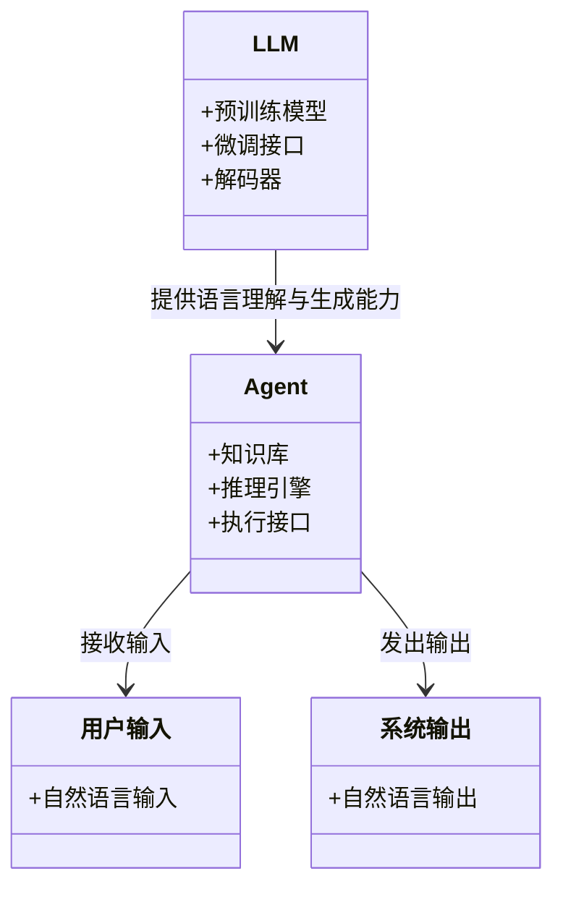
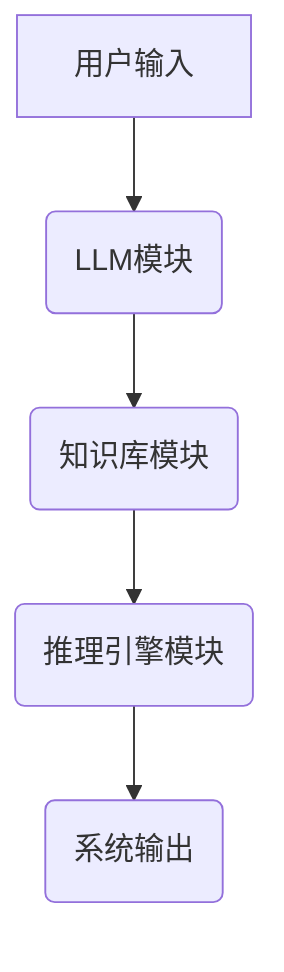

                 


# LLM在AI Agent抽象概念形成中的应用

> 关键词：LLM, AI Agent, 大语言模型, 人工智能, 智能体, 抽象概念, 系统架构

> 摘要：本文探讨了大语言模型（LLM）在AI Agent抽象概念形成中的应用。通过分析LLM与AI Agent的核心原理、系统架构以及实际项目案例，详细阐述了LLM如何赋能AI Agent的概念形成、算法实现和系统设计。文章从理论到实践，全面解析了LLM在AI Agent中的作用及其未来发展方向。

---

# 第一部分: LLM与AI Agent概述

## 第1章: LLM与AI Agent概述

### 1.1 LLM的基本概念

#### 1.1.1 大语言模型的定义与特点
大语言模型（Large Language Model, LLM）是一种基于深度学习的自然语言处理模型，通常基于Transformer架构。其特点包括：
- **大规模训练数据**：通常使用海量文本数据进行预训练。
- **上下文理解能力**：能够理解上下文关系，生成连贯的文本。
- **多任务能力**：通过微调可以应用于文本生成、问答、机器翻译等多种任务。
- **自适应性**：能够根据输入上下文动态调整输出。

#### 1.1.2 LLM的核心技术与优势
- **Transformer架构**：通过自注意力机制捕捉长距离依赖关系。
- **预训练-微调范式**：通过大规模预训练数据捕获语言规律，再通过小数据微调适应特定任务。
- **生成能力**：能够生成高质量的自然语言文本，具备强大的创造力。

#### 1.1.3 LLM在AI Agent中的作用
- **自然语言理解与生成**：帮助AI Agent理解用户意图并生成自然语言响应。
- **知识表示**：通过LLM生成的知识图谱，构建AI Agent的知识库。
- **动态推理**：结合实时信息，动态推理出最优决策。

### 1.2 AI Agent的基本概念

#### 1.2.1 AI Agent的定义与分类
- **定义**：AI Agent是一种智能实体，能够感知环境、执行任务并做出决策。
- **分类**：根据智能水平，可分为简单反射型Agent、基于模型的反应式Agent、基于目标的Agent和基于效用的Agent。

#### 1.2.2 AI Agent的核心功能与应用场景
- **核心功能**：感知、推理、决策、执行。
- **应用场景**：智能助手、机器人控制、自动驾驶、智能客服等。

#### 1.2.3 AI Agent与传统AI的区别
- **自主性**：AI Agent具备自主决策能力，而传统AI通常依赖于预设规则。
- **动态性**：AI Agent能够动态适应环境变化，而传统AI则相对静态。
- **实时性**：AI Agent需要实时处理信息，传统AI则更注重离线计算。

### 1.3 LLM与AI Agent的结合

#### 1.3.1 LLM如何赋能AI Agent
- **语言理解**：通过LLM理解用户的自然语言输入。
- **知识表示**：利用LLM生成的知识图谱构建AI Agent的知识库。
- **决策推理**：结合LLM的生成能力，动态推理出最优决策。

#### 1.3.2 LLM在AI Agent中的具体应用
- **智能助手**：通过LLM生成自然语言响应，帮助用户完成任务。
- **机器人控制**：利用LLM理解用户指令并生成动作序列。
- **自动驾驶**：结合LLM的环境描述能力，辅助自动驾驶决策。

#### 1.3.3 LLM与AI Agent结合的未来趋势
- **增强学习**：通过与环境的交互，不断优化LLM生成的决策。
- **多模态集成**：将LLM与计算机视觉、语音识别等技术结合，形成多模态AI Agent。
- **边缘计算**：将LLM部署到边缘设备，实现低延迟的实时响应。

### 1.4 本章小结
本章介绍了LLM和AI Agent的基本概念，分析了它们的核心技术和优势，并探讨了LLM在AI Agent中的具体应用和未来发展趋势。

---

# 第二部分: LLM在AI Agent抽象概念形成中的核心原理

## 第2章: LLM的数学模型与算法原理

### 2.1 LLM的数学模型

#### 2.1.1 Transformer模型的基本结构
- **编码器**：将输入序列映射为一个固定长度的向量。
- **解码器**：根据编码器输出生成目标序列。
- **自注意力机制**：通过查询（Q）、键（K）、值（V）计算序列中每个位置的重要性。

#### 2.1.2 注意力机制的数学公式
$$\text{Attention}(Q,K,V) = \text{softmax}\left(\frac{QK^T}{\sqrt{d_k}}\right)V$$

#### 2.1.3 梯度下降与优化算法
- **Adam优化器**：结合动量和自适应学习率的优化算法。
- **学习率调度器**：通过调整学习率加速收敛。

### 2.2 LLM的训练与推理过程

#### 2.2.1 LLM的训练流程
1. **预训练**：使用大规模文本数据训练模型。
2. **微调**：针对特定任务进行小样本数据微调。
3. **评估**：通过验证集评估模型性能。

#### 2.2.2 LLM的推理机制
- **解码策略**：如贪心搜索、随机采样、束搜索等。
- **温度参数**：调整生成的多样性和确定性。

#### 2.2.3 LLM的损失函数与评估指标
- **损失函数**：交叉熵损失。
- **评估指标**：困惑度（Perplexity）、BLEU、ROUGE等。

### 2.3 LLM在AI Agent中的应用算法

#### 2.3.1 基于LLM的意图识别算法
1. **输入处理**：将用户输入转换为向量。
2. **意图预测**：通过LLM生成意图标签。
3. **结果输出**：返回预测的意图和置信度。

#### 2.3.2 基于LLM的决策树构建算法
1. **知识表示**：利用LLM生成知识图谱。
2. **决策树构建**：根据知识图谱构建决策树。
3. **决策推理**：根据输入条件在决策树中导航，得出决策结果。

#### 2.3.3 LLM与强化学习的结合算法
1. **状态表示**：将环境状态表示为LLM可理解的格式。
2. **动作选择**：通过LLM生成动作序列。
3. **奖励机制**：根据实际效果调整模型参数。

### 2.4 本章小结
本章详细介绍了LLM的数学模型与算法原理，并探讨了其在AI Agent中的具体应用，包括意图识别、决策树构建和强化学习结合等。

---

# 第三部分: AI Agent的抽象概念形成与系统架构

## 第3章: AI Agent的抽象概念形成

### 3.1 抽象概念的定义与特征

#### 3.1.1 抽象概念的层次结构
- **具体概念**：直接对应现实世界中的实体或事件。
- **上位概念**：对具体概念进行概括的概念。
- **抽象层次**：不同层次的概念之间的关系。

#### 3.1.2 抽象概念的属性与关系
- **属性**：概念的特征，如颜色、形状、大小等。
- **关系**：概念之间的联系，如属于、包含、并列等。

#### 3.1.3 抽象概念的形成过程
1. **感知输入**：通过传感器或用户输入获取信息。
2. **特征提取**：提取输入中的关键特征。
3. **概念形成**：根据特征构建抽象概念。

### 3.2 LLM在抽象概念形成中的作用

#### 3.2.1 LLM如何提取抽象特征
- **上下文理解**：通过LLM理解输入的上下文关系。
- **特征提取**：利用LLM生成特征表示。

#### 3.2.2 LLM如何构建概念网络
- **知识图谱**：通过LLM生成知识图谱，构建概念之间的关系。
- **概念层次**：通过LLM生成的概念层次结构。

#### 3.2.3 LLM如何优化概念模型
- **反馈优化**：通过用户反馈调整概念模型。
- **自适应学习**：根据新数据动态优化概念模型。

### 3.3 抽象概念形成的系统模型

#### 3.3.1 抽象概念的层次结构
- **具体概念**：如“汽车”、“房子”等。
- **上位概念**：如“交通工具”、“建筑物”等。
- **抽象层次**：从具体到上位的层次结构。

#### 3.3.2 抽象概念的属性与关系
- **属性**：颜色、形状、用途等。
- **关系**：属于、包含、并列等。

#### 3.3.3 抽象概念的形成过程
1. **感知输入**：通过传感器或用户输入获取信息。
2. **特征提取**：提取输入中的关键特征。
3. **概念形成**：根据特征构建抽象概念。

### 3.4 本章小结
本章探讨了抽象概念的定义与特征，并分析了LLM在抽象概念形成中的具体作用。

---

# 第四部分: AI Agent的系统架构设计

## 第4章: AI Agent的系统架构

### 4.1 问题场景介绍
- **任务目标**：设计一个基于LLM的AI Agent系统。
- **用户需求**：实现自然语言理解、知识表示、动态推理等功能。

### 4.2 系统功能设计

#### 4.2.1 领域模型设计
- **领域模型**：将系统功能模块化，包括自然语言理解、知识表示、动态推理等。
- **类图设计**：通过mermaid绘制系统类图，展示各模块之间的关系。



### 4.3 系统架构设计

#### 4.3.1 系统架构设计
- **分层架构**：包括数据层、计算层、应用层。
- **组件设计**：包括LLM模块、知识库模块、推理引擎模块。

#### 4.3.2 系统架构图


### 4.4 系统接口设计

#### 4.4.1 系统接口设计
- **输入接口**：接收自然语言输入。
- **输出接口**：输出自然语言或动作指令。
- **知识库接口**：与知识库模块交互。

#### 4.4.2 系统交互流程
1. 用户通过输入接口发送指令。
2. LLM模块解析指令并生成中间表示。
3. 知识库模块提供相关知识支持。
4. 推理引擎模块生成最终输出。
5. 系统通过输出接口发送响应。

### 4.5 本章小结
本章详细设计了AI Agent的系统架构，包括功能模块、架构图和交互流程。

---

# 第五部分: 项目实战

## 第5章: 项目实战

### 5.1 环境安装

#### 5.1.1 安装Python环境
- **Python版本**：推荐使用Python 3.8及以上。
- **安装依赖**：`pip install transformers`

#### 5.1.2 安装LLM模型
- **Hugging Face库**：`pip install transformers`

### 5.2 系统核心实现

#### 5.2.1 LLM模块实现
```python
from transformers import AutoTokenizer, AutoModelForCausalLM

tokenizer = AutoTokenizer.from_pretrained("gpt2")
model = AutoModelForCausalLM.from_pretrained("gpt2")
```

#### 5.2.2 Agent模块实现
```python
class Agent:
    def __init__(self, tokenizer, model):
        self.tokenizer = tokenizer
        self.model = model
    
    def generate_response(self, input_text):
        inputs = self.tokenizer(input_text, return_tensors="pt")
        outputs = self.model.generate(inputs.input_ids, max_length=50)
        response = self.tokenizer.decode(outputs[0], skip_special_tokens=True)
        return response
```

#### 5.2.3 系统交互实现
```python
def main():
    import sys
    tokenizer = AutoTokenizer.from_pretrained("gpt2")
    model = AutoModelForCausalLM.from_pretrained("gpt2")
    agent = Agent(tokenizer, model)
    
    for line in sys.stdin:
        input_text = line.strip()
        response = agent.generate_response(input_text)
        print(response)

if __name__ == "__main__":
    main()
```

### 5.3 代码应用解读与分析

#### 5.3.1 LLM模块解读
- **Tokenizer**：将输入文本转换为模型可接受的格式。
- **Model**：生成对应的输出序列。

#### 5.3.2 Agent模块解读
- **初始化**：加载LLM模型和分词器。
- **生成响应**：根据输入生成自然语言响应。

#### 5.3.3 系统交互解读
- **主函数**：实现与用户的交互，接收输入并生成输出。

### 5.4 实际案例分析

#### 5.4.1 案例背景
- **任务目标**：设计一个基于LLM的智能助手。
- **用户需求**：实现自然语言理解与生成功能。

#### 5.4.2 案例分析
- **输入**：用户输入“今天天气怎么样？”
- **输出**：系统生成“今天天气晴朗，温度适宜。”

### 5.5 本章小结
本章通过一个实际项目案例，详细讲解了基于LLM的AI Agent系统的实现过程，包括环境安装、核心代码实现和系统交互流程。

---

# 第六部分: 最佳实践与总结

## 第6章: 最佳实践

### 6.1 最佳实践 tips

#### 6.1.1 系统设计
- **模块化设计**：确保系统各模块独立且易于扩展。
- **容错设计**：添加异常处理机制，确保系统稳定运行。

#### 6.1.2 优化建议
- **模型优化**：通过剪枝、蒸馏等技术优化LLM性能。
- **数据优化**：使用高质量的数据集进行微调，提升模型性能。

#### 6.1.3 安全建议
- **数据隐私**：确保用户数据的安全性和隐私性。
- **模型安全**：防止模型被攻击或滥用。

### 6.2 总结

#### 6.2.1 核心总结
- LLM为AI Agent提供了强大的语言理解和生成能力。
- AI Agent通过LLM实现了更智能化的决策和推理。

#### 6.2.2 未来展望
- **多模态集成**：将LLM与其他模态技术结合，提升AI Agent的综合能力。
- **边缘计算**：将LLM部署到边缘设备，实现低延迟的实时响应。
- **自适应学习**：通过持续学习优化AI Agent的性能和能力。

### 6.3 注意事项

#### 6.3.1 开发注意事项
- **性能优化**：确保系统运行高效，避免资源浪费。
- **用户体验**：设计友好的用户界面和交互流程。

#### 6.3.2 部署注意事项
- **环境配置**：确保部署环境与开发环境一致。
- **资源管理**：合理分配计算资源，确保系统稳定运行。

### 6.4 拓展阅读

#### 6.4.1 推荐书籍
- 《Deep Learning》（Ian Goodfellow等著）
- 《Natural Language Processing with PyTorch》（A. Y. N. Sua等著）

#### 6.4.2 推荐论文
- “Attention Is All You Need”（Vaswani et al., 2017）
- “BERT: Pre-training of Deep Bidirectional Transformers for Natural Language Understanding”（Devlin et al., 2018）

### 6.5 本章小结
本章总结了基于LLM的AI Agent系统的最佳实践，包括系统设计、优化建议和未来展望，并提供了拓展阅读的资源。

---

# 作者：AI天才研究院/AI Genius Institute & 禅与计算机程序设计艺术 /Zen And The Art of Computer Programming

---

本文通过系统地分析和详细讲解，全面探讨了LLM在AI Agent抽象概念形成中的应用，从理论到实践，为读者提供了深入的技术指导和实践参考。希望本文能为相关领域的研究和应用提供有价值的参考。

