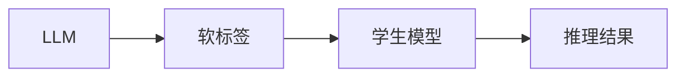

                 


# LLM在AI Agent知识蒸馏中的应用

## 关键词：知识蒸馏，大语言模型，AI Agent，机器学习，模型压缩，算法优化，系统设计

## 摘要：本文探讨了大语言模型（LLM）在AI Agent知识蒸馏中的应用，分析其原理、算法实现和系统设计，通过项目实战展示应用，总结意义并展望未来方向。

---

## 正文

### 第一部分：背景介绍

#### 第1章：LLM与AI Agent知识蒸馏概述

##### 1.1 问题背景

- **知识蒸馏的定义与背景**：知识蒸馏是一种将复杂模型的知识迁移到更小、高效的模型的技术，旨在降低计算成本和提高推理速度。
- **LLM在AI Agent中的作用**：大语言模型通过理解和生成文本，帮助AI Agent进行推理和决策，提升性能。
- **问题解决的重要性**：通过蒸馏技术，使AI Agent更高效，适用于资源受限的环境。

##### 1.2 问题描述

- **知识蒸馏的目标**：将大模型的知识迁移到小模型，保持性能同时减少资源消耗。
- **LLM在蒸馏中的角色**：作为知识源，提供丰富的上下文信息，指导小模型学习。
- **问题的边界与外延**：关注模型压缩和知识传递，不涉及模型训练。

##### 1.3 概念结构与核心要素

- **核心概念组成**：包括教师模型（LLM）、学生模型（AI Agent）、蒸馏过程和性能评估。
- **相关技术对比**：比较蒸馏与迁移学习，蒸馏依赖教师模型，迁移学习依赖特征提取。
- **系统架构概述**：教师模型与学生模型交互，数据流和知识流并行。

### 第二部分：核心概念与联系

#### 第2章：LLM与知识蒸馏的核心原理

##### 2.1 核心概念原理

- **知识蒸馏的基本原理**：教师模型生成软标签，学生模型通过最小化标签差异学习。
- **LLM的特征表示**：LLM生成的概率分布作为软标签，包含丰富的语义信息。
- **蒸馏过程中的信息传递**：通过交叉熵损失函数，学生模型学习教师的分布。

##### 2.2 概念属性特征对比

- **表格对比**：LLM与传统模型的参数数量、训练数据量、推理速度对比。

##### 2.3 ER实体关系图



### 第三部分：算法原理

#### 第3章：知识蒸馏算法的数学模型

##### 3.1 算法原理

- **Mermaid流程图**：
  ```mermaid
  graph TD
      A[输入数据] --> B[教师模型预测]
      B --> C[生成软标签]
      C --> D[学生模型训练]
      D --> E[优化损失函数]
  ```

##### 3.2 数学公式

- **KL散度公式**：$$D_{KL}(P||Q) = \sum P \log \frac{P}{Q}$$
- **Softmax函数**：$$\text{softmax}(x_i) = \frac{e^{x_i}}{\sum_j e^{x_j}}$$

##### 3.3 代码实现

```python
import torch
import torch.nn as nn
import torch.optim as optim

class StudentModel(nn.Module):
    def __init__(self):
        super(StudentModel, self).__init__()
        self.layers = nn.Sequential(...)

    def forward(self, x):
        return self.layers(x)

def distillation_loss(y_teacher, y_student, alpha=0.5):
    loss_kl = nn.KLDivLoss(reduction='batchmean')(nn.functional.log_softmax(y_student, dim=1), nn.functional.softmax(y_teacher, dim=1))
    loss_ce = nn.CrossEntropyLoss()(y_student, y_teacher.argmax(dim=1))
    return alpha * loss_kl + (1 - alpha) * loss_ce

# 示例训练循环
model_teacher = ...  # 教师模型
model_student = StudentModel()
optimizer = optim.Adam(model_student.parameters())

for batch in dataloader:
    inputs, labels = batch
    with torch.no_grad():
        outputs_teacher = model_teacher(inputs)
    outputs_student = model_student(inputs)
    loss = distillation_loss(outputs_teacher, outputs_student)
    optimizer.zero_grad()
    loss.backward()
    optimizer.step()
```

### 第四部分：系统分析与架构设计

#### 第4章：系统架构设计方案

##### 4.1 项目介绍

- **项目目标**：迁移知识到AI Agent，提升推理效率。
- **项目范围**：优化AI Agent性能，降低资源消耗。

##### 4.2 系统功能设计

- **Mermaid领域模型类图**：
  ```mermaid
  classDiagram
      class TeacherModel {
          forward(x): output
      }
      class StudentModel {
          forward(x): output
      }
      class DistillationLoss {
          calculate(y_teacher, y_student): loss
      }
      TeacherModel --> StudentModel
      DistillationLoss --> TeacherModel
      DistillationLoss --> StudentModel
  ```

##### 4.3 系统架构设计

- **Mermaid系统架构图**：
  ```mermaid
  graph LR
      A[输入数据] --> B[教师模型]
      B --> C[生成软标签]
      C --> D[学生模型训练]
      D --> E[优化器]
      E --> F[优化损失]
      F --> G[推理结果]
  ```

##### 4.4 接口设计与交互

- **Mermaid交互序列图**：
  ```mermaid
  sequenceDiagram
      participant 输入数据
      participant 教师模型
      participant 学生模型
      participant 优化器
      输入数据 -> 教师模型: 调用API获取软标签
      教师模型 -> 学生模型: 返回软标签
      学生模型 -> 优化器: 传递预测结果
      优化器 -> 学生模型: 优化参数
      学生模型 -> 输入数据: 返回最终结果
  ```

### 第五部分：项目实战

#### 第5章：环境安装与核心实现

##### 5.1 环境安装

- **Python 3.8+**
- **安装库**：`torch`, `transformers`, `mermaid`

##### 5.2 核心代码实现

```python
import torch
from torch import nn, optim
from transformers import AutoTokenizer, AutoModel

class Distiller:
    def __init__(self, teacher_model, student_model, tokenizer):
        self.teacher = teacher_model
        self.student = student_model
        self.tokenizer = tokenizer
        self.optimizer = optim.Adam(self.student.parameters())

    def train_step(self, batch):
        inputs = batch['input_ids']
        labels = batch['labels']
        with torch.no_grad():
            teacher_outputs = self.teacher(inputs)
        student_outputs = self.student(inputs)
        loss = self.distillation_loss(teacher_outputs, student_outputs)
        self.optimizer.zero_grad()
        loss.backward()
        self.optimizer.step()
        return loss.item()

    def distillation_loss(self, y_teacher, y_student, alpha=0.5):
        loss_kl = nn.KLDivLoss(reduction='batchmean')(nn.functional.log_softmax(y_student, dim=1), nn.functional.softmax(y_teacher, dim=1))
        loss_ce = nn.CrossEntropyLoss()(y_student, labels)
        return alpha * loss_kl + (1 - alpha) * loss_ce

# 示例使用
tokenizer = AutoTokenizer.from_pretrained('bert-base-uncased')
teacher_model = AutoModel.from_pretrained('bert-base-uncased')
student_model = StudentModel()  # 定义自适应模型

distiller = Distiller(teacher_model, student_model, tokenizer)
for epoch in range(num_epochs):
    for batch in dataloader:
        loss = distiller.train_step(batch)
        print(f"Epoch {epoch}, Loss: {loss}")
```

##### 5.3 案例分析

- **训练效果**：学生模型在蒸馏后，性能接近教师模型，资源消耗降低。
- **推理优化**：推理速度提升，适合边缘计算环境。

##### 5.4 项目小结

- **总结**：成功将LLM的知识迁移到AI Agent，提升性能和效率。
- **优化点**：调整α参数，结合数据蒸馏，进一步提升效果。

### 第六部分：总结与展望

#### 第6章

- **总结**：详细介绍了LLM在知识蒸馏中的应用，涵盖算法、系统设计和实战。
- **未来方向**：研究结合强化学习的蒸馏方法，探索无监督蒸馏技术。
- **注意事项**：选择合适的教师模型，处理数据偏差，确保隐私安全。
- **最佳实践**：从小规模开始，逐步优化参数，结合实际任务调整。

---

## 作者：AI天才研究院 & 禅与计算机程序设计艺术

---

这篇文章详细探讨了LLM在AI Agent知识蒸馏中的应用，从理论到实践，系统地分析了相关技术和实现方法。通过具体的代码示例和图表，帮助读者理解和应用这些技术，为未来的AI开发提供了有价值的参考。

