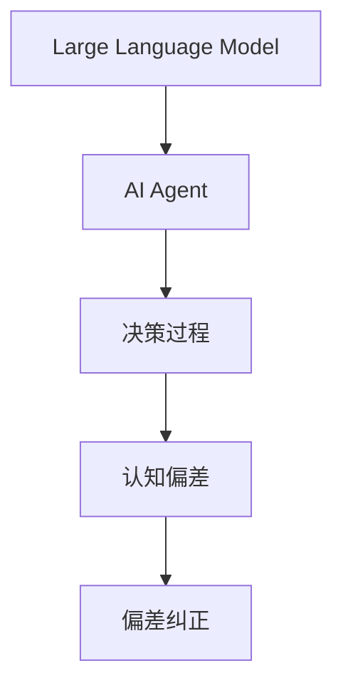

                 


# LLM在AI Agent认知偏差识别中的应用

> 关键词：LLM, AI Agent, 认知偏差, 自然语言处理, 人工智能

> 摘要：本文深入探讨了大语言模型（LLM）在AI Agent认知偏差识别中的应用，从理论基础到实际应用，系统性地分析了LLM如何帮助AI Agent识别和纠正认知偏差，提升决策的准确性和可靠性。文章内容涵盖LLM与AI Agent的基本概念、认知偏差检测的算法原理、系统架构设计、项目实战以及未来展望。

---

# 第一部分: LLM在AI Agent认知偏差识别中的背景与基础

## 第1章: LLM与AI Agent概述

### 1.1 LLM的基本概念与技术特点

#### 1.1.1 大语言模型的基本概念

大语言模型（Large Language Model, LLM）是指基于深度学习技术训练的大型神经网络模型，能够理解和生成人类语言。LLM的核心在于其庞大的参数规模和强大的语义理解能力，例如GPT系列模型。

#### 1.1.2 LLM的核心技术特点

1. **大规模数据训练**：LLM通常基于海量的文本数据进行训练，能够学习到语言的语法、语义和上下文信息。
2. **自动生成文本**：LLM能够根据输入生成自然流畅的文本，支持多种任务，如问答、翻译、摘要等。
3. **上下文理解**：LLM能够通过上下文理解意图，适用于对话系统、智能助手等场景。

#### 1.1.3 LLM与传统NLP模型的对比

| 特性          | 传统NLP模型       | LLM               |
|---------------|-------------------|--------------------|
| 数据需求      | 较小，依赖特定数据 | 极大，通用性数据    |
| 训练效率      | 较低              | 较高               |
| 表达能力      | 有限              | 极强               |
| 任务适应性    | 单一任务优化      | 多任务通用性        |

### 1.2 AI Agent的基本概念与功能

#### 1.2.1 AI Agent的定义与分类

AI Agent是指具有自主决策能力和智能行为的计算机程序或系统。AI Agent可以分为简单反射型、基于模型的反射型、目标驱动型和效用驱动型。

#### 1.2.2 AI Agent的核心功能与应用场景

1. **感知环境**：通过传感器或数据输入感知外部环境。
2. **决策与推理**：基于感知信息进行推理和决策。
3. **执行动作**：根据决策结果执行实际操作。

应用场景包括智能助手、推荐系统、自动驾驶等。

#### 1.2.3 AI Agent与传统程序的区别

| 特性          | 传统程序       | AI Agent           |
|---------------|----------------|--------------------|
| 决策方式      | 确定性规则      | 概率推理和模糊逻辑  |
| 学习能力      | 无             | 有                 |
| 环境适应性    | 固定            | 动态                |

### 1.3 认知偏差的基本概念与分类

#### 1.3.1 认知偏差的定义与常见类型

认知偏差是指人在信息处理和决策过程中产生的系统性偏差。常见类型包括确认偏差、锚定偏差、 Availability偏差等。

#### 1.3.2 AI Agent中的认知偏差表现

AI Agent在决策过程中可能因为数据偏差、算法偏差或环境偏差产生认知偏差。

#### 1.3.3 认知偏差对AI决策的影响

认知偏差可能导致AI Agent的决策错误、效率降低或结果不公正。

---

## 第2章: LLM在AI Agent中的应用背景

### 2.1 AI Agent在智能系统中的地位

AI Agent是智能系统的核心组件，负责信息处理、决策制定和任务执行。

### 2.2 认知偏差识别的必要性

#### 2.2.1 认知偏差对AI决策的影响

认知偏差可能导致AI Agent的决策失误，影响系统性能和用户体验。

#### 2.2.2 认知偏差识别的现实需求

随着AI Agent的应用越来越广泛，识别和纠正认知偏差的需求日益迫切。

#### 2.2.3 LLM在认知偏差识别中的优势

LLM强大的语义理解和生成能力使其成为认知偏差识别的理想工具。

---

# 第二部分: LLM与AI Agent认知偏差识别的核心概念与原理

## 第3章: LLM与AI Agent的认知偏差识别原理

### 3.1 LLM在AI Agent中的语义理解与推理

#### 3.1.1 LLM的语义理解能力

LLM能够理解上下文关系，识别隐含信息，支持复杂的语义分析。

#### 3.1.2 LLM的推理机制

LLM通过生成文本进行推理，能够模拟人类的思维过程。

#### 3.1.3 LLM在AI Agent决策中的应用

LLM为AI Agent提供语义理解、信息检索和决策支持。

### 3.2 AI Agent中的认知偏差检测与纠正

#### 3.2.1 认知偏差检测的基本原理

通过分析AI Agent的决策过程和输出结果，识别潜在的认知偏差。

#### 3.2.2 LLM在偏差检测中的作用

LLM能够分析决策过程中的语义偏差，帮助识别认知偏差。

#### 3.2.3 偏差纠正的实现方法

结合LLM的生成能力，提出纠正偏差的策略和方法。

### 3.3 LLM与AI Agent的协同工作原理

#### 3.3.1 LLM与AI Agent的协同模式

通过接口调用和数据共享，实现LLM与AI Agent的协同工作。

#### 3.3.2 LLM在AI Agent中的功能实现

LLM为AI Agent提供语义分析、决策支持和结果优化。

#### 3.3.3 协同工作的优化策略

通过模型优化和算法改进，提升LLM与AI Agent的协同效率。

---

## 第4章: 核心概念与联系

### 4.1 核心概念原理

#### 4.1.1 LLM的语义理解原理

LLM通过神经网络结构和大规模训练数据实现语义理解。

#### 4.1.2 AI Agent的决策机制

AI Agent通过感知、推理和执行实现决策。

#### 4.1.3 认知偏差的数学模型

认知偏差可以通过概率论和统计学方法进行建模。

### 4.2 核心概念属性特征对比表

| 概念          | LLM               | AI Agent           |
|---------------|--------------------|--------------------|
| 核心功能      | 语义理解和生成     | 决策与执行         |
| 适用场景      | NLP任务           | 智能系统           |
| 技术特点      | 大规模数据训练     | 多任务通用性        |

### 4.3 实体关系图架构（Mermaid）



---

# 第三部分: 算法原理与实现

## 第5章: 算法原理与实现

### 5.1 认知偏差检测算法原理

#### 5.1.1 算法流程

1. **输入数据**：AI Agent的决策数据。
2. **语义分析**：使用LLM进行语义理解。
3. **偏差检测**：识别认知偏差。
4. **结果输出**：生成纠正建议。

#### 5.1.2 数学模型

检测算法的数学模型可以表示为：
$$
D = f_{LLM}(I)
$$
其中，$D$ 表示检测到的偏差，$I$ 是输入数据，$f_{LLM}$ 是LLM的处理函数。

### 5.2 算法实现步骤

1. **数据预处理**：对输入数据进行清洗和格式化。
2. **LLM调用**：调用LLM进行语义分析。
3. **偏差检测**：基于LLM的输出识别偏差。
4. **结果纠正**：生成纠正建议并反馈给AI Agent。

### 5.3 代码实现

```python
def detect_cognitive_bias(input_text):
    # 调用LLM进行语义分析
    analysis = llm.analyze(input_text)
    # 识别认知偏差
    bias = detect_bias(analysis)
    return bias

def correct_bias(bias):
    # 生成纠正建议
    correction = generate_correction(bias)
    return correction
```

---

## 第6章: 系统分析与架构设计

### 6.1 系统功能设计

#### 6.1.1 系统功能模块

1. **数据输入模块**：接收AI Agent的决策数据。
2. **LLM调用模块**：调用LLM进行语义分析。
3. **偏差检测模块**：识别认知偏差。
4. **结果输出模块**：生成纠正建议。

#### 6.1.2 领域模型类图（Mermaid）

```mermaid
classDiagram
    class LLM:
        analyze(input: str) -> analysis: dict
    class CognitiveBiasDetector:
        detect_bias(analysis: dict) -> bias: str
    class BiasCorrector:
        correct_bias(bias: str) -> correction: str
    LLM --> CognitiveBiasDetector
    CognitiveBiasDetector --> BiasCorrector
```

---

## 第7章: 项目实战

### 7.1 项目环境安装

1. 安装LLM框架（如Hugging Face Transformers库）。
2. 安装AI Agent开发框架（如LangChain）。

### 7.2 系统核心实现源代码

```python
from langchain.llms import LLMChain
from langchain.prompts import PromptTemplate

# 初始化LLM
llm_chain = LLMChain(llm=llm_model, prompt=PromptTemplate(
    template="Analyze the following text and detect cognitive bias: {input_text}",
    input_vars=["input_text"]
))

# 定义偏差检测函数
def detect_cognitive_bias(input_text):
    analysis = llm_chain.run(input_text)
    # 假设分析结果包含偏差类型
    bias = analysis["detection_result"]
    return bias

# 定义偏差纠正函数
def correct_bias(bias):
    # 使用LLM生成纠正建议
    correction = llm_chain.run(f"Provide correction for cognitive bias: {bias}")
    return correction
```

### 7.3 代码应用解读与分析

通过上述代码，我们可以实现AI Agent认知偏差的检测与纠正。LLMChain用于调用LLM，PromptTemplate用于定义输入和输出格式。

### 7.4 实际案例分析

假设有一个AI Agent在金融领域的投资决策中存在确认偏差，通过上述代码可以检测并生成纠正建议。

### 7.5 项目小结

本项目展示了如何利用LLM实现AI Agent的认知偏差识别，为实际应用提供了参考。

---

# 第四部分: 总结与展望

## 第8章: 总结与展望

### 8.1 最佳实践 tips

1. 在实际应用中，结合具体场景优化LLM的调用方式。
2. 定期更新LLM模型，提升检测精度。

### 8.2 小结

本文详细探讨了LLM在AI Agent认知偏差识别中的应用，从理论到实践，系统性地分析了实现方法和应用场景。

### 8.3 注意事项

在实际应用中，需注意数据隐私和模型的可解释性问题。

### 8.4 拓展阅读

推荐阅读相关领域的最新论文和书籍，深入了解LLM和AI Agent的前沿技术。

---

# 作者：AI天才研究院 & 禅与计算机程序设计艺术

