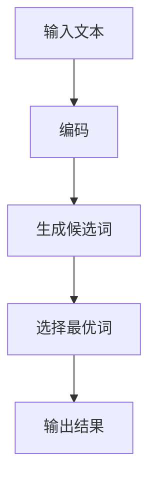
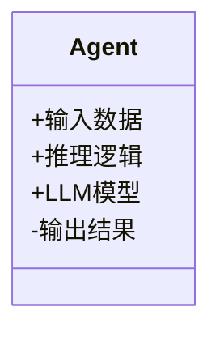

                 


# LLM在AI Agent语义推理能力上的应用

> **关键词**：LLM, AI Agent, 语义推理, 大语言模型, 人工智能, 自然语言处理  
> **摘要**：本文深入探讨了大语言模型（LLM）在AI Agent语义推理能力中的应用。通过分析LLM的核心原理、算法机制、系统架构以及实际案例，本文详细阐述了如何利用LLM提升AI Agent的理解和推理能力。文章从背景介绍、核心概念解析、算法原理、数学模型、系统架构设计、项目实战到最佳实践，层层深入，为读者提供了全面而系统的知识体系。

---

## 第一部分：背景介绍

### 第1章：问题背景与描述

#### 1.1 问题背景
在人工智能领域，AI Agent（智能体）作为能够感知环境、自主决策并执行任务的实体，正在变得越来越重要。然而，AI Agent的核心能力——语义推理——却面临诸多挑战。传统的基于规则的推理方法在处理复杂语义关系时显得力不从心，而大语言模型（LLM）的出现为这一领域带来了革命性的变化。

#### 1.2 问题描述
语义推理是指从输入文本中理解隐含含义并推导出结论的能力。AI Agent需要通过语义推理来理解用户意图、环境状态，并做出合理的决策。然而，传统的语义理解方法依赖于大量手动设计的规则，这不仅效率低下，而且难以应对复杂多变的语义场景。

#### 1.3 问题解决与边界
LLM的引入为语义推理提供了新的可能性。通过大规模预训练，LLM能够理解上下文关系并生成连贯的推理结果。然而，这种技术也面临一些边界问题，例如模型的计算成本、推理的实时性以及模型的可解释性。

#### 1.4 核心要素与组成结构
语义推理系统的核心要素包括：
1. **输入数据**：包括文本、上下文信息等。
2. **推理逻辑**：基于LLM生成的中间结果进行推理。
3. **输出结果**：最终的推理结论或决策建议。

---

## 第二部分：核心概念与联系

### 第2章：核心概念解析

#### 2.1 LLM与AI Agent的关系
- **LLM的定义**：大语言模型是一种基于深度学习的自然语言处理模型，通过大量数据训练，能够生成与人类类似的文本。
- **AI Agent的功能**：AI Agent通过感知环境、执行任务、与用户交互，实现智能化决策。
- **两者结合的必要性**：LLM为AI Agent提供了强大的语义理解能力，使其能够更好地理解用户需求和环境信息。

#### 2.2 语义推理的原理
语义推理是通过分析文本的语义关系，推导出隐含的信息或结论。LLM通过上下文理解和生成能力，为AI Agent提供了强大的语义推理支持。

#### 2.3 核心概念对比表
| **核心概念** | **LLM** | **AI Agent** | **传统规则推理** |
|--------------|----------|--------------|------------------|
| **功能**      | 生成文本 | 执行任务      | 基于规则推导    |
| **优势**      | 自然语言处理能力强 | 自主决策能力     | 简单易实现       |
| **局限性**     | 计算成本高 | 可能缺乏可解释性 | 难应对复杂场景     |

#### 2.4 ER实体关系图
```mermaid
er
actor(Agent, "LLM模型", "推理逻辑", "输入数据", "输出结果")
```

---

## 第三部分：算法原理讲解

### 第3章：LLM的算法原理

#### 3.1 基本原理
- **模型结构**：LLM通常基于Transformer架构，包括编码器和解码器两部分。
- **训练过程**：通过监督学习和无监督学习结合，模型在大量数据上进行预训练。
- **解码机制**：生成文本的过程基于贪心搜索或随机采样。

#### 3.2 推理算法流程


#### 3.3 Python实现示例
```python
def decode_step(tokens, model):
    for i in range(len(tokens)):
        # 获取当前输入序列
        input_tokens = tokens[:i+1]
        # 生成下一个词的概率分布
        logits, _ = model(input_tokens)
        # 根据概率分布选择下一个词
        next_token = torch.argmax(logits[-1]).item()
        tokens.append(next_token)
    return tokens
```

---

## 第四部分：数学模型和公式

### 第4章：数学模型与公式

#### 4.1 概率分布
LLM通过概率分布生成文本，其核心公式为：
$$ P(y|x) = \frac{1}{Z} \exp(-E(x,y)) $$
其中，$Z$ 是归一化常数，$E(x,y)$ 是能量函数。

#### 4.2 损失函数
常用的损失函数是交叉熵损失：
$$ \mathcal{L} = -\sum_{i=1}^{n} \log P(y_i|x) $$

#### 4.3 注意力机制
注意力机制的计算公式为：
$$ \alpha_i = \frac{\exp(w_i^T h)}{\sum_{j} \exp(w_j^T h)} $$
其中，$w_i$ 是查询向量，$h$ 是键向量。

---

## 第五部分：系统分析与架构设计

### 第5章：系统架构设计

#### 5.1 项目介绍
本项目旨在通过LLM提升AI Agent的语义推理能力，使其能够更准确地理解用户意图并做出决策。

#### 5.2 系统功能设计


#### 5.3 系统架构设计


#### 5.4 系统接口设计
- 输入接口：接收文本输入。
- 输出接口：生成推理结果。

#### 5.5 系统交互
```mermaid
sequence
    用户 --> Agent: 提供输入
    Agent --> LLM: 请求推理
    LLM --> Agent: 返回结果
    Agent --> 用户: 输出结论
```

---

## 第六部分：项目实战

### 第6章：项目实战

#### 6.1 环境安装
- 安装Python和必要的库：
  ```bash
  pip install torch transformers
  ```

#### 6.2 系统核心实现
```python
class Agent:
    def __init__(self, model):
        self.model = model

    def process_input(self, input_text):
        # 编码输入
        input_tokens = self.tokenizer.encode(input_text)
        # 调用LLM进行推理
        output_tokens = self.model.decode(input_tokens)
        return output_tokens
```

#### 6.3 实际案例分析
- 案例输入：用户输入“今天天气怎么样？”
- 推理过程：模型生成上下文相关的天气信息。
- 输出结果：提供天气预报。

---

## 第七部分：最佳实践与小结

### 第7章：最佳实践

#### 7.1 小结
本文详细探讨了LLM在AI Agent语义推理中的应用，从理论到实践，全面介绍了相关技术。

#### 7.2 注意事项
- 模型的选择和调优至关重要。
- 注意计算资源的消耗。
- 提高模型的可解释性。

#### 7.3 拓展阅读
建议阅读以下内容：
- 《Attention Is All You Need》
- 《Transformers Are All You Need》

---

## 作者

**作者**：AI天才研究院/AI Genius Institute & 禅与计算机程序设计艺术 /Zen And The Art of Computer Programming

---

通过以上结构和内容，希望本文能够为读者提供一个全面而深入的视角，理解LLM在AI Agent语义推理中的应用及其未来发展。

