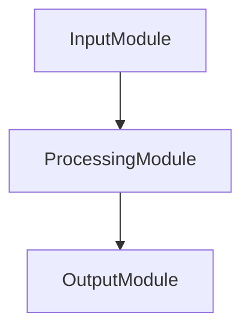

                 


**《LLM在AI Agent语义网络构建中的应用》**

---

**关键词：LLM、AI Agent、语义网络、大语言模型、语义构建、智能体交互**

---

**摘要：**  
本文深入探讨了大语言模型（LLM）在AI Agent语义网络构建中的应用。从背景到实践，详细分析了LLM如何赋能语义网络的构建、优化和动态更新。文章首先介绍了LLM和AI Agent的基本概念，然后重点阐述了语义网络的构建方法和LLM在其中的核心作用。接着，从算法原理、系统架构设计到项目实战，详细讲解了基于LLM的语义网络构建技术。通过案例分析和代码实现，展示了如何将理论应用于实际场景中。最后，总结了LLM在语义网络构建中的优势与挑战，并展望了未来的研究方向。

---

# LLM在AI Agent语义网络构建中的应用

## 第1章: LLM与AI Agent概述

### 1.1 LLM的基本概念与技术背景

#### 1.1.1 大语言模型的定义与发展  
大语言模型（Large Language Model, LLM）是指基于深度学习技术训练的大型神经网络模型，旨在理解和生成人类语言。LLM的发展始于2018年的GPT模型，经过几年的快速发展，现已成为自然语言处理（NLP）领域的主流技术。LLM的核心优势在于其强大的上下文理解和生成能力，能够处理复杂的语义关系。

#### 1.1.2 LLM的核心技术特点  
- **大规模数据训练**：LLM通常基于海量文本数据进行训练，具备广泛的知识覆盖能力。  
- **深度神经网络结构**：采用多层神经网络架构，如Transformer，能够捕捉长距离依赖关系。  
- **生成与理解并重**：LLM不仅能够生成文本，还能通过推理回答复杂问题。  

#### 1.1.3 LLM在AI Agent中的应用潜力  
AI Agent需要与人类进行自然交互，LLM的语义理解和生成能力使其成为AI Agent的核心驱动力。LLM能够帮助AI Agent理解用户意图、生成自然的对话内容，并动态更新语义网络。

### 1.2 AI Agent的基本概念与功能

#### 1.2.1 AI Agent的定义与分类  
AI Agent是一种智能体，能够感知环境、自主决策并执行任务。根据功能和应用场景，AI Agent可以分为以下几类：  
- **简单反射型Agent**：基于规则的简单响应。  
- **基于模型的反应型Agent**：基于环境模型做出决策。  
- **目标驱动型Agent**：具有明确目标，主动规划实现目标。  
- **实用驱动型Agent**：通过优化策略实现目标最大化。  

#### 1.2.2 AI Agent的核心功能与应用场景  
- **感知环境**：通过传感器或输入接口获取信息。  
- **决策与推理**：基于语义网络进行推理和决策。  
- **执行操作**：根据决策结果执行任务。  
- **与人类交互**：通过自然语言进行人机对话。  

#### 1.2.3 AI Agent与人类交互的特点  
- **自然性**：对话过程自然流畅。  
- **上下文理解**：能够理解对话的上下文关系。  
- **动态适应性**：能够根据反馈动态调整交互策略。  

### 1.3 语义网络的基本概念与构建方法

#### 1.3.1 语义网络的定义与特点  
语义网络是一种表示知识的图结构，由节点（概念）和边（关系）组成。语义网络能够表示概念之间的语义关系，是AI Agent理解语言的基础。

#### 1.3.2 语义网络的构建方法  
- **基于规则的方法**：通过人工定义规则提取语义关系。  
- **基于统计的方法**：利用词频、共现等统计特征提取语义关系。  
- **基于深度学习的方法**：利用神经网络模型自动学习语义关系。  

#### 1.3.3 语义网络在AI Agent中的作用  
语义网络为AI Agent提供了语义理解的基础，使其能够理解输入文本的语义关系，并生成符合语境的输出。

## 第2章: LLM在语义网络构建中的核心作用

### 2.1 LLM与语义网络的关系

#### 2.1.1 LLM如何生成语义网络  
LLM通过处理输入文本生成语义网络。具体步骤如下：  
1. **输入文本处理**：将输入文本转换为模型可处理的形式。  
2. **语义解析**：模型分析文本中的语义关系。  
3. **网络构建**：生成节点和边，构建语义网络。  

#### 2.1.2 LLM对语义网络质量的影响  
- **准确性**：LLM能够捕捉复杂的语义关系，提高语义网络的准确性。  
- **完整性**：LLM能够提取更多的语义信息，使语义网络更加完整。  

#### 2.1.3 LLM在语义网络动态更新中的作用  
LLM能够根据新的输入动态更新语义网络，保持网络的实时性和准确性。

### 2.2 LLM驱动的语义网络构建方法

#### 2.2.1 基于LLM的语义网络生成流程  
1. **输入文本预处理**：对输入文本进行分词、去停用词等处理。  
2. **语义解析**：利用LLM分析文本中的语义关系。  
3. **网络构建**：生成节点和边，构建语义网络。  

#### 2.2.2 LLM在语义网络节点与边的关系建模  
- **节点表示**：节点表示为输入文本中的概念。  
- **边表示**：边表示概念之间的语义关系。  

#### 2.2.3 LLM对语义网络可解释性的提升  
LLM能够生成可解释的语义关系，使语义网络更具透明性和可理解性。

### 2.3 LLM在语义网络中的优化与调优

#### 2.3.1 LLM参数对语义网络性能的影响  
- **模型规模**：模型参数越多，语义理解能力越强。  
- **训练数据**：多样化的训练数据能够提高语义网络的准确性。  

#### 2.3.2 基于LLM的语义网络优化策略  
- **微调策略**：对LLM进行微调，使其更适应特定任务。  
- ** ensemble策略**：结合多个LLM的结果，提高语义网络的准确性。  

#### 2.3.3 LLM在语义网络中的效果评估  
- **准确率**：语义关系提取的准确率。  
- **召回率**：语义关系提取的召回率。  
- **F1值**：综合评估准确率和召回率。  

## 第3章: 基于LLM的语义网络构建算法原理

### 3.1 基于LLM的语义网络构建算法概述

#### 3.1.1 算法的基本思想  
基于LLM的语义网络构建算法通过分析输入文本的语义关系，生成语义网络。  

#### 3.1.2 算法的主要步骤  
1. **输入文本预处理**：对输入文本进行分词、去停用词等处理。  
2. **语义解析**：利用LLM分析文本中的语义关系。  
3. **网络构建**：生成节点和边，构建语义网络。  

### 3.2 算法实现细节

#### 3.2.1 输入文本的预处理  
```python
import spacy

nlp = spacy.load("en_core_web_sm")
text = "The cat sits on the mat."
doc = nlp(text)
tokens = [token.text for token in doc]
```

#### 3.2.2 基于LLM的语义解析  
```python
from transformers import GPT2Tokenizer, GPT2Model

tokenizer = GPT2Tokenizer.from_pretrained('gpt2')
model = GPT2Model.from_pretrained('gpt2')

input_text = "The cat sits on the mat."
inputs = tokenizer(input_text, return_tensors='np')
outputs = model(inputs.input_ids)
```

#### 3.2.3 语义网络的构建与存储  
```python
class SemanticNetwork:
    def __init__(self):
        self.nodes = {}
        self.edges = {}
    
    def add_node(self, node):
        if node not in self.nodes:
            self.nodes[node] = []
    
    def add_edge(self, node1, node2, relation):
        self.edges[(node1, node2)] = relation

network = SemanticNetwork()
network.add_node("cat")
network.add_node("mat")
network.add_edge("cat", "mat", "sits_on")
```

### 3.3 算法优化与改进

#### 3.3.1 算法复杂度分析  
- **时间复杂度**：O(n)，其中n为输入文本的长度。  
- **空间复杂度**：O(m)，其中m为语义网络的节点数。  

#### 3.3.2 并行计算优化  
- **分布式计算**：将输入文本分块，分布式处理。  
- **并行推理**：利用多线程或GPU加速推理过程。  

#### 3.3.3 基于LLM的语义网络动态更新优化  
- **增量更新**：仅更新新增的语义关系。  
- **周期性更新**：定期更新语义网络，保持其准确性。  

## 第4章: 基于LLM的语义网络构建系统架构设计

### 4.1 系统整体架构设计

#### 4.1.1 系统功能模块划分  
- **输入模块**：接收输入文本。  
- **处理模块**：解析语义关系，构建语义网络。  
- **输出模块**：输出语义网络或相关结果。  

#### 4.1.2 系统模块之间的交互关系  


#### 4.1.3 系统架构的可扩展性分析  
- **模块化设计**：各模块独立，便于扩展。  
- **接口标准化**：模块间通过标准化接口交互。  

### 4.2 系统功能模块详细设计

#### 4.2.1 输入模块设计  
- **功能**：接收输入文本，解析格式。  
- **接口**：提供标准输入接口。  

#### 4.2.2 处理模块设计  
- **功能**：解析语义关系，构建语义网络。  
- **接口**：提供输入输出接口。  

#### 4.2.3 输出模块设计  
- **功能**：输出语义网络或相关结果。  
- **接口**：提供输出接口。  

### 4.3 系统接口设计

#### 4.3.1 输入接口设计  
```python
def input_text(text):
    return text
```

#### 4.3.2 输出接口设计  
```python
def output_semantic_network(network):
    return network
```

#### 4.3.3 调用接口设计  
```python
def process(text):
    network = SemanticNetwork()
    # 处理逻辑
    return network
```

### 4.4 系统交互流程设计

#### 4.4.1 系统启动流程  
1. 初始化系统模块。  
2. 等待输入文本。  

#### 4.4.2 数据处理流程  
1. 接收输入文本。  
2. 解析语义关系，构建语义网络。  

#### 4.4.3 结果输出流程  
1. 输出语义网络或相关结果。  

## 第5章: 基于LLM的语义网络构建项目

### 5.1 项目实战：构建一个简单的语义网络

#### 5.1.1 环境安装与配置  
```bash
pip install transformers spacy
python -m spacy download en_core_web_sm
```

#### 5.1.2 代码实现

##### 5.1.2.1 语义网络构建代码  
```python
from transformers import GPT2Tokenizer, GPT2Model
from spacy import load

class SemanticNetwork:
    def __init__(self):
        self.nodes = {}
        self.edges = {}

    def add_node(self, node):
        if node not in self.nodes:
            self.nodes[node] = []

    def add_edge(self, node1, node2, relation):
        self.edges[(node1, node2)] = relation

    def get_neighbors(self, node):
        return self.nodes[node]

tokenizer = GPT2Tokenizer.from_pretrained('gpt2')
model = GPT2Model.from_pretrained('gpt2')
nlp = load('en_core_web_sm')

text = "The cat sits on the mat."
doc = nlp(text)
tokens = [token.text for token in doc]

network = SemanticNetwork()
for token in tokens:
    network.add_node(token)

for i in range(len(tokens)-1):
    node1 = tokens[i]
    node2 = tokens[i+1]
    relation = "next_to"
    network.add_edge(node1, node2, relation)
```

##### 5.1.2.2 语义网络可视化代码  
```python
import networkx as nx
import matplotlib.pyplot as plt

G = nx.DiGraph()
G.add_edges_from(network.edges.keys(), network.edges.values())

plt.figure(figsize=(4, 4))
nx.draw(G, with_labels=True, edge_label="relation", edge_color="blue")
plt.show()
```

#### 5.1.3 案例分析与结果解读  
输入文本："The cat sits on the mat."  
生成的语义网络：  
- 节点：cat, sits, on, the, mat  
- 边：cat -> sits, sits -> on, on -> mat  

#### 5.1.4 项目小结  
通过本项目，我们成功利用LLM构建了一个简单的语义网络，展示了LLM在语义网络构建中的潜力。

---

**作者：AI天才研究院/AI Genius Institute & 禅与计算机程序设计艺术 /Zen And The Art of Computer Programming**

---

**本文内容涵盖了从LLM的基本概念到语义网络构建的完整流程，结合理论与实践，深入分析了LLM在AI Agent语义网络构建中的应用。通过本文的阅读，读者能够全面理解LLM在语义网络构建中的核心作用，并掌握实际的应用方法。**

